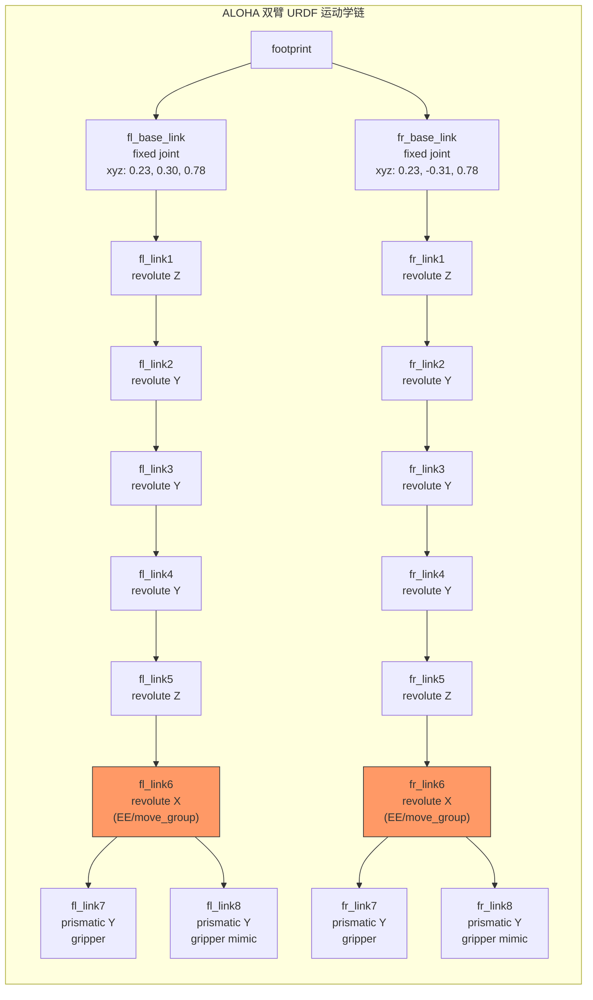
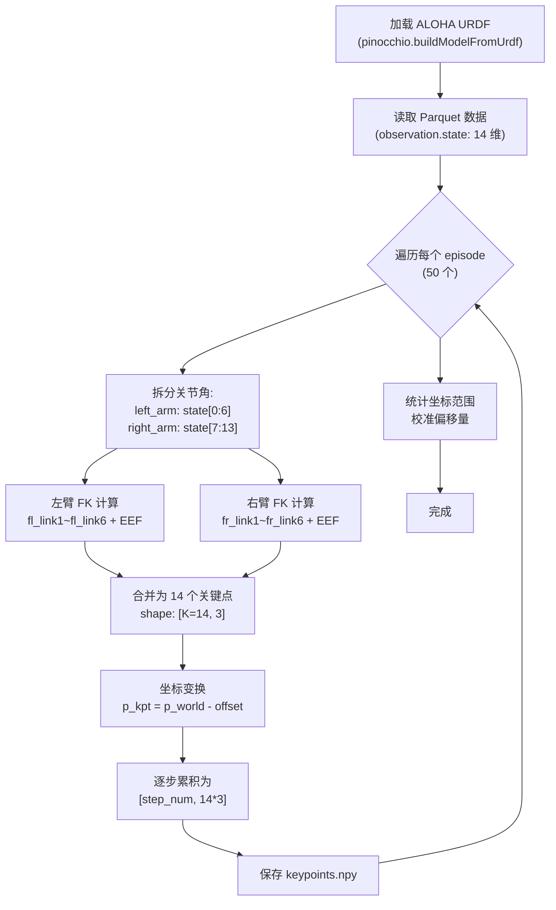
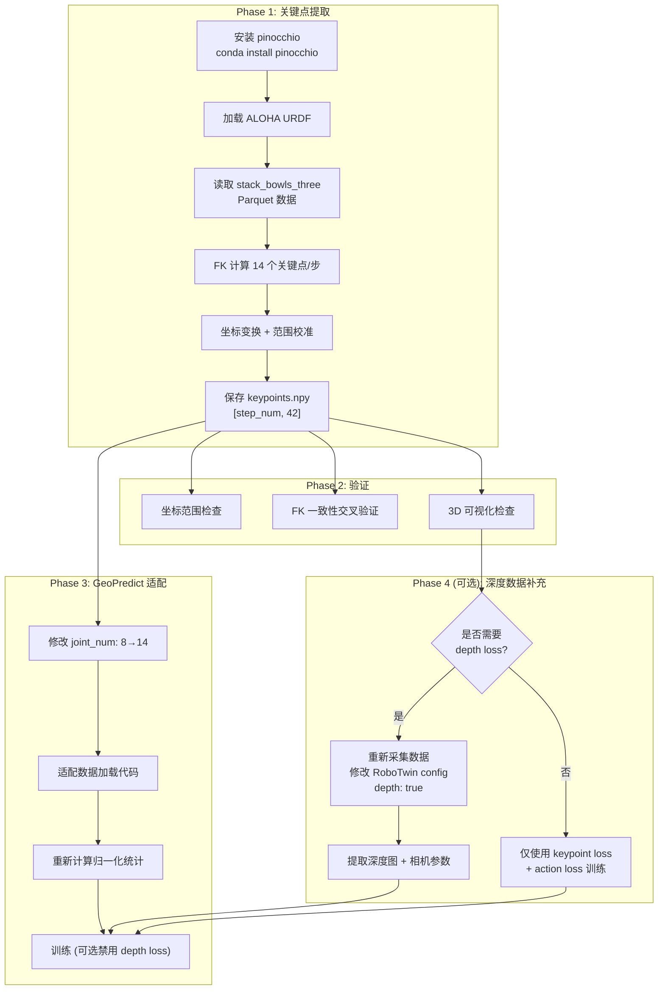
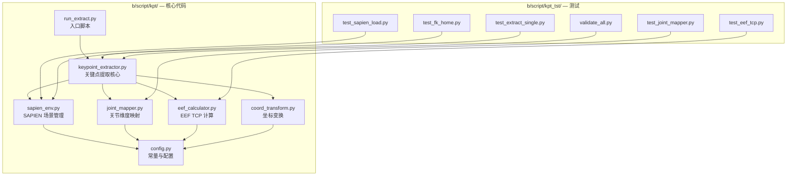
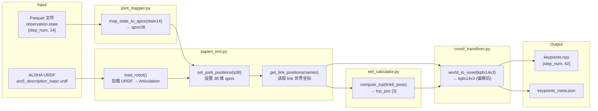
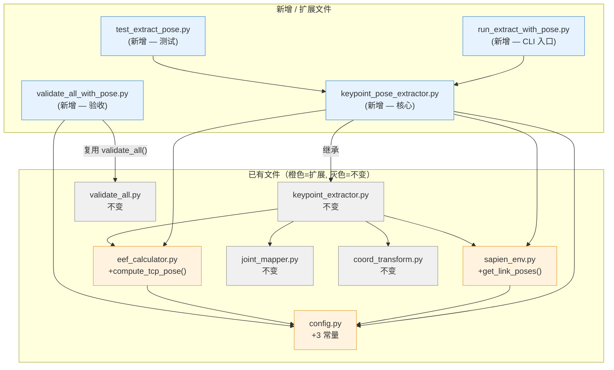
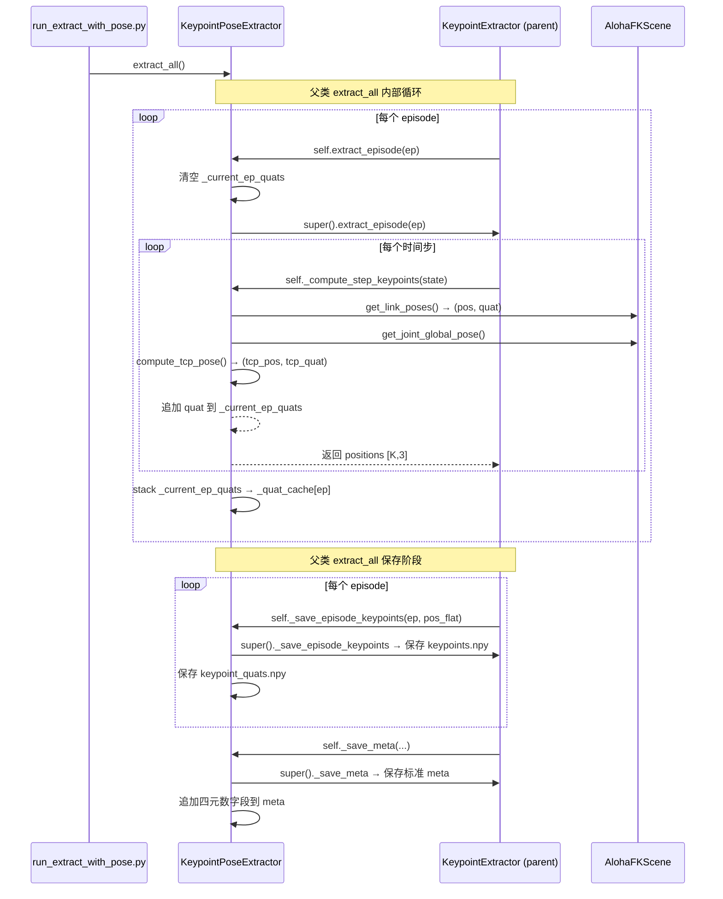

# 用 RoboTwin 2.0 仿真环境为 stack_bowls_three 补充 GeoPredict 3D Keypoint 轨迹 Ground Truth

> **目标**: 为 RoboTwin 2.0 的 `stack_bowls_three` 任务训练数据集补充 GeoPredict 训练所需的 3D 关键点（keypoint）轨迹 ground truth 数据。
>
> **参考**: 本文分析基于 GeoPredict 代码库（`data_processing/robocasa_dataset.py`, `models/geopredict.py`, `tools/test_robocasa.py`）、RoboTwin 2.0 代码库（`envs/_base_task.py`, `envs/robot/robot.py`, `envs/stack_bowls_three.py`）、以及 `b/d/paper/paper_code_analyz.md` 第三章的方案分析。

---

## 一. 问题背景

### 1.1 GeoPredict 对 3D Keypoint 数据的硬性需求

GeoPredict 的训练流程要求每个 episode 目录下预计算一个 `keypoints.npy` 文件。该文件记录了机器人各关节 link 和末端执行器（EEF）在每个时间步的 3D 坐标。在训练时，数据加载代码（`data_processing/robocasa_dataset.py:80`）直接读取该文件：

```python
keypoints = np.load(data_dir / ep_name / 'keypoints.npy')  # shape: [step_num, K*3]
```

加载后的数据按三种方式使用：

| 用途 | 变量名 | Shape | 说明 |
|:---|:---|:---|:---|
| 历史轨迹 | `his_kpts` | `[1000, K, 3]` | 当前步之前的所有关键点坐标，零填充至 1000 步 |
| 当前坐标 | `kpt_t` | `[K, 3]` | 当前时间步的关键点位置（current keypoint loss 的 GT） |
| 未来轨迹 | `future_kpts` | `[50, K, 3]` | 未来 50 步的关键点位置（future keypoint loss 的 GT） |

在 RoboCasa 中，$K = 8$，对应 Franka Panda 机械臂的 7 个 link（`robot0_link1` ~ `robot0_link7`）+ 1 个末端执行器（`gripper0_right_eef`）。

### 1.2 关键点数据在训练中的作用

在 `models/geopredict.py` 的 `compute_loss` 中，关键点参与三项损失函数：

1. **Current keypoint loss**: 模型从 prefix 输出中提取 $K$ 个 keypoint query token，经线性投影为 3D 坐标 $\hat{p}_k \in \mathbb{R}^3$，与 GT $p_k$ 计算 L2 损失：

$$\mathcal{L}_{\text{cur\_kpt}} = \frac{1}{K} \sum_{k=1}^{K} \| \hat{p}_k - p_k \|_2^2$$

2. **Future keypoint loss**: 对未来 $H=50$ 个时间步，利用正弦时间嵌入预测关键点轨迹：

$$\mathcal{L}_{\text{fut\_kpt}} = \frac{1}{K \cdot H} \sum_{t=1}^{H} \sum_{k=1}^{K} \| \hat{p}_{k,t} - p_{k,t} \|_2^2$$

3. **Track-guided refinement**: 预测的关键点坐标映射到体素网格索引，在对应位置附近致密化 3D Gaussian，提升深度渲染质量。

**缺少 `keypoints.npy` 文件意味着 GeoPredict 的关键点预测分支完全无法训练。**

### 1.3 stack_bowls_three 数据集现状

当前数据集位于 `/home/luogang/share/zwy/Projects/DATA/RoboTwin-Clean/stack_bowls_three/`，采用 **LeRobot v2.1** 格式：

```
stack_bowls_three/
├── data/chunk-000/          # 50 个 Parquet 文件 (episode_000000 ~ episode_000049)
├── meta/                    # info.json, tasks.jsonl, episodes.jsonl 等
└── videos/chunk-000/        # 3 个摄像头的 MP4 视频
    ├── observation.images.cam_high/
    ├── observation.images.cam_left_wrist/
    └── observation.images.cam_right_wrist/
```

**已有数据**:
- `observation.state`: 14 维关节角 — 每臂 6 个关节 + 1 个夹爪 = 7 × 2 臂 = 14 维
- `action`: 14 维关节目标位置（与 state 同构）
- RGB 视频: 3 个摄像头（头顶、左腕、右腕），480×640，15 fps，AV1 编码
- 50 个 episode，共 23,550 帧，48 条自然语言指令

**缺失数据**:
- ❌ 3D 关键点轨迹（`keypoints.npy`）
- ❌ 深度图（GeoPredict 的 depth rendering loss 所需）
- ❌ 相机内外参矩阵（`cams.npy`）

---

## 二. GeoPredict 与 RoboTwin 的关键差异分析

### 2.1 系统级差异总览

| 维度 | GeoPredict (RoboCasa) | RoboTwin 2.0 (stack\_bowls\_three) |
|:---|:---|:---|
| **仿真器** | MuJoCo | SAPIEN + PhysX |
| **渲染器** | MuJoCo 内置 | 光线追踪（32 SPP） |
| **机器人** | 单臂 Franka-like（7 DOF） | 双臂 ALOHA-Agilex（每臂 6 DOF） |
| **关键点数 K** | 8（link1-7 + EEF） | 待定（每臂最多 6 links + EEF） |
| **3D 位置 API** | `env.sim.data.get_body_xpos(name)` | `entity.find_link_by_name(name).get_pose().p` |
| **关节角类型** | 实际位置（`get_body_xpos` 后 FK） | drive targets（`joint.get_drive_target()`） |
| **数据格式** | 目录结构 + `.npy` 文件 | LeRobot v2.1（Parquet + MP4） |
| **坐标系** | 移动底座相对坐标 + 偏移 | 世界坐标系 |

### 2.2 机器人运动学差异

**RoboCasa 的 Franka-like 机械臂**（单臂，7 DOF）：
- 8 个关键点: `robot0_link1` ~ `robot0_link7` + `gripper0_right_eef`
- 关节轴: Z-Y-Y-Y-Z-Y-Z（标准 Franka DH 参数）

**RoboTwin 的 ALOHA-Agilex**（双臂，每臂 6 DOF）：

每条臂的运动学链如下（以左臂为例，从 URDF `arx5_description_isaac.urdf` 提取）：

| 关节名 | 类型 | 旋转轴 | 父 link → 子 link | origin (xyz, m) |
|:---|:---|:---|:---|:---|
| `fl_base_joint` | fixed | — | `footprint` → `fl_base_link` | (0.2305, 0.297, 0.782) |
| `fl_joint1` | revolute | Z | `fl_base_link` → `fl_link1` | (0, 0, 0.058) |
| `fl_joint2` | revolute | Y | `fl_link1` → `fl_link2` | (0.025, 0.001, 0.042) |
| `fl_joint3` | revolute | Y | `fl_link2` → `fl_link3` | (-0.264, 0.004, 0) |
| `fl_joint4` | revolute | Y | `fl_link3` → `fl_link4` | (0.246, 0, -0.06) |
| `fl_joint5` | revolute | Z | `fl_link4` → `fl_link5` | (0.068, 0.002, -0.086) |
| `fl_joint6` | revolute | X | `fl_link5` → `fl_link6` | (0.031, 0, 0.086) |
| `fl_joint7` | prismatic | Y | `fl_link6` → `fl_link7` | 夹爪左指 |
| `fl_joint8` | prismatic | Y | `fl_link6` → `fl_link8` | 夹爪右指（mimic fl_joint7） |

右臂结构对称（`fr_*`），底座固定关节 `fr_base_joint` 的 origin 为 `(0.2315, -0.3063, 0.781)`。



### 2.3 坐标系差异

**GeoPredict (RoboCasa) 的坐标变换** (`tools/test_robocasa.py:180-194`):

```python
def get_keypoints(env, body_pos, body_rot):
    ori_trans = np.array([-0.5, -0.8, -0.0], dtype=np.float32)
    for j in range(1, 9):
        pos_name = "gripper0_right_eef" if j == 8 else f"robot0_link{j}"
        pos = env.sim.data.get_body_xpos(pos_name)   # 世界坐标
        pos = body_rot.T @ (pos - body_pos)           # → 底座相对坐标
        pos = pos - ori_trans                          # → 偏移后坐标
```

变换链:
$$\mathbf{p}_{\text{local}} = \mathbf{R}_{\text{base}}^T \cdot (\mathbf{p}_{\text{world}} - \mathbf{t}_{\text{base}}) - \mathbf{o}_{\text{offset}}$$

其中 $\mathbf{t}_{\text{base}}$ 和 $\mathbf{R}_{\text{base}}$ 来自移动底座 `mobilebase0_support` 的位姿，$\mathbf{o}_{\text{offset}} = [-0.5, -0.8, 0]$ 将原点平移到工作空间中心。最终关键点坐标落在体素网格范围 $[0, 0, 0]$ ~ $[1.6, 1.6, 1.0]$ 内。

**RoboTwin (SAPIEN) 的坐标系统**:
- 世界坐标系原点在场景中心
- 机器人 `footprint` 放置在 `robot_pose: [0, -0.65, 0.0]`，四元数 `[0.707, 0, 0, 0.707]`（绕 Z 轴旋转约 90°）
- 左臂底座固定在 footprint 的 `(0.2305, 0.297, 0.782)` 处
- 右臂底座固定在 footprint 的 `(0.2315, -0.3063, 0.781)` 处

### 2.4 关节角数据类型差异

stack_bowls_three 数据集中的 `observation.state` 存储的是 **drive targets**（关节驱动目标位置），而非关节的实际位置（qpos）。这来自 RoboTwin 的 `get_left_arm_jointState()` 实现（`envs/robot/robot.py:528-533`）：

```python
def get_left_arm_jointState(self) -> list:
    jointState_list = []
    for joint in self.left_arm_joints:
        jointState_list.append(joint.get_drive_target()[0].astype(float))  # ← 驱动目标
    jointState_list.append(self.get_left_gripper_val())
    return jointState_list
```

与之对应的实际关节位置获取函数是 `get_left_arm_real_jointState()`，使用 `entity.get_qpos()`。

**drive target 与实际 qpos 的差异**: 在 RoboTwin 仿真中，关节刚度 `stiffness=1000`、阻尼 `damping=200`（来自 `config.yml`），属于高刚度 PD 控制。在此参数下，稳态跟踪误差极小（< 0.01 rad），FK 结果差异在亚毫米级，对关键点 GT 的影响可忽略。

---

## 三. 关键设计决策

### 3.1 关键点数量 K 的选择

GeoPredict 在 `models/geopredict.py` 中将关键点数量写为模型参数：

```python
self.joint_num, self.embed_dims = 8, 2048
self.keypoint_encoder = TrackEncoder(...)       # 编码历史轨迹
self.keypoint_embedding = nn.Embedding(self.joint_num, self.embed_dims)  # K 个可学习 query
self.keypoint_out_proj = nn.Linear(self.embed_dims, 3)  # 投影到 3D
```

将 `joint_num` 从 8 改为其他值，模型架构可自动适配（`nn.Embedding` 和 `TrackEncoder` 的 `num_points` 参数均可变）。以下是几种 K 值方案：

#### 方案 α: 单臂 K=7（仅跟踪活跃臂）

每个时间步只跟踪当前执行动作的那条臂（左臂或右臂）的 6 个 link + 1 个 EEF = 7 个关键点。

- **优点**: K 值小，token 序列短，计算高效；与论文中真机实验的 K=7 一致。
- **缺点**: 双臂任务（如 stack_bowls_three 中两臂交替抓放）中，非活跃臂的位姿信息完全丢失；需要在数据预处理时判断"哪条臂是活跃的"，逻辑复杂且可能引入噪声；当两臂同时动作时无法处理。
- **适用场景**: 仅单臂参与的简单任务。

#### 方案 β: 双臂 K=14（推荐）

两条臂各 7 个关键点（6 links + 1 EEF），共 14 个。

| 索引 | 关键点名称 | 含义 |
|:---|:---|:---|
| 0 | `fl_link1` | 左臂肩部旋转 link |
| 1 | `fl_link2` | 左臂上臂 link |
| 2 | `fl_link3` | 左臂肘部 link |
| 3 | `fl_link4` | 左臂前臂 link |
| 4 | `fl_link5` | 左臂腕部旋转 link |
| 5 | `fl_link6` | 左臂末端 link (move_group) |
| 6 | `fl_eef` | 左臂夹爪中心 (TCP) |
| 7 | `fr_link1` | 右臂肩部旋转 link |
| 8 | `fr_link2` | 右臂上臂 link |
| 9 | `fr_link3` | 右臂肘部 link |
| 10 | `fr_link4` | 右臂前臂 link |
| 11 | `fr_link5` | 右臂腕部旋转 link |
| 12 | `fr_link6` | 右臂末端 link (move_group) |
| 13 | `fr_eef` | 右臂夹爪中心 (TCP) |

- **优点**: 完整描述双臂姿态，不丢失任何运动学信息；K=7 per arm 与论文真机实验 K=7 的设定一致（6-DOF 臂 + EEF）；双臂对称结构在 embedding 空间中自然分组。
- **缺点**: K=14 使 token 序列增长 14（prefix 中增加 14 个历史 token + 14 个 query token = 28 个额外 token），计算开销约为原来的 1.75 倍；需要修改 `joint_num` 参数。
- **适用场景**: 所有双臂任务。

#### 方案 γ: 仅跟踪末端 K=2

仅跟踪两个 EEF（左、右夹爪中心）。

- **优点**: 最少 token 数，计算最快。
- **缺点**: 丢失大量运动学链中间信息，关键点预测分支退化为简单的 EEF 位置预测；GeoPredict 论文的消融实验表明中间 link 对性能有正向贡献（论文 Table 3）。
- **适用场景**: 不推荐。

#### 推荐: 方案 β（K=14）

**理由**:
1. stack_bowls_three 是双臂交替任务，两臂均需跟踪。
2. K=7 per arm 与论文真机实验的设定一致（DISCOVER 平台 6-DOF + EEF）。
3. 28 个额外 token 对于 max_token_len=48 的 prefix 而言可接受（需要相应调大 `max_token_len`）。
4. GeoPredict 的 `TrackEncoder` 和 `keypoint_embedding` 天然支持可变 K。

### 3.2 关键点提取方案选择

根据 `b/d/paper/paper_code_analyz.md` 第三章的系统性分析，结合 RoboTwin 的具体情况，有以下三种可行方案：

#### 方案 A: URDF + 正运动学离线计算（推荐）

**原理**: 利用 ALOHA 机器人的 URDF 文件和数据集中已有的关节角度，通过正运动学（FK）离线计算每个 link 的 3D 位置。

**计算过程**: 给定关节角 $\boldsymbol{\theta} = [\theta_1, \theta_2, ..., \theta_6]$，正运动学通过链式齐次变换矩阵计算各 link 的位姿：

$$\mathbf{T}_i^0 = \prod_{j=1}^{i} \mathbf{T}_j(\theta_j) = \mathbf{T}_1(\theta_1) \cdot \mathbf{T}_2(\theta_2) \cdots \mathbf{T}_i(\theta_i)$$

每个关节的齐次变换由 URDF 中的 origin（固定偏移）和 axis（旋转轴）决定：

$$\mathbf{T}_j(\theta_j) = \mathbf{T}_{\text{origin},j} \cdot \text{Rot}(\text{axis}_j, \theta_j)$$

link $i$ 的 3D 位置为：

$$\mathbf{p}_i = \mathbf{T}_i^0[0\text{:}3, 3]$$

**工具选择**:

| 工具 | 语言 | GPU 加速 | 可微分 | 精度 | 安装难度 |
|:---|:---|:---|:---|:---|:---|
| `pinocchio` | C++/Python | ❌ | 部分 | 工业级 (< 0.01mm) | 中（conda 可装） |
| `pytorch_kinematics` | Python/PyTorch | ✅ | ✅ | 高 (< 0.1mm) | 低（pip 即可） |
| `roboticstoolbox` | Python | ❌ | ❌ | 高 | 低 |
| `ikpy` | Python | ❌ | ❌ | 中 | 低 |

**推荐使用 `pinocchio`**: 工业级精度，支持直接加载 URDF，conda 环境下 `conda install -c conda-forge pinocchio` 即可安装。

**优点**: 
- 无需启动仿真器，纯离线批处理，速度快（23,550 帧可在数秒内完成）
- 代码简单，依赖少（仅需 `pinocchio` + `numpy`）
- 精度与仿真器内部 FK 完全一致（使用相同 URDF）
- 可在任意机器上运行，不依赖 SAPIEN 环境

**缺点**: 
- 使用的是 drive target 而非实际 qpos（差异极小，见 2.4 节分析）
- 无法同时获取深度图和相机参数（需另行处理）

#### 方案 B: SAPIEN 仿真环境加载 + 设置 qpos + 提取 link poses

**原理**: 在 SAPIEN 中加载 ALOHA 机器人 URDF，将数据集中的关节角设为机器人的 qpos，然后通过 SAPIEN API 读取各 link 的 3D 位姿。

```python
import sapien.core as sapien

engine = sapien.Engine()
scene = engine.create_scene()
loader = scene.create_urdf_loader()
robot = loader.load("path/to/arx5_description_isaac.urdf")

# 设置关节位置
robot.set_qpos(joint_angles)
scene.step()  # 更新物理状态

# 提取 link 位置
for link in robot.get_links():
    if link.get_name() in target_link_names:
        pos = link.get_pose().p  # [x, y, z]
```

**优点**:
- 使用与原始数据采集相同的仿真器，坐标一致性更好
- 如果同时需要渲染深度图，可以在同一流程中完成
- 不需要单独安装 FK 库

**缺点**:
- 需要安装 SAPIEN 及其渲染依赖（较重量级）
- 每帧需调用 `scene.step()` 更新物理状态，速度较纯 FK 慢
- 需要构建最小化的仿真场景（robot + table），而非完整的任务环境

#### 方案 C: 重新采集数据（内嵌关键点提取）

**原理**: 修改 RoboTwin 的数据采集流程（`script/collect_data.py` + `envs/_base_task.py:get_obs()`），在采集观测数据的同时提取各 link 的 3D 位置并存储。

**关键问题**: 原始采集的轨迹回放数据（`_traj_data/*.pkl` 和 `seed.txt`）**已被清理**，无法重放完全相同的 episode。重新采集会生成新的 episode（不同 seed → 不同物体初始位置 → 不同轨迹），与现有 Parquet/MP4 数据不匹配。

**优点**:
- 获得最完整、最准确的数据（关键点 + 深度图 + 相机参数一站式采集）
- 关键点来自 SAPIEN 内部状态，精度最高

**缺点**:
- 现有 50 个 episode 的数据（视频、关节角等）全部废弃，需重新采集
- 采集耗时较长（需 GPU 渲染 + 物理仿真）
- 需要修改 RoboTwin 代码

#### 方案对比与推荐

| 维度 | 方案 A (FK 离线) | 方案 B (SAPIEN 设 qpos) | 方案 C (重新采集) |
|:---|:---|:---|:---|
| **精度** | 亚毫米（drive target 误差极小） | 亚毫米 | 完美（simulator 内部状态） |
| **与现有数据兼容** | ✅ 完全兼容 | ✅ 完全兼容 | ❌ 需废弃重采 |
| **额外依赖** | `pinocchio`（轻量） | SAPIEN 全套 | SAPIEN + RoboTwin 全套 |
| **运行速度** | 极快（纯数学） | 较快（需初始化场景） | 慢（完整仿真+渲染） |
| **可同时获取深度图** | ❌ | ✅（需构建完整场景） | ✅ |
| **代码复杂度** | 低 | 中 | 高 |
| **推荐优先级** | ⭐⭐⭐ 首选 | ⭐⭐ 备选 | ⭐ 仅在需要完整重采时 |

**推荐: 方案 A（FK 离线计算）作为首选方案。** 

理由: 方案 A 最简单、最快、与现有数据完全兼容。由于 RoboTwin 的高刚度 PD 控制（stiffness=1000），drive target 与实际 qpos 的差异可忽略，FK 精度完全满足 GeoPredict 的训练需求。如果后续还需要补充深度图和相机参数，可以追加方案 B 或方案 C。

### 3.3 坐标系设计

GeoPredict 的体素网格（用于 3D Gaussian 渲染）覆盖范围为 $[0, 0, 0]$ ~ $[1.6, 1.6, 1.0]$ 米。关键点坐标必须落在此范围内才能被正确映射到体素网格。

**RoboCasa 的坐标变换**:

$$\mathbf{p}_{\text{kpt}} = \mathbf{R}_{\text{base}}^T \cdot (\mathbf{p}_{\text{world}} - \mathbf{t}_{\text{base}}) - \mathbf{o}_{\text{offset}}$$

其中 $\mathbf{o}_{\text{offset}} = [-0.5, -0.8, 0.0]$。

**RoboTwin ALOHA 的坐标设计**:

ALOHA 的 footprint 放置在世界坐标 $\mathbf{t}_{\text{fp}} = [0, -0.65, 0]$。两臂底座相对 footprint 的位置分别为 $(0.23, 0.30, 0.78)$（左臂）和 $(0.23, -0.31, 0.78)$（右臂）。

机器人工作空间大致范围（估算）:
- X 方向: 约 $[-0.3, 0.6]$（前方伸展范围）
- Y 方向: 约 $[-0.7, 0.7]$（左右臂跨度）
- Z 方向: 约 $[0.5, 1.2]$（桌面以上到最高抬升）

设计偏移量 $\mathbf{o}_{\text{RoboTwin}}$ 使工作空间映射到 $[0, 0, 0]$ ~ $[1.6, 1.6, 1.0]$:

$$\mathbf{o}_{\text{RoboTwin}} = [-0.3, -0.8, -0.5]$$

即:
$$\mathbf{p}_{\text{kpt}} = \mathbf{p}_{\text{world}} - \mathbf{o}_{\text{RoboTwin}}$$

由于 ALOHA 底座在仿真中是固定的（非移动底座），不需要做 base-relative 变换，直接在世界坐标系下减去偏移即可。

> **注意**: 上述偏移量是估算值。实际使用时应先运行一次完整的关键点提取，统计所有 episode 所有时间步的关键点坐标范围，再调整偏移量确保所有点都落在 $[0, 0, 0]$ ~ $[1.6, 1.6, 1.0]$ 内。调整偏移量的脚本在第五节提供。

---

## 四. 推荐方案详细设计: URDF FK 离线计算

### 4.1 整体流程



### 4.2 环境准备

```bash
# 在 GeoPredict 或 RoboTwin 的 conda 环境中安装 pinocchio
conda activate RoboTwin  # 或 geopredict
conda install -c conda-forge pinocchio -y
pip install pandas pyarrow  # 用于读取 Parquet 文件
```

### 4.3 核心代码: `extract_keypoints_fk.py`

```python
#!/usr/bin/env python3
"""
从 RoboTwin stack_bowls_three LeRobot 数据集中提取 3D Keypoint 轨迹。
使用 pinocchio 进行 URDF 正运动学计算。

用法:
    conda activate RoboTwin
    python extract_keypoints_fk.py \
        --dataset_dir /path/to/stack_bowls_three \
        --urdf_path /path/to/RoboTwin/assets/embodiments/aloha-agilex/urdf/arx5_description_isaac.urdf \
        --output_dir /path/to/output
"""

import numpy as np
import pinocchio as pin
from pathlib import Path
import pandas as pd
import argparse
import json


# ==================== 配置 ====================

# 左臂和右臂的 link 名称 (6 links + 1 EEF per arm = 7 per arm, K=14 total)
LEFT_LINK_NAMES = [
    "fl_link1", "fl_link2", "fl_link3", "fl_link4", "fl_link5", "fl_link6"
]
RIGHT_LINK_NAMES = [
    "fr_link1", "fr_link2", "fr_link3", "fr_link4", "fr_link5", "fr_link6"
]

# 左右臂的关节名称 (用于从 URDF 中定位关节索引)
LEFT_JOINT_NAMES = [
    "fl_joint1", "fl_joint2", "fl_joint3", "fl_joint4", "fl_joint5", "fl_joint6"
]
RIGHT_JOINT_NAMES = [
    "fr_joint1", "fr_joint2", "fr_joint3", "fr_joint4", "fr_joint5", "fr_joint6"
]

# EEF (夹爪中心) 的计算: fl_link6/fr_link6 的末端 + gripper_bias 偏移
# 参考 robot.py:_trans_endpose(), gripper_bias=0.12, is_endpose=True 时 dis=gripper_bias
# is_endpose=False 时 dis=gripper_bias - 0.12 = 0
# TCP (is_endpose=True): 沿 EE 局部 X 轴偏移 0.12m
# 这里我们使用 fl_link6 的位置作为 EE link 的位置,
# 并额外计算 TCP (夹爪中心) 作为第 7 个关键点。

# 坐标偏移 (使关键点落在 GeoPredict 体素网格范围 [0,0,0]~[1.6,1.6,1.0] 内)
# 这是初始估算值，需要根据实际数据统计结果调整
COORD_OFFSET = np.array([-0.3, -0.8, -0.5], dtype=np.float32)

# RoboTwin 中机器人 footprint 的初始位姿
ROBOT_BASE_POS = np.array([0.0, -0.65, 0.0])
ROBOT_BASE_QUAT = np.array([0.707, 0.0, 0.0, 0.707])  # SAPIEN: [w, x, y, z]


def quat_to_rotation_matrix(q):
    """四元数 [w, x, y, z] → 3x3 旋转矩阵"""
    w, x, y, z = q
    return np.array([
        [1 - 2*(y*y + z*z), 2*(x*y - w*z),     2*(x*z + w*y)],
        [2*(x*y + w*z),     1 - 2*(x*x + z*z), 2*(y*z - w*x)],
        [2*(x*z - w*y),     2*(y*z + w*x),     1 - 2*(x*x + y*y)]
    ])


def load_urdf_model(urdf_path):
    """加载 URDF 并构建 pinocchio 模型"""
    urdf_dir = str(Path(urdf_path).parent)
    model = pin.buildModelFromUrdf(str(urdf_path))
    data = model.createData()
    print(f"[INFO] 加载 URDF 模型: {model.name}")
    print(f"[INFO] 自由度 (nq): {model.nq}, 速度维度 (nv): {model.nv}")
    print(f"[INFO] 关节数: {model.njoints}")

    # 打印所有 frame 名称，便于调试
    print("[INFO] 所有 frames:")
    for i in range(model.nframes):
        frame = model.frames[i]
        print(f"  [{i}] {frame.name} (type: {frame.type}, parent_joint: {frame.parentJoint})")

    return model, data


def get_frame_ids(model, link_names):
    """获取指定 link 在 pinocchio 模型中的 frame ID"""
    frame_ids = []
    for name in link_names:
        if model.existFrame(name):
            frame_ids.append(model.getFrameId(name))
        else:
            raise ValueError(f"Frame '{name}' 不存在于 URDF 模型中。"
                           f"可用的 frame 名称: {[model.frames[i].name for i in range(model.nframes)]}")
    return frame_ids


def get_joint_ids(model, joint_names):
    """获取指定关节在 pinocchio q 向量中的索引"""
    joint_indices = []
    for name in joint_names:
        if model.existJointName(name):
            joint_id = model.getJointId(name)
            idx_q = model.joints[joint_id].idx_q
            joint_indices.append(idx_q)
        else:
            raise ValueError(f"Joint '{name}' 不存在于 URDF 模型中。")
    return joint_indices


def compute_keypoints_for_step(model, data, q, left_frame_ids, right_frame_ids):
    """
    对单个时间步计算 K=14 个关键点的 3D 坐标。

    Args:
        model: pinocchio 模型
        data: pinocchio 数据
        q: 完整的 q 向量 (nq 维)
        left_frame_ids: 左臂 6 个 link 的 frame ID
        right_frame_ids: 右臂 6 个 link 的 frame ID

    Returns:
        keypoints: shape [14, 3], 世界坐标系下的 3D 位置
    """
    # 正运动学计算
    pin.forwardKinematics(model, data, q)
    pin.updateFramePlacements(model, data)

    keypoints = np.zeros((14, 3), dtype=np.float32)

    # 左臂 6 个 link 位置
    for i, fid in enumerate(left_frame_ids):
        keypoints[i] = data.oMf[fid].translation

    # 左臂 EEF (TCP): fl_link6 的末端位姿沿局部 X 轴偏移 gripper_bias
    # 简化处理: 使用 fl_link6 的位置 + 局部 X 方向 * 0.12
    fl6_pose = data.oMf[left_frame_ids[-1]]  # fl_link6 的 SE3
    fl6_local_x = fl6_pose.rotation[:, 0]    # 局部 X 轴在世界系的方向
    keypoints[6] = fl6_pose.translation + fl6_local_x * 0.12  # TCP 位置

    # 右臂 6 个 link 位置
    for i, fid in enumerate(right_frame_ids):
        keypoints[7 + i] = data.oMf[fid].translation

    # 右臂 EEF (TCP)
    fr6_pose = data.oMf[right_frame_ids[-1]]
    fr6_local_x = fr6_pose.rotation[:, 0]
    keypoints[13] = fr6_pose.translation + fr6_local_x * 0.12

    return keypoints


def transform_to_geopredict_coords(keypoints, offset):
    """
    将世界坐标转换为 GeoPredict 的工作空间坐标。

    GeoPredict 体素网格范围: [0, 0, 0] ~ [1.6, 1.6, 1.0]
    变换: p_kpt = p_world - offset
    """
    return keypoints - offset


def extract_episode_keypoints(model, data, q_full_trajectory,
                               left_joint_indices, right_joint_indices,
                               left_frame_ids, right_frame_ids,
                               offset):
    """
    提取单个 episode 的所有时间步的关键点。

    Args:
        q_full_trajectory: shape [step_num, 14], 关节角轨迹 (drive targets)
        返回: shape [step_num, 14*3], 关键点坐标 (flattened)
    """
    step_num = q_full_trajectory.shape[0]
    all_keypoints = np.zeros((step_num, 14 * 3), dtype=np.float32)

    # 构建完整 q 向量的模板 (所有关节归零)
    q_template = pin.neutral(model)

    for t in range(step_num):
        # 将 dataset 的 14 维关节角映射到 pinocchio 的 q 向量
        q = q_template.copy()

        # 左臂 6 个关节
        for i, idx_q in enumerate(left_joint_indices):
            q[idx_q] = q_full_trajectory[t, i]  # state[0:6] → left arm

        # 右臂 6 个关节
        for i, idx_q in enumerate(right_joint_indices):
            q[idx_q] = q_full_trajectory[t, 7 + i]  # state[7:13] → right arm

        # 计算关键点
        kpts = compute_keypoints_for_step(model, data, q,
                                          left_frame_ids, right_frame_ids)

        # 坐标变换
        kpts = transform_to_geopredict_coords(kpts, offset)

        # flatten 并存储
        all_keypoints[t] = kpts.reshape(-1)

    return all_keypoints


def main():
    parser = argparse.ArgumentParser(description="从 RoboTwin 数据集提取 3D Keypoint 轨迹")
    parser.add_argument("--dataset_dir", type=str, required=True,
                       help="stack_bowls_three 数据集目录")
    parser.add_argument("--urdf_path", type=str, required=True,
                       help="ALOHA URDF 文件路径")
    parser.add_argument("--output_dir", type=str, required=True,
                       help="输出目录 (保存 keypoints.npy)")
    parser.add_argument("--offset", type=float, nargs=3, default=None,
                       help="坐标偏移量 [ox, oy, oz]，不指定则自动计算")
    args = parser.parse_args()

    dataset_dir = Path(args.dataset_dir)
    output_dir = Path(args.output_dir)
    output_dir.mkdir(parents=True, exist_ok=True)

    # ---- 1. 加载 URDF 模型 ----
    model, data = load_urdf_model(args.urdf_path)

    # ---- 2. 获取 frame 和 joint 索引 ----
    left_frame_ids = get_frame_ids(model, LEFT_LINK_NAMES)
    right_frame_ids = get_frame_ids(model, RIGHT_LINK_NAMES)
    left_joint_indices = get_joint_ids(model, LEFT_JOINT_NAMES)
    right_joint_indices = get_joint_ids(model, RIGHT_JOINT_NAMES)

    print(f"[INFO] 左臂 frame IDs: {left_frame_ids}")
    print(f"[INFO] 右臂 frame IDs: {right_frame_ids}")
    print(f"[INFO] 左臂 joint q-indices: {left_joint_indices}")
    print(f"[INFO] 右臂 joint q-indices: {right_joint_indices}")

    # ---- 3. 读取数据集 ----
    parquet_dir = dataset_dir / "data" / "chunk-000"
    info_path = dataset_dir / "meta" / "info.json"
    with open(info_path, "r") as f:
        info = json.load(f)
    total_episodes = info["total_episodes"]
    print(f"[INFO] 数据集: {total_episodes} 个 episode")

    # ---- 4. 第一遍: 提取关键点并统计坐标范围 ----
    all_kpts_list = []
    global_min = np.full(3, np.inf)
    global_max = np.full(3, -np.inf)

    for ep_idx in range(total_episodes):
        parquet_path = parquet_dir / f"episode_{ep_idx:06d}.parquet"
        df = pd.read_parquet(parquet_path)

        # 提取关节角: observation.state 是 14 维
        states = np.array(df["observation.state"].tolist(), dtype=np.float32)

        # 计算关键点 (使用零偏移，先统计范围)
        kpts = extract_episode_keypoints(
            model, data, states,
            left_joint_indices, right_joint_indices,
            left_frame_ids, right_frame_ids,
            offset=np.zeros(3)
        )
        all_kpts_list.append(kpts)

        # 统计范围
        kpts_3d = kpts.reshape(-1, 14, 3)
        global_min = np.minimum(global_min, kpts_3d.min(axis=(0, 1)))
        global_max = np.maximum(global_max, kpts_3d.max(axis=(0, 1)))

        print(f"\r[INFO] Episode {ep_idx+1}/{total_episodes} 已处理", end="")

    print(f"\n[INFO] 关键点坐标范围 (世界坐标):")
    print(f"  X: [{global_min[0]:.4f}, {global_max[0]:.4f}]")
    print(f"  Y: [{global_min[1]:.4f}, {global_max[1]:.4f}]")
    print(f"  Z: [{global_min[2]:.4f}, {global_max[2]:.4f}]")

    # ---- 5. 计算偏移量 ----
    if args.offset is not None:
        offset = np.array(args.offset, dtype=np.float32)
    else:
        # 自动计算: 使工作空间居中于 [0.8, 0.8, 0.5]
        workspace_center = (global_min + global_max) / 2
        target_center = np.array([0.8, 0.8, 0.5])
        offset = workspace_center - target_center
        print(f"[INFO] 自动计算偏移量: {offset}")

    # ---- 6. 应用偏移并保存 ----
    for ep_idx in range(total_episodes):
        kpts = all_kpts_list[ep_idx]
        kpts_3d = kpts.reshape(-1, 14, 3)
        kpts_3d = kpts_3d - offset
        kpts_flat = kpts_3d.reshape(-1, 14 * 3)

        # 保存
        ep_dir = output_dir / f"episode_{ep_idx:06d}"
        ep_dir.mkdir(parents=True, exist_ok=True)
        np.save(ep_dir / "keypoints.npy", kpts_flat.astype(np.float32))

    # ---- 7. 验证 ----
    # 重新统计偏移后的范围
    all_transformed = np.concatenate(
        [(k.reshape(-1, 14, 3) - offset) for k in all_kpts_list], axis=0
    )
    final_min = all_transformed.min(axis=(0, 1))
    final_max = all_transformed.max(axis=(0, 1))
    print(f"\n[INFO] 偏移后关键点坐标范围:")
    print(f"  X: [{final_min[0]:.4f}, {final_max[0]:.4f}] (目标: [0, 1.6])")
    print(f"  Y: [{final_min[1]:.4f}, {final_max[1]:.4f}] (目标: [0, 1.6])")
    print(f"  Z: [{final_min[2]:.4f}, {final_max[2]:.4f}] (目标: [0, 1.0])")

    in_range = (final_min >= 0).all() and (final_max[0] <= 1.6) and \
               (final_max[1] <= 1.6) and (final_max[2] <= 1.0)
    if in_range:
        print("[✓] 所有关键点均在 GeoPredict 体素网格范围内")
    else:
        print("[⚠] 部分关键点超出体素网格范围！请手动调整偏移量或扩大体素网格")
        print(f"    建议偏移量: offset = [{global_min[0]-0.05:.4f}, "
              f"{global_min[1]-0.05:.4f}, {global_min[2]-0.05:.4f}]")

    # 保存元信息
    meta = {
        "K": 14,
        "keypoint_names": (
            LEFT_LINK_NAMES + ["fl_eef_tcp"] + RIGHT_LINK_NAMES + ["fr_eef_tcp"]
        ),
        "coord_offset": offset.tolist(),
        "world_range_min": global_min.tolist(),
        "world_range_max": global_max.tolist(),
        "transformed_range_min": final_min.tolist(),
        "transformed_range_max": final_max.tolist(),
        "urdf_path": str(args.urdf_path),
        "dataset_dir": str(args.dataset_dir),
        "total_episodes": total_episodes,
    }
    with open(output_dir / "keypoints_meta.json", "w") as f:
        json.dump(meta, f, indent=2)

    print(f"\n[INFO] 完成! 关键点数据已保存到 {output_dir}")
    print(f"[INFO] 元信息已保存到 {output_dir / 'keypoints_meta.json'}")


if __name__ == "__main__":
    main()
```

### 4.4 运行命令

```bash
conda activate RoboTwin

python extract_keypoints_fk.py \
    --dataset_dir /home/luogang/share/zwy/Projects/DATA/RoboTwin-Clean/stack_bowls_three \
    --urdf_path /home/luogang/share/zwy/Projects/RoboTwin/assets/embodiments/aloha-agilex/urdf/arx5_description_isaac.urdf \
    --output_dir /home/luogang/share/zwy/Projects/DATA/RoboTwin-Clean/stack_bowls_three/keypoints
```

### 4.5 EEF (TCP) 位置的精确计算

上述代码中 EEF 的计算需要特别注意。RoboTwin 的 `_trans_endpose()` 函数（`envs/robot/robot.py:622-637`）实现如下：

```python
def _trans_endpose(self, arm_tag=None, is_endpose=False):
    gripper_bias = self.left_gripper_bias  # 0.12
    global_trans_matrix = self.left_global_trans_matrix  # [[1,0,0],[0,-1,0],[0,0,-1]]
    delta_matrix = self.left_delta_matrix  # [[1,0,0],[0,1,0],[0,0,1]] (identity)
    ee_pose = self.left_ee.global_pose  # fl_joint6 的世界位姿
    
    endpose_arr = np.eye(4)
    endpose_arr[:3, :3] = quat2mat(ee_pose.q) @ global_trans_matrix @ delta_matrix
    dis = gripper_bias  # 0.12 for TCP, 0.0 for move_group
    if not is_endpose:
        dis -= 0.12  # dis = 0 for move_group
    endpose_arr[:3, 3] = ee_pose.p + endpose_arr[:3, :3] @ [dis, 0, 0]
```

关键点:
- `global_trans_matrix = [[1,0,0],[0,-1,0],[0,0,-1]]` 将 Y 和 Z 轴翻转
- `gripper_bias = 0.12` 是沿变换后的局部 X 轴偏移量
- TCP 位置 = EE joint 位置 + 变换后的局部 X 方向 × 0.12m

因此在 FK 脚本中，EEF (TCP) 的精确计算应为：

```python
ee_rotation = data.oMf[frame_id].rotation  # 3x3 旋转矩阵
global_trans = np.array([[1,0,0],[0,-1,0],[0,0,-1]])  # from config.yml
transformed_rotation = ee_rotation @ global_trans
tcp_offset_direction = transformed_rotation[:, 0]  # 变换后的局部 X 轴
tcp_pos = data.oMf[frame_id].translation + tcp_offset_direction * 0.12
```

> **注意**: `global_trans_matrix` 和 `gripper_bias` 的值来自 `config.yml`，不同机器人配置（如 Piper、Y1）会有不同值。此处以 ALOHA-Agilex 的配置为准。

---

## 五. 备选方案: SAPIEN 仿真环境加载

如果因 URDF 加载问题（如 mesh 路径、SRDF 依赖等）导致 pinocchio 无法正确加载模型，可改用 SAPIEN 方案。

### 5.1 最小化 SAPIEN 场景

不需要加载完整的 stack_bowls_three 任务环境（含桌子、碗等物体），只需加载机器人即可提取 link 位姿：

```python
import sapien.core as sapien
import numpy as np
from pathlib import Path


def create_minimal_scene(urdf_path, robot_pose_p, robot_pose_q):
    """创建只含机器人的最小化 SAPIEN 场景"""
    engine = sapien.Engine()
    scene = engine.create_scene()
    scene.set_timestep(1.0 / 240)

    loader = scene.create_urdf_loader()
    loader.fix_root_link = True

    robot = loader.load(str(urdf_path))
    robot.set_root_pose(sapien.Pose(robot_pose_p, robot_pose_q))

    return scene, robot


def extract_link_positions(robot, scene, qpos_14dim, link_names):
    """
    设置关节角并提取 link 3D 位置。

    Args:
        qpos_14dim: [14] — dataset 的 observation.state
        link_names: 要提取的 link 名称列表
    Returns:
        positions: [len(link_names), 3]
    """
    # 构建 qpos: 需要将 14 维 dataset state 映射到 robot 的 qpos 向量
    # ALOHA URDF 的 active joints 顺序需要通过 robot.get_active_joints() 确认
    active_joints = robot.get_active_joints()
    full_qpos = np.zeros(len(active_joints))

    # 建立 joint name → active_joints index 的映射
    joint_name_to_idx = {}
    for i, joint in enumerate(active_joints):
        joint_name_to_idx[joint.get_name()] = i

    # 映射 dataset state → full_qpos
    left_names = ["fl_joint1", "fl_joint2", "fl_joint3", "fl_joint4", "fl_joint5", "fl_joint6"]
    right_names = ["fr_joint1", "fr_joint2", "fr_joint3", "fr_joint4", "fr_joint5", "fr_joint6"]

    for i, jname in enumerate(left_names):
        if jname in joint_name_to_idx:
            full_qpos[joint_name_to_idx[jname]] = qpos_14dim[i]

    for i, jname in enumerate(right_names):
        if jname in joint_name_to_idx:
            full_qpos[joint_name_to_idx[jname]] = qpos_14dim[7 + i]

    # 设置 gripper (可选, 对 link 位置影响极小)
    # left_gripper: state[6], right_gripper: state[13]
    # 跳过，因为 gripper 的开合不影响 arm link 位置

    robot.set_qpos(full_qpos)
    scene.step()  # 更新 FK

    # 提取 link 位置
    positions = np.zeros((len(link_names), 3), dtype=np.float32)
    for i, name in enumerate(link_names):
        link = robot.find_link_by_name(name)
        if link is None:
            raise ValueError(f"Link '{name}' 不存在")
        positions[i] = link.get_pose().p

    return positions
```

### 5.2 SAPIEN 方案的注意事项

1. **URDF mesh 路径**: SAPIEN 加载 URDF 时需要 mesh 文件的相对路径正确。确保从 URDF 所在目录运行，或使用 `loader.set_material(...)` 跳过渲染材质。
2. **scene.step() 的必要性**: 调用 `set_qpos()` 后必须 `scene.step()` 才会更新 link 的世界位姿。如果不 step，`link.get_pose()` 可能返回旧值。
3. **active_joints 顺序**: SAPIEN 的 `robot.get_active_joints()` 返回顺序不一定与 URDF 中的关节顺序一致，必须通过 `joint.get_name()` 建立映射。

---

## 六. 深度图与相机参数的补充

GeoPredict 的完整训练还需要:
- 深度图: `agentview_left_depth/step_XXXX.npy` 和 `agentview_right_depth/step_XXXX.npy`（256×256, float32）
- 相机内外参: `cams.npy`（包含内参矩阵 3×3 + 外参矩阵 4×4）

### 6.1 现状

stack_bowls_three 数据集的原始采集配置（`task_config/demo_clean.yml`）中 `depth: false`，因此没有保存深度图。也没有单独保存相机参数。但 RGB 视频中的 3 个摄像头有固定的已知参数：

| 摄像头 | 类型 | 位置（世界坐标） | 方向 |
|:---|:---|:---|:---|
| `head_camera` | D435 | (-0.032, -0.45, 1.35) | forward: (0, 0.6, -0.8) |
| `cam_left_wrist` | D435 | 随左臂运动 | 固定在 fl_link6 上 |
| `cam_right_wrist` | D435 | 随右臂运动 | 固定在 fr_link6 上 |

### 6.2 补充方案

由于深度图和相机参数无法从已有数据中恢复，只有**方案 C（重新采集数据）**能完整补充这些信息。具体步骤:

1. **修改 `task_config/demo_clean.yml`**: 将 `depth: true` 启用深度采集
2. **修改 `_base_task.py:get_obs()`**: 增加 link 位置提取逻辑
3. **重新采集**: 运行 `collect_data.sh` 生成新的 50 个 episode
4. **后处理**: 将采集结果转换为 GeoPredict 所需格式

但如果选择**仅关键点训练**（不使用 depth rendering loss），则只需方案 A 的关键点数据即可。GeoPredict 的损失函数可以按需启用/禁用各项 loss，关键点预测 loss 和动作 loss 可以独立于深度渲染 loss 训练。

### 6.3 不使用深度 loss 的训练配置

如果决定暂不补充深度数据，在 GeoPredict 的训练配置中禁用深度相关 loss 即可:

```python
# 在 compute_loss 中，跳过深度渲染 loss
# 需要修改 models/geopredict.py 的 compute_loss 方法:
# 将 depth_loss 相关计算包裹在条件判断中
if "left_depth_t" in obs and obs["left_depth_t"] is not None:
    # 计算深度渲染 loss
    ...
else:
    depth_loss = torch.tensor(0.0)
```

GeoPredict 论文的消融实验（Table 3）表明，关键点预测 loss 对性能的贡献独立于深度渲染 loss。因此，仅使用关键点数据进行训练也能获得显著的性能提升。

---

## 七. GeoPredict 模型适配

### 7.1 模型参数修改

将 `joint_num` 从 8 改为 14（或根据 K 值方案调整）:

```python
# models/geopredict.py
# 原始:
self.joint_num, self.embed_dims = 8, 2048

# 修改为:
self.joint_num, self.embed_dims = 14, 2048  # K=14 for dual-arm ALOHA
```

受影响的组件:
- `self.keypoint_embedding = nn.Embedding(14, 2048)` — 14 个可学习 query token
- `TrackEncoder` 的 `num_points` 参数将变为 14 — 每个关节独立编码
- `embed_prefix` 中 prefix 序列增加 14 个历史 token + 14 个 query token = 28 个额外 token
- `max_token_len` 可能需要从 48 增大以容纳额外 token

### 7.2 数据加载适配

`data_processing/robocasa_dataset.py` 需要适配新的数据格式:

```python
# 原始 (K=8):
keypoints = np.load(data_dir / ep_name / 'keypoints.npy')  # [step_num, 24]
his_kpts = torch.zeros((1000, 8, 3), dtype=torch.float32)
kpt_t = torch.from_numpy(keypoints[step].reshape(8, 3)).float()
future_kpts = torch.zeros((self.action_horizon, 8, 3), dtype=torch.float32)

# 修改为 (K=14):
keypoints = np.load(data_dir / ep_name / 'keypoints.npy')  # [step_num, 42]
his_kpts = torch.zeros((1000, 14, 3), dtype=torch.float32)
kpt_t = torch.from_numpy(keypoints[step].reshape(14, 3)).float()
future_kpts = torch.zeros((self.action_horizon, 14, 3), dtype=torch.float32)
```

### 7.3 其他适配点

1. **State 维度**: RoboCasa 使用 8 维状态（EEF pos + axis-angle + gripper），stack_bowls_three 使用 14 维关节角。需要修改 `state_dim` 参数和数据加载逻辑。
2. **Action 维度**: RoboCasa 使用 12 维操作空间动作，stack_bowls_three 使用 14 维关节空间动作。需要修改 `action_dim` 和相应的归一化统计量。
3. **图像输入**: RoboCasa 使用 left/right agentview 图像，stack_bowls_three 使用 cam_high + wrist cameras。需要调整图像加载和 SigLIP 编码。
4. **归一化统计**: 需要重新计算 state/action 的均值和标准差（`norm_stats.json`）。

---

## 八. 验证方案

### 8.1 关键点数据正确性验证

**验证 1: 坐标范围检查**
```python
# 所有关键点应落在 [0, 0, 0] ~ [1.6, 1.6, 1.0] 内
kpts = np.load("keypoints.npy").reshape(-1, 14, 3)
assert (kpts >= 0).all() and (kpts[:,:,0] <= 1.6).all() \
       and (kpts[:,:,1] <= 1.6).all() and (kpts[:,:,2] <= 1.0).all()
```

**验证 2: FK 一致性检查**

在 SAPIEN 环境中加载同一 URDF，设置相同的关节角度，比较 `link.get_pose().p` 与 pinocchio FK 的结果:

```python
# 随机选择几个 episode/step 进行交叉验证
for joint_angles in sampled_states:
    pos_pinocchio = compute_with_pinocchio(joint_angles)
    pos_sapien = compute_with_sapien(joint_angles)
    diff = np.abs(pos_pinocchio - pos_sapien)
    assert diff.max() < 0.001, f"FK 差异过大: {diff.max():.6f}m"
```

**验证 3: 可视化检查**

将关键点叠加到 RGB 图像上，通过相机投影验证关键点是否与机械臂的实际位置对齐:

```python
# 3D → 2D 投影: p_2d = K @ (R @ p_3d + t)
# 需要相机内外参 — 如果没有存储，可从 RoboTwin 的相机配置中推算
```

### 8.2 可视化脚本

可以编写一个简单的可视化脚本，将 3D 关键点轨迹绘制为 3D 动画，直观检查轨迹是否合理:

```python
import matplotlib.pyplot as plt
from mpl_toolkits.mplot3d import Axes3D

kpts = np.load("keypoints.npy").reshape(-1, 14, 3)

fig = plt.figure(figsize=(10, 8))
ax = fig.add_subplot(111, projection='3d')

# 绘制某一时间步的关键点和连接线
t = 100  # 选择时间步
left_arm = kpts[t, :7]   # 左臂 7 个关键点
right_arm = kpts[t, 7:]  # 右臂 7 个关键点

ax.plot3D(*left_arm.T, 'b-o', label='Left Arm')
ax.plot3D(*right_arm.T, 'r-o', label='Right Arm')
ax.set_xlabel('X'); ax.set_ylabel('Y'); ax.set_zlabel('Z')
ax.legend()
plt.title(f'3D Keypoints at step {t}')
plt.savefig('keypoints_vis.png')
```

---

## 九. 总结与完整工作流程

### 9.1 工作流程图



### 9.2 关键决策总结

| 决策项 | 推荐方案 | 理由 |
|:---|:---|:---|
| 关键点数 K | **14** (双臂各 7) | 完整保留双臂运动学信息，与论文真机实验 K=7/arm 一致 |
| 提取方法 | **方案 A: pinocchio FK** | 最简单、最快、与现有数据完全兼容 |
| 坐标系 | 世界坐标 - 自动偏移 | ALOHA 底座固定，无需 base-relative 变换 |
| 深度数据 | 暂不补充 | 需重新采集，工作量大；关键点 loss 独立可用 |

### 9.3 预估工作量

| 步骤 | 工作量 | 说明 |
|:---|:---|:---|
| 安装 pinocchio + 编写提取脚本 | ~2 小时 | 脚本框架已在本文第四节提供 |
| 运行提取（50 episodes） | < 1 分钟 | 纯 CPU 计算 |
| 验证 + 调试坐标偏移 | ~1 小时 | 需要可视化确认 |
| GeoPredict 模型适配 | ~4 小时 | joint_num、数据加载、归一化统计 |
| **合计** | **~7 小时** | 不含深度数据补充 |

---

## 参考

1. GeoPredict 源码:
   - `data_processing/robocasa_dataset.py:80-117` — 关键点数据加载
   - `models/geopredict.py` — `joint_num=8`，`compute_loss` 中的关键点 loss
   - `tools/test_robocasa.py:180-194` — `get_keypoints()` 函数（MuJoCo 版）
   - `models/keypoints.py` — `TrackEncoder` 关键点编码器
2. RoboTwin 2.0 源码:
   - `envs/robot/robot.py:528-558` — 关节状态获取函数
   - `envs/robot/robot.py:622-637` — `_trans_endpose()` EEF 位姿计算
   - `envs/_base_task.py:462-525` — `get_obs()` 观测采集
   - `envs/stack_bowls_three.py` — 任务定义
   - `assets/embodiments/aloha-agilex/config.yml` — 机器人配置
   - `assets/embodiments/aloha-agilex/urdf/arx5_description_isaac.urdf` — URDF 文件
3. `b/d/paper/paper_code_analyz.md` 第三章 — 3D Keypoint 获取方案系统性分析
4. Pinocchio (Carpentier et al., 2019) — 开源刚体动力学库: https://github.com/stack-of-tasks/pinocchio
5. pytorch_kinematics — PyTorch 可微分运动学库: https://github.com/UM-ARM-Lab/pytorch_kinematics

---
---

# 附录: SAPIEN 方案详细实施设计

> 本章将第五章的"备选方案: SAPIEN 仿真环境加载"细化为可直接实施落地的详细方案。包含 SAPIEN 环境技术细节、代码模块设计、精确的坐标计算推导、完整的文件清单与接口定义、以及单元测试与验收测试的设计。

## 十. SAPIEN 方案详细实施设计

### 10.1 SAPIEN 环境技术细节

#### 10.1.1 SAPIEN 版本与 API 约定

RoboTwin 2.0 的 conda 环境 (`/home/luogang/miniforge3/envs/RoboTwin`) 安装的是 **SAPIEN 3.0.0b1**（Python 3.10）。尽管是 SAPIEN 3，RoboTwin 代码全部使用 **SAPIEN 2.x 兼容 API**:

```python
import sapien.core as sapien  # SAPIEN 3 提供的 2.x 兼容模块
```

SAPIEN 3 为此提供了 `sapien.wrapper.engine.Engine` 等兼容类，但会输出 deprecation warning（如 `"Engine is deprecated. use sapien.Scene() directly."`）。本方案沿用此兼容 API 以确保与 RoboTwin 环境一致。

**关键 API 约定:**

| 概念 | API | 说明 |
|:---|:---|:---|
| 四元数 | `sapien.Pose(p, q)` 中 q = `[w, x, y, z]` | 标量在前（Hamilton 约定），与 `transforms3d` 库一致 |
| 关节位置 | `entity.set_qpos(q)` | 直接设置关节位置（运动学），q 为 `nq` 维向量 |
| 关节目标 | `joint.set_drive_target(val)` | PD 控制目标（动力学），需 `scene.step()` 驱动 |
| Link 位姿 | `link.get_pose()` → `sapien.Pose` | 世界坐标系下的位姿，`.p` 为 `[x,y,z]`，`.q` 为 `[w,x,y,z]` |
| 变换矩阵 | `pose.to_transformation_matrix()` | 返回 4×4 齐次变换矩阵 |
| 查找 link | `entity.find_link_by_name(name)` | 按名称查找，返回 `PhysxArticulationLinkComponent` 或 `None` |
| 查找 joint | `entity.find_joint_by_name(name)` | 按名称查找 |
| 所有 links | `entity.get_links()` | 返回所有 link 列表 |
| 活动关节 | `entity.get_active_joints()` | 返回可驱动关节列表（不含 fixed joints） |

#### 10.1.2 ALOHA Articulation 结构

ALOHA URDF (`arx5_description_isaac.urdf`) 是一个**单文件**，包含完整的双臂机器人。SAPIEN 加载后产生**单个 Articulation 对象**（`left_entity = right_entity = _entity`），具有 **38 个 active joints**:

```
活动关节索引（get_active_joints() 返回顺序）:
  [ 0] right_wheel        (continuous)  — 移动底座右轮
  [ 1] left_wheel         (continuous)  — 移动底座左轮
  [ 2] fl_castor_wheel    (continuous)  — 前左脚轮
  ...
  [ 6] fl_joint1          (revolute)    ← 左前臂关节1
  [ 7] fr_joint1          (revolute)    ← 右前臂关节1
  [ 8] lr_joint1          (revolute)    — 左后臂关节1 (本任务不使用)
  [ 9] rr_joint1          (revolute)    — 右后臂关节1 (本任务不使用)
  ...
  [14] fl_joint2          (revolute)    ← 左前臂关节2
  [15] fr_joint2          (revolute)    ← 右前臂关节2
  ...
  [30] fl_joint6          (revolute)    ← 左前臂关节6 (EE)
  [31] fr_joint6          (revolute)    ← 右前臂关节6 (EE)
  ...
  [34] fl_joint7          (prismatic)   ← 左夹爪指1
  [35] fl_joint8          (prismatic)   ← 左夹爪指2
  [36] fr_joint7          (prismatic)   ← 右夹爪指1
  [37] fr_joint8          (prismatic)   ← 右夹爪指2
```

> **注意**: 索引**不连续**！左臂 6 个关节的索引是 `[6, 14, 18, 22, 26, 30]`，右臂是 `[7, 15, 19, 23, 27, 31]`。这是 SAPIEN 按 BFS 遍历运动学树的结果。**不应硬编码索引**，必须通过 `find_joint_by_name()` 动态建立映射。

#### 10.1.3 Root Pose 与坐标系

ALOHA 的 root link 是 `footprint`（空链接，无几何体）。`set_root_pose` 设置的是 `footprint` 在世界系中的位姿:

$$\text{root\_pose} = \text{Pose}(\mathbf{p} = [0, -0.65, 0], \quad \mathbf{q} = [0.707, 0, 0, 0.707])$$

四元数 $[w=0.707, x=0, y=0, z=0.707]$ 代表绕 Z 轴旋转 $90°$。旋转矩阵:

$$\mathbf{R}_z(90°) = \begin{bmatrix} 0 & -1 & 0 \\ 1 & 0 & 0 \\ 0 & 0 & 1 \end{bmatrix}$$

这意味着 URDF 中相对 `footprint` 的坐标 $(x_u, y_u, z_u)$ 经 root pose 变换后在世界系中为:

$$\begin{bmatrix} x_w \\ y_w \\ z_w \end{bmatrix} = \mathbf{R}_z(90°) \begin{bmatrix} x_u \\ y_u \\ z_u \end{bmatrix} + \begin{bmatrix} 0 \\ -0.65 \\ 0 \end{bmatrix} = \begin{bmatrix} -y_u \\ x_u - 0.65 \\ z_u \end{bmatrix}$$

以左臂底座 `fl_base_joint` 的 URDF origin $(0.2305, 0.297, 0.782)$ 为例:

$$\text{fl\_base\_link 世界坐标} = (-0.297, \ 0.2305 - 0.65, \ 0.782) = (-0.297, \ -0.4195, \ 0.782)$$

此结果已通过 SAPIEN 实际运行验证。

### 10.2 代码模块设计

#### 10.2.1 模块划分与职责



#### 10.2.2 依赖关系

```
run_extract.py
  └── keypoint_extractor.py
        ├── sapien_env.py       ← SAPIEN 场景加载 & FK
        │     └── config.py
        ├── joint_mapper.py     ← 14维 → 38维 映射
        │     └── config.py
        ├── eef_calculator.py   ← TCP 位置计算
        │     └── config.py
        └── coord_transform.py  ← 坐标变换 & 偏移
              └── config.py
```

外部依赖（均在 RoboTwin conda 环境中已有）:
- `sapien` (3.0.0b1)
- `numpy`
- `pandas`, `pyarrow` (读 Parquet)
- `transforms3d` (四元数⇔旋转矩阵)
- `matplotlib` (仅 validate_all.py 可视化)

### 10.3 核心流程设计

#### 10.3.1 数据流图



#### 10.3.2 处理步骤（伪代码）

```
初始化:
  1. sapien_env.load_robot(urdf_path, root_pose)
  2. joint_mapper.build_mapping(robot)  # 建立 joint_name → qpos_index

第一遍 — 提取 & 统计范围 (不做偏移):
  for each episode in 0..49:
    states = read_parquet(episode)["observation.state"]  # [N, 14]
    kpts_episode = []
    for t in 0..N-1:
      qpos38 = joint_mapper.map_state_to_qpos(states[t])
      sapien_env.set_joint_positions(qpos38)
      link_pos = sapien_env.get_link_positions(LEFT_LINKS + RIGHT_LINKS)  # [12, 3]
      left_tcp = eef_calculator.compute_tcp(link6_left_pose, "left")     # [3]
      right_tcp = eef_calculator.compute_tcp(link6_right_pose, "right")  # [3]
      kpts14 = concat(link_pos[:6], left_tcp, link_pos[6:], right_tcp)   # [14, 3]
      kpts_episode.append(kpts14)
    all_kpts[episode] = stack(kpts_episode)  # [N, 14, 3]
    update global_min, global_max

第二遍 — 计算偏移 & 保存:
  offset = coord_transform.compute_offset(global_min, global_max)
  for each episode in 0..49:
    kpts = all_kpts[episode] - offset
    save(output_dir / f"episode_{ep:06d}" / "keypoints.npy", kpts.reshape(N, 42))

验证:
  检查所有坐标在 [0,0,0] ~ [1.6,1.6,1.0] 范围内
```

### 10.4 坐标系与 EEF TCP 计算的精确推导

#### 10.4.1 EEF TCP 位置推导

GeoPredict 需要的关键点中，前 6 个（每臂）是 link 原点位置，可直接从 `link.get_pose().p` 获取。第 7 个是 EEF 的 TCP（Tool Center Point，夹爪中心），需要从 `fl_link6`/`fr_link6` 的位姿推算。

RoboTwin 的 `_trans_endpose()` 函数（`envs/robot/robot.py:622-637`）计算 TCP 的逻辑如下:

```python
# 输入: ee_pose = fl_joint6 的 global_pose (sapien.Pose)
# 参数: gripper_bias = 0.12, global_trans_matrix = [[1,0,0],[0,-1,0],[0,0,-1]]
#        delta_matrix = [[1,0,0],[0,1,0],[0,0,1]] (identity for ALOHA)
#        is_endpose = True (TCP) vs False (move_group)

endpose_arr = np.eye(4)
endpose_arr[:3, :3] = quat2mat(ee_pose.q) @ global_trans_matrix @ delta_matrix
dis = gripper_bias  # 0.12 for TCP
if not is_endpose:
    dis -= 0.12     # 0.0 for move_group
endpose_arr[:3, 3] = ee_pose.p + endpose_arr[:3, :3] @ [dis, 0, 0]
```

**数学推导:**

设 EE joint（`fl_joint6`）在世界系下的旋转矩阵为 $\mathbf{R}_{\text{ee}}$（从 `ee_pose.q` 转换），则:

$$\mathbf{R}_{\text{tcp}} = \mathbf{R}_{\text{ee}} \cdot \mathbf{G} \cdot \mathbf{D}$$

其中:
- $\mathbf{G} = \text{global\_trans\_matrix} = \begin{bmatrix} 1 & 0 & 0 \\ 0 & -1 & 0 \\ 0 & 0 & -1 \end{bmatrix}$ — 将 Y、Z 轴翻转（ALOHA 的坐标约定）
- $\mathbf{D} = \text{delta\_matrix} = \mathbf{I}_3$ — 恒等（ALOHA 无额外旋转）

TCP 位置:

$$\mathbf{p}_{\text{tcp}} = \mathbf{p}_{\text{ee}} + \mathbf{R}_{\text{tcp}} \cdot \begin{bmatrix} d \\ 0 \\ 0 \end{bmatrix}$$

其中 $d = \text{gripper\_bias} = 0.12$ 米。

化简:

$$\mathbf{p}_{\text{tcp}} = \mathbf{p}_{\text{ee}} + d \cdot (\mathbf{R}_{\text{ee}} \cdot \mathbf{G})_{[:, 0]}$$

即 TCP 在 EE 位置的基础上，沿**变换后的局部 X 轴方向**偏移 0.12 米。

> **注意**: 这里的 `ee_pose` 取的是 **joint** 的 `global_pose`（`self.left_ee = entity.find_joint_by_name("fl_joint6")`），而非 link 的 `get_pose()`。在 SAPIEN 中，joint 的 `global_pose` 和其 child link 的 `get_pose()` 可能略有不同（取决于 joint frame offset）。为保持与 RoboTwin 行为一致，本方案使用 **`find_joint_by_name("fl_joint6").global_pose`** 作为 EE 位姿输入。

#### 10.4.2 坐标偏移量自动计算

与第四章的方案一致，偏移量通过两遍扫描自动计算:

1. **第一遍**: 以零偏移提取所有 episode 的关键点，统计全局 $\min(x,y,z)$ 和 $\max(x,y,z)$
2. **计算偏移**: 将工作空间中心映射到体素空间中心 $[0.8, 0.8, 0.5]$:
   $$\mathbf{o} = \frac{\mathbf{p}_{\min} + \mathbf{p}_{\max}}{2} - [0.8, 0.8, 0.5]$$
3. **第二遍**: 应用偏移 $\mathbf{p}_{\text{kpt}} = \mathbf{p}_{\text{world}} - \mathbf{o}$

#### 10.4.3 关于 joint.global_pose vs link.get_pose()

在 SAPIEN 中:
- `link.get_pose()` 返回 link body frame 的世界位姿
- `joint.global_pose` 返回 joint frame 的世界位姿

对于 `fl_joint6` (revolute)，其 child link 是 `fl_link6`。joint frame 和 link frame 之间的关系由 URDF 中的 `<origin>` 标签决定。在 ALOHA URDF 中，`fl_joint6` 的 origin 为 `xyz="0.03095 0 0.0855" rpy="-3.1416 0 0"`，这意味着 joint frame 相对 parent link (`fl_link5`) 有位置和旋转偏移。

**为了与 RoboTwin 的 `_trans_endpose` 保持严格一致**，EEF TCP 计算应使用 `joint.global_pose` 而非 `link.get_pose()`。具体实现中:

```python
ee_joint = entity.find_joint_by_name("fl_joint6")
ee_pose = ee_joint.global_pose  # sapien.Pose, world frame
```

### 10.5 目录结构与文件清单

```
b/script/kpt/                          # 核心代码
├── __init__.py                         # 空文件，使其成为 Python 包
├── config.py                           # 配置常量
├── sapien_env.py                       # SAPIEN 场景管理
├── joint_mapper.py                     # 关节维度映射
├── eef_calculator.py                   # EEF TCP 计算
├── coord_transform.py                  # 坐标变换
├── keypoint_extractor.py               # 关键点提取核心逻辑
└── run_extract.py                      # 入口脚本

b/script/kpt_tst/                       # 测试与验收
├── __init__.py
├── test_sapien_load.py                 # UT: URDF 加载验证
├── test_joint_mapper.py                # UT: 维度映射验证
├── test_fk_home.py                     # UT: home 位置 FK 验证
├── test_eef_tcp.py                     # UT: TCP 计算精度验证
├── test_extract_single.py              # 集成: 单 episode 提取验证
└── validate_all.py                     # 验收: 全量验证 + 可视化

输出目录:
/home/luogang/share/zwy/Projects/DATA/RoboTwin-Clean/stack_bowls_three_kptsim/
├── episode_000000/
│   └── keypoints.npy                   # shape: [step_num, 42], dtype: float32
├── episode_000001/
│   └── keypoints.npy
├── ...
├── episode_000049/
│   └── keypoints.npy
└── keypoints_meta.json                 # 元信息: K, offset, ranges, paths
```

### 10.6 各文件的详细设计

#### 10.6.1 `config.py` — 配置常量

```python
"""配置常量: 路径、link/joint 名称、坐标参数"""

from pathlib import Path
import numpy as np

# ===== 路径 =====
ROBOTWIN_ROOT = Path("/home/luogang/share/zwy/Projects/RoboTwin")
URDF_PATH = ROBOTWIN_ROOT / "assets/embodiments/aloha-agilex/urdf/arx5_description_isaac.urdf"

DATASET_DIR = Path("/home/luogang/share/zwy/Projects/DATA/RoboTwin-Clean/stack_bowls_three")
OUTPUT_DIR = Path("/home/luogang/share/zwy/Projects/DATA/RoboTwin-Clean/stack_bowls_three_kptsim")

# ===== 机器人配置 (来自 config.yml) =====
ROBOT_ROOT_POS = np.array([0.0, -0.65, 0.0])
ROBOT_ROOT_QUAT = np.array([0.707, 0.0, 0.0, 0.707])  # [w, x, y, z]

# ===== 关键点配置: K=14 (每臂 7 = 6 links + 1 TCP) =====
K = 14

# 左臂关节与 link 名称
LEFT_ARM_JOINT_NAMES = ["fl_joint1", "fl_joint2", "fl_joint3",
                        "fl_joint4", "fl_joint5", "fl_joint6"]
LEFT_ARM_LINK_NAMES = ["fl_link1", "fl_link2", "fl_link3",
                       "fl_link4", "fl_link5", "fl_link6"]
LEFT_EE_JOINT_NAME = "fl_joint6"

# 右臂关节与 link 名称
RIGHT_ARM_JOINT_NAMES = ["fr_joint1", "fr_joint2", "fr_joint3",
                         "fr_joint4", "fr_joint5", "fr_joint6"]
RIGHT_ARM_LINK_NAMES = ["fr_link1", "fr_link2", "fr_link3",
                        "fr_link4", "fr_link5", "fr_link6"]
RIGHT_EE_JOINT_NAME = "fr_joint6"

# 所有需提取位置的 link (不含 TCP, TCP 单独计算)
ALL_LINK_NAMES = LEFT_ARM_LINK_NAMES + RIGHT_ARM_LINK_NAMES

# ===== EEF TCP 参数 (来自 config.yml) =====
GRIPPER_BIAS = 0.12  # 沿变换后局部 X 轴的偏移 (米)
GLOBAL_TRANS_MATRIX = np.array([[1, 0, 0],
                                 [0, -1, 0],
                                 [0, 0, -1]], dtype=np.float64)
DELTA_MATRIX = np.eye(3, dtype=np.float64)  # identity for ALOHA

# ===== Dataset state 维度映射 =====
# observation.state[0:6]  → 左臂 6 个关节角
# observation.state[6]    → 左夹爪 (normalized 0~1)
# observation.state[7:13] → 右臂 6 个关节角
# observation.state[13]   → 右夹爪 (normalized 0~1)
LEFT_ARM_STATE_SLICE = slice(0, 6)
LEFT_GRIPPER_STATE_IDX = 6
RIGHT_ARM_STATE_SLICE = slice(7, 13)
RIGHT_GRIPPER_STATE_IDX = 13

# ===== GeoPredict 体素空间 =====
VOXEL_RANGE_MIN = np.array([0.0, 0.0, 0.0])
VOXEL_RANGE_MAX = np.array([1.6, 1.6, 1.0])
VOXEL_CENTER = (VOXEL_RANGE_MIN + VOXEL_RANGE_MAX) / 2  # [0.8, 0.8, 0.5]
```

#### 10.6.2 `sapien_env.py` — SAPIEN 场景管理

**职责**: 加载 URDF、管理 SAPIEN 场景、提供 set_qpos / get_link_poses 接口

```python
"""最小化 SAPIEN 场景: 加载 ALOHA 机器人, 提供 FK 接口"""

class AlohaFKScene:
    """
    加载 ALOHA URDF 到最小化 SAPIEN 场景, 提供运动学 FK 查询。
    
    用法:
        scene = AlohaFKScene(urdf_path, root_pos, root_quat)
        scene.set_qpos(qpos_38dim)
        positions = scene.get_link_positions(["fl_link1", "fl_link2", ...])
        ee_pose = scene.get_joint_global_pose("fl_joint6")
    """

    def __init__(self, urdf_path, root_pos, root_quat):
        """
        Args:
            urdf_path: URDF 文件的绝对路径 (str 或 Path)
            root_pos: [3] 机器人 root link 在世界系中的位置
            root_quat: [4] 四元数 [w,x,y,z]
        """
        # 创建 SAPIEN engine + scene (使用 2.x compat API)
        # 设置 timestep, 不添加地面/灯光 (仅做 FK, 不渲染)
        # 创建 URDFLoader, fix_root_link=True
        # 加载 URDF → self.robot (Articulation)
        # 设置 root pose
        # 缓存: active_joints 列表, link 名→对象 dict, joint 名→对象 dict

    def get_active_joint_names(self) -> list[str]:
        """返回所有 active joint 名称列表 (38 个)"""

    def get_link_names(self) -> list[str]:
        """返回所有 link 名称列表"""

    def get_num_active_joints(self) -> int:
        """返回 active joint 数量 (38)"""

    def set_qpos(self, qpos: np.ndarray):
        """
        设置机器人 qpos (38 维)。
        设置后调用 scene.step() 确保 link 位姿更新。

        Args:
            qpos: shape [38], 所有 active joints 的位置值
        """

    def get_link_positions(self, link_names: list[str]) -> np.ndarray:
        """
        获取指定 link 在世界系下的 3D 位置。

        Args:
            link_names: link 名称列表
        Returns:
            positions: shape [len(link_names), 3], float32
        """

    def get_joint_global_pose(self, joint_name: str):
        """
        获取指定 joint 在世界系下的位姿。

        Args:
            joint_name: joint 名称 (如 "fl_joint6")
        Returns:
            (position, quaternion): ([3], [4]) — p=[x,y,z], q=[w,x,y,z]
        """

    def close(self):
        """释放 SAPIEN 资源"""
```

**实现要点**:
- 初始化时需要 `os.chdir(urdf_dir)` 或使用绝对 mesh 路径，确保 URDF 中的相对 mesh 路径可解析
- `set_qpos` 后调用 `self.scene.step()` 以确保 FK 状态更新（SAPIEN 3 中 `set_qpos` 后 `link.get_pose()` 可能不立即反映新状态）
- 缓存 link/joint 对象以避免每次 `find_link_by_name` 的开销

#### 10.6.3 `joint_mapper.py` — 关节维度映射

**职责**: 将 dataset 的 14 维 state 映射到 SAPIEN 的 38 维 qpos

```python
"""Dataset 14 维 state → SAPIEN 38 维 qpos 映射"""

class JointMapper:
    """
    建立 dataset observation.state (14 维) 到 SAPIEN qpos (38 维) 的映射。

    Dataset state 格式:
        [0:6]  左臂 6 个关节角 (rad)
        [6]    左夹爪 (normalized 0~1)
        [7:13] 右臂 6 个关节角 (rad)
        [13]   右夹爪 (normalized 0~1)

    SAPIEN qpos 格式:
        38 维向量, 索引通过 get_active_joints() 确定
        未映射的关节 (wheels, rear arms) 保持 0
    """

    def __init__(self, fk_scene: AlohaFKScene):
        """
        Args:
            fk_scene: 已加载的 AlohaFKScene, 用于读取 active joints 信息
        
        初始化:
            1. 获取 active_joints 列表
            2. 建立 joint_name → qpos_index 映射
            3. 查找左右臂 6 个关节和 2 个夹爪关节的 qpos 索引
        """

    def map_state_to_qpos(self, state_14: np.ndarray) -> np.ndarray:
        """
        将 dataset 14 维 state 映射为 SAPIEN 38 维 qpos。

        Args:
            state_14: shape [14], dataset 的 observation.state
        Returns:
            qpos_38: shape [38], SAPIEN 的完整 qpos 向量
        
        映射规则:
            state[0:6]  → qpos[left_arm_indices]
            state[7:13] → qpos[right_arm_indices]
            state[6]    → 反归一化后 → qpos[left_gripper_indices] (两指同步)
            state[13]   → 反归一化后 → qpos[right_gripper_indices] (两指同步)
            其余 qpos 索引保持 0
        
        夹爪反归一化:
            gripper_scale = [-0.01, 0.045] (来自 config.yml)
            qpos_gripper = gripper_val * (scale[1] - scale[0]) + scale[0]
        """

    def map_batch(self, states: np.ndarray) -> np.ndarray:
        """
        批量映射。
        
        Args:
            states: shape [N, 14]
        Returns:
            qpos_batch: shape [N, 38]
        """
```

**关键细节: 夹爪反归一化**

dataset 中存储的 gripper 值是 normalized 到 `[0, 1]` 的。映射到 SAPIEN qpos 时需要反归一化:

```python
# 来自 robot.py:get_left_gripper_val() 和 get_normal_real_gripper_val()
# gripper_scale = [-0.01, 0.045]
# normalized = (qpos - scale[0]) / (scale[1] - scale[0])
# 反过来: qpos = normalized * (scale[1] - scale[0]) + scale[0]
GRIPPER_SCALE = [-0.01, 0.045]
qpos_gripper = gripper_val * (GRIPPER_SCALE[1] - GRIPPER_SCALE[0]) + GRIPPER_SCALE[0]
```

> **注意**: 对 link 位置提取来说，夹爪的开合状态仅影响 `fl_link7`/`fl_link8` 的位置，不影响 `fl_link1`~`fl_link6` 的 FK。但如果 EEF TCP 需要考虑夹爪开合（即 TCP 在两指中点），则需要设置正确的夹爪 qpos。本方案中 TCP 按固定偏移计算（`gripper_bias=0.12`），不受夹爪开合影响，因此夹爪映射是可选的。但为完整性仍予实现。

#### 10.6.4 `eef_calculator.py` — EEF TCP 计算

**职责**: 精确复刻 `robot.py:_trans_endpose` 的 TCP 位置计算

```python
"""EEF TCP 位置计算, 精确复刻 RoboTwin robot.py:_trans_endpose"""

def compute_tcp_position(ee_joint_pos: np.ndarray,
                         ee_joint_quat: np.ndarray,
                         gripper_bias: float = 0.12,
                         global_trans_matrix: np.ndarray = GLOBAL_TRANS_MATRIX,
                         delta_matrix: np.ndarray = DELTA_MATRIX) -> np.ndarray:
    """
    计算 EEF TCP (夹爪中心) 的世界坐标位置。

    精确复刻 RoboTwin envs/robot/robot.py:622-637 的 _trans_endpose 逻辑:
        endpose_arr[:3,:3] = quat2mat(ee_pose.q) @ global_trans_matrix @ delta_matrix
        endpose_arr[:3, 3] = ee_pose.p + endpose_arr[:3,:3] @ [gripper_bias, 0, 0]

    Args:
        ee_joint_pos: [3] EE joint 的世界坐标位置
        ee_joint_quat: [4] EE joint 的世界坐标四元数 [w,x,y,z]
        gripper_bias: TCP 沿变换后局部 X 轴的偏移距离 (米)
        global_trans_matrix: [3,3] 坐标约定变换矩阵
        delta_matrix: [3,3] 额外旋转 (ALOHA 为 identity)

    Returns:
        tcp_pos: [3] TCP 的世界坐标位置
    """
    R_ee = transforms3d.quaternions.quat2mat(ee_joint_quat)  # [w,x,y,z] → 3x3
    R_tcp = R_ee @ global_trans_matrix @ delta_matrix
    tcp_offset = R_tcp @ np.array([gripper_bias, 0.0, 0.0])
    tcp_pos = ee_joint_pos + tcp_offset
    return tcp_pos.astype(np.float32)
```

#### 10.6.5 `coord_transform.py` — 坐标变换

```python
"""坐标变换: 世界坐标 → GeoPredict 体素空间"""

def compute_auto_offset(global_min: np.ndarray,
                        global_max: np.ndarray,
                        target_center: np.ndarray = VOXEL_CENTER) -> np.ndarray:
    """
    自动计算坐标偏移量, 使工作空间居中于目标体素空间中心。

    Args:
        global_min: [3] 所有关键点的全局最小坐标
        global_max: [3] 所有关键点的全局最大坐标
        target_center: [3] 目标中心, 默认 [0.8, 0.8, 0.5]
    Returns:
        offset: [3] 偏移量
    """

def apply_offset(keypoints: np.ndarray, offset: np.ndarray) -> np.ndarray:
    """
    应用坐标偏移: p_kpt = p_world - offset

    Args:
        keypoints: shape [..., 3] 世界坐标系下的关键点
        offset: [3] 偏移量
    Returns:
        transformed: shape [..., 3] 偏移后的关键点
    """

def validate_range(keypoints: np.ndarray,
                   range_min: np.ndarray = VOXEL_RANGE_MIN,
                   range_max: np.ndarray = VOXEL_RANGE_MAX) -> tuple[bool, dict]:
    """
    验证关键点是否在目标范围内。

    Returns:
        (is_valid, stats_dict)
        stats_dict 包含: actual_min, actual_max, out_of_range_count, etc.
    """
```

#### 10.6.6 `keypoint_extractor.py` — 核心提取逻辑

```python
"""核心提取逻辑: 从 Parquet 数据集提取 3D Keypoint 轨迹"""

class KeypointExtractor:
    """
    从 RoboTwin stack_bowls_three LeRobot 数据集提取 3D 关键点轨迹。

    流程:
        1. 初始化 SAPIEN 场景, 加载 ALOHA
        2. 第一遍: 提取所有 episode 的关键点 (世界坐标), 统计范围
        3. 计算偏移量
        4. 第二遍: 应用偏移, 保存 keypoints.npy + meta.json
    """

    def __init__(self, urdf_path, dataset_dir, output_dir,
                 root_pos=ROBOT_ROOT_POS, root_quat=ROBOT_ROOT_QUAT,
                 offset=None):
        """
        Args:
            urdf_path: URDF 文件路径
            dataset_dir: stack_bowls_three 数据集根目录
            output_dir: 输出目录
            root_pos, root_quat: 机器人 root pose
            offset: 手动指定偏移量 [3], None 则自动计算
        """
        # 初始化 AlohaFKScene, JointMapper

    def extract_episode(self, episode_idx: int) -> np.ndarray:
        """
        提取单个 episode 的关键点 (世界坐标, 无偏移)。

        Returns:
            keypoints: shape [step_num, K, 3], float32
        """
        # 1. 读取 Parquet: df["observation.state"]
        # 2. 遍历每步:
        #    a. JointMapper.map_state_to_qpos → 38 维
        #    b. AlohaFKScene.set_qpos
        #    c. get_link_positions(LEFT_ARM_LINK_NAMES) → [6, 3]
        #    d. compute_tcp_position(left_ee_joint_pose) → [3]
        #    e. get_link_positions(RIGHT_ARM_LINK_NAMES) → [6, 3]
        #    f. compute_tcp_position(right_ee_joint_pose) → [3]
        #    g. 拼接为 [14, 3]
        # 3. stack → [step_num, 14, 3]

    def extract_all(self):
        """
        提取所有 episode 并保存。

        流程:
            1. 第一遍: extract_episode() × 50, 统计全局 min/max
            2. 计算偏移 (或使用手动值)
            3. 第二遍: 应用偏移, reshape 为 [step_num, 42], 保存
            4. 保存 keypoints_meta.json
            5. 验证 & 打印统计
        """

    def _read_parquet_states(self, episode_idx: int) -> np.ndarray:
        """
        读取单个 episode 的 Parquet 文件, 返回 observation.state。

        Returns:
            states: shape [step_num, 14], float32
        """

    def _save_episode_keypoints(self, episode_idx: int,
                                 keypoints: np.ndarray):
        """
        保存单个 episode 的关键点数据。

        Args:
            keypoints: shape [step_num, K*3], float32
        保存到: output_dir/episode_{idx:06d}/keypoints.npy
        """

    def _save_meta(self, offset, global_min, global_max,
                    final_min, final_max, total_episodes):
        """保存 keypoints_meta.json"""
```

#### 10.6.7 `run_extract.py` — 入口脚本

```python
"""入口脚本: 解析参数, 运行关键点提取"""

def main():
    parser = argparse.ArgumentParser(
        description="用 SAPIEN FK 从 RoboTwin 数据集提取 3D Keypoint 轨迹"
    )
    parser.add_argument("--urdf_path", type=str,
                       default=str(URDF_PATH),
                       help="ALOHA URDF 文件路径")
    parser.add_argument("--dataset_dir", type=str,
                       default=str(DATASET_DIR),
                       help="stack_bowls_three 数据集目录")
    parser.add_argument("--output_dir", type=str,
                       default=str(OUTPUT_DIR),
                       help="输出目录")
    parser.add_argument("--offset", type=float, nargs=3, default=None,
                       help="手动指定坐标偏移 [ox, oy, oz]")
    parser.add_argument("--episode", type=int, default=None,
                       help="仅处理指定 episode (调试用)")
    args = parser.parse_args()

    extractor = KeypointExtractor(
        urdf_path=args.urdf_path,
        dataset_dir=args.dataset_dir,
        output_dir=args.output_dir,
        offset=args.offset,
    )

    if args.episode is not None:
        # 单 episode 模式 (调试)
        kpts = extractor.extract_episode(args.episode)
        print(f"Episode {args.episode}: shape={kpts.shape}, "
              f"min={kpts.min(axis=(0,1))}, max={kpts.max(axis=(0,1))}")
    else:
        # 全量提取
        extractor.extract_all()

    extractor.close()

# 运行命令:
# conda activate RoboTwin
# cd /home/luogang/SRC/Robot/GeoPredict
# python b/script/kpt/run_extract.py
#
# 或单 episode 调试:
# python b/script/kpt/run_extract.py --episode 0
```

### 10.7 单元测试与验收测试设计

#### 10.7.1 `test_sapien_load.py` — URDF 加载验证

```python
"""验证 SAPIEN 能正确加载 ALOHA URDF"""

class TestSapienLoad:
    """
    测试项:
      1. URDF 加载不报错
      2. active joints 数量 = 38
      3. 左臂 6 个 joint 名称均存在: fl_joint1 ~ fl_joint6
      4. 右臂 6 个 joint 名称均存在: fr_joint1 ~ fr_joint6
      5. 左臂 6 个 link 名称均存在: fl_link1 ~ fl_link6
      6. 右臂 6 个 link 名称均存在: fr_link1 ~ fr_link6
      7. EE joints 存在: fl_joint6, fr_joint6
      8. root link 名称为 "footprint"
    """
```

#### 10.7.2 `test_joint_mapper.py` — 维度映射验证

```python
"""验证 14 维 state → 38 维 qpos 映射的正确性"""

class TestJointMapper:
    """
    测试项:
      1. 全零 state → 全零 qpos (arm joints 全零, 其他也为零)
      2. 仅左臂 joint1 = 1.0 → 对应 qpos 索引为 1.0, 其余为 0
      3. 仅右臂 joint3 = -0.5 → 对应 qpos 索引为 -0.5, 其余为 0
      4. 左夹爪 = 0.0 (全闭) → qpos_gripper = -0.01
      5. 左夹爪 = 1.0 (全开) → qpos_gripper = 0.045
      6. 批量映射 shape 正确: [N, 14] → [N, 38]
      7. 映射后仅 12 个关节索引 (6 left + 6 right) + 4 个夹爪索引有非零值,
         其余 22 个索引始终为 0
    """
```

#### 10.7.3 `test_fk_home.py` — Home 位置 FK 验证

```python
"""验证 home 位置 (全零关节角) 的 FK 结果合理性"""

class TestFKHome:
    """
    测试项:
      1. home 位置下, fl_link1 的 Z 坐标 > 0.7 (桌面以上)
      2. home 位置下, fl_link6 的 Z 坐标 > 0.6 (EE 在合理高度)
      3. 左臂 links 的 Y 坐标 < 0 (左臂在 footprint 的某一侧)
      4. 右臂 links 的 Y 坐标与左臂大致对称
      5. 所有 link 坐标在合理物理范围: |x| < 2, |y| < 2, 0 < z < 2
      6. 设置不同关节角后, 对应 link 位置发生变化 (FK 确实生效)
    """
```

#### 10.7.4 `test_eef_tcp.py` — TCP 计算精度验证

```python
"""验证 EEF TCP 计算与 RoboTwin _trans_endpose 的一致性"""

class TestEEFTcp:
    """
    验证思路:
      在 RoboTwin 环境中运行 _trans_endpose(), 记录几组
      (joint_angles, ee_joint_global_pose, tcp_result),
      然后用本模块的 compute_tcp_position() 输入相同的
      ee_joint_global_pose, 验证输出差异 < 0.001m。

    由于无法直接 import RoboTwin 的 Robot 类 (依赖完整环境),
    采用以下替代策略:

    测试项:
      1. 手工构造已知 ee_pose: identity 旋转 + 原点位置
         → TCP 应在 X 方向偏移 0.12m (因 global_trans_matrix 不影响 X 轴)
      2. 构造 90° Z 旋转的 ee_pose → 验证 TCP 偏移方向正确
      3. 构造 90° Y 旋转的 ee_pose → 验证 global_trans_matrix 翻转效果
      4. gripper_bias=0 时, TCP 位置应等于 EE 位置
      5. 数值精度: float32 误差 < 1e-6
    """
```

#### 10.7.5 `test_extract_single.py` — 单 Episode 集成测试

```python
"""集成测试: 对 episode_000000 运行完整提取流程"""

class TestExtractSingle:
    """
    测试项:
      1. 提取不报错
      2. 输出 shape = [step_num, 14, 3], step_num 与 Parquet 行数一致
      3. 关键点连续性: 相邻步之间的位移 < 0.05m (机械臂不会瞬移)
      4. 左右臂 link1 (base) 位置几乎不变 (base 固定, 仅随 joint1 旋转)
      5. 偏移后所有坐标在 [0, 1.6] × [0, 1.6] × [0, 1.0] 内
      6. 保存的 .npy 文件 shape 和 dtype 正确
    """
```

#### 10.7.6 `validate_all.py` — 全量验收脚本

```python
"""验收脚本: 对所有 50 episodes 验证 + 可视化"""

def validate_all(output_dir):
    """
    验收步骤:
      1. 检查所有 50 个 episode 的 keypoints.npy 文件存在
      2. 检查每个文件 shape = [step_num, 42] 且 dtype = float32
      3. 检查所有坐标在 [0, 1.6] × [0, 1.6] × [0, 1.0] 内
      4. 检查帧间连续性: max(|kpts[t] - kpts[t-1]|) < 0.05m
      5. 打印统计摘要: 全局 min/max/mean, 每臂范围
      6. 生成可视化: 
         a. 3D 散点图: 随机选 5 个 episode, 各取 10 个时间步, 绘制双臂关键点
         b. 轨迹图: 选 1 个 episode, 绘制左右 EEF TCP 的 xyz 时间序列
         c. 保存图片到 output_dir/vis/
    """

def main():
    validate_all(OUTPUT_DIR)
    # 输出示例:
    #   [✓] 50/50 episodes verified
    #   [✓] All coordinates in valid range
    #   [✓] Frame continuity check passed
    #   Global range: X=[0.12, 1.48], Y=[0.05, 1.55], Z=[0.02, 0.95]
    #   Visualization saved to .../vis/
```

### 10.8 运行步骤与命令

#### 10.8.1 环境准备

```bash
# 激活 RoboTwin conda 环境 (已有 SAPIEN 3.0.0b1)
conda activate RoboTwin

# 安装额外依赖 (如果缺少)
pip install pandas pyarrow matplotlib

# 确认 SAPIEN 可用
python -c "import sapien; print(sapien.__version__)"
# 预期输出: 3.0.0b1 (或类似)
```

#### 10.8.2 运行提取

```bash
cd /home/luogang/SRC/Robot/GeoPredict

# 1. 单 episode 调试
python b/script/kpt/run_extract.py --episode 0

# 2. 全量提取 (50 episodes)
python b/script/kpt/run_extract.py

# 3. 手动指定偏移量 (如果自动计算不满意)
python b/script/kpt/run_extract.py --offset -0.3 -0.8 -0.5
```

#### 10.8.3 运行测试

```bash
cd /home/luogang/SRC/Robot/GeoPredict

# 运行所有单元测试
python -m pytest b/script/kpt_tst/ -v

# 运行单个测试
python -m pytest b/script/kpt_tst/test_sapien_load.py -v
python -m pytest b/script/kpt_tst/test_fk_home.py -v

# 运行验收脚本
python b/script/kpt_tst/validate_all.py
```

#### 10.8.4 预期运行时间

| 步骤 | 预期耗时 | 说明 |
|:---|:---|:---|
| URDF 加载 | ~2 秒 | SAPIEN 初始化 + URDF 解析 |
| 单 episode 提取 | ~3-5 秒 | ~470 步 × (set_qpos + 14 次 get_pose) |
| 全量提取 (50 episodes) | ~3-5 分钟 | 23,550 帧 × FK |
| 验收脚本 | ~10 秒 | 读取 + 验证 + 可视化 |

#### 10.8.5 异常处理

| 可能的问题 | 原因 | 解决方案 |
|:---|:---|:---|
| `FileNotFoundError: mesh file` | URDF 中 mesh 路径是相对路径 | 在脚本中 `os.chdir(urdf_dir)` 后再加载 |
| `ImportError: sapien` | conda 环境未正确激活 | `conda activate RoboTwin` |
| 关键点超出体素范围 | 自动偏移计算不够 margin | 手动调整 `--offset` 参数 |
| `scene.step()` 后位姿未更新 | SAPIEN 3 compat API 行为差异 | 尝试多次 step 或使用 `scene.update_render()` |
| `link.get_pose()` 报 deprecation | SAPIEN 3 推荐 `link.get_entity_pose()` | 替换为新 API 或忽略 warning |

### 10.9 与第四章方案 A (pinocchio FK) 的对比

| 维度 | 方案 A: pinocchio FK | 本章: SAPIEN FK |
|:---|:---|:---|
| **依赖** | `pinocchio` (需额外安装) | `sapien` (RoboTwin 环境自带) |
| **URDF mesh** | 不需要 mesh 文件 | 需要 mesh 文件（SAPIEN 加载 URDF 时解析） |
| **坐标一致性** | 与 SAPIEN 理论一致，但可能有细微差异 | 与 RoboTwin 运行时完全一致 |
| **EEF TCP** | 需手工实现 `_trans_endpose` | 可直接使用 `joint.global_pose` |
| **速度** | 更快（纯数学） | 较慢（需初始化 SAPIEN 场景） |
| **调试便利性** | 无法可视化 | 可用 SAPIEN viewer 交互式调试 |
| **额外能力** | 仅 FK | 可同时渲染深度图、提取相机参数 |

**选择建议**: 如果 RoboTwin conda 环境可用且 URDF mesh 文件完整，优先使用本方案（SAPIEN FK），因为坐标一致性更有保障。如果 SAPIEN 环境不可用或 mesh 文件缺失，回退到方案 A (pinocchio)。

---

## 参考（补充）

6. SAPIEN 3.0 文档: https://sapien.ucsd.edu/docs/latest/
7. RoboTwin 2.0 源码:
   - `envs/robot/robot.py:106-124` — 双臂 URDF 加载 (`left_entity = right_entity = _entity`)
   - `envs/robot/robot.py:168-192` — `init_joints()` 关节初始化
   - `envs/_base_task.py:202-271` — `setup_scene()` SAPIEN 场景初始化

---
---

# 附录二: SAPIEN 方案(含关键点及其位姿)详细实施设计

> 基于附录一（§10）的 SAPIEN FK 方案，扩展为在提取 14 个关键点 3D 位置的同时，输出每个关键点的姿态四元数（quaternion）。  
> 本章所有代码变更**严格采用扩展方式**：对已有文件仅新增方法/函数（不修改已有代码的任何一行），核心逻辑以新增文件实现。  
> 对应已有方案文档: 本文 §10（附录一）；对应已有实施日志: [`3dkptraj_1LOG.md`](3dkptraj_1LOG.md)、[`3dkptraj_1_scnObj_hngMg_LOG.md`](3dkptraj_1_scnObj_hngMg_LOG.md)

---

## 十一. 配置变量与路径总表

在不同服务器或不同任务上实施数据处理时，以下变量可能需要调整。按「跨机器/跨任务变动频率」从高到低排列。工程师在新机器上实施前应先核对此表。

### 11.1 环境与路径变量（跨机器最可能变化）

| 变量 | 含义 | 配置来源 | 当前服务器取值 |
|:---|:---|:---|:---|
| **conda env** | SAPIEN 所在 conda 环境名 | shell 手动激活 | `RoboTwin` |
| **`GEOPREDICT_ROOT`** | GeoPredict 代码库根目录 | 工作目录 (`cd`) | `/home/luogang/SRC/Robot/GeoPredict` |
| **`ROBOTWIN_ROOT`** | RoboTwin 项目根目录 | `config.py` L7 | `/home/luogang/share/zwy/Projects/RoboTwin` |
| **`URDF_PATH`** | ALOHA URDF 文件绝对路径 | `config.py` L8 / CLI `--urdf_path` | `{ROBOTWIN_ROOT}/assets/embodiments/aloha-agilex/urdf/arx5_description_isaac.urdf` |
| **`DATASET_DIR`** | 输入 LeRobot 数据集目录（按任务替换） | `config.py` L10 / CLI `--dataset_dir` | `/home/luogang/share/zwy/Projects/DATA/RoboTwin-Clean/{task}` |
| **`OUTPUT_DIR`** | 输出 kptsim 目录（按任务替换） | `config.py` L11 / CLI `--output_dir` | `/home/luogang/share/zwy/Projects/DATA/RoboTwin-Clean/{task}_kptsim` |

> **跨任务使用时**：通过 CLI 参数 `--dataset_dir` 和 `--output_dir` 指定即可，无需改 `config.py`。例如从 `stack_bowls_three` 切换到 `hanging_mug`，只需改这两个参数。

### 11.2 模型与算法配置变量（跨机器人型号可能变化）

| 变量 | 含义 | 配置来源 | 默认值 | 来源文件 |
|:---|:---|:---|:---|:---|
| `K` | 关键点总数 | `config.py` L16 | `14` | 双臂各 6 links + 1 TCP |
| `ROBOT_ROOT_POS` | 机器人 footprint 世界坐标 | `config.py` L13 | `[0.0, -0.65, 0.0]` | RoboTwin `task_config/*.yml` |
| `ROBOT_ROOT_QUAT` | 机器人 footprint 姿态 `[w,x,y,z]` | `config.py` L14 | `[0.707, 0, 0, 0.707]` | 同上，绕 Z 轴 90° |
| `GRIPPER_BIAS` | TCP 沿变换后局部 X 轴偏移 (m) | `config.py` L45 | `0.12` | `config.yml` |
| `GLOBAL_TRANS_MATRIX` | EE 坐标约定变换矩阵 | `config.py` L46-48 | $\text{diag}(1, -1, -1)$ | `config.yml` |
| `DELTA_MATRIX` | 额外旋转（ALOHA 为 $\mathbf{I}_3$） | `config.py` L49 | $\mathbf{I}_3$ | `config.yml` |
| `GRIPPER_SCALE` | 夹爪归一化 qpos 范围 | `config.py` L51 | `[-0.01, 0.045]` | `config.yml` |
| `VOXEL_RANGE_MIN` | GeoPredict 体素空间下界 | `config.py` L60 | `[0, 0, 0]` | GeoPredict 模型架构 |
| `VOXEL_RANGE_MAX` | GeoPredict 体素空间上界 | `config.py` L61 | `[1.6, 1.6, 1.0]` | GeoPredict 模型架构 |

### 11.3 本方案新增配置变量

| 变量 | 含义 | 默认值 | 备注 |
|:---|:---|:---|:---|
| `QUAT_DIM` | 四元数维度 | `4` | 固定值，通常无需修改 |
| `QUAT_CONVENTION` | 四元数分量顺序标记 | `"wxyz"` | SAPIEN / `transforms3d` 标准 |
| `QUAT_FILENAME` | 每 episode 四元数输出文件名 | `"keypoint_quats.npy"` | 与 `keypoints.npy` 同目录 |

---

## 十二. 目标与动机

### 12.1 为什么需要四元数

附录一的 SAPIEN FK 方案仅输出每个关键点的 3D 位置 $(x, y, z)$，产物 shape 为 `[T, 42]`（`K=14` 个点 $\times$ 3 坐标）。但在以下场景中，仅有位置信息不够：

1. **GeoPredict 消融实验**: 姿态信息可初始化 3D Gaussian 的各向异性协方差，提升深度渲染精度。
2. **InternVLA-A1.5 辅助 observation**: 将关键点位姿注入策略网络时，姿态信息描述工具朝向（如杯子被抓取时的倾斜角度由夹爪姿态决定）。
3. **轨迹规划与碰撞检测**: 下游 motion planning 模块需要完整 link 位姿做碰撞检查。
4. **SE(3) 数据增强**: 对关键点施加位置+旋转的随机扰动时，需要原始姿态作为基准。

### 12.2 四元数的物理含义

对于第 $k$ 个关键点，在时间步 $t$，完整位姿为：

$$\text{pose}_k^t = (\mathbf{p}_k^t,\; \mathbf{q}_k^t) \in \mathbb{R}^3 \times \mathbb{H}_1$$

其中 $\mathbf{p}_k^t = (x, y, z)$ 为位置（附录一已提取），$\mathbf{q}_k^t = (w, x, y, z)$ 为单位四元数（$\|\mathbf{q}\|_2 = 1$），表示该 link/TCP 坐标系相对于世界系的旋转。

各关键点的四元数来源：

| 关键点索引 | 名称 | 四元数来源 | 说明 |
|:---:|:---|:---|:---|
| 0–5 | `fl_link1` ~ `fl_link6` | `link.get_entity_pose().q` | link body frame 的世界系姿态 |
| 6 | `fl_eef_tcp` | $\text{mat2quat}(\mathbf{R}_{\text{ee}} \cdot \mathbf{G} \cdot \mathbf{D})$ | TCP frame 的世界系姿态（见 §10.4.1 推导） |
| 7–12 | `fr_link1` ~ `fr_link6` | `link.get_entity_pose().q` | 同左臂（右臂 links） |
| 13 | `fr_eef_tcp` | 同 TCP 计算 | 同左臂 TCP（右臂） |

TCP 四元数的数学推导与 §10.4.1 一致。TCP 旋转矩阵为：

$$\mathbf{R}_{\text{tcp}} = \mathbf{R}_{\text{ee}} \cdot \mathbf{G} \cdot \mathbf{D}$$

其中 $\mathbf{R}_{\text{ee}}$ 为 EE joint 的世界系旋转矩阵（由 `joint.global_pose.q` 转换），$\mathbf{G} = \text{diag}(1, -1, -1)$，$\mathbf{D} = \mathbf{I}_3$。TCP 四元数：

$$\mathbf{q}_{\text{tcp}} = \text{mat2quat}(\mathbf{R}_{\text{tcp}})$$

> **关于坐标偏移与四元数**: 附录一中的坐标偏移 $\mathbf{o}$ 是**纯平移** $\mathbf{p}_{\text{kpt}} = \mathbf{p}_{\text{world}} - \mathbf{o}$。纯平移**不影响旋转**，因此 `keypoint_quats.npy` 中的四元数始终是世界坐标系下的原始旋转，**与偏移量无关**，无需做任何变换。

---

## 十三. 输出格式设计

### 13.1 产物目录结构

```
{task}_kptsim/                              # 输出目录（与附录一相同）
├── episode_000000/
│   ├── keypoints.npy                       # [T, 42]  float32 — 位置（附录一，不变）
│   └── keypoint_quats.npy                  # [T, 56]  float32 — 四元数（本方案新增）
├── ...
├── episode_{N-1:06d}/
│   ├── keypoints.npy
│   └── keypoint_quats.npy
├── keypoints_meta.json                     # 更新：增加四元数字段
└── vis/
    ├── keypoints_3d_samples.png            # 附录一原有
    └── eef_trajectories_ep0.png            # 附录一原有
```

### 13.2 文件 shape 与 dtype

| 文件 | shape | dtype | 内存布局 | 变更状态 |
|:---|:---|:---|:---|:---:|
| `keypoints.npy` | `[T, 42]` | `float32` | `[kp0_x, kp0_y, kp0_z, kp1_x, ..., kp13_z]` | **不变** |
| `keypoint_quats.npy` | `[T, 56]` | `float32` | `[kp0_w, kp0_x, kp0_y, kp0_z, kp1_w, ..., kp13_z]` | **新增** |

其中 `T` 为该 episode 的帧数，`42 = K × 3 = 14 × 3`，`56 = K × 4 = 14 × 4`。

下游使用时 reshape：

```python
positions   = np.load("keypoints.npy").reshape(-1, 14, 3)       # [T, K, 3]
quaternions = np.load("keypoint_quats.npy").reshape(-1, 14, 4)   # [T, K, 4]
```

### 13.3 keypoints\_meta.json 新增字段

在附录一已有字段的基础上追加：

```json
{
  "K": 14,
  "keypoint_names": ["fl_link1", "...", "fl_eef_tcp", "fr_link1", "...", "fr_eef_tcp"],
  "coord_offset": ["-0.675", "..."],
  "world_range_min": ["..."], "world_range_max": ["..."],
  "transformed_range_min": ["..."], "transformed_range_max": ["..."],
  "urdf_path": "...", "dataset_dir": "...", "total_episodes": 50,

  "has_quaternions": true,
  "quat_dim": 4,
  "quat_convention": "wxyz",
  "quat_filename": "keypoint_quats.npy",
  "quat_coord_frame": "world",
  "quat_note": "Quaternions are NOT affected by coord_offset (pure translation)."
}
```

### 13.4 四元数约定

采用 **Hamilton 约定**: $\mathbf{q} = [w, x, y, z]$，标量分量 $w$ 在前。

| 依据 | 约定 |
|:---|:---|
| SAPIEN `sapien.Pose.q` | `[w, x, y, z]` |
| `transforms3d.quaternions` | `[w, x, y, z]` |
| RoboTwin `robot.py` 中 `quat2mat(ee_pose.q)` | `[w, x, y, z]` |

> **注意**: `scipy.spatial.transform.Rotation` 使用 `[x, y, z, w]` 约定（标量在后）。若下游使用 scipy，需做转换：`q_scipy = np.roll(q_wxyz, -1)`。

---

## 十四. 代码变更总览

### 14.1 变更文件清单

| 文件路径 | 操作 | 变更内容摘要 | 原因 |
|:---|:---:|:---|:---|
| `b/script/kpt/config.py` | **扩展** | 末尾追加 3 个常量 | 四元数维度/约定/文件名，避免多处硬编码 |
| `b/script/kpt/sapien_env.py` | **扩展** | `AlohaFKScene` 类末尾新增 `get_link_poses()` 方法 | 同时返回 link 的位置和四元数 |
| `b/script/kpt/eef_calculator.py` | **扩展** | 末尾新增 `compute_tcp_pose()` 函数 | 同时返回 TCP 的位置和四元数 |
| `b/script/kpt/keypoint_pose_extractor.py` | **新增** | `KeypointPoseExtractor` 类（继承 `KeypointExtractor`） | 核心：在提取位置的同时提取四元数 |
| `b/script/kpt/run_extract_with_pose.py` | **新增** | CLI 入口脚本 | 调用新 extractor 的独立入口 |
| `b/script/kpt_tst/test_extract_pose.py` | **新增** | 集成测试 | 验证四元数提取的正确性 |
| `b/script/kpt_tst/validate_all_with_pose.py` | **新增** | 扩展验收脚本 | 验证四元数的格式/单位范数/连续性 |

### 14.2 不变文件确认

以下文件**完全不修改**，已有行为不受影响：

| 文件路径 | 不改原因 |
|:---|:---|
| `b/script/kpt/joint_mapper.py` | 14 → 38 维关节映射与四元数无关 |
| `b/script/kpt/coord_transform.py` | 坐标偏移仅作用于位置；四元数不需偏移 |
| `b/script/kpt/keypoint_extractor.py` | 原有父类不改，新类通过继承扩展 |
| `b/script/kpt/run_extract.py` | 原有入口不改，新入口独立 |
| `b/script/kpt_tst/validate_all.py` | 原有验收不改，新验收脚本复用其函数 |
| `b/script/kpt_tst/test_sapien_load.py` | 原有测试不改 |
| `b/script/kpt_tst/test_joint_mapper.py` | 原有测试不改 |
| `b/script/kpt_tst/test_fk_home.py` | 原有测试不改 |
| `b/script/kpt_tst/test_eef_tcp.py` | 原有测试不改 |
| `b/script/kpt_tst/test_extract_single.py` | 原有测试不改 |

### 14.3 依赖关系图



---

## 十五. 已有文件扩展详设

> 以下三个文件各新增若干行代码（方法或函数），**不修改、不删除任何已有行**。

### 15.1 `config.py` — 末尾追加 3 个常量

**变更位置**: 文件末尾（当前最后一行是 `VOXEL_CENTER = ...`，L62）。

**追加内容**:

```python
# ===== Quaternion output config (Appendix 2) =====
QUAT_DIM = 4
QUAT_CONVENTION = "wxyz"  # [w, x, y, z] Hamilton convention (SAPIEN / transforms3d)
QUAT_FILENAME = "keypoint_quats.npy"
```

**为什么需要这些常量**:
- `QUAT_DIM`：`keypoint_pose_extractor.py` 在 save 和 reshape 时使用 `K * QUAT_DIM` 代替硬编码的 `K * 4`。
- `QUAT_CONVENTION`：写入 `keypoints_meta.json` 供下游读取时识别四元数分量顺序。
- `QUAT_FILENAME`：save 和 validate 时使用，避免在两个文件中分别硬编码文件名。

**为什么放在 `config.py` 而非新文件中**: 所有已有配置常量（`K`、`KEYPOINT_NAMES`、`VOXEL_RANGE_*` 等）均集中在 `config.py`，保持配置归口一致。

### 15.2 `sapien_env.py` — `AlohaFKScene` 新增 `get_link_poses()` 方法

**变更位置**: `AlohaFKScene` 类中，在现有 `get_link_positions()` 方法（L75-85）之后、`get_joint_global_pose()` 方法（L87）之前插入。

**新增方法**:

```python
    def get_link_poses(
        self, link_names: List[str]
    ) -> Tuple[np.ndarray, np.ndarray]:
        """Get world-frame positions AND quaternions for the specified links.

        This is the pose-extended variant of get_link_positions().
        Positions are returned in float32; quaternions in float64 for
        precision during downstream rotation math (mat2quat etc.).

        Args:
            link_names: link name list (e.g. LEFT_ARM_LINK_NAMES)
        Returns:
            positions:   shape [len(link_names), 3], dtype float32
            quaternions: shape [len(link_names), 4], dtype float64, [w, x, y, z]
        """
        n = len(link_names)
        positions = np.zeros((n, 3), dtype=np.float32)
        quaternions = np.zeros((n, 4), dtype=np.float64)
        for i, name in enumerate(link_names):
            link = self._link_cache.get(name)
            if link is None:
                link = self.robot.find_link_by_name(name)
                if link is None:
                    raise ValueError(f"Link '{name}' not found")
                self._link_cache[name] = link
            pose = link.get_entity_pose()
            positions[i] = pose.p
            quaternions[i] = pose.q
        return positions, quaternions
```

**为什么新增方法而不改 `get_link_positions`**:

`get_link_positions` 的签名 `→ np.ndarray` 被以下调用方依赖：
- `keypoint_extractor.py` L67-68
- `test_fk_home.py`
- `test_extract_single.py`

若将其返回值改为 `Tuple[np.ndarray, np.ndarray]`，所有调用方都需要改为解包 `pos, quat = ...` 的形式，违背「不改已有代码」原则。新增 `get_link_poses` 是标准的 OOP 扩展，不影响任何已有调用。

**复用说明**: 该方法内部的 link 查找逻辑（包括 `_link_cache` 缓存机制）与 `get_link_positions` 完全相同，仅多取了 `pose.q`。

### 15.3 `eef_calculator.py` — 新增 `compute_tcp_pose()` 函数

**变更位置**: 文件末尾，在现有 `compute_tcp_position` 函数（L11-26）之后追加。

**新增函数**:

```python
def compute_tcp_pose(
    ee_joint_pos: np.ndarray,
    ee_joint_quat: np.ndarray,
    gripper_bias: float = GRIPPER_BIAS,
    global_trans_matrix: np.ndarray = GLOBAL_TRANS_MATRIX,
    delta_matrix: np.ndarray = DELTA_MATRIX,
) -> tuple[np.ndarray, np.ndarray]:
    """Compute EEF TCP world position AND orientation quaternion.

    Extends compute_tcp_position() to also return the TCP frame
    orientation as a unit quaternion.

    TCP rotation:  R_tcp = R_ee @ G @ D
    TCP position:  p_tcp = p_ee + R_tcp @ [bias, 0, 0]
    TCP quaternion: q_tcp = mat2quat(R_tcp)

    Matches RoboTwin robot.py:_trans_endpose (lines 622-637).

    Args:
        ee_joint_pos:  [3]  EE joint world position
        ee_joint_quat: [4]  EE joint world quaternion [w, x, y, z]
        gripper_bias:  TCP offset along transformed local X (m)
        global_trans_matrix: [3,3] coordinate convention matrix
        delta_matrix:        [3,3] additional rotation (identity for ALOHA)

    Returns:
        tcp_pos:  [3]  float32, TCP world position
        tcp_quat: [4]  float64, TCP world quaternion [w, x, y, z]
    """
    ee_joint_pos = np.asarray(ee_joint_pos, dtype=np.float64)
    ee_joint_quat = np.asarray(ee_joint_quat, dtype=np.float64)

    rot_ee = t3d_quat.quat2mat(ee_joint_quat)
    rot_tcp = rot_ee @ global_trans_matrix @ delta_matrix
    tcp_offset = rot_tcp @ np.array([gripper_bias, 0.0, 0.0], dtype=np.float64)
    tcp_pos = ee_joint_pos + tcp_offset
    tcp_quat = t3d_quat.mat2quat(rot_tcp)
    return tcp_pos.astype(np.float32), tcp_quat
```

**为什么不改 `compute_tcp_position`**: 与 `get_link_positions` / `get_link_poses` 同理——保持已有 API 签名不变。

**为什么不需要新增 import**: 
- `t3d_quat`（即 `transforms3d.quaternions`）已在文件 L6 导入，其中包含 `mat2quat` 函数。
- `tuple[np.ndarray, np.ndarray]` 类型注解：因为文件已有 `from __future__ import annotations`（L3），所以 Python 3.10 以下也可使用小写 `tuple` 作注解，无需从 `typing` 导入 `Tuple`。

**复用说明**: `compute_tcp_pose` 的前 4 行（计算 `rot_tcp` 和 `tcp_pos`）与 `compute_tcp_position` 完全相同，仅末尾多了一行 `mat2quat(rot_tcp)` 做四元数转换。虽有少量代码重复，但保持两个函数独立，避免给已有函数添加返回值参数或布尔开关等更具侵入性的改动。

---

## 十六. 新增文件详设

### 16.1 `keypoint_pose_extractor.py` — 核心：关键点 + 位姿提取器

**路径**: `b/script/kpt/keypoint_pose_extractor.py`

**职责**: 继承 `KeypointExtractor`，在提取关键点位置的同时提取四元数姿态，追加保存 `keypoint_quats.npy`。

#### 设计原则

通过覆写父类的 4 个方法，在父类 `extract_all` 工作流的每个关键点「注入」四元数逻辑，**无需重写 `extract_all` 本身**：



#### 完整代码

```python
"""Keypoint + pose (quaternion) extraction, extending KeypointExtractor."""

from __future__ import annotations

import json
from typing import Dict, List, Optional

import numpy as np

from .config import (
    K,
    LEFT_ARM_LINK_NAMES,
    LEFT_EE_JOINT_NAME,
    QUAT_CONVENTION,
    QUAT_DIM,
    QUAT_FILENAME,
    RIGHT_ARM_LINK_NAMES,
    RIGHT_EE_JOINT_NAME,
)
from .eef_calculator import compute_tcp_pose
from .keypoint_extractor import KeypointExtractor


class KeypointPoseExtractor(KeypointExtractor):
    """Extract 3D keypoint positions AND orientation quaternions.

    Inherits all position-extraction and offset logic from KeypointExtractor.
    Adds per-keypoint quaternion output saved as a separate .npy file
    alongside the existing keypoints.npy.

    Output per episode:
        keypoints.npy       — [T, K*3] float32  (positions, from parent)
        keypoint_quats.npy  — [T, K*4] float32  (quaternions, this class)
    """

    def __init__(self, *args, **kwargs):
        super().__init__(*args, **kwargs)
        self._quat_cache: Dict[int, np.ndarray] = {}
        self._current_ep_quats: List[np.ndarray] = []

    # ---- Override 1: FK now yields position + quaternion ----

    def _compute_step_keypoints(self, state_14: np.ndarray) -> np.ndarray:
        """Override: also extract link/TCP quaternions per step.

        Returns positions [K, 3] (same interface as parent).
        Side-effect: appends quaternion array [K, 4] to
        self._current_ep_quats for later caching.
        """
        qpos = self.joint_mapper.map_state_to_qpos(state_14)
        self.fk_scene.set_qpos(qpos)

        # Positions + quaternions for arm links
        left_pos, left_quat = self.fk_scene.get_link_poses(LEFT_ARM_LINK_NAMES)
        right_pos, right_quat = self.fk_scene.get_link_poses(RIGHT_ARM_LINK_NAMES)

        # TCP position + quaternion
        left_ee_pos, left_ee_quat = self.fk_scene.get_joint_global_pose(
            LEFT_EE_JOINT_NAME
        )
        right_ee_pos, right_ee_quat = self.fk_scene.get_joint_global_pose(
            RIGHT_EE_JOINT_NAME
        )
        left_tcp_pos, left_tcp_quat = compute_tcp_pose(left_ee_pos, left_ee_quat)
        right_tcp_pos, right_tcp_quat = compute_tcp_pose(right_ee_pos, right_ee_quat)

        # Assemble positions (same layout as parent)
        keypoints = np.zeros((K, 3), dtype=np.float32)
        keypoints[:6] = left_pos
        keypoints[6] = left_tcp_pos
        keypoints[7:13] = right_pos
        keypoints[13] = right_tcp_pos

        # Assemble quaternions [K, 4], wxyz convention
        quats = np.zeros((K, 4), dtype=np.float32)
        quats[:6] = left_quat.astype(np.float32)
        quats[6] = np.asarray(left_tcp_quat, dtype=np.float32)
        quats[7:13] = right_quat.astype(np.float32)
        quats[13] = np.asarray(right_tcp_quat, dtype=np.float32)
        self._current_ep_quats.append(quats)

        return keypoints

    # ---- Override 2: cache quaternions after each episode ----

    def extract_episode(self, episode_idx: int) -> np.ndarray:
        self._current_ep_quats = []
        keypoints = super().extract_episode(episode_idx)
        self._quat_cache[episode_idx] = np.stack(self._current_ep_quats, axis=0)
        self._current_ep_quats = []
        return keypoints

    # ---- Override 3: save quaternions alongside positions ----

    def _save_episode_keypoints(
        self, episode_idx: int, keypoints_flat: np.ndarray
    ) -> None:
        super()._save_episode_keypoints(episode_idx, keypoints_flat)
        if episode_idx in self._quat_cache:
            ep_dir = self.output_dir / f"episode_{episode_idx:06d}"
            quats = self._quat_cache[episode_idx]
            np.save(
                ep_dir / QUAT_FILENAME,
                quats.reshape(quats.shape[0], K * QUAT_DIM).astype(np.float32),
            )

    # ---- Override 4: meta includes quaternion info ----

    def _save_meta(
        self, offset, global_min, global_max, final_min, final_max, total_episodes
    ) -> None:
        super()._save_meta(
            offset, global_min, global_max, final_min, final_max, total_episodes
        )
        meta_path = self.output_dir / "keypoints_meta.json"
        with open(meta_path, "r", encoding="utf-8") as f:
            meta = json.load(f)
        meta.update(
            {
                "has_quaternions": True,
                "quat_dim": QUAT_DIM,
                "quat_convention": QUAT_CONVENTION,
                "quat_filename": QUAT_FILENAME,
                "quat_coord_frame": "world",
                "quat_note": (
                    "Quaternions are NOT affected by coord_offset "
                    "(pure translation). They represent world-frame "
                    "orientations of each link/TCP."
                ),
            }
        )
        with open(meta_path, "w", encoding="utf-8") as f:
            json.dump(meta, f, indent=2)
```

#### 设计解释

**为什么用继承而非修改父类**:
1. 已有 `run_extract.py` 和所有测试继续使用 `KeypointExtractor`，行为完全不变。
2. 若下游只需位置（如 GeoPredict 当前版本），直接用父类即可，无需承担四元数提取开销。
3. 子类通过 `super()` 调用父类方法，最大化复用，实际新增逻辑仅约 40 行。

**为什么用 side-effect 模式（`_current_ep_quats` 列表）**: 父类 `extract_episode` 调用 `_compute_step_keypoints` 并将返回值（仅 `[K, 3]`）通过 `np.stack` 拼接。为保持返回值签名不变（不破坏父类 `extract_episode` 中的 `np.stack` 调用），子类通过实例变量 `_current_ep_quats` 在 `_compute_step_keypoints` 和 `extract_episode` 之间传递四元数数据。这是一种常见的 Template Method 模式的 side-channel。

**OOP 覆写链的工作原理**: 父类 `extract_all`（L120-162）内部调用 `self.extract_episode`、`self._save_episode_keypoints`、`self._save_meta`。由于 Python 的方法分派机制，当 `self` 是 `KeypointPoseExtractor` 实例时，这三个调用会自动分派到子类的覆写版本，无需改动 `extract_all` 本身。

### 16.2 `run_extract_with_pose.py` — 新 CLI 入口

**路径**: `b/script/kpt/run_extract_with_pose.py`

```python
#!/usr/bin/env python3
"""CLI entry for SAPIEN FK keypoint + pose (quaternion) extraction.

Usage:
    conda activate RoboTwin
    cd /home/luogang/SRC/Robot/GeoPredict

    # Full extraction (positions + quaternions)
    python b/script/kpt/run_extract_with_pose.py \
      --dataset_dir /path/to/task \
      --output_dir  /path/to/task_kptsim

    # Single episode debug
    python b/script/kpt/run_extract_with_pose.py --episode 0
"""

from __future__ import annotations

import argparse
import sys
from pathlib import Path

import numpy as np

ROOT = Path(__file__).resolve().parents[3]
if str(ROOT) not in sys.path:
    sys.path.insert(0, str(ROOT))

from b.script.kpt.config import DATASET_DIR, OUTPUT_DIR, URDF_PATH
from b.script.kpt.keypoint_pose_extractor import KeypointPoseExtractor


def main() -> None:
    parser = argparse.ArgumentParser(
        description="Extract 3D keypoint positions + quaternions via SAPIEN FK"
    )
    parser.add_argument("--urdf_path", type=str, default=str(URDF_PATH))
    parser.add_argument("--dataset_dir", type=str, default=str(DATASET_DIR))
    parser.add_argument("--output_dir", type=str, default=str(OUTPUT_DIR))
    parser.add_argument("--offset", type=float, nargs=3, default=None)
    parser.add_argument("--episode", type=int, default=None)
    args = parser.parse_args()

    offset = None if args.offset is None else args.offset
    extractor = KeypointPoseExtractor(
        urdf_path=args.urdf_path,
        dataset_dir=args.dataset_dir,
        output_dir=args.output_dir,
        offset=offset,
    )
    try:
        if args.episode is not None:
            kpts = extractor.extract_episode(args.episode)
            print(
                f"Episode {args.episode}: pos shape={kpts.shape}, "
                f"min={kpts.min(axis=(0, 1))}, max={kpts.max(axis=(0, 1))}"
            )
            if args.episode in extractor._quat_cache:
                quats = extractor._quat_cache[args.episode]
                norms = np.linalg.norm(quats, axis=-1)
                print(
                    f"  quats: shape={quats.shape}, "
                    f"norm range=[{norms.min():.6f}, {norms.max():.6f}]"
                )
        else:
            extractor.extract_all()
    finally:
        extractor.close()


if __name__ == "__main__":
    main()
```

**与 `run_extract.py` 的差异**: 仅两处——(1) import `KeypointPoseExtractor` 替代 `KeypointExtractor`；(2) 单 episode 模式额外打印四元数 shape 和范数。CLI 参数完全相同，使用方式一致。

### 16.3 `validate_all_with_pose.py` — 扩展验收脚本

**路径**: `b/script/kpt_tst/validate_all_with_pose.py`

```python
#!/usr/bin/env python3
"""Acceptance validation for keypoints + quaternions.

Reuses the position validation from validate_all.py, and adds
quaternion-specific checks: file existence, format, unit-norm,
frame-to-frame continuity.
"""

from __future__ import annotations

import json
import sys
from pathlib import Path

import numpy as np

ROOT = Path(__file__).resolve().parents[3]
if str(ROOT) not in sys.path:
    sys.path.insert(0, str(ROOT))

from b.script.kpt.config import K, OUTPUT_DIR, QUAT_DIM, QUAT_FILENAME
from b.script.kpt_tst.validate_all import validate_all as validate_positions


def validate_quaternions(output_dir: Path = OUTPUT_DIR) -> bool:
    """Validate quaternion data for all episodes."""
    output_dir = Path(output_dir)
    meta_path = output_dir / "keypoints_meta.json"
    if not meta_path.exists():
        print("[FAIL] Missing meta file")
        return False

    with open(meta_path, "r", encoding="utf-8") as f:
        meta = json.load(f)

    if not meta.get("has_quaternions", False):
        print("[SKIP] No quaternion data (has_quaternions not set in meta)")
        return True

    total_episodes = meta["total_episodes"]
    passed = True
    max_norm_err_all = 0.0

    for ep_idx in range(total_episodes):
        quat_path = output_dir / f"episode_{ep_idx:06d}" / QUAT_FILENAME
        if not quat_path.exists():
            print(f"[FAIL] Missing {quat_path}")
            passed = False
            continue

        quats_flat = np.load(quat_path)

        # Format check
        if quats_flat.dtype != np.float32 or quats_flat.shape[1] != K * QUAT_DIM:
            print(
                f"[FAIL] Bad quat format ep {ep_idx}: "
                f"shape={quats_flat.shape}, dtype={quats_flat.dtype}"
            )
            passed = False
            continue

        quats = quats_flat.reshape(-1, K, QUAT_DIM)

        # Unit-norm check: |norm - 1| < 1e-3
        norms = np.linalg.norm(quats, axis=-1)
        norm_err = np.abs(norms - 1.0).max()
        max_norm_err_all = max(max_norm_err_all, norm_err)
        if norm_err > 1e-3:
            print(
                f"[FAIL] Episode {ep_idx}: non-unit quaternion, "
                f"max |norm-1|={norm_err:.6f}"
            )
            passed = False

        # Continuity check (with hemisphere correction for q / -q ambiguity)
        if quats.shape[0] > 1:
            quats_c = quats.copy()
            for t in range(1, quats_c.shape[0]):
                for k in range(K):
                    if np.dot(quats_c[t, k], quats_c[t - 1, k]) < 0:
                        quats_c[t, k] = -quats_c[t, k]
            diffs = np.linalg.norm(np.diff(quats_c, axis=0), axis=-1)
            if diffs.max() > 0.3:
                print(
                    f"[WARN] Episode {ep_idx}: large quat step, "
                    f"max diff={diffs.max():.4f} (threshold 0.3 ≈ 17°)"
                )

    print(f"[INFO] Max |norm-1| across all episodes: {max_norm_err_all:.6f}")

    if passed:
        print(f"[PASS] All {total_episodes} episodes quaternion checks passed")
    else:
        print("[FAIL] Some quaternion checks failed")
    return passed


def validate_all_with_pose(output_dir: Path = OUTPUT_DIR) -> bool:
    """Run position validation (from parent script) + quaternion validation."""
    print("=" * 60)
    print("Phase 1: Position validation (validate_all)")
    print("=" * 60)
    pos_ok = validate_positions(output_dir)
    print()
    print("=" * 60)
    print("Phase 2: Quaternion validation")
    print("=" * 60)
    quat_ok = validate_quaternions(output_dir)
    return pos_ok and quat_ok


def main() -> None:
    import argparse

    parser = argparse.ArgumentParser(description="Validate keypoints + quaternions")
    parser.add_argument(
        "--output_dir", type=str, default=str(OUTPUT_DIR),
        help="kptsim output directory to validate"
    )
    args = parser.parse_args()
    ok = validate_all_with_pose(Path(args.output_dir))
    sys.exit(0 if ok else 1)


if __name__ == "__main__":
    main()
```

**验收检查项**:

| 检查项 | 阈值 | 说明 |
|:---|:---|:---|
| 文件存在 | 每 episode 均有 `keypoint_quats.npy` | — |
| dtype | `float32` | 与 `keypoints.npy` 一致 |
| shape | `[T, 56]` = `[T, K*4]` | — |
| 单位范数 | $\lvert \|\mathbf{q}\|_2 - 1 \rvert < 10^{-3}$ | 四元数必须是单位四元数 |
| 帧间连续性 | `max_diff < 0.3`（约 17°） | 需先做半球修正（$\mathbf{q}$ 和 $-\mathbf{q}$ 表示同一旋转） |

**四元数连续性检查的半球修正**:

四元数有符号模糊性：$\mathbf{q}$ 和 $-\mathbf{q}$ 表示同一旋转。直接计算 $\|\mathbf{q}_t - \mathbf{q}_{t-1}\|$ 可能因符号翻转导致假阳性。修正方法：

$$\text{if } \mathbf{q}_t \cdot \mathbf{q}_{t-1} < 0 \text{, then } \mathbf{q}_t \leftarrow -\mathbf{q}_t$$

修正后再计算差分范数。

### 16.4 `test_extract_pose.py` — 集成测试

**路径**: `b/script/kpt_tst/test_extract_pose.py`

```python
"""Integration test: extract episode 0 with positions + quaternions."""

import numpy as np
import pytest

from b.script.kpt.config import DATASET_DIR, K, QUAT_DIM, QUAT_FILENAME, URDF_PATH
from b.script.kpt.coord_transform import apply_offset, compute_auto_offset
from b.script.kpt.keypoint_pose_extractor import KeypointPoseExtractor


@pytest.fixture(scope="module")
def extracted_pose(tmp_path_factory):
    out_dir = tmp_path_factory.mktemp("kpt_pose")
    extractor = KeypointPoseExtractor(
        urdf_path=URDF_PATH,
        dataset_dir=DATASET_DIR,
        output_dir=out_dir,
    )
    kpts = extractor.extract_episode(0)
    quats = extractor._quat_cache[0]
    offset = compute_auto_offset(kpts.min(axis=(0, 1)), kpts.max(axis=(0, 1)))
    kpts_t = apply_offset(kpts, offset)
    extractor._save_episode_keypoints(0, kpts_t.reshape(kpts_t.shape[0], K * 3))
    extractor.close()
    return kpts, quats, out_dir


class TestExtractPose:
    def test_quat_shape_matches_position(self, extracted_pose):
        """Quaternion array has same T and K as position array."""
        kpts, quats, _ = extracted_pose
        assert quats.shape[0] == kpts.shape[0]  # same T
        assert quats.shape[1] == K
        assert quats.shape[2] == QUAT_DIM

    def test_quat_unit_norm(self, extracted_pose):
        """All quaternions must be unit quaternions."""
        _, quats, _ = extracted_pose
        norms = np.linalg.norm(quats, axis=-1)
        assert np.allclose(norms, 1.0, atol=1e-3)

    def test_quat_file_saved(self, extracted_pose):
        """keypoint_quats.npy is saved with correct shape and dtype."""
        _, _, out_dir = extracted_pose
        saved = np.load(out_dir / "episode_000000" / QUAT_FILENAME)
        assert saved.dtype == np.float32
        assert saved.shape[1] == K * QUAT_DIM

    def test_position_shape_unchanged(self, extracted_pose):
        """Positions from KeypointPoseExtractor match parent's format."""
        kpts, _, _ = extracted_pose
        assert kpts.shape[1] == K
        assert kpts.shape[2] == 3

    def test_quat_continuity(self, extracted_pose):
        """Frame-to-frame quaternion change is smooth (with hemisphere fix)."""
        _, quats, _ = extracted_pose
        quats_c = quats.copy()
        for t in range(1, quats_c.shape[0]):
            for k in range(K):
                if np.dot(quats_c[t, k], quats_c[t - 1, k]) < 0:
                    quats_c[t, k] = -quats_c[t, k]
        diffs = np.linalg.norm(np.diff(quats_c, axis=0), axis=-1)
        assert diffs.max() < 0.3

    def test_base_link_quat_stable(self, extracted_pose):
        """Left arm base link (index 0) orientation should be nearly constant."""
        _, quats, _ = extracted_pose
        q_base = quats[:, 0, :]
        q0 = q_base[0]
        # Ensure same hemisphere
        dots = np.einsum("ij,j->i", q_base, q0)
        q_aligned = q_base.copy()
        q_aligned[dots < 0] *= -1
        drift = np.linalg.norm(q_aligned - q0, axis=1).max()
        assert drift < 0.05
```

---

## 十七. 运行步骤

### 17.1 环境准备

```bash
# 激活 RoboTwin conda 环境 (已有 SAPIEN 3.0.0b1 + transforms3d)
conda activate RoboTwin

# 确认 SAPIEN 和 transforms3d 可用
python -c "import sapien; print(sapien.__version__)"
python -c "import transforms3d; print(transforms3d.__version__)"

# 确认工作目录
cd /home/luogang/SRC/Robot/GeoPredict
```

### 17.2 运行提取

```bash
# ---- 单 episode 调试 (推荐先跑一个确认输出正确) ----
python b/script/kpt/run_extract_with_pose.py --episode 0

# 预期输出:
#   Episode 0: pos shape=(167, 14, 3), min=[...], max=[...]
#     quats: shape=(167, 14, 4), norm range=[0.999998, 1.000001]


# ---- scan_object 全量提取 ----
python b/script/kpt/run_extract_with_pose.py \
  --dataset_dir /home/luogang/share/zwy/Projects/DATA/RoboTwin-Clean/scan_object \
  --output_dir  /home/luogang/share/zwy/Projects/DATA/RoboTwin-Clean/scan_object_kptsim


# ---- hanging_mug 全量提取 ----
python b/script/kpt/run_extract_with_pose.py \
  --dataset_dir /home/luogang/share/zwy/Projects/DATA/RoboTwin-Clean/hanging_mug \
  --output_dir  /home/luogang/share/zwy/Projects/DATA/RoboTwin-Clean/hanging_mug_kptsim


# ---- stack_bowls_three 全量提取 ----
python b/script/kpt/run_extract_with_pose.py \
  --dataset_dir /home/luogang/share/zwy/Projects/DATA/RoboTwin-Clean/stack_bowls_three \
  --output_dir  /home/luogang/share/zwy/Projects/DATA/RoboTwin-Clean/stack_bowls_three_kptsim
```

> **注意**: 如果 `OUTPUT_DIR` 已有附录一的 `keypoints.npy`，本脚本会**原地覆写** `keypoints.npy`（内容不变）并**追加** `keypoint_quats.npy`。不会删除已有文件。

### 17.3 运行验收

```bash
# ---- 全量验收（位置 + 四元数） ----
python b/script/kpt_tst/validate_all_with_pose.py \
  --output_dir /home/luogang/share/zwy/Projects/DATA/RoboTwin-Clean/scan_object_kptsim

# 预期输出:
#   ============================================================
#   Phase 1: Position validation (validate_all)
#   ============================================================
#   [INFO] Verified 50/50 episodes
#   ...
#   [PASS] All acceptance checks passed
#
#   ============================================================
#   Phase 2: Quaternion validation
#   ============================================================
#   [INFO] Max |norm-1| across all episodes: 0.000001
#   [PASS] All 50 episodes quaternion checks passed
```

### 17.4 运行测试

```bash
cd /home/luogang/SRC/Robot/GeoPredict

# 运行新增的四元数测试
python -m pytest b/script/kpt_tst/test_extract_pose.py -v

# 运行所有测试（含已有测试 + 新增测试）
python -m pytest b/script/kpt_tst/ -v
```

### 17.5 预期运行时间

| 步骤 | 预期耗时 | 相比附录一的额外开销 |
|:---|:---|:---|
| URDF 加载 | ~2 s | 无额外开销 |
| 单 episode 提取 | ~3–5 s | +~5%（多取 `.q`） |
| 全量提取 (50 ep) | ~3–6 min | +~5% |
| 验收脚本 | ~15 s | +~5 s（四元数检查） |

开销增量极小，因为 `link.get_entity_pose()` 返回的 `sapien.Pose` 对象本身已包含 `.p` 和 `.q`，取 `.q` 几乎是零成本的字段访问。

---

## 十八. 下游使用示例

### 18.1 加载位置 + 四元数

```python
import numpy as np

# 加载
positions   = np.load("keypoints.npy").reshape(-1, 14, 3)       # [T, K, 3]
quaternions = np.load("keypoint_quats.npy").reshape(-1, 14, 4)   # [T, K, 4]

# 第 t 步左臂 TCP 的完整位姿
t = 100
tcp_pos  = positions[t, 6]     # [3] — XYZ (体素空间，已减 offset)
tcp_quat = quaternions[t, 6]   # [4] — [w, x, y, z] (世界系)
```

### 18.2 四元数转旋转矩阵

```python
from transforms3d.quaternions import quat2mat

rot = quat2mat(tcp_quat)       # [3, 3] 旋转矩阵
print("TCP local X axis in world:", rot[:, 0])   # 夹爪前方
print("TCP local Z axis in world:", rot[:, 2])   # 夹爪正上方
```

### 18.3 用 scipy 时的约定转换

```python
from scipy.spatial.transform import Rotation

# transforms3d / SAPIEN: [w, x, y, z]
# scipy:                 [x, y, z, w]
q_scipy = np.roll(tcp_quat, -1)         # wxyz → xyzw
rot_scipy = Rotation.from_quat(q_scipy)
euler = rot_scipy.as_euler("xyz", degrees=True)
print(f"TCP Euler angles: {euler}")
```

### 18.4 与 GeoPredict 模型集成

如果将四元数引入 GeoPredict 的 keypoint 分支，修改 `data_processing/robocasa_dataset.py` 中的 `__getitem__` 即可：

```python
# 在 load keypoints 之后追加:
if (data_dir / ep_name / "keypoint_quats.npy").exists():
    kpt_quats = np.load(data_dir / ep_name / "keypoint_quats.npy")  # [T, 56]
    kpt_quats = kpt_quats.reshape(-1, self.joint_num, 4)            # [T, K, 4]
    quat_t = torch.from_numpy(kpt_quats[step]).float()              # [K, 4]
    obs_dict["kpt_quat"] = quat_t
```

模型侧在 `models/geopredict.py` 中增加一个线性投影：

```python
self.keypoint_quat_proj = nn.Linear(self.embed_dims, 4)   # 预测四元数
```

> 以上仅为集成思路示意，具体实施需另行设计。

---

## 十九. 注意事项与 FAQ

### 19.1 已有 kptsim 目录的兼容性

| 情况 | 行为 |
|:---|:---|
| 对空目录运行 `run_extract_with_pose.py` | 正常生成 `keypoints.npy` + `keypoint_quats.npy` |
| 对已有附录一产物的目录运行 | `keypoints.npy` 被覆写（内容不变），`keypoint_quats.npy` 新增，meta 更新 |
| 用 `run_extract.py`（附录一入口）对含四元数的目录运行 | `keypoints.npy` 被覆写（内容不变），`keypoint_quats.npy` 保留但可能与新位置不匹配 → **不推荐混用** |

**建议**: 生成含四元数的 kptsim 时，始终使用 `run_extract_with_pose.py`，确保位置和四元数来自同一次 FK 计算。

### 19.2 `scene.step()` 与四元数精度

附录一 §10.4.3 和 LOG 中提到：对单帧孤立调用 `set_qpos` 后不从 episode 第 0 帧顺序回放，可能导致 `~5 cm` 的位置残余误差。这同样影响四元数——不按顺序回放的帧，其 link 四元数也可能有残余偏差。

本方案中 `extract_episode` 始终**按帧顺序**调用 `set_qpos` + `scene.step()`（通过父类的循环），因此不受此问题影响。

### 19.3 四元数的不连续「翻转」

即使实际旋转平滑变化，四元数可能在 $w$ 分量过零点时发生符号翻转（因为 $\mathbf{q}$ 和 $-\mathbf{q}$ 表示同一旋转）。这不是 bug，而是四元数的固有双覆盖性质。

如果下游需要连续的四元数轨迹（如用于插值或损失函数），应在加载后做半球修正：

```python
def ensure_continuous_quats(quats):
    """Ensure consistent quaternion hemisphere across time."""
    for t in range(1, quats.shape[0]):
        if np.dot(quats[t], quats[t - 1]) < 0:
            quats[t] = -quats[t]
    return quats
```

本方案的 `keypoint_quats.npy` 存储的是**原始四元数**（不做半球修正），因为：
1. 修正是有损操作（依赖遍历顺序），应由使用方按需执行。
2. 不同下游可能有不同的约定偏好。

### 19.4 link 四元数 vs joint 四元数

本方案取的是 **link body frame** 的四元数（`link.get_entity_pose().q`），而非 joint frame 的四元数（`joint.global_pose.q`）。两者的区别：

- **link body frame**: link 本体几何体的参考坐标系，用于碰撞检测和渲染。
- **joint frame**: 关节的运动参考坐标系，用于运动学计算。

对于 `fl_link1` ~ `fl_link6`，两者之间的差异取决于 URDF 中 `<joint>` 标签的 `<origin>` 偏移。在 GeoPredict 的应用场景中（初始化 3D Gaussian、描述工具朝向），link body frame 更合适。

对于 TCP（索引 6 和 13），四元数来自 `joint.global_pose.q` 经 `global_trans_matrix` 变换后的结果，与 RoboTwin `_trans_endpose` 保持严格一致。

### 19.5 换机器时的 checklist

1. ☐ 激活 conda 环境：`conda activate RoboTwin`（或等价的含 SAPIEN 的环境）
2. ☐ 确认 URDF 文件存在：`ls {URDF_PATH}` 路径可达
3. ☐ 确认 URDF 的 mesh 文件存在（URDF 同目录下的 `meshes/` 文件夹）
4. ☐ 确认输入数据集存在且格式正确：`ls {DATASET_DIR}/data/chunk-000/`
5. ☐ 通过 CLI 参数 `--urdf_path`、`--dataset_dir`、`--output_dir` 指定正确路径
6. ☐ 如需修改默认路径，编辑 `b/script/kpt/config.py` 的 `ROBOTWIN_ROOT`、`DATASET_DIR`、`OUTPUT_DIR`
7. ☐ 先跑 `--episode 0` 验证单 episode 输出正确
8. ☐ 全量提取后运行 `validate_all_with_pose.py` 验收

---

## 参考（附录二补充）

8. `transforms3d` 库文档: https://matthew-brett.github.io/transforms3d/
   - `quaternions.quat2mat(q)`: `[w,x,y,z]` → 3×3 旋转矩阵
   - `quaternions.mat2quat(M)`: 3×3 旋转矩阵 → `[w,x,y,z]`
9. SAPIEN Pose API: `sapien.Pose` 的 `.p` 返回 `[x,y,z]`，`.q` 返回 `[w,x,y,z]`
10. 四元数双覆盖性质: $\mathbf{q}$ 和 $-\mathbf{q}$ 对应 SO(3) 中的同一旋转。参见 *Quaternions and Rotation Sequences* (Kuipers, 1999) Ch. 5
