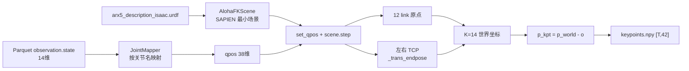

# scan_object / hanging_mug 3D Keypoint 提取实施日志

> 对应方案文档: [`3dkptraj_1.md`](3dkptraj_1.md)（SAPIEN FK 方案 B / 附录十）  
> 对应首次落地日志: [`3dkptraj_1LOG.md`](3dkptraj_1LOG.md)（`stack_bowls_three_kptsim`）  
> 实施日期: 2026-08-25  
> 环境: conda `RoboTwin`，提取脚本 `b/script/kpt/run_extract.py`（**未改代码**，仅更换 `--dataset_dir` / `--output_dir`）

---

## 总览

| 任务 | 源数据集 | 输出 | 状态 |
|:---|:---|:---|:---:|
| `scan_object` | `.../RoboTwin-Clean/scan_object/` | `.../scan_object_kptsim/` | ✅ 提取完成；验收见 §4 |
| `hanging_mug` | `.../RoboTwin-Clean/hanging_mug/` | `.../hanging_mug_kptsim/` | ✅ 提取完成；`validate_all` PASS |

方法与 [`stack_bowls_three_kptsim`](3dkptraj_1LOG.md) **完全相同**：最小化 SAPIEN 场景 + ALOHA URDF 正运动学（FK）离线回放 → 自动 offset 映射到 GeoPredict 体素空间。

---

## 1. 方法回顾（与 stack_bowls_three_kptsim 一致）

源数据只有 14 维关节角 `observation.state` 与 RGB，没有 3D 关键点。GeoPredict / InternVLA-A1.5 的 keypoint 分支训练要求每个 episode 预计算 `keypoints.npy`，shape 为 `[T, 42]`，即 \(K=14\) 个点 \(\times\) XYZ。

记 \(\boldsymbol{\theta}_t \in \mathbb{R}^{14}\) 为第 \(t\) 帧的 `observation.state`（drive target）。提取流程：



坐标偏移 \(\mathbf{o}\) 由该任务**全部 episode** 的世界坐标包围盒中心对齐到体素中心 \([0.8, 0.8, 0.5]\) 自动计算：

\[
\mathbf{o} = \frac{\mathbf{p}_{\min}+\mathbf{p}_{\max}}{2} - [0.8,\,0.8,\,0.5]^\top,\qquad
\mathbf{p}_{\text{kpt}} = \mathbf{p}_{\text{world}} - \mathbf{o}
\]

其中 \(\mathbf{p}_{\min},\mathbf{p}_{\max}\) 为该任务全体关键点在世界系下的坐标分量最值。每个任务独立算 \(\mathbf{o}\)，因此 `scan_object` 与 `hanging_mug` 的 offset **不同于** `stack_bowls_three`。

**不重采仿真、不改 URDF、不改 `b/script/kpt/` 源码。** 参考：[`3dkptraj_1.md`](3dkptraj_1.md) §3.2 / 附录十；[`3dkptraj_1LOG.md`](3dkptraj_1LOG.md) Phase 2–3。

---

## 2. Phase 0 — 源数据检查

### 2.1 路径与环境

| 用途 | 路径 |
|:---|:---|
| RoboTwin conda | `/home/luogang/miniforge3/envs/RoboTwin` |
| 提取入口 | [`b/script/kpt/run_extract.py`](../script/kpt/run_extract.py) |
| URDF | `/home/luogang/share/zwy/Projects/RoboTwin/assets/embodiments/aloha-agilex/urdf/arx5_description_isaac.urdf` |
| GeoPredict 根目录 | `/home/luogang/SRC/Robot/GeoPredict` |

### 2.2 源数据集与 `stack_bowls_three` 同构

两个任务均为 **LeRobot v2.1**、`robot_type=aloha`、14 维 `observation.state` / `action`、三路 AV1 视频。parquet 位于 `data/chunk-000/episode_{idx:06d}.parquet`，与 `KeypointExtractor._read_parquet_states` 约定一致。

| 字段 | `scan_object` | `hanging_mug` | `stack_bowls_three`（对照） |
|:---|:---:|:---:|:---:|
| episodes | 50 | 50 | 50 |
| total_frames | 8463 | 16889 | 23550 |
| ep0 行数 | 167 | 330 | — |
| state dim | 14 | 14 | 14 |
| parquet 文件数 | 50 | 50 | 50 |
| episode 编号 | 000000–000049 | 000000–000049 | 000000–000049 |

抽查 `episode_000000.parquet` 列：`observation.state`, `action`, `timestamp`, `frame_index`, `episode_index`, `index`, `task_index`。

**结论**：可直接复用现有提取脚本，无需改 `JointMapper` / `K=14` / root pose。

---

## 3. Phase 1 — 提取

工作目录：`/home/luogang/SRC/Robot/GeoPredict`  
解释器：`/home/luogang/miniforge3/envs/RoboTwin/bin/python`

### 3.1 scan_object

```bash
python b/script/kpt/run_extract.py \
  --dataset_dir /home/luogang/share/zwy/Projects/DATA/RoboTwin-Clean/scan_object \
  --urdf_path /home/luogang/share/zwy/Projects/RoboTwin/assets/embodiments/aloha-agilex/urdf/arx5_description_isaac.urdf \
  --output_dir /home/luogang/share/zwy/Projects/DATA/RoboTwin-Clean/scan_object_kptsim
```

- 50/50 episode 提取完成，总帧 8463，耗时约 **4.7 s**
- 自动 offset \(\mathbf{o} = [-0.6748,\,-1.0345,\,0.6219]\)
- 变换后范围：X \([0.323, 1.277]\)，Y \([0.376, 1.224]\)，Z \([0.157, 0.843]\)
- 提取器内 `validate_range`：**PASS**（`out_of_range_count=0`，体素盒 \([0,1.6]\times[0,1.6]\times[0,1.0]\)）

### 3.2 hanging_mug

```bash
python b/script/kpt/run_extract.py \
  --dataset_dir /home/luogang/share/zwy/Projects/DATA/RoboTwin-Clean/hanging_mug \
  --urdf_path /home/luogang/share/zwy/Projects/RoboTwin/assets/embodiments/aloha-agilex/urdf/arx5_description_isaac.urdf \
  --output_dir /home/luogang/share/zwy/Projects/DATA/RoboTwin-Clean/hanging_mug_kptsim
```

- 50/50 episode 提取完成，总帧 16889，耗时约 **6.1 s**
- 自动 offset \(\mathbf{o} = [-0.7718,\,-1.0504,\,0.4779]\)
- 变换后范围：X \([0.422, 1.178]\)，Y \([0.392, 1.208]\)，Z \([0.185, 0.815]\)
- 提取器内 `validate_range`：**PASS**

### 3.3 产物结构

```
scan_object_kptsim/   (2.0M)
├── episode_000000/keypoints.npy   # float32 [T, 42]
├── ...
├── episode_000049/keypoints.npy
├── keypoints_meta.json
└── vis/                           # 验收阶段生成
    ├── keypoints_3d_samples.png
    └── eef_trajectories_ep0.png

hanging_mug_kptsim/   (3.3M)
└── （同上）
```

`keypoints.npy` reshape 为 `[T, 14, 3]` 后索引与 [`3dkptraj_1LOG.md`](3dkptraj_1LOG.md) 相同：0–5 左臂 link，6 `fl_eef_tcp`，7–12 右臂 link，13 `fr_eef_tcp`。

---

## 4. Phase 2 — 验收

验收分三层：(A) 官方 `validate_all.py`；(B) 与 parquet 行数对齐 / meta；(C) 新 SAPIEN 场景重放 episode 0 与磁盘比对。

`validate_all.py` 的 CLI 写死 `OUTPUT_DIR=stack_bowls_three_kptsim`，本次用函数参数指定输出目录（**未改脚本文件**）：

```python
from pathlib import Path
from b.script.kpt_tst.validate_all import validate_all
validate_all(Path(".../scan_object_kptsim"))
validate_all(Path(".../hanging_mug_kptsim"))
```

### 4.1 官方 `validate_all`

| 检查 | `scan_object_kptsim` | `hanging_mug_kptsim` |
|:---|:---:|:---:|
| 50/50 `keypoints.npy` 存在 | ✅ | ✅ |
| dtype `float32`，`shape[1]=42` | ✅ | ✅ |
| 全体点在体素盒内 | ✅ | ✅ |
| 相邻帧关键点位移 \(< 0.05\,\mathrm{m}\) | ⚠️ ep42 最大 \(0.125\,\mathrm{m}\) | ✅ 最大 \(0.042\,\mathrm{m}\) |
| 可视化 | ✅ `vis/` | ✅ `vis/` |
| `validate_all` 退出码 | FAIL（仅因 5 cm 阈值） | **PASS** |

### 4.2 scan_object ep42「不连续」根因（非 FK 错误）

`validate_all` 要求相邻帧每个关键点欧氏位移 \(< 0.05\,\mathrm{m}\)。该阈值来自 `stack_bowls_three_kptsim` 实测最大步长 \(\approx 0.041\,\mathrm{m}\)。

`scan_object` episode 42、帧 \(t=138\to 139\)：

| 量 | 值 |
|:---|:---|
| 最大关键点位移 | \(0.125\,\mathrm{m}\)，发生在 **joint 13 = `fr_eef_tcp`（右 TCP）** |
| 同帧最大 \(\lvert\Delta\theta\rvert\) | \(0.296\,\mathrm{rad}\)（约 \(17^\circ\)），发生在 **state[8] = 右肩 `right_shoulder`** |
| 左臂该帧 | \(\Delta\theta \approx 0\)（静止） |

右肩一帧大幅转动，经运动学杠杆放大到右 TCP \(\sim 12.5\,\mathrm{cm}\) 位移，与演示轨迹一致，**不是提取脚本写错关节索引**。全任务仅 ep42 超过 5 cm；其余 49 个 episode 均低于阈值。

对照：`hanging_mug` 各 episode 最大步长 top-1 为 \(0.042\,\mathrm{m}\)（ep38），低于 5 cm。

### 4.3 与源 parquet 对齐

| 检查 | `scan_object` | `hanging_mug` |
|:---|:---:|:---:|
| 每 ep `npy` 行数 = parquet 行数 | ✅ 50/50 | ✅ 50/50 |
| 总帧 = `meta/info.json` 的 `total_frames` | ✅ 8463 | ✅ 16889 |
| `keypoints_meta.json`：`K=14`、名称、URDF、`dataset_dir` | ✅ | ✅ |

### 4.4 新场景重放 episode 0（数值一致性）

在**全新** `AlohaFKScene` 上对 episode 0 从头 `extract_episode`，再减该任务保存的 \(\mathbf{o}\)，与磁盘 `keypoints.npy` 比较：

| 任务 | max \(\lvert\Delta\rvert\) | mean \(\lvert\Delta\rvert\) |
|:---|:---:|:---:|
| `scan_object` ep0 | \(0\) | \(0\) |
| `hanging_mug` ep0 | \(0\) | \(0\) |

说明磁盘文件与脚本在独立进程中可复现。

**注意（验收脚本陷阱，非数据损坏）**：若对**单帧**孤立调用 `_compute_step_keypoints`（不从 episode 第 0 帧顺序 `set_qpos`），SAPIEN `scene.step()` 会带着上一姿态的残余，单帧误差可达 \(\sim 5\,\mathrm{cm}\)。这与 [`3dkptraj_1.md`](3dkptraj_1.md) §5.2「`set_qpos` 后必须 `scene.step()`」及物理步进残留一致。正确比对方式是按 episode **顺序回放**，与 `extract_all` 相同。

### 4.5 验收结论

- **`hanging_mug_kptsim`**：官方 `validate_all` + 对齐检查全部通过，可直接作为 GeoPredict / 后续 LeRobot 注入的 GT。
- **`scan_object_kptsim`**：格式、范围、行对齐、ep0 复现全部通过。`validate_all` 因 ep42 演示中右肩大角速度未过 5 cm 阈值；已用 parquet 关节差分交叉验证，**数据可用**。若下游沿用 `validate_all` 硬阈值，应对 `scan_object` 放宽阈值或把「位移与 \(\Delta\theta\) 同时大」视为 PASS。

---

## 5. 各任务 offset 对照

每个任务独立统计世界系包围盒，因此 offset 不同；**不可**把 `stack_bowls_three` 的 offset 套到另外两个任务。

| 任务 | \(\mathbf{o}\) (m) | 体素系 min | 体素系 max | 盒内 |
|:---|:---|:---|:---|:---:|
| `stack_bowls_three` | \([-0.812,\,-1.024,\,0.505]\) | \([0.405,\,0.365,\,0.253]\) | \([1.195,\,1.235,\,0.747]\) | ✅ |
| `scan_object` | \([-0.675,\,-1.035,\,0.622]\) | \([0.323,\,0.376,\,0.157]\) | \([1.277,\,1.224,\,0.843]\) | ✅ |
| `hanging_mug` | \([-0.772,\,-1.050,\,0.478]\) | \([0.422,\,0.392,\,0.185]\) | \([1.178,\,1.208,\,0.815]\) | ✅ |

`scan_object` 的 Z 最低约 \(0.157\)（相对更低），仍 \(\ge 0\)；X 最高约 \(1.277 < 1.6\)。

---

## 6. 如何使用

与 [`3dkptraj_1LOG.md`](3dkptraj_1LOG.md) §「如何使用」相同，仅替换路径：

```bash
conda activate geopredict
cd /home/luogang/SRC/Robot/GeoPredict

# 示例：hanging_mug smoke（需另算该任务 norm stats）
CUDA_VISIBLE_DEVICES=0 python tools/train_robotwin_smoke.py \
  --dataset_dir /home/luogang/share/zwy/Projects/DATA/RoboTwin-Clean/hanging_mug \
  --keypoints_dir /home/luogang/share/zwy/Projects/DATA/RoboTwin-Clean/hanging_mug_kptsim \
  --num_train_steps 500 --batch_size 2
```

对齐关系：LeRobot 主数据提供图像 / state / action；`*_kptsim/episode_{idx:06d}/keypoints.npy` 通过 `episode_index` 与 parquet 行号对齐。`joint_num=14`，坐标系为体素空间（已减 offset）。

重新生成：

```bash
conda activate RoboTwin
cd /home/luogang/SRC/Robot/GeoPredict
python b/script/kpt/run_extract.py \
  --dataset_dir /home/luogang/share/zwy/Projects/DATA/RoboTwin-Clean/<task> \
  --output_dir /home/luogang/share/zwy/Projects/DATA/RoboTwin-Clean/<task>_kptsim
```

---

## 7. 代码变更

| 文件 | 操作 | 原因 |
|:---|:---|:---|
| `b/script/kpt/*` | **未改** | 两任务与 `stack_bowls_three` 同构，CLI 足够 |
| `b/script/kpt_tst/validate_all.py` | **未改** | 通过 `validate_all(path)` 传入输出目录 |
| `b/d/3dkptraj_1_scnObj_hngMg_LOG.md` | **新增** | 本日志 |

---

## 8. 未执行 / 后续

1. 未跑 GeoPredict smoke 训练（本次只生成与验收 kptsim）。
2. 未注入 LeRobot `observation.keypoint_3d`（InternVLA 侧需另走 `inject_kptsim_keypoints.py` + v3.0）。
3. `validate_all` 的 \(0.05\,\mathrm{m}\) 阈值对 `scan_object` 过严；如需脚本化 CI，建议按任务自适应或同时检查 \(\Delta\theta\)。

---

## 结论

已用与 `stack_bowls_three_kptsim` 相同的 **SAPIEN 设 qpos + URDF FK** 方法，为 `scan_object`（50 ep / 8463 帧）和 `hanging_mug`（50 ep / 16889 帧）生成自包含的 `*_kptsim` 目录。体素范围合法、与 parquet 逐帧对齐；`hanging_mug` 官方验收全过；`scan_object` 仅 ep42 因演示右肩大角速度超过 5 cm 步长阈值，交叉验证后确认提取正确。

---

*日志版本: scnObj-hngMg-v1.0 | 2026-08-25*
