# GeoPredict: 预测性运动学与3D高斯几何增强的VLA操作框架

## 论文与代码深度解析

> **论文**: *GeoPredict: Leveraging Predictive Kinematics and 3D Gaussian Geometry for Precise VLA Manipulation*
> **发表**: CVPR 2026 (Highlight)
> **作者**: Jingjing Qian, Boyao Han, Chen Shi, Lei Xiao, Long Yang, Shaoshuai Shi, Li Jiang
> **机构**: 香港中文大学(深圳), 湖南大学, Voyager Research (滴滴)
> **arXiv**: [2512.16811](https://arxiv.org/abs/2512.16811) | **代码**: [GitHub](https://github.com/jingjingqian75/GeoPredict) | **项目主页**: [GeoPredict-Page](https://jingjingqian75.github.io/GeoPredict-Page/)

---

## 目录

1. [概述与贡献](#1-概述与贡献)
2. [背景与相关工作](#2-背景与相关工作)
3. [方法论深度解析](#3-方法论深度解析)
4. [架构分析](#4-架构分析)
5. [数据流水线分析](#5-数据流水线分析)
6. [训练与推理过程](#6-训练与推理过程)
7. [实验结果分析](#7-实验结果分析)
8. [优势、局限与展望](#8-优势局限与展望)
9. [参考文献](#9-参考文献)
10. [模型网络结构与 Forward/Backward 深度解析](#10-模型网络结构与-forwardbackward-深度解析)

---

## 1. 概述与贡献

### 1.1 问题陈述与动机

Vision-Language-Action (VLA) 模型通过预训练的 Vision-Language Model (VLM) 将视觉观测和语言指令映射为机器人动作，在泛化性方面表现优异。然而，现有 VLA 方法存在三个核心局限性：

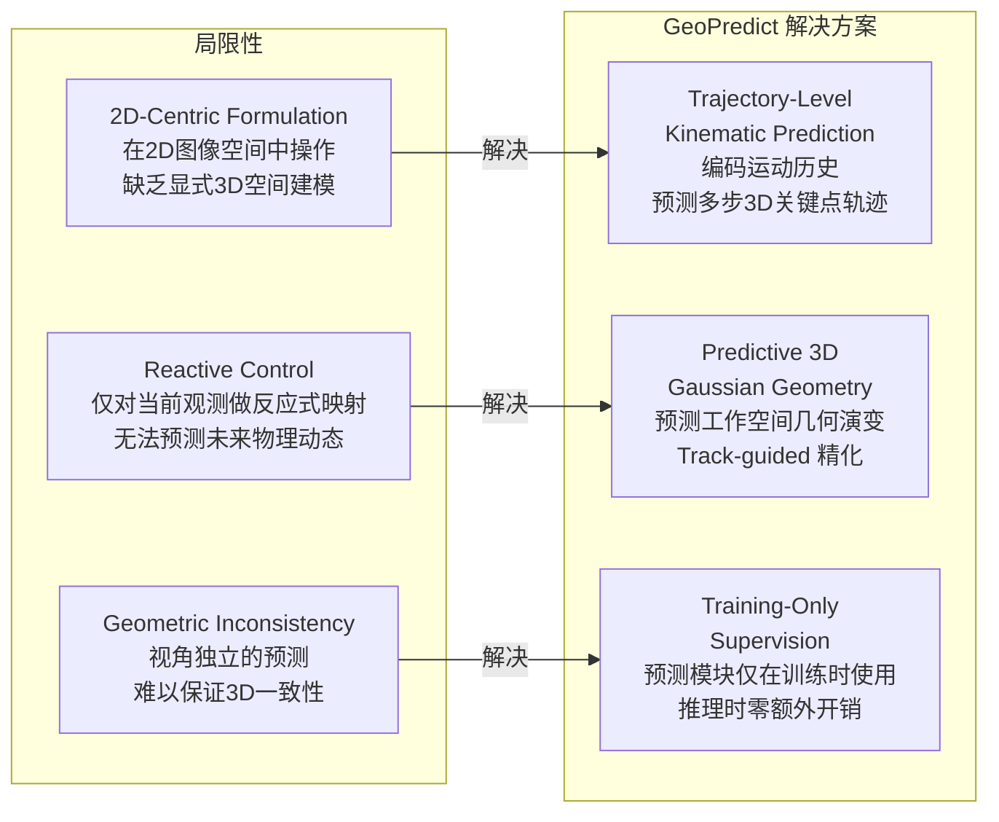
```mermaid
flowchart LR
    subgraph 局限性
        P1["2D-Centric Formulation<br/>在2D图像空间中操作<br/>缺乏显式3D空间建模"]
        P2["Reactive Control<br/>仅对当前观测做反应式映射<br/>无法预测未来物理动态"]
        P3["Geometric Inconsistency<br/>视角独立的预测<br/>难以保证3D一致性"]
    end
    subgraph GeoPredict 解决方案
        S1["Trajectory-Level<br/>Kinematic Prediction<br/>编码运动历史<br/>预测多步3D关键点轨迹"]
        S2["Predictive 3D<br/>Gaussian Geometry<br/>预测工作空间几何演变<br/>Track-guided 精化"]
        S3["Training-Only<br/>Supervision<br/>预测模块仅在训练时使用<br/>推理时零额外开销"]
    end
    P1 -->|"解决"| S1
    P2 -->|"解决"| S2
    P3 -->|"解决"| S3
```

具体而言：

1. **2D-Centric Formulation**: 多数 VLA 模型（如 OpenVLA [Kim et al., 2025]、Pi0 [Black et al., 2024]）在 2D 图像空间中运行，缺乏对工作空间的显式三维建模，导致在需要精确空间推理的任务中表现不佳。

2. **Reactive Control**: 现有方法将当前观测反应式地映射为动作，无法预测机器人运动将如何改变底层 3D 场景。这种"近视"的策略在长序列操作任务中受限。

3. **Geometric Inconsistency**: 基于视频预测（如 SuSiE [Black et al., 2023]、UniPi [Du et al., 2023]）或深度预测（如 DreamVLA [Zhang et al., 2025]）的方法产生视角相关的预测，难以跨多视角保持 3D 几何一致性。

GeoPredict 提出两种互补的预测能力来解决上述问题：**预测性运动学先验**（Predictive Kinematic Priors）和**预测性 3D 高斯几何**（Predictive 3D Gaussian Geometry），并采用"仅训练时辅助监督"的设计范式，在不增加推理成本的前提下将 3D 结构化知识注入到 transformer 的内部表征中。

### 1.2 核心贡献

论文的三个主要贡献：

1. **GeoPredict 框架**: 提出了一个 geometry-aware VLA 框架，将面向未来的运动学和几何先验注入到连续动作策略中，增强对长序列 3D 动态的推理能力。

2. **两个互补的预测模块**:
   - **Trajectory-Level Kinematic Predictor**: 预测多步机器人关键点运动轨迹
   - **Predictive 3D Gaussian Geometry Module**: 带有 track-guided refinement 机制，将几何建模能力集中分配到任务相关的交互区域

3. **一致且显著的性能提升**: 在 RoboCasa Human-50、LIBERO 和真实世界操作任务上，GeoPredict 相比强 VLA 基线均取得显著改善，尤其在需要精确空间推理和几何鲁棒性的场景中优势明显。

### 1.3 技术摘要

GeoPredict 构建在 Pi0 [Black et al., 2024] 之上，使用 PaliGemma (SigLIP 视觉编码器 + Gemma LLM) 作为 VLM 骨干，通过 conditional flow matching 生成连续动作。在此基础上，GeoPredict 新增：

- **Track Encoder**: 将机器人关键点的运动历史压缩为紧凑的 token，通过 cross-attention 编码运动惯性
- **Future Track Query**: 可学习的查询 token，在 transformer 中与指令、图像、历史 token 共同处理，预测未来多步 3D 关键点轨迹
- **3D Spatial Query + Voxel Decoder**: 将工作空间离散化为体素网格，通过 3D 转置卷积解码为 3D Gaussian Splatting 基元
- **Track-guided Refinement**: 沿预测的关键点轨迹自适应增加高斯密度，聚焦于交互区域
- **Depth Rendering Loss**: 通过可微高斯溅射渲染深度图并与真值监督，仅用于训练

推理时，仅执行标准 VLA 推理流程（prefix 计算 + KV cache + 10步 Euler 去噪），所有 3D 预测模块不参与。

---

## 2. 背景与相关工作

### 2.1 纵向分析：机器人学习范式的演进

#### 2.1.1 从行为克隆到 VLA 模型

机器人操作策略的学习经历了从简单行为克隆到基于大规模预训练模型的 VLA 方法的显著演进：


```mermaid
flowchart LR
    BC["BC-Transformer<br/>(2024)<br/>行为克隆基线<br/>简单前馈策略"] --> RT1["RT-1<br/>(2022)<br/>Robotics Transformer<br/>首次大规模机器人数据"]
    RT1 --> RT2["RT-2<br/>(2023)<br/>VLM→动作<br/>利用视觉-语言预训练"]
    RT2 --> OV["OpenVLA<br/>(2025)<br/>开源 VLA<br/>离散动作token化"]
    OV --> Pi0["Pi0<br/>(2024)<br/>Flow Matching<br/>连续动作生成<br/>双专家架构"]
    Pi0 --> GP["GeoPredict<br/>(2025/2026)<br/>几何感知VLA<br/>3D预测性先验<br/>训练时监督"]

    style BC fill:#e5e7eb
    style RT1 fill:#bfdbfe
    style RT2 fill:#93c5fd
    style OV fill:#60a5fa
    style Pi0 fill:#3b82f6,color:#fff
    style GP fill:#22c55e,color:#fff
```

**关键演进节点**：

| 阶段 | 代表方法 | 动作表示 | 3D感知 | 预测性 |
|:---:|:---:|:---:|:---:|:---:|
| 行为克隆 | BC-Transformer | 连续 | 无 | 无 |
| 大规模 Transformer | RT-1/RT-2 | 离散 token | 无 | 无 |
| 开源 VLA | OpenVLA | 离散自回归 | 无 | 无 |
| 连续动作 VLA | Pi0 | Flow Matching | 无 | 无 |
| **几何感知 VLA** | **GeoPredict** | **Flow Matching** | **显式 3DGS** | **多步 3D 预测** |

动作表示的演进是一条关键线索。OpenVLA 采用离散自回归 token 化（将连续动作空间离散化为词表中的 token），这限制了推理频率并难以捕获多模态动作分布。Pi0 引入 conditional flow matching [Lipman et al., 2022]，通过学习从噪声到动作的连续向量场来生成平滑的动作序列，显著提升了动作质量。GeoPredict 继承了 Pi0 的 flow matching 框架，并在此之上注入了 3D 结构化知识。

#### 2.1.2 从反应式到预测式策略

近年来，将预测结构整合到 visuomotor 模型中的工作逐渐增多：

| 方法 | 预测目标 | 3D一致性 | 推理时开销 | 预测步长 |
|:---:|:---:|:---:|:---:|:---:|
| SuSiE [Black et al., 2023] | 单帧 RGB | 无 | 高 (扩散去噪) | 1步 |
| UniPi [Du et al., 2023] | 视频序列 | 无 | 高 | 多步 |
| Video Prediction Policy [Hu et al., 2025] | 视频表征 | 弱 | 中 | 多步 |
| Seer [Tian et al., 2025] | 视觉状态 | 无 | 高 | 多步 |
| DreamVLA [Zhang et al., 2025] | 深度图 | 弱 | 中 | 多步 |
| GWM [Lu et al., 2025] | 3D Gaussian 属性 | 强 | **高** | 多步 |
| WorldVLA [Cen et al., 2025] | 自回归世界模型 | 中 | 高 | 多步 |
| **GeoPredict** | **3D 关键点 + 深度图** | **强** | **零** | **50步** |

GeoPredict 的关键区别在于：预测模块**仅在训练时使用**。这意味着推理时的计算开销为零（相比基座模型 Pi0 仅增加少量 query token），同时训练时的 3D 监督信号已将几何理解能力编码进了 transformer 的内部表征中。

#### 2.1.3 3D 场景表征的演进

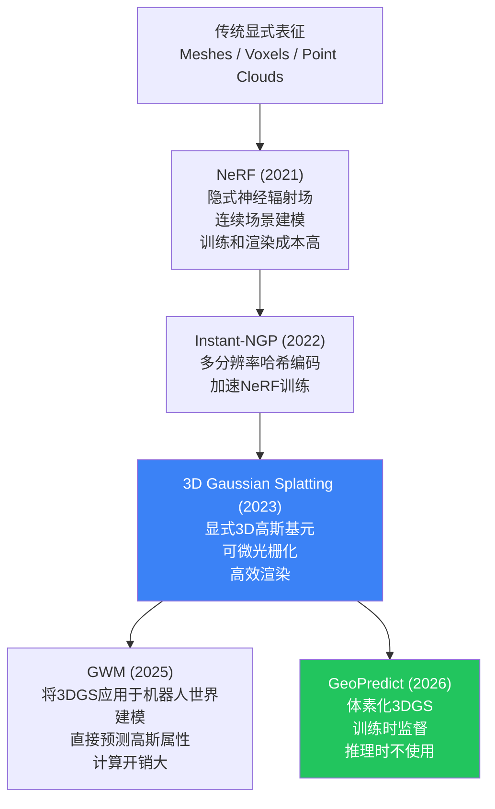
```mermaid
flowchart TD
    Trad["传统显式表征<br/>Meshes / Voxels / Point Clouds"]
    NeRF["NeRF (2021)<br/>隐式神经辐射场<br/>连续场景建模<br/>训练和渲染成本高"]
    InstNGP["Instant-NGP (2022)<br/>多分辨率哈希编码<br/>加速NeRF训练"]
    GS["3D Gaussian Splatting (2023)<br/>显式3D高斯基元<br/>可微光栅化<br/>高效渲染"]
    GWM["GWM (2025)<br/>将3DGS应用于机器人世界建模<br/>直接预测高斯属性<br/>计算开销大"]
    GP["GeoPredict (2026)<br/>体素化3DGS<br/>训练时监督<br/>推理时不使用"]

    Trad --> NeRF
    NeRF --> InstNGP
    InstNGP --> GS
    GS --> GWM
    GS --> GP

    style GP fill:#22c55e,color:#fff
    style GS fill:#3b82f6,color:#fff
```

3D Gaussian Splatting (3DGS) [Kerbl et al., 2023] 作为 NeRF 的高效替代方案，将场景建模为一组带有可学习属性的 3D 高斯基元。GeoPredict 选择 3DGS 的理由：

1. **显式表征**: 每个高斯基元有明确的 3D 位置、形状和不透明度，适合空间推理
2. **可微渲染**: 基于 alpha compositing 的光栅化过程完全可微，可作为训练损失的一部分
3. **几何聚焦**: GeoPredict 仅渲染深度图（不渲染颜色），这与论文的核心洞察一致——策略受益于几何结构信息（形状、距离），而非外观

与 GWM 直接预测大规模高斯属性（计算开销大）不同，GeoPredict 采用体素化方案：将工作空间划分为体素网格，通过 3D 转置卷积上采样，并用 track-guided refinement 在关键交互区域增加密度。

### 2.2 横向分析：同期方法对比

#### 2.2.1 VLA 方法综合对比 (2024-2026)

| 方法 | 骨干 | 动作类型 | 3D感知 | 预测能力 | 推理额外开销 | RoboCasa | LIBERO Avg |
|:---:|:---:|:---:|:---:|:---:|:---:|:---:|:---:|
| OpenVLA | LLaVA 7B | 离散自回归 | 无 | 无 | 无 | - | 76.5% |
| TraceVLA | LLaVA 7B | 离散 | 视觉轨迹 | 无 | 低 | - | 74.8% |
| SpatialVLA | InternVL | 连续 | 空间表征 | 无 | 低 | - | 78.1% |
| Pi0 | PaliGemma | Flow Matching | 无 | 无 | 无 | 42.3% | 93.9% |
| UniVLA | PaliGemma | 潜在动作 | 无 | 无 | 低 | - | 95.2% |
| 4D-VLA | InternVL | 连续 | 4D时空 | 中 | 中 | - | 88.6% |
| DreamVLA | LLaVA | 连续 | 深度预测 | 强 | 中 | - | 92.6% |
| GWM | Pi0 | Flow Matching | 3DGS | 强 | **高** | 39.2% | - |
| **GeoPredict** | **PaliGemma** | **Flow Matching** | **3DGS** | **强** | **零** | **52.4%** | **96.5%** |

GeoPredict 在两个关键维度上取得了最佳平衡：

1. **3D 感知深度**: 与 GWM 一样使用 3DGS 实现强 3D 一致性，但避免了 GWM 在推理时预测高斯属性的高计算开销
2. **推理效率**: 与基座模型 Pi0 的推理成本几乎相同（仅多了约 336 个轻量 query token），而性能提升了 10.1%

---

## 3. 方法论深度解析

本章节逐一分析 GeoPredict 的每个技术组件，将论文中的数学公式映射到代码实现，并深入解读关键设计决策。

### 3.1 问题形式化

VLA 策略 $\boldsymbol{\pi}$ 的目标是学习一个映射：

$$\boldsymbol{\pi}: (\mathbf{L}, \mathbf{I}_t, \mathbf{Q}_t) \rightarrow \mathbf{A}_t = [\mathbf{a}_t, \mathbf{a}_{t+1}, \ldots, \mathbf{a}_{t+H-1}]$$

其中：
- $\mathbf{L}$: 语言指令（如 "place the mug on the counter"）
- $\mathbf{I}_t$: 当前时间步的多视角图像观测（左/右/手腕相机，224×224 分辨率）
- $\mathbf{Q}_t$: 机器人本体感知状态（3维末端位置 + 3维轴角旋转 + 2维夹爪状态 = 8维，补零至32维）
- $\mathbf{A}_t$: 动作序列（action chunk），$H = 50$ 步
- 每个动作 $\mathbf{a}_t = \{\Delta\mathbf{x}, \Delta\boldsymbol{\theta}, g\} \in \mathbb{R}^{7}$（实际12维，补零至32维），其中 $\Delta\mathbf{x} \in \mathbb{R}^3$ 为平移偏移，$\Delta\boldsymbol{\theta} \in \mathbb{R}^3$ 为旋转偏移，$g \in \mathbb{R}$ 为夹爪开合状态

**代码映射**: 全局常量定义在 `models/geopredict.py:15-18`：
```python
action_dim = 32          # 实际 12 维，补零到 32 维
action_horizon = 50      # 预测 50 步未来动作
max_token_len = 48       # 语言 prompt 最大 token 长度
action_expert_config = gemma_300m_config  # 动作专家使用小 Gemma 配置
```

### 3.2 基座模型: Pi0 架构

GeoPredict 构建在 Pi0 之上。Pi0 的核心由三部分组成：SigLIP 视觉编码器、Gemma 双专家 LLM、以及基于 Flow Matching 的动作生成器。

#### 3.2.1 SigLIP 视觉编码器

SigLIP 是一个标准的 ViT (Vision Transformer) 架构，将 224×224 RGB 图像编码为一组空间 token：

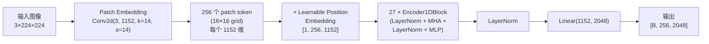
```mermaid
flowchart LR
    Img["输入图像<br/>3×224×224"] --> PE["Patch Embedding<br/>Conv2d(3, 1152, k=14, s=14)"]
    PE --> Tok["256 个 patch token<br/>(16×16 grid)<br/>每个 1152 维"]
    Tok --> POS["+ Learnable Position<br/>Embedding<br/>[1, 256, 1152]"]
    POS --> Blocks["27 × Encoder1DBlock<br/>(LayerNorm + MHA +<br/>LayerNorm + MLP)"]
    Blocks --> Norm["LayerNorm"]
    Norm --> Proj["Linear(1152, 2048)"]
    Proj --> Out["输出<br/>[B, 256, 2048]"]
```

- **Patch Embedding**: `Conv2d(3, 1152, kernel_size=14, stride=14)` 将图像分割为 16×16=256 个不重叠的 patch，每个 patch 嵌入为 1152 维向量
- **位置编码**: 可学习的位置嵌入 `[1, 256, 1152]`，初始化为正态分布 $\mathcal{N}(0, 1/\sqrt{1152})$
- **27 层 Encoder Block**: 每层包含 LayerNorm + 16 头 Multi-Head Attention + LayerNorm + MLP (GELU)
- **最终投影**: `Linear(1152, 2048)` 将输出映射到 Gemma 主专家的维度

**代码映射**: `models/siglip.py`，`class SigLIP`。对于 3 个摄像头视角（左/右/手腕），SigLIP 分别编码，产生 $3 \times 256 = 768$ 个图像 token。

#### 3.2.2 PaliGemma Tokenizer

语言指令通过 SentencePiece tokenizer（词表大小 257,152，与 PaliGemma 一致）进行分词：

```python
# models/tokenizer.py - PaligemmaTokenizer.tokenize()
tokens = self._tokenizer.encode(cleaned_text, add_bos=True) + self._tokenizer.encode("\n")
```

- 添加 BOS (Begin of Sentence) token
- 追加 `"\n"` 作为"答案开始"分隔符
- 填充或截断至 `max_token_len = 48`
- 输出 token 序列和对应的 attention mask

#### 3.2.3 Gemma 双专家 LLM 骨干

GeoPredict 的核心创新之一继承自 Pi0：一个**双专家** Gemma 架构。两个"专家"共享注意力计算，但维持独立的 FFN 通路：

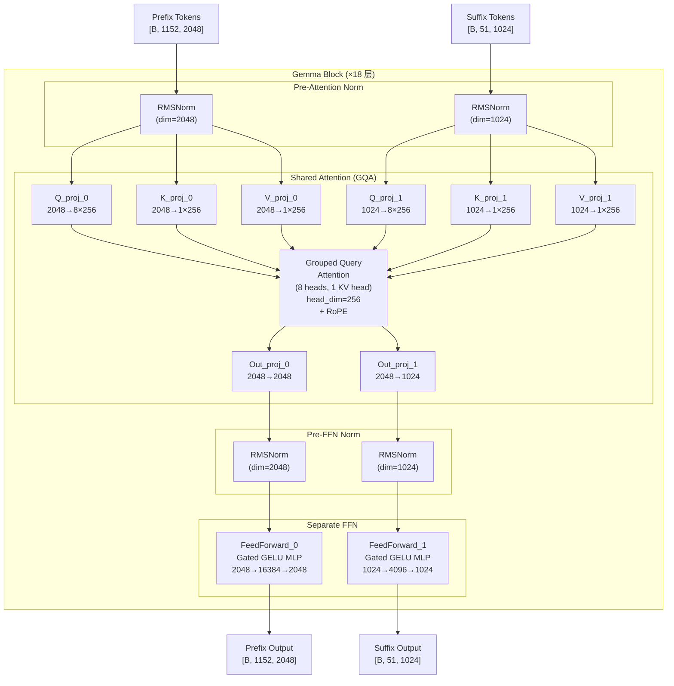
```mermaid
flowchart TB
    subgraph "Gemma Block (×18 层)"
        direction TB
        subgraph "Pre-Attention Norm"
            RN1_0["RMSNorm<br/>(dim=2048)"]
            RN1_1["RMSNorm<br/>(dim=1024)"]
        end
        subgraph "Shared Attention (GQA)"
            direction LR
            Q0["Q_proj_0<br/>2048→8×256"] --> ATT["Grouped Query<br/>Attention<br/>(8 heads, 1 KV head)<br/>head_dim=256<br/>+ RoPE"]
            K0["K_proj_0<br/>2048→1×256"] --> ATT
            V0["V_proj_0<br/>2048→1×256"] --> ATT
            Q1["Q_proj_1<br/>1024→8×256"] --> ATT
            K1["K_proj_1<br/>1024→1×256"] --> ATT
            V1["V_proj_1<br/>1024→1×256"] --> ATT
            ATT --> O0["Out_proj_0<br/>2048→2048"]
            ATT --> O1["Out_proj_1<br/>2048→1024"]
        end
        subgraph "Pre-FFN Norm"
            RN2_0["RMSNorm<br/>(dim=2048)"]
            RN2_1["RMSNorm<br/>(dim=1024)"]
        end
        subgraph "Separate FFN"
            FF0["FeedForward_0<br/>Gated GELU MLP<br/>2048→16384→2048"]
            FF1["FeedForward_1<br/>Gated GELU MLP<br/>1024→4096→1024"]
        end
    end

    Input0["Prefix Tokens<br/>[B, 1152, 2048]"] --> RN1_0
    Input1["Suffix Tokens<br/>[B, 51, 1024]"] --> RN1_1
    RN1_0 --> Q0 & K0 & V0
    RN1_1 --> Q1 & K1 & V1
    O0 --> RN2_0 --> FF0 --> Out0["Prefix Output<br/>[B, 1152, 2048]"]
    O1 --> RN2_1 --> FF1 --> Out1["Suffix Output<br/>[B, 51, 1024]"]
```

两个专家的配置：

| 参数 | Expert-0 (Prefix/主专家) | Expert-1 (Suffix/动作专家) |
|:---:|:---:|:---:|
| width | 2048 | 1024 |
| depth | 18 | 18 |
| mlp_dim | 16,384 | 4,096 |
| num_heads | 8 | 8 |
| num_kv_heads | 1 | 1 |
| head_dim | 256 | 256 |

**共享注意力的实现机制** (`models/gemma.py:114-191`):

1. 每个专家的输入 $\mathbf{x}$ 通过**各自独立**的 Q/K/V 投影得到 query、key、value（投影的输入维度不同，但输出的 head 结构相同）
2. 来自两个专家的 Q, K, V 在**序列维度上拼接** — 这意味着 prefix token 和 suffix token 参与同一个注意力计算
3. 应用 Rotary Position Embedding (RoPE) 进行位置编码
4. 执行 Grouped Query Attention (GQA)：8 个 query head 共享 1 个 KV head（group size = 8）
5. 注意力输出按序列维度**拆分回**各专家，通过各自的输出投影

**Grouped Query Attention (GQA)**:

GQA 是 Multi-Head Attention 和 Multi-Query Attention 的折中方案。设 query 有 $N_h = 8$ 个头，KV 有 $N_{kv} = 1$ 个头，组大小 $G = N_h / N_{kv} = 8$，则 KV 头被扩展复制 8 次以匹配 query 头数：

$$\text{Attention}(\mathbf{Q}, \mathbf{K}, \mathbf{V}) = \text{softmax}\left(\frac{\mathbf{Q}\mathbf{K}^\top}{\sqrt{d_h}} \odot \mathbf{M}\right)\mathbf{V}$$

其中 $d_h = 256$ 是每个头的维度，$\mathbf{M}$ 是 block-wise causal attention mask（详见 §4.2.2）。

**RoPE 位置编码** (`models/gemma.py:70-85`):

$$\text{RoPE}(\mathbf{x}, pos) = \begin{bmatrix} x_1 \cos\theta_1 - x_2 \sin\theta_1 \\ x_2 \cos\theta_1 + x_1 \sin\theta_1 \\ \vdots \\ x_{d-1} \cos\theta_{d/2} - x_d \sin\theta_{d/2} \\ x_d \cos\theta_{d/2} + x_{d-1} \sin\theta_{d/2} \end{bmatrix}$$

其中 $\theta_i = pos / 10000^{2i/d}$。RoPE 直接作用于 Q 和 K 向量，使注意力分数自然地编码了相对位置信息。

**Gated GELU FFN**:

$$\text{FFN}(\mathbf{x}) = \text{down\_proj}\big(\text{GELU}(\text{gate\_proj}(\mathbf{x})) \odot \text{up\_proj}(\mathbf{x})\big)$$

这种门控结构（GeGLU）允许网络选择性地激活不同的特征通道。

#### 3.2.4 Conditional Flow Matching 动作生成

Pi0/GeoPredict 使用 Conditional Flow Matching (CFM) [Lipman et al., 2022] 来生成连续动作。其核心思想是学习一个从噪声到清洁动作的**速度场** (velocity field)。

**训练时的 flow matching** (`models/geopredict.py:266-287`):

1. **采样噪声**: $\boldsymbol{\epsilon} \sim \mathcal{N}(\mathbf{0}, \mathbf{I})$，形状 $[B, 50, 32]$

2. **采样时间**: $t \sim \text{Beta}(1.5, 1) \times 0.999 + 0.001$，范围 $(0.001, 1.0)$

   Beta(1.5, 1) 分布偏向较大的 $t$ 值（即更多噪声），这意味着模型在训练中更频繁地见到高噪声样本。$t = 0$ 对应清洁动作，$t = 1$ 对应纯噪声。

3. **线性插值**: 在清洁动作和噪声之间插值：

$$\mathbf{x}_t = t \cdot \boldsymbol{\epsilon} + (1 - t) \cdot \mathbf{A}$$

4. **目标速度场**: flow 从动作指向噪声的方向：

$$\mathbf{u}_t = \boldsymbol{\epsilon} - \mathbf{A}$$

5. **动作损失**: 预测速度场 $\mathbf{v}_t$ 与目标速度场 $\mathbf{u}_t$ 之间的 MSE：

$$\mathcal{L}_{\text{action}} = \|\mathbf{v}_t - \mathbf{u}_t\|_2^2$$

```python
# models/geopredict.py:266-287 - compute_loss 中的 flow matching
noise = torch.randn_like(actions)                              # [B, 50, 32]
time = Beta(1.5, 1).sample(batch_shape) * 0.999 + 0.001       # (0.001, 1.0)
x_t = time * noise + (1 - time) * actions                     # 线性插值
u_t = noise - actions                                          # 目标速度场
# ... forward pass ...
v_t = self.action_out_proj(suffix_out[:, -50:])                # [B, 50, 32]
action_loss = torch.square(v_t - u_t).mean()                   # MSE 损失
```

**推理时的去噪** (`models/geopredict.py:504-542`):

从纯噪声 $\mathbf{x}_1 \sim \mathcal{N}(\mathbf{0}, \mathbf{I})$ 出发，通过 Euler 积分法沿速度场反向积分：

$$\mathbf{x}_{t+\Delta t} = \mathbf{x}_t + \Delta t \cdot \mathbf{v}_t, \quad \Delta t = -\frac{1}{N_{\text{steps}}}$$

默认 $N_{\text{steps}} = 10$，每步 $\Delta t = -0.1$，从 $t = 1.0$ 积分到 $t = 0.0$，最终得到去噪后的动作 $\mathbf{x}_0 \approx \mathbf{A}_t$。

以下对上述 flow matching 机制进行基于代码的深入分析。

##### 3.2.4.1 双专家 (Dual-Expert) 架构

GeoPredict 的 "Action Expert" 并非一个独立的网络，而是**嵌入在同一个 Gemma Transformer 内的第二条宽度通道**。这种双专家设计继承自 Pi0 [Black et al., 2024]，其核心思想是：prefix（视觉/语言/keypoint 等观测 token）和 suffix（状态/动作 token）各自通过不同宽度的线性变换处理，但**共享同一组注意力计算**。

**两个 Expert 的配置对比** (`models/gemma.py:21-37`):

| 参数 | Prefix Expert (2B) | Action Expert (300M) |
|:---:|:---:|:---:|
| `width` (隐藏维度) | 2048 | 1024 |
| `depth` (层数) | 18 | 18 (共享) |
| `mlp_dim` (FFN 中间维度) | 16384 | 4096 |
| `num_heads` (注意力头数) | 8 | 8 (共享) |
| `num_kv_heads` (GQA KV 头数) | 1 | 1 (共享) |
| `head_dim` (每头维度) | 256 | 256 (共享) |
| 近似参数量 | ~2B | ~300M |

```python
# models/gemma.py:21-37
gemma_2b_config = Config(width=2048, depth=18, mlp_dim=16384, num_heads=8, num_kv_heads=1, head_dim=256)
gemma_300m_config = Config(width=1024, depth=18, mlp_dim=4096, num_heads=8, num_kv_heads=1, head_dim=256)
```

关键约束: 两个 expert 的 `head_dim`、`num_heads`、`num_kv_heads` 和 `depth` **必须相同**（`gemma.py:94-96, 259` 有 assert 检查），因为它们共享同一个注意力计算。

**每一层 Block 的内部结构** (`models/gemma.py:207-251`):

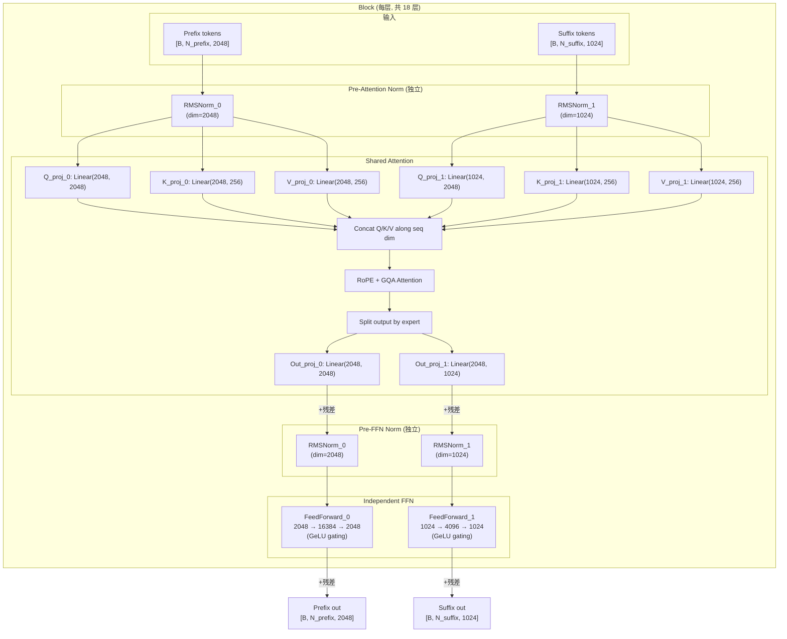
```mermaid
flowchart TD
    subgraph "Block (每层, 共 18 层)"
        subgraph "输入"
            X0["Prefix tokens<br/>[B, N_prefix, 2048]"]
            X1["Suffix tokens<br/>[B, N_suffix, 1024]"]
        end
        
        subgraph "Pre-Attention Norm (独立)"
            NORM0_A["RMSNorm_0<br/>(dim=2048)"]
            NORM1_A["RMSNorm_1<br/>(dim=1024)"]
        end
        
        subgraph "Shared Attention"
            Q0["Q_proj_0: Linear(2048, 2048)"]
            Q1["Q_proj_1: Linear(1024, 2048)"]
            K0["K_proj_0: Linear(2048, 256)"]
            K1["K_proj_1: Linear(1024, 256)"]
            V0["V_proj_0: Linear(2048, 256)"]
            V1["V_proj_1: Linear(1024, 256)"]
            CONCAT["Concat Q/K/V along seq dim"]
            ROPE["RoPE + GQA Attention"]
            SPLIT["Split output by expert"]
            O0["Out_proj_0: Linear(2048, 2048)"]
            O1["Out_proj_1: Linear(2048, 1024)"]
        end
        
        subgraph "Pre-FFN Norm (独立)"
            NORM0_F["RMSNorm_0<br/>(dim=2048)"]
            NORM1_F["RMSNorm_1<br/>(dim=1024)"]
        end
        
        subgraph "Independent FFN"
            FFN0["FeedForward_0<br/>2048 → 16384 → 2048<br/>(GeLU gating)"]
            FFN1["FeedForward_1<br/>1024 → 4096 → 1024<br/>(GeLU gating)"]
        end
    end
    
    X0 --> NORM0_A --> Q0 & K0 & V0
    X1 --> NORM1_A --> Q1 & K1 & V1
    Q0 & Q1 --> CONCAT
    K0 & K1 --> CONCAT
    V0 & V1 --> CONCAT
    CONCAT --> ROPE --> SPLIT
    SPLIT --> O0 --> |"+残差"| NORM0_F --> FFN0 --> |"+残差"| OUT0["Prefix out<br/>[B, N_prefix, 2048]"]
    SPLIT --> O1 --> |"+残差"| NORM1_F --> FFN1 --> |"+残差"| OUT1["Suffix out<br/>[B, N_suffix, 1024]"]
```

**共享注意力的具体实现** (`models/gemma.py:114-181`):

核心机制是**投影到统一的注意力空间，计算完注意力后再投影回各自的宽度**:

```python
# models/gemma.py:114-140 — Attention.forward (简化)
# ① 每个 expert 用自己的 Q/K/V projection (不同 input width → 统一 head space)
for i, x in enumerate(xs):
    q = self.q_projections[i](x)  # Expert 0: [B,T,2048]→[B,T,2048]; Expert 1: [B,T,1024]→[B,T,2048]
    k = self.k_projections[i](x)  # Expert 0: [B,T,2048]→[B,T,256];  Expert 1: [B,T,1024]→[B,T,256]
    v = self.v_projections[i](x)  # Expert 0: [B,T,2048]→[B,T,256];  Expert 1: [B,T,1024]→[B,T,256]

# ② 沿序列维度拼接所有 expert 的 Q/K/V
q = torch.cat(qs, dim=1)  # [B, N_prefix + N_suffix, 8, 256]
k = torch.cat(ks, dim=1)  # [B, N_prefix + N_suffix, 1, 256]
v = torch.cat(vs, dim=1)

# ③ 统一计算 RoPE + GQA 注意力 (所有 token 参与同一个注意力矩阵)
q = apply_rope(q, positions)
k = apply_rope(k, positions)
# ... GQA attention computation ...
attn_output  # [B, N_prefix + N_suffix, 8, 256]

# ④ Split 回各 expert, 用各自的 out_projection 投影回原始宽度
# Expert 0: [B, N_prefix, 2048] → Linear(2048, 2048) → [B, N_prefix, 2048]
# Expert 1: [B, N_suffix, 2048] → Linear(2048, 1024) → [B, N_suffix, 1024]
```

**为什么采用"共享注意力 + 独立 FFN"设计？**

- **共享注意力**: 使得 action expert 的 suffix token 可以直接 attend 到 prefix expert 的观测 token（图像、语言、keypoint）。如果注意力分离，action expert 就无法"看到"观测信息，无法实现"条件生成"。
- **独立 FFN**: 观测理解（prefix）和动作预测（suffix）需要不同的特征变换能力。Prefix expert 处理 2048 维的高维视觉-语言特征，需要大容量的 FFN (16384)。Action expert 处理 1024 维的动作-时间特征，使用较小的 FFN (4096) 即可，同时减少了推理时的计算量。
- **独立 RMSNorm**: 不同宽度的特征需要独立的归一化统计量。

##### 3.2.4.2 Flow Matching 训练过程代码深入解析

本节深入分析 `compute_loss` 中 flow matching 的每个环节，结合数学推导、代码实现和物理直觉进行三方对应。

**Conditional Flow Matching (CFM) 的数学框架简述**

Flow matching [Lipman et al., 2022] 的核心思想是学习一个时间依赖的向量场 $\mathbf{v}_\theta(\mathbf{x}, t)$，该向量场定义了一个 ODE:

$$\frac{d\mathbf{x}_t}{dt} = \mathbf{v}_\theta(\mathbf{x}_t, t), \quad t \in [0, 1]$$

使得 $t = 0$ 时 $\mathbf{x}_0$ 服从数据分布（清洁动作），$t = 1$ 时 $\mathbf{x}_1$ 服从先验分布（标准高斯噪声）。

**"Conditional" 的含义**: 不直接学习全局的向量场（这要求知道数据分布的解析形式），而是对每个训练样本 $\mathbf{a}$（清洁动作）和噪声 $\boldsymbol{\epsilon}$ 定义一条**条件路径**，在这条路径上可以解析地写出目标向量场。

GeoPredict 使用**线性最优传输 (Optimal Transport, OT) 路径**:

$$\mathbf{x}_t = t \cdot \boldsymbol{\epsilon} + (1 - t) \cdot \mathbf{a}$$

对 $t$ 求导，得到这条路径上的**常速度场**:

$$\mathbf{u}_t = \frac{d\mathbf{x}_t}{dt} = \boldsymbol{\epsilon} - \mathbf{a}$$

注意 $\mathbf{u}_t$ 与 $t$ 无关——这是线性 OT 路径的一个优良性质：速度沿路径恒定，使得训练更稳定（网络不需要预测随 $t$ 剧烈变化的目标）。

**Beta(1.5, 1) 时间采样策略**

```python
# models/geopredict.py:267
time = torch.distributions.Beta(1.5, 1).sample(batch_shape).to(device) * 0.999 + 0.001
```

Beta(1.5, 1) 的概率密度函数 $p(t) \propto t^{0.5}$，偏向 $t = 1$（高噪声端）:

- $P(t > 0.5) \approx 0.65$，即约 65% 的训练样本落在高噪声区间
- $P(t > 0.8) \approx 0.36$，仍有显著比例的极高噪声样本

**为什么偏向噪声端？** 推理时从 $t = 1$（纯噪声）出发去噪，早期步骤（高 $t$）的预测误差会在后续步骤中累积。因此模型需要在高噪声区域有更高的预测精度。类比: 投篮时起手角度的微小偏差会在飞行过程中被放大——因此需要更多地练习起手动作。

`* 0.999 + 0.001` 将范围限制在 $(0.001, 1.0)$，避免 $t = 0$ 时数值不稳定（此时 $\mathbf{x}_t = \mathbf{a}$，没有噪声，模型需要预测 $\mathbf{u}_t$ 但缺少噪声信号来推断 $\boldsymbol{\epsilon}$）。

**`embed_suffix`: 动作与时间的编码融合**

`embed_suffix`（`models/geopredict.py:193-223`）负责将 noisy actions $\mathbf{x}_t$ 和 diffusion time $t$ 编码为 suffix token 序列:

```python
# models/geopredict.py:193-223 — embed_suffix (完整逻辑)

# ① State Token: 机器人本体状态投影到 action expert 维度
state_token = self.state_proj(obs["state"])[:, None, :]  # [B, 1, 1024]

# ② 时间编码: 对标量 t 做多频率正弦编码
time_emb = posemb_sincos(timestep, 1024, min_period=4e-3, max_period=4.0)  # [B, 1024]

# ③ 动作投影: 将 32 维 noisy actions 投影到 1024 维
action_tokens = self.action_in_proj(noisy_actions)  # [B, 50, 1024]

# ④ 时间广播: 同一个时间编码复制到所有 50 个动作步
time_tokens = time_emb.unsqueeze(1).repeat(1, 50, 1)  # [B, 50, 1024]

# ⑤ 拼接 + MLP 融合: 动作和时间特征拼接后通过 2 层 MLP
action_time_tokens = torch.cat([action_tokens, time_tokens], dim=-1)  # [B, 50, 2048]
action_time_tokens = self.action_time_mlp_in(action_time_tokens)       # [B, 50, 1024]
action_time_tokens = F.silu(action_time_tokens)                        # SiLU 激活
action_time_tokens = self.action_time_mlp_out(action_time_tokens)      # [B, 50, 1024]
```

数据流:

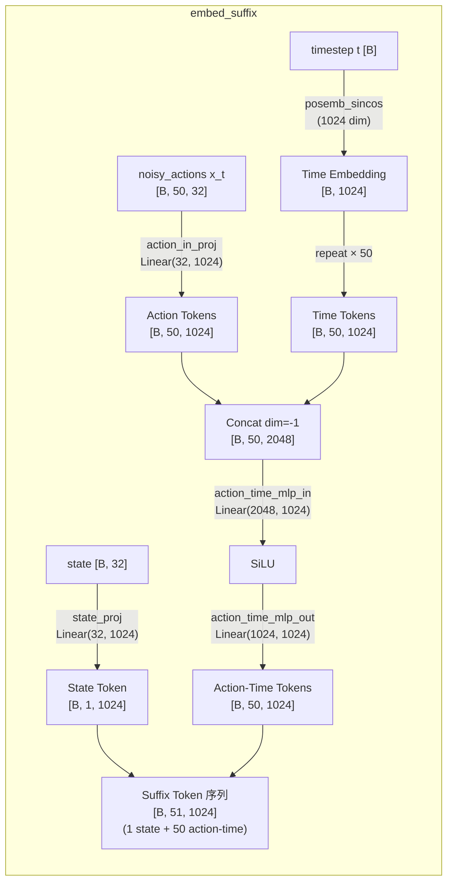
```mermaid
flowchart LR
    subgraph "embed_suffix"
        STATE["state [B, 32]"] -->|"state_proj<br/>Linear(32, 1024)"| ST["State Token<br/>[B, 1, 1024]"]
        
        TIME["timestep t [B]"] -->|"posemb_sincos<br/>(1024 dim)"| TE["Time Embedding<br/>[B, 1024]"]
        TE -->|"repeat × 50"| TT["Time Tokens<br/>[B, 50, 1024]"]
        
        NOISY["noisy_actions x_t<br/>[B, 50, 32]"] -->|"action_in_proj<br/>Linear(32, 1024)"| AT["Action Tokens<br/>[B, 50, 1024]"]
        
        AT --> CAT["Concat dim=-1<br/>[B, 50, 2048]"]
        TT --> CAT
        CAT -->|"action_time_mlp_in<br/>Linear(2048, 1024)"| SILU["SiLU"]
        SILU -->|"action_time_mlp_out<br/>Linear(1024, 1024)"| ATT["Action-Time Tokens<br/>[B, 50, 1024]"]
        
        ST --> SUFFIX["Suffix Token 序列<br/>[B, 51, 1024]<br/>(1 state + 50 action-time)"]
        ATT --> SUFFIX
    end
```

**`posemb_sincos` 时间编码** (`models/geopredict.py:31-43`):

```python
def posemb_sincos(pos, embedding_dim, min_period, max_period):
    fraction = torch.linspace(0.0, 1.0, embedding_dim // 2)  # 512 个频率点
    period = min_period * (max_period / min_period) ** fraction  # 对数均匀: 0.004 → 4.0
    sinusoid_input = pos / period * 2 * π                       # 每个频率的相位
    return cat([sin(sinusoid_input), cos(sinusoid_input)])       # [B, 1024]
```

数学公式:

$$\text{PE}(t)_{2i} = \sin\Big(\frac{2\pi \cdot t}{p_i}\Big), \quad \text{PE}(t)_{2i+1} = \cos\Big(\frac{2\pi \cdot t}{p_i}\Big)$$

其中周期 $p_i = 0.004 \times (1000)^{i/511}$，$i \in \{0, 1, \ldots, 511\}$。

**频率设计的考量**: `min_period = 0.004` 意味着最高频率成分对 $t$ 的变化极为敏感——$t$ 变化 0.002 就完成一个完整的正弦周期。这使得编码能精细区分相近的 $t$ 值（如 $t = 0.31$ vs $t = 0.32$），这对 flow matching 很重要，因为模型在不同的 $t$ 处需要预测不同大小的速度（虽然理论目标 $\mathbf{u}_t$ 与 $t$ 无关，但网络的最优预测策略会根据 $t$ 处的信噪比调整其预测偏好）。

**训练时的完整 forward pass 流程** (`compute_loss`, `models/geopredict.py:272-288`):

```python
# models/geopredict.py:272-288

# ① Prefix + Suffix 一起构建
prefix_tokens, prefix_mask, prefix_ar_mask = self.embed_prefix(observation)   # [B, ~1152, 2048]
suffix_tokens, suffix_mask, suffix_ar_mask = self.embed_suffix(obs, x_t, time)  # [B, 51, 1024]

# ② 拼接 mask, 构建统一的注意力矩阵
input_mask = torch.cat([prefix_mask, suffix_mask], dim=1)
ar_mask = torch.cat([prefix_ar_mask, suffix_ar_mask], dim=0)
attn_mask = make_attn_mask(input_mask, ar_mask)  # [B, N_total, N_total]
positions = torch.cumsum(input_mask, dim=1) - 1

# ③ 双专家 LLM 一次 forward pass
(prefix_out, suffix_out), _ = self.llm(
    [prefix_tokens, suffix_tokens],  # 列表: [expert_0_input, expert_1_input]
    positions=positions, mask=attn_mask)

# ④ 从 action expert 输出解码速度场
v_t = self.action_out_proj(suffix_out[:, -self.action_horizon:])  # [B, 50, 32]
action_loss = torch.square(v_t - u_t).mean()
```

关键细节:
- `self.llm` 接收一个**列表** `[prefix_tokens, suffix_tokens]`，索引 0 走 prefix expert (2048 宽)，索引 1 走 action expert (1024 宽)
- 在每层 Block 中，两组 token 的 Q/K/V 被拼接后做统一的注意力计算，然后再分开通过各自的 FFN
- `action_out_proj: Linear(1024, 32)` 将 action expert 的输出从 1024 维投影回 32 维动作空间

##### 3.2.4.3 Flow Matching 推理过程代码深入解析

推理时的核心目标是从纯噪声 $\mathbf{x}_1 \sim \mathcal{N}(\mathbf{0}, \mathbf{I})$ 出发，通过迭代去噪得到清洁的动作序列 $\mathbf{x}_0$。

**`sample_actions` 完整解析** (`models/geopredict.py:504-542`):

```python
# models/geopredict.py:504-542

def sample_actions(self, observation, num_steps=10):
    dt = -1.0 / num_steps                        # dt = -0.1 (负号表示从 t=1 → t=0)
    x_t = torch.randn((B, 50, 32), device=device) # 纯噪声初始化
    time = torch.tensor(1.0, device=device)        # 从 t=1 开始

    # ① Prefix 单次编码 + KV Cache
    prefix_tokens, prefix_mask, prefix_ar_mask = self.embed_prefix(observation)
    prefix_attn_mask = make_attn_mask(prefix_mask, prefix_ar_mask)
    positions = torch.cumsum(prefix_mask, dim=1) - 1
    (prefix_out, _), kv_cache = self.llm(
        [prefix_tokens, None],   # 仅 prefix expert, action expert 为 None
        positions=positions, mask=prefix_attn_mask)

    # ② 迭代 Euler 去噪 (10 步)
    while time >= -dt / 2:  # time >= 0.05, 即循环 10 次
        time_batch = time.expand(B)
        suffix_tokens, suffix_mask, suffix_ar_mask = self.embed_suffix(obs, x_t, time_batch)
        
        # 构建 suffix 对 prefix 的注意力掩码
        suffix_attn_mask = make_attn_mask(suffix_mask, suffix_ar_mask)
        prefix_attn_mask_expanded = prefix_mask.unsqueeze(1).expand(-1, 51, -1)
        full_attn_mask = torch.cat([prefix_attn_mask_expanded, suffix_attn_mask], dim=-1)
        positions = torch.sum(prefix_mask, dim=-1).unsqueeze(1) + torch.cumsum(suffix_mask, dim=-1) - 1
        
        # 仅运行 action expert, 复用 prefix KV cache
        (_, suffix_out), _ = self.llm(
            [None, suffix_tokens],   # prefix 为 None, 仅 action expert
            positions=positions, mask=full_attn_mask, kv_cache=kv_cache)
        
        v_t = self.action_out_proj(suffix_out[:, -50:])  # [B, 50, 32]
        
        # ③ Euler 更新
        x_t = x_t + dt * v_t   # dt = -0.1, v_t ≈ ε - a → x_t 向 a 方向移动
        time = time + dt         # time: 1.0 → 0.9 → ... → 0.0
    
    return x_t  # 去噪后的动作 chunk [B, 50, 32]
```

**Euler ODE 积分的数学含义**:

每一步执行:

$$\mathbf{x}_{t + \Delta t} = \mathbf{x}_t + \Delta t \cdot \mathbf{v}_\theta(\mathbf{x}_t, t)$$

其中 $\Delta t = -0.1$。展开 10 步:

$$\mathbf{x}_{0.9} = \mathbf{x}_{1.0} - 0.1 \cdot \mathbf{v}_\theta(\mathbf{x}_{1.0}, 1.0)$$
$$\mathbf{x}_{0.8} = \mathbf{x}_{0.9} - 0.1 \cdot \mathbf{v}_\theta(\mathbf{x}_{0.9}, 0.9)$$
$$\vdots$$
$$\mathbf{x}_{0.0} = \mathbf{x}_{0.1} - 0.1 \cdot \mathbf{v}_\theta(\mathbf{x}_{0.1}, 0.1)$$

**为什么 10 步就足够？**

理论上，如果网络完美地学会了 $\mathbf{v}_\theta = \mathbf{u}_t = \boldsymbol{\epsilon} - \mathbf{a}$（常速度场），那么 **1 步即可精确求解**（因为常速度的 Euler 积分是精确的）。10 步是为了**容纳网络预测误差**——实际网络无法完美预测速度场，多步积分可以在每步根据当前位置 $\mathbf{x}_t$ 重新估计速度，类似导航中的"边走边修正"。10 步是精度与推理速度之间的实用折中。

**训练 vs 推理的不对称性**:

| 维度 | 训练 | 推理 |
|:---:|:---:|:---:|
| **时间 $t$** | 随机采样一个 $t$ | 从 $t=1.0$ 到 $t=0.0$ 遍历 10 个 $t$ |
| **Forward Pass 次数** | 1 次 (prefix + suffix 一起) | 1 + 10 = 11 次 (1 prefix + 10 suffix) |
| **目标** | 预测速度场 $\mathbf{v}_\theta \approx \mathbf{u}_t$ | 沿速度场积分得到清洁动作 |
| **x_t 的角色** | 模型输入 (给定的随机插值) | 模型输入 + 输出 (每步更新) |
| **KV Cache** | 不使用 | 使用 (prefix 编码一次后缓存) |

**推理时序图**:

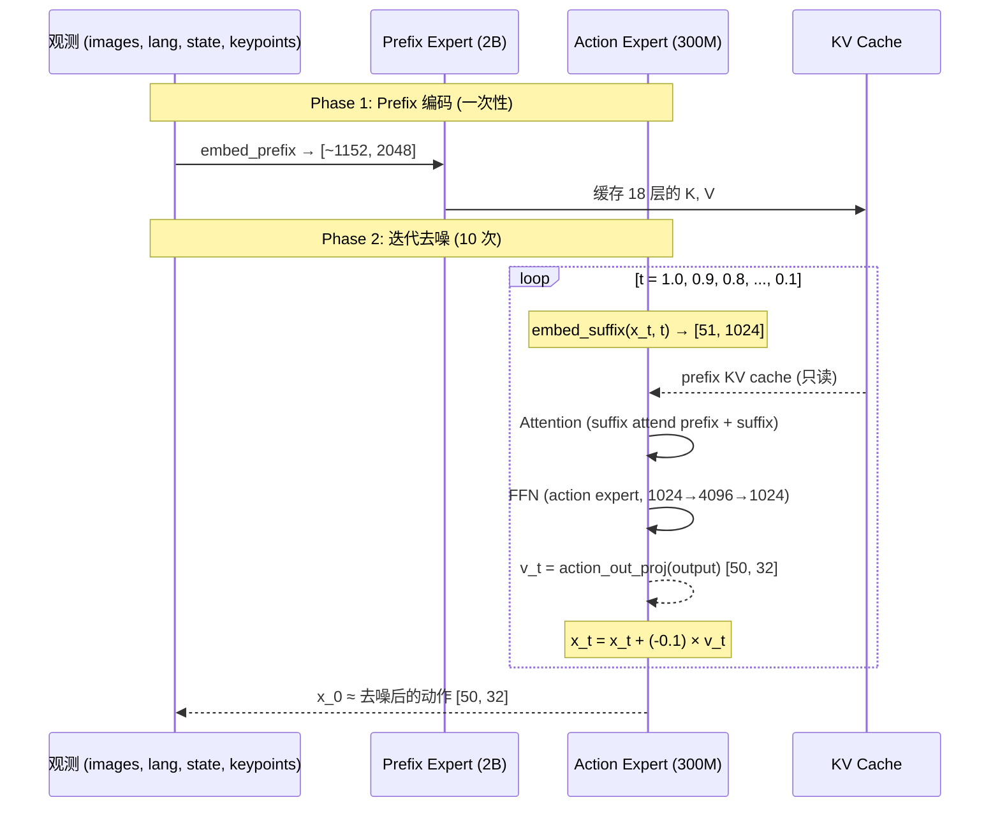
```mermaid
sequenceDiagram
    participant OBS as 观测 (images, lang, state, keypoints)
    participant PRE as Prefix Expert (2B)
    participant ACT as Action Expert (300M)
    participant KV as KV Cache
    
    Note over OBS, ACT: Phase 1: Prefix 编码 (一次性)
    OBS ->> PRE: embed_prefix → [~1152, 2048]
    PRE ->> KV: 缓存 18 层的 K, V
    
    Note over OBS, ACT: Phase 2: 迭代去噪 (10 次)
    
    loop t = 1.0, 0.9, 0.8, ..., 0.1
        Note over ACT: embed_suffix(x_t, t) → [51, 1024]
        KV -->> ACT: prefix KV cache (只读)
        ACT ->> ACT: Attention (suffix attend prefix + suffix)
        ACT ->> ACT: FFN (action expert, 1024→4096→1024)
        ACT -->> ACT: v_t = action_out_proj(output) [50, 32]
        Note over ACT: x_t = x_t + (-0.1) × v_t
    end
    
    ACT -->> OBS: x_0 ≈ 去噪后的动作 [50, 32]
```

##### 3.2.4.4 Action Expert 与 Prefix Expert 的交互

训练和推理时，两个 expert 的交互方式不同:

**训练时: 一次联合 Forward Pass**

Prefix tokens `[B, ~1152, 2048]` 和 suffix tokens `[B, 51, 1024]` **同时**输入到 LLM 的 18 层中。在每一层:

1. 各自通过独立的 `RMSNorm` 归一化
2. 各自通过独立的 `Q_proj/K_proj/V_proj` 投影到统一的注意力空间 (Q: $8 \times 256 = 2048$ 维, K/V: $1 \times 256 = 256$ 维)
3. Q/K/V 沿序列维度**拼接**，形成一个大的注意力矩阵
4. 统一计算 RoPE + GQA 注意力（由 `attn_mask` 控制可见性）
5. 注意力输出按序列位置**分回**各 expert
6. 各自通过独立的 `Out_proj` 投影回自己的宽度
7. 各自通过独立的 `FFN` 做特征变换

**推理时: 分离的两步**

- **Step 1 (一次)**: 仅 prefix tokens 通过 LLM，action expert 输入为 `None`。KV cache 被保存。
- **Step 2 (10 次)**: 仅 suffix tokens 通过 LLM，prefix expert 输入为 `None`。通过 KV cache 实现 suffix 对 prefix 的注意力。

当 `self.llm` 收到 `[None, suffix_tokens]` 时，在 `Attention.forward()` 中，仅 expert 1 (action) 会生成 Q/K/V。但 KV cache 中已经存储了 Step 1 中 prefix 生成的 K 和 V，它们被拼接到当前的 K/V 中:

```python
# models/gemma.py:147-151
if kv_cache is not None:
    cache_k, cache_v = kv_cache
    k = torch.cat([cache_k, k], dim=1)  # 拼接 prefix 的 K 和当前 suffix 的 K
    v = torch.cat([cache_v, v], dim=1)
```

这样 suffix 的 Q 就可以 attend 到 prefix 的 K/V（通过 cache），实现了"基于观测条件的动作生成"，而无需重新编码 prefix。

**注意力掩码的作用**:

`ar_mask` 确保 suffix tokens 可以 attend 到**所有 prefix tokens**，但 prefix tokens **不能** attend 到 suffix tokens。这是因为:
- Prefix 代表观测信息（图像、语言、历史轨迹），在动作生成之前就已确定
- Suffix 代表正在去噪的动作，其信息不应"泄漏"回观测表征

##### 3.2.4.5 数值示例

以 `batch_size=1, action_horizon=50, action_dim=32` 为例走通完整流程。

**训练**:

```
noise = randn(1, 50, 32)           # 标准高斯噪声
actions = 训练数据中的 GT 动作         # [1, 50, 32], 已 z-score 归一化
time = 0.7                           # Beta(1.5,1) 采样得到

x_t = 0.7 * noise + 0.3 * actions    # 混合: 70% 噪声 + 30% 干净动作
u_t = noise - actions                 # 目标速度场 (常向量)

# embed_suffix:
state_token = state_proj(state)       # [1, 1, 1024]
time_emb = posemb_sincos(0.7, 1024)   # [1, 1024]
action_tokens = action_in_proj(x_t)   # [1, 50, 1024]
→ concat + MLP → suffix_tokens        # [1, 51, 1024]

# LLM forward (一次):
prefix_tokens: [1, ~1152, 2048]       # Image + Lang + Track + Query + Spatial
suffix_tokens: [1, 51, 1024]          # State + Action-Time
→ 18 层 Block (共享注意力 + 独立 FFN)
→ prefix_out: [1, ~1152, 2048]
→ suffix_out: [1, 51, 1024]

v_t = action_out_proj(suffix_out[:, -50:])  # [1, 50, 32]
action_loss = MSE(v_t, u_t)                 # 标量
```

**推理**:

```
x_t = randn(1, 50, 32)              # 纯噪声
time = 1.0, dt = -0.1

# Step 0: Prefix 编码 + Cache
prefix → LLM → kv_cache (18 层, 每层 K/V shape [1, ~1152, 1, 256])

# Steps 1-10: 迭代去噪
t=1.0: embed_suffix(x_t, 1.0) → LLM(suffix, cache) → v_t → x_t += -0.1 * v_t
t=0.9: embed_suffix(x_t, 0.9) → LLM(suffix, cache) → v_t → x_t += -0.1 * v_t
...
t=0.1: embed_suffix(x_t, 0.1) → LLM(suffix, cache) → v_t → x_t += -0.1 * v_t

return x_t  # [1, 50, 32], 去噪后的动作 chunk
```

**推理计算量分析**:
- Prefix 编码: 1 次 × ~1152 tokens × 2048 维 × 18 层 (大)
- 每步去噪: 1 次 × 51 tokens × 1024 维 × 18 层 (小)
- 总计 ≈ 1 prefix + 10 suffix ≈ $1 + 10 \times \frac{51 \times 1024}{1152 \times 2048} \approx 1.22$ 次等效 prefix forward pass

KV cache 机制使得 10 步去噪的额外计算量仅约为 prefix 编码的 22%，这是 GeoPredict 保持推理高效性的关键。

> **参考来源**: 本节分析基于 GeoPredict 代码库（[GitHub](https://github.com/jingjingqian75/GeoPredict)）中 [geopredict.py](models/geopredict.py) 的 `embed_suffix` / `compute_loss` / `sample_actions` 方法，[gemma.py](models/gemma.py) 的 `Attention` / `Block` / `Gemma` 双专家架构，以及论文 [arXiv:2512.16811](https://arxiv.org/abs/2512.16811) §3.1 (Preliminary) 中关于 conditional flow matching 的描述。Conditional Flow Matching 的理论基础参见 [Lipman et al., 2022, "Flow Matching for Generative Modeling"](https://arxiv.org/abs/2210.02747)。

### 3.3 轨迹级运动学预测 (Trajectory-Level Kinematic Prediction)

这是 GeoPredict 的第一个核心创新。它为策略提供了**运动学先验**——通过编码过去的运动历史并预测未来的 3D 关键点轨迹。

#### 3.3.1 Track Encoder 架构

Track Encoder 将机器人 $K = 8$ 个关键点（7 个手臂关节 + 1 个末端执行器）的变长运动历史压缩为紧凑的 token 表示。

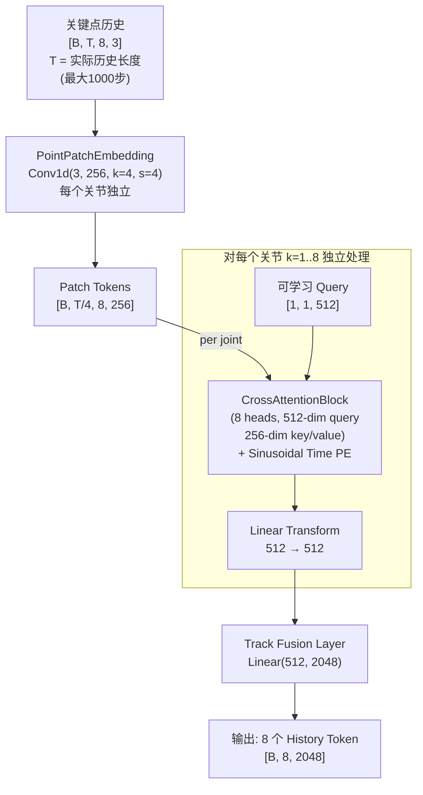
```mermaid
flowchart TD
    Input["关键点历史<br/>[B, T, 8, 3]<br/>T = 实际历史长度<br/>(最大1000步)"]
    PPE["PointPatchEmbedding<br/>Conv1d(3, 256, k=4, s=4)<br/>每个关节独立"]
    Patches["Patch Tokens<br/>[B, T/4, 8, 256]"]
    
    subgraph "对每个关节 k=1..8 独立处理"
        Q["可学习 Query<br/>[1, 1, 512]"]
        CA["CrossAttentionBlock<br/>(8 heads, 512-dim query<br/>256-dim key/value)<br/>+ Sinusoidal Time PE"]
        LT["Linear Transform<br/>512 → 512"]
    end
    
    Fuse["Track Fusion Layer<br/>Linear(512, 2048)"]
    Output["输出: 8 个 History Token<br/>[B, 8, 2048]"]
    
    Input --> PPE --> Patches
    Patches -->|"per joint"| CA
    Q --> CA
    CA --> LT --> Fuse --> Output
```

**PointPatchEmbedding** (`models/keypoints.py:8-49`):

将时间维度上的 3D 坐标序列分组为 patch（类似 ViT 对图像的 patch 化）：
- 时间步长补零至 `patch_size=4` 的倍数
- 使用 `Conv1d(3, 256, kernel=4, stride=4)` 将每 4 个时间步的 3D 坐标映射为一个 256 维 patch token
- 每个关节独立处理（通过 `einops.rearrange` 将关节维度合并到 batch 维度）
- 输出: `[B, num_patches, 8, 256]`，其中 `num_patches = ceil(T/4)`

**CrossAttentionBlock** (`models/keypoints.py:111-147`):

对于每个关节 $k$：

$$\mathbf{Z}_k^{\text{hist}} = \text{CrossAttn}(\text{query}=\mathbf{Q}^{\text{hist}},\ \text{key}=\text{MLP}(\boldsymbol{\mathcal{T}}_k),\ \text{value}=\text{MLP}(\boldsymbol{\mathcal{T}}_k)) \quad \text{(论文 Eq.1)}$$

其中：
- $\mathbf{Q}^{\text{hist}} \in \mathbb{R}^{1 \times 512}$: 可学习的 history query（Xavier 初始化）
- $\boldsymbol{\mathcal{T}}_k \in \mathbb{R}^{(T/4) \times 256}$: 关节 $k$ 的 patch 序列
- Key 和 Value 添加了**正弦位置编码**以编码时间顺序
- Multi-Head Attention: 8 头, head_dim=64
- 后接 FFN (Linear-GELU-Dropout-Linear-Dropout)

最终输出 8 个 history token `[B, 8, 2048]`（经过 `track_fusion_layer: Linear(512, 2048)` 投影至主专家维度）。

**设计洞察**: 使用 cross-attention 而非直接编码的优势在于：
- 变长历史的高效压缩（无论历史多长，每个关节只产生 1 个 token）
- 通过可学习的 query 让模型自主决定从历史中提取什么信息
- 保留了时间顺序信息（通过时间位置编码）

#### 3.3.2 Future Track Query 与关键点预测

**Future Track Query** 是 8 个可学习的嵌入 token（`keypoint_embedding: Embedding(8, 2048)`），在 transformer 中作为"查询"与指令、图像、历史 token 共同处理。经过 18 层 Gemma 注意力后，这些 token 的输出编码了对应关节未来轨迹的潜在表示。

**当前关键点预测** (`models/geopredict.py:291-295`):

直接从 Future Track Query 的输出预测当前时刻的 3D 位置：

```python
keypoint_token = prefix_out[:, -self.spatial_num - self.joint_num:-self.spatial_num]  # [B, 8, 2048]
pred_kpt = self.keypoint_out_proj(keypoint_token)  # [B, 8, 3]  (Linear: 2048 → 3)
kpt_loss = torch.square(pred_kpt - kpt_t).mean()
```

**未来关键点预测** (`models/geopredict.py:298-311`):

通过添加 1D 正弦时间位置编码 $\mathbf{PE}^{\text{time}}[\tau]$ 来预测未来 $H$ 步的关键点位置：

$$\hat{\mathbf{p}}_{k,t+\tau} = \text{MLP}(\mathbf{e}_k^{\text{fut}} + \mathbf{PE}^{\text{time}}[\tau]), \quad \tau = 0, \ldots, H \quad \text{(论文 Eq.2)}$$

其中：
- $\mathbf{e}_k^{\text{fut}} \in \mathbb{R}^{2048}$: 关节 $k$ 的 Future Track Query 输出
- $\mathbf{PE}^{\text{time}} \in \mathbb{R}^{50 \times 2048}$: 预计算的正弦时间编码（base=100），存储在 `self.future_pos`
- MLP 即 `keypoint_out_proj: Linear(2048, 3)`

**轨迹预测损失** (论文 Eq.3):

$$\mathcal{L}_{\text{track}} = \frac{1}{K(H+1)} \sum_{k=1}^{K} \sum_{\tau=0}^{H} \|\hat{\mathbf{p}}_{k,t+\tau} - \mathbf{p}_{k,t+\tau}^{\text{gt}}\|_2^2$$

在代码中，这被分为 `current_keypoint_loss` 和 `future_keypoint_loss` 两项，均使用 MSE 损失，各权重为 1.0。

### 3.4 预测性 3D 高斯几何 (Predictive 3D Gaussian Geometry)

这是 GeoPredict 的第二个核心创新。该模块估计工作空间几何的未来演变，为策略提供更强的空间推理能力。

#### 3.4.1 3D Spatial Query

将机器人工作空间离散化为 3D 体素网格：

- **工作空间范围**: $1.6\text{m} \times 1.6\text{m} \times 1.0\text{m}$（即 $[0,0,0]$ 到 $[1.6, 1.6, 1.0]$）
- **体素大小**: $v = 0.04\text{m}$
- **完整网格分辨率**: $40 \times 40 \times 25 = 40{,}000$ 体素
- **降采样（coarse）网格**: 每轴降 5 倍，得 $8 \times 8 \times 5 = 320$ 个 token

每个粗体素被赋予一个 2048 维的可学习嵌入，加上 3D 正弦位置编码：

$$\mathbf{Q}^{\text{spatial}}[i,j,k] = \mathbf{Q}^{\text{init}}[i,j,k] + \mathbf{PE}^{\text{spatial}}[i,j,k] \quad \text{(论文 Eq.4)}$$

其中 3D 位置编码由三个独立的 1D 正弦编码沿 $x, y, z$ 轴拼接而成：

$$\mathbf{PE}^{\text{spatial}}[i,j,k] = \text{Concat}\big(\mathbf{PE}^x[i],\ \mathbf{PE}^y[j],\ \mathbf{PE}^z[k]\big)$$

维度分配: $C_x = 800, C_y = 800, C_z = 448$，总计 $C = 2048$。

**代码映射** (`models/geopredict.py:74-94`, `get_3d_sincos_pos_embed`):

```python
# 各轴独立的 1D 正弦位置编码
emb_x = get_1d_sincos_pos_embed(800, pos_x)   # [8, 800]
emb_y = get_1d_sincos_pos_embed(800, pos_y)   # [8, 800]
emb_z = get_1d_sincos_pos_embed(448, pos_z)   # [5, 448]
# 拼接为 [320, 2048] 的 3D 编码
```

320 个 spatial query token 被展平为序列，与指令、图像、历史 token 一起输入 transformer。

#### 3.4.2 Voxel Decoder

经过 Gemma transformer 的多层注意力后，320 个 spatial query 的输出被送入 Voxel Decoder，通过 3D 转置卷积恢复到完整的体素分辨率：

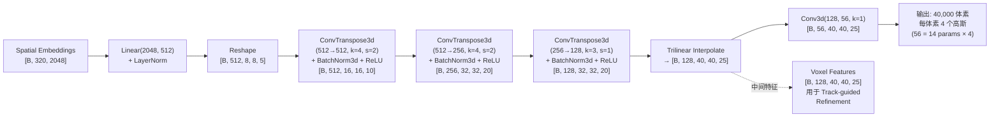
```mermaid
flowchart LR
    IN["Spatial Embeddings<br/>[B, 320, 2048]"] --> LP["Linear(2048, 512)<br/>+ LayerNorm"]
    LP --> RS["Reshape<br/>[B, 512, 8, 8, 5]"]
    RS --> UC1["ConvTranspose3d<br/>(512→512, k=4, s=2)<br/>+ BatchNorm3d + ReLU<br/>[B, 512, 16, 16, 10]"]
    UC1 --> UC2["ConvTranspose3d<br/>(512→256, k=4, s=2)<br/>+ BatchNorm3d + ReLU<br/>[B, 256, 32, 32, 20]"]
    UC2 --> UC3["ConvTranspose3d<br/>(256→128, k=3, s=1)<br/>+ BatchNorm3d + ReLU<br/>[B, 128, 32, 32, 20]"]
    UC3 --> INT["Trilinear Interpolate<br/>→ [B, 128, 40, 40, 25]"]
    INT --> FC["Conv3d(128, 56, k=1)<br/>[B, 56, 40, 40, 25]"]
    FC --> OUT["输出: 40,000 体素<br/>每体素 4 个高斯<br/>(56 = 14 params × 4)"]
    INT -.->|"中间特征"| FEAT["Voxel Features<br/>[B, 128, 40, 40, 25]<br/>用于 Track-guided<br/>Refinement"]
```

**代码映射**: `models/head.py`，`class VoxelDecoder`。

**时间偏移** (论文 Eq.5): 为了预测未来几何，spatial embeddings 被加上时间位置编码：

$$\mathbf{E}_{t+\tau}^{\text{spatial}} = \mathbf{E}^{\text{spatial}} + \mathbf{PE}^{\text{time}}[\tau], \quad \tau = 0, \ldots, H$$

共享同一组 `future_pos` 时间编码（与关键点预测使用的相同）。代码实现在 `models/geopredict.py:416-418`。

#### 3.4.3 高斯基元参数化

每个高斯基元 $\mathbf{g} = \{\boldsymbol{\mu}, \alpha, \boldsymbol{\Sigma}\}$ 由 14 个参数定义：

| 参数 | 维度 | 激活函数 | 物理含义 |
|:---:|:---:|:---:|:---:|
| offset ($\Delta\boldsymbol{\mu}$) | 3 | $\tanh(\cdot) \times 0.04$ | 相对于体素中心的偏移（限制在 ±0.04m） |
| opacity ($\alpha$) | 1 | $\sigma(\cdot)$ (sigmoid) | 不透明度 $\in (0, 1)$ |
| scale ($\mathbf{s}$) | 3 | $\text{softplus}(\cdot, \beta=20)$，截断 ≤ 0.04 | 各轴尺度 |
| rotation ($\mathbf{q}$) | 4 | $\text{normalize}(\cdot)$ | 单位四元数 |
| rgb ($\mathbf{c}$) | 3 | $\sigma(\cdot)$ | 颜色（训练时存在但论文指出不影响性能） |

高斯中心 = 体素中心 + offset: $\boldsymbol{\mu} = \boldsymbol{\mu}_{\text{voxel}} + \Delta\boldsymbol{\mu}$

每个体素包含 $N_G = 4$ 个初始高斯基元，共产生 $40 \times 40 \times 25 \times 4 = 160{,}000$ 个高斯。

**代码映射**: `models/geopredict.py:128-133`（激活函数定义），`models/geopredict.py:225-243`（`process_guassian_voxel`）。

#### 3.4.4 Track-Guided Gaussian Refinement

这是 GeoPredict 最巧妙的设计之一。均匀的全局高斯分辨率要么不够精细（特别是在机器人交互区域），要么计算开销过大。Track-guided refinement 利用预测的关键点轨迹来**自适应地**在交互区域增加高斯密度。

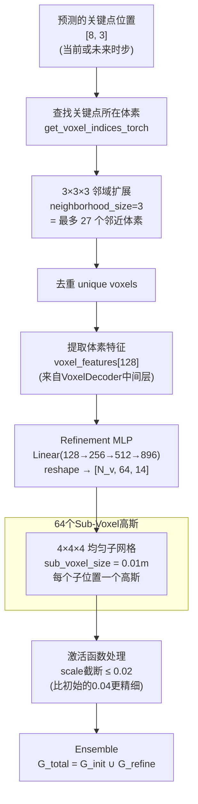
```mermaid
flowchart TD
    KPT["预测的关键点位置<br/>[8, 3]<br/>(当前或未来时步)"]
    VX["查找关键点所在体素<br/>get_voxel_indices_torch"]
    NB["3×3×3 邻域扩展<br/>neighborhood_size=3<br/>= 最多 27 个邻近体素"]
    UQ["去重 unique voxels"]
    FEAT["提取体素特征<br/>voxel_features[128]<br/>(来自VoxelDecoder中间层)"]
    MLP["Refinement MLP<br/>Linear(128→256→512→896)<br/>reshape → [N_v, 64, 14]"]
    
    subgraph "64个Sub-Voxel高斯"
        GRID["4×4×4 均匀子网格<br/>sub_voxel_size = 0.01m<br/>每个子位置一个高斯"]
    end
    
    ACT["激活函数处理<br/>scale截断 ≤ 0.02<br/>(比初始的0.04更精细)"]
    ENS["Ensemble<br/>G_total = G_init ∪ G_refine"]
    
    KPT --> VX --> NB --> UQ --> FEAT --> MLP --> GRID --> ACT --> ENS
```

**数学形式化** (论文 Eq.7):

对于时间步 $t+\tau$，给定初始高斯集 $\mathbf{G}_{t+\tau}^{\text{init}}$ 和预测关键点位置 $\mathbf{P}_{t+\tau} = \{\hat{\mathbf{p}}_{k,t+\tau}\}_{k=1}^K$，定义精化掩码：

$$\mathbf{M}^{\text{refine}}[i,j,k] = \begin{cases} 1, & \text{if } \exists\, \mathbf{p} \in \mathbf{P}_{t+\tau} \text{ s.t. } \mathbf{p} \in \boldsymbol{\mathcal{V}}[i,j,k] \\ 0, & \text{otherwise} \end{cases}$$

对于掩码值为 1 的体素，通过共享 MLP 生成额外 $N_G' = 64$ 个更精细的高斯基元 (论文 Eq.8)：

$$\mathbf{G}_{t+\tau}^{\text{total}} = \mathbf{G}_{t+\tau}^{\text{init}} \cup \mathbf{G}_{t+\tau}^{\text{refine}}$$

**代码实现要点** (`models/geopredict.py:351-378`):

1. 使用 `get_voxel_indices_torch` (with `expand_neighborhood=True, neighborhood_size=3`) 找到关键点附近的 3×3×3 = 27 个邻域体素
2. 对唯一体素提取 128 维中间特征（来自 VoxelDecoder 的 `save_features`）
3. `refine_gs_mlp: Linear(128→256→512→896)`，reshape 为 `[N_v, 64, 14]`
4. 64 个子高斯的初始中心按 4×4×4 均匀子网格排列（间距 = 0.04/4 = 0.01m）
5. 精化高斯的 scale 截断为 ≤ 0.02m（比初始的 0.04m 更精细）
6. 将精化高斯与初始高斯合并进行渲染

**效率分析**（论文消融 Table 5）:

| 配置 | N_G (全局) | N_G' (精化) | 训练时间/epoch | 成功率 |
|:---:|:---:|:---:|:---:|:---:|
| 全局高密度 | 8 | 无 | 19.1h | 51.4% |
| Track-guided (少) | 4 | 8 | 15.5h | 51.1% |
| **Track-guided (多)** | **4** | **64** | **15.7h** | **52.4%** |

关键发现：Track-guided refinement ($N_G=4, N_G'=64$) 比全局高密度 ($N_G=8$) 效果更好 (+1.0%) 且更快 (-18%)。这是因为交互区域仅占整个工作空间的很小比例，在此局部增加密度的边际成本极低。

#### 3.4.5 可微高斯溅射渲染

GeoPredict 使用 `diff_gaussian_rasterization` 库（CUDA 实现的可微高斯溅射渲染器）将 3D 高斯基元渲染为深度图。

**渲染过程** (论文 Eq.9-10):

对于给定相机和像素射线 $\mathbf{r}$，收集所有投影椭圆与射线相交的高斯基元，按深度排序。第 $i$ 个高斯的累积透射率：

$$T_i = \prod_{j=1}^{i-1}(1 - \alpha_j)$$

渲染深度:

$$\hat{\mathbf{D}}(\mathbf{r}) = \sum_{i \in \mathcal{N}} T_i \alpha_i d_i$$

其中 $d_i$ 是第 $i$ 个高斯中心 $\boldsymbol{\mu}_i$ 的深度，$\alpha_i$ 是其不透明度。

**代码映射**: `models/gaussian.py`，`class GaussianRenderer`。关键实现细节：

- 分辨率: 224×224（与输入图像一致）
- 近/远裁剪面: `znear=0.01, zfar=10.0`
- 投影矩阵: `getProjectionMatrixK` 从完整的相机内参 $\mathbf{K}$ 构建，支持非图像中心的光心
- 渲染循环: 对 batch 中的每个样本和每个相机视角**串行**渲染（Python 循环，非批量化）
- 输出: `depth [B, V, 1, H, W]`, `image [B, V, 3, H, W]`, `alpha [B, V, 1, H, W]`

#### 3.4.6 深度渲染损失

渲染的深度图通过空间掩码约束，仅在工作空间范围内进行监督 (论文 Eq.10):

$$\mathcal{L}_{\text{depth}} = \frac{1}{\sum \mathbf{M}^{\text{spatial}}} \sum_{\tau=0}^{H} \sum_{c=1}^{N_{\text{cam}}} \sum_{\mathbf{r} \in \text{pixels}} \mathbf{M}^{\text{spatial}}(\mathbf{r}) \cdot |\hat{\mathbf{D}}_{c,t+\tau}(\mathbf{r}) - \mathbf{D}^{\text{gt}}_{c,t+\tau}(\mathbf{r})|$$

**空间掩码构建**: 使用 `lift_to_3d`（`models/utils.py:26-56`）将深度图反投影到 3D 世界坐标，仅保留在工作空间 $[0,0,0]-[1.6,1.6,1.0]$ 范围内的点。

**代码 vs 论文的差异**: 论文写的是 L1 损失，代码中使用的是 `smooth_l1_loss`（Huber Loss），这是一种常见的实践改进——在残差较小时表现为 L2（更稳定），在残差较大时表现为 L1（对异常值更鲁棒）。

**代码映射**: `models/geopredict.py:343-411`（当前时步深度损失），`models/geopredict.py:416-491`（未来时步深度损失）。

### 3.5 总训练目标

所有损失项等权求和 (论文 Eq.11):

$$\mathcal{L}_{\text{total}} = \lambda_1 \mathcal{L}_{\text{action}} + \lambda_2 \mathcal{L}_{\text{track}} + \lambda_3 \mathcal{L}_{\text{depth}}$$

其中 $\lambda_1 = \lambda_2 = \lambda_3 = 1.0$。

在代码中，损失被更细分为 6 个子项，均以权重 1.0 累加：

| 损失项 | 代码变量 | 描述 |
|:---:|:---:|:---:|
| $\mathcal{L}_{\text{action}}$ | `action_loss` | Flow matching 速度场 MSE |
| $\mathcal{L}_{\text{track}}^{\text{curr}}$ | `current_keypoint_loss` | 当前时步关键点位置 MSE |
| $\mathcal{L}_{\text{track}}^{\text{future}}$ | `future_keypoint_loss` | 未来 50 步关键点位置 MSE |
| $\mathcal{L}_{\text{depth}}^{\text{curr,left}}$ | `current_loss_render_left_depth` | 当前左相机深度 Smooth L1 |
| $\mathcal{L}_{\text{depth}}^{\text{curr,right}}$ | `current_loss_render_right_depth` | 当前右相机深度 Smooth L1 |
| $\mathcal{L}_{\text{depth}}^{\text{future,left/right}}$ | `future_loss_render_{left,right}_depth` | 未来深度 Smooth L1 |

---

## 4. 架构分析

本节从静态和动态两个视角对 GeoPredict 的系统架构进行深入解析。静态架构分析涵盖组件拓扑、类层次结构和模块级 I/O 规格;动态架构分析则追踪 token 序列的构建过程、注意力掩码机制、训练/推理 forward pass 的执行流程以及梯度传播路径。

### 4.1 静态架构

#### 4.1.1 顶层组件图

下图展示了 GeoPredict 的高层架构,从输入端(三相机图像、语言指令、关节轨迹历史)到输出端(预测动作序列),标注了各模块生成的 token 数量和特征维度。

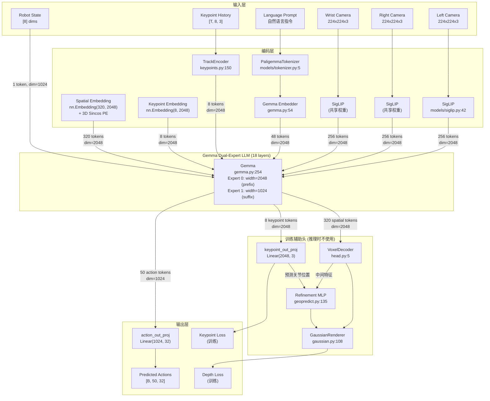
```mermaid
graph TD
    subgraph Inputs ["输入层"]
        CAM_L["Left Camera<br/>224x224x3"]
        CAM_R["Right Camera<br/>224x224x3"]
        CAM_W["Wrist Camera<br/>224x224x3"]
        LANG["Language Prompt<br/>自然语言指令"]
        HIST["Keypoint History<br/>[T, 8, 3]"]
        STATE["Robot State<br/>[8] dims"]
    end

    subgraph Encoders ["编码层"]
        SIGLIP_L["SigLIP<br/>models/siglip.py:42"]
        SIGLIP_R["SigLIP<br/>(共享权重)"]
        SIGLIP_W["SigLIP<br/>(共享权重)"]
        TOK["PaligemmaTokenizer<br/>models/tokenizer.py:5"]
        GEMMA_EMB["Gemma Embedder<br/>gemma.py:54"]
        TRACK["TrackEncoder<br/>keypoints.py:150"]
        KPT_EMB["Keypoint Embedding<br/>nn.Embedding(8, 2048)"]
        SPA_EMB["Spatial Embedding<br/>nn.Embedding(320, 2048)<br/>+ 3D Sincos PE"]
    end

    subgraph Backbone ["Gemma Dual-Expert LLM (18 layers)"]
        GEMMA["Gemma<br/>gemma.py:254<br/>Expert 0: width=2048 (prefix)<br/>Expert 1: width=1024 (suffix)"]
    end

    subgraph TrainingHeads ["训练辅助头 (推理时不使用)"]
        VOXEL["VoxelDecoder<br/>head.py:5"]
        GS_RENDER["GaussianRenderer<br/>gaussian.py:108"]
        REFINE["Refinement MLP<br/>geopredict.py:135"]
        KPT_PROJ["keypoint_out_proj<br/>Linear(2048, 3)"]
    end

    subgraph Outputs ["输出层"]
        ACTION_PROJ["action_out_proj<br/>Linear(1024, 32)"]
        ACTIONS["Predicted Actions<br/>[B, 50, 32]"]
        DEPTH_LOSS["Depth Loss<br/>(训练)"]
        KPT_LOSS["Keypoint Loss<br/>(训练)"]
    end

    CAM_L --> SIGLIP_L -->|"256 tokens<br/>dim=2048"| GEMMA
    CAM_R --> SIGLIP_R -->|"256 tokens<br/>dim=2048"| GEMMA
    CAM_W --> SIGLIP_W -->|"256 tokens<br/>dim=2048"| GEMMA
    LANG --> TOK --> GEMMA_EMB -->|"48 tokens<br/>dim=2048"| GEMMA
    HIST --> TRACK -->|"8 tokens<br/>dim=2048"| GEMMA
    KPT_EMB -->|"8 tokens<br/>dim=2048"| GEMMA
    SPA_EMB -->|"320 tokens<br/>dim=2048"| GEMMA
    STATE -->|"1 token, dim=1024"| GEMMA
    GEMMA -->|"50 action tokens<br/>dim=1024"| ACTION_PROJ --> ACTIONS
    GEMMA -->|"320 spatial tokens<br/>dim=2048"| VOXEL --> GS_RENDER --> DEPTH_LOSS
    GEMMA -->|"8 keypoint tokens<br/>dim=2048"| KPT_PROJ --> KPT_LOSS
    VOXEL -->|"中间特征"| REFINE --> GS_RENDER
    KPT_PROJ -->|"预测关节位置"| REFINE
```

**图注**: prefix 包含 $768 + 48 + 8 + 8 + 320 = 1152$ 个 token(宽度 2048),suffix 包含 $1 + 50 = 51$ 个 token(宽度 1024)。VoxelDecoder、GaussianRenderer 和 Refinement MLP 仅在训练阶段激活,推理时跳过。

**关键设计决策**:

1. **双宽度专家机制**: prefix expert 使用 2048 维宽度(2B 参数规模),负责处理视觉-语言-几何的多模态融合;suffix expert 使用 1024 维宽度(300M 参数规模),专注于动作去噪。两个 expert 共享注意力权重(相同的 head_dim=256, num_heads=8, num_kv_heads=1),但各自拥有独立的 FFN 和 projection 层(`models/gemma.py:207-251`)。

2. **训练-推理解耦**: 几何预测模块(VoxelDecoder + GaussianRenderer + Refinement MLP + keypoint_out_proj)在训练中提供辅助监督信号,但推理时完全不参与计算。这种设计使得推理延迟与基础 Pi0 模型相当,仅增加了 TrackEncoder 的前处理开销。

---

#### 4.1.2 类层次结构

以下类图展示了 GeoPredict 中所有核心 `nn.Module` 类的继承关系、组合关系和关键接口。

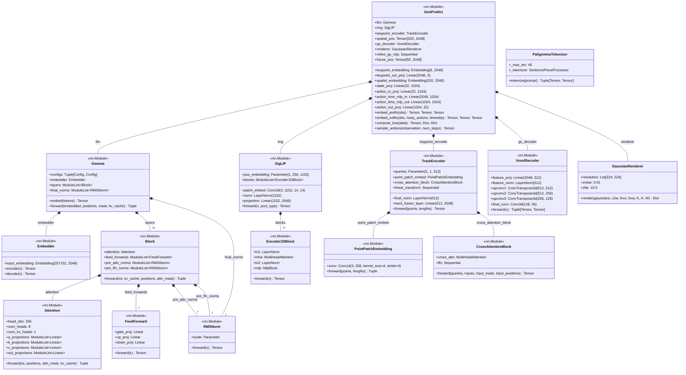
```mermaid
classDiagram
    class GeoPredict {
        <<nn.Module>>
        +llm: Gemma
        +img: SigLIP
        +keypoint_encoder: TrackEncoder
        +keypoint_embedding: Embedding(8, 2048)
        +keypoint_out_proj: Linear(2048, 3)
        +spatial_embedding: Embedding(320, 2048)
        +spatial_pos: Tensor[320, 2048]
        +gs_decoder: VoxelDecoder
        +renderer: GaussianRenderer
        +refine_gs_mlp: Sequential
        +state_proj: Linear(32, 1024)
        +action_in_proj: Linear(32, 1024)
        +action_time_mlp_in: Linear(2048, 1024)
        +action_time_mlp_out: Linear(1024, 1024)
        +action_out_proj: Linear(1024, 32)
        +future_pos: Tensor[50, 2048]
        +embed_prefix(obs) Tensor, Tensor, Tensor
        +embed_suffix(obs, noisy_actions, timestep) Tensor, Tensor, Tensor
        +compute_loss(data) Tensor, Dict, Dict
        +sample_actions(observation, num_steps) Tensor
    }

    class Gemma {
        <<nn.Module>>
        +configs: Tuple[Config, Config]
        +embedder: Embedder
        +layers: ModuleList~Block~
        +final_norms: ModuleList~RMSNorm~
        +embed(tokens) Tensor
        +forward(embedded, positions, mask, kv_cache) Tuple
    }

    class Block {
        <<nn.Module>>
        +attention: Attention
        +feed_forwards: ModuleList~FeedForward~
        +pre_attn_norms: ModuleList~RMSNorm~
        +pre_ffn_norms: ModuleList~RMSNorm~
        +forward(xs, kv_cache, positions, attn_mask) Tuple
    }

    class Attention {
        <<nn.Module>>
        +head_dim: 256
        +num_heads: 8
        +num_kv_heads: 1
        +q_projections: ModuleList~Linear~
        +k_projections: ModuleList~Linear~
        +v_projections: ModuleList~Linear~
        +out_projections: ModuleList~Linear~
        +forward(xs, positions, attn_mask, kv_cache) Tuple
    }

    class FeedForward {
        <<nn.Module>>
        +gate_proj: Linear
        +up_proj: Linear
        +down_proj: Linear
        +forward(x) Tensor
    }

    class Embedder {
        <<nn.Module>>
        +input_embedding: Embedding(257152, 2048)
        +encode(x) Tensor
        +decode(x) Tensor
    }

    class RMSNorm {
        <<nn.Module>>
        +scale: Parameter
        +forward(x) Tensor
    }

    class SigLIP {
        <<nn.Module>>
        +patch_embed: Conv2d(3, 1152, 14, 14)
        +pos_embedding: Parameter[1, 256, 1152]
        +blocks: ModuleList~Encoder1DBlock~
        +norm: LayerNorm(1152)
        +projection: Linear(1152, 2048)
        +forward(x, pool_type) Tensor
    }

    class Encoder1DBlock {
        <<nn.Module>>
        +ln1: LayerNorm
        +mha: MultiheadAttention
        +ln2: LayerNorm
        +mlp: MlpBlock
        +forward(x) Tensor
    }

    class TrackEncoder {
        <<nn.Module>>
        +queries: Parameter[1, 1, 512]
        +point_patch_embed: PointPatchEmbedding
        +cross_attention_block: CrossAttentionBlock
        +linear_transform: Sequential
        +final_norm: LayerNorm(512)
        +track_fusion_layer: Linear(512, 2048)
        +forward(points, lengths) Tensor
    }

    class PointPatchEmbedding {
        <<nn.Module>>
        +conv: Conv1d(3, 256, kernel_size=4, stride=4)
        +forward(points, lengths) Tuple
    }

    class CrossAttentionBlock {
        <<nn.Module>>
        +cross_attn: MultiHeadAttention
        +ffn: Sequential
        +forward(queries, inputs, input_mask, input_positions) Tensor
    }

    class VoxelDecoder {
        <<nn.Module>>
        +feature_proj: Linear(2048, 512)
        +feature_norm: LayerNorm(512)
        +upconv1: ConvTranspose3d(512, 512)
        +upconv2: ConvTranspose3d(512, 256)
        +upconv3: ConvTranspose3d(256, 128)
        +final_conv: Conv3d(128, 56)
        +forward(x) Tuple[Tensor, Tensor]
    }

    class GaussianRenderer {
        +resolution: List[224, 224]
        +znear: 0.01
        +zfar: 10.0
        +render(gaussians, c2w, fovx, fovy, K, H, W) Dict
    }

    class PaligemmaTokenizer {
        +_max_len: 48
        +_tokenizer: SentencePieceProcessor
        +tokenize(prompt) Tuple[Tensor, Tensor]
    }

    GeoPredict *-- Gemma : llm
    GeoPredict *-- SigLIP : img
    GeoPredict *-- TrackEncoder : keypoint_encoder
    GeoPredict *-- VoxelDecoder : gs_decoder
    GeoPredict *-- GaussianRenderer : renderer
    Gemma *-- Embedder : embedder
    Gemma *-- "18" Block : layers
    Gemma *-- "2" RMSNorm : final_norms
    Block *-- Attention : attention
    Block *-- "2" FeedForward : feed_forwards
    Block *-- "2" RMSNorm : pre_attn_norms
    Block *-- "2" RMSNorm : pre_ffn_norms
    SigLIP *-- "27" Encoder1DBlock : blocks
    TrackEncoder *-- PointPatchEmbedding : point_patch_embed
    TrackEncoder *-- CrossAttentionBlock : cross_attention_block
```

**图注**: 数字标注的组合关系(如 `"18" Block`)表示对应模块的实例个数。`GaussianRenderer` 不继承 `nn.Module`,它是一个普通 Python 类,封装了 `diff_gaussian_rasterization` 库的调用逻辑。

---

#### 4.1.3 每模块 I/O 分析

下表列出了各核心模块的输入输出张量形状、关键参数和代码位置。其中 $B$ 为 batch size,$T$ 为历史轨迹长度,$J=8$ 为关节数,$H_{\text{img}}=W_{\text{img}}=224$ 为图像尺寸。

**SigLIP --- 视觉编码器**

| 项目 | 详情 |
|------|------|
| 文件 | `models/siglip.py:42-99` |
| 输入 | `x`: $[B, 3, 224, 224]$ --- 单张图像,像素值范围 $[-1, 1]$ |
| 内部流程 | Conv2d patch embedding ($14 \times 14$) $\to$ $[B, 256, 1152]$ $\to$ + positional embedding $\to$ 27 层 Encoder1DBlock $\to$ LayerNorm $\to$ Linear projection |
| 输出 | $[B, 256, 2048]$ --- 256 个 image token,维度 2048 |
| 关键参数 | `patch_size=14`, `width=1152`, `depth=27`, `num_heads=16`, `mlp_dim=4304` |
| 备注 | 三个相机共享同一 SigLIP 实例,每相机独立编码 $\to$ 共 $3 \times 256 = 768$ 个 image token |

**PaligemmaTokenizer --- 语言分词器**

| 项目 | 详情 |
|------|------|
| 文件 | `models/tokenizer.py:5-24` |
| 输入 | `prompt`: 自然语言字符串 |
| 输出 | `(tokens, mask)`: $([48], [48])$ --- token ID (long) 和有效位掩码 (bool) |
| 内部流程 | SentencePiece BPE 编码(含 BOS),附加换行符 token,截断或零填充至 `max_len=48` |
| 关键参数 | 词汇表大小 $257{,}152$ (PaliGemma 标准词汇表) |

**Gemma Embedder --- 词嵌入编码**

| 项目 | 详情 |
|------|------|
| 文件 | `models/gemma.py:54-67` |
| 输入 | `tokens`: $[B, 48]$ --- token ID (long) |
| 输出 | $[B, 48, 2048]$ --- 语言 token 嵌入 (乘以 $\sqrt{d}$ 缩放) |
| 关键参数 | `Embedding(257152, 2048)` |

**TrackEncoder --- 关节轨迹编码器**

| 项目 | 详情 |
|------|------|
| 文件 | `models/keypoints.py:150-213` |
| 输入 | `points`: $[B, T_{\max}, 8, 3]$ (padded, $T_{\max}=1000$);&ensp;`lengths`: $[B]$ (实际长度) |
| 内部流程 | PointPatchEmbedding (stride=4) $\to$ $[B, T/4, 8, 256]$ $\to$ 对每个关节独立做 CrossAttention (1 learnable query) $\to$ $[B, 8, 1, 512]$ $\to$ reshape + LayerNorm $\to$ Linear(512, 2048) |
| 输出 | $[B, 8, 2048]$ --- 8 个 history token,每关节一个 |
| 关键参数 | `patch_size=4`, `embed_dim=256`, `query_dim=512`, `num_queries=1`, `num_heads=8` |

**Gemma (Dual-Expert LLM) --- 主干网络**

| 项目 | 详情 |
|------|------|
| 文件 | `models/gemma.py:254-297` |
| 输入 | `embedded`: List$[\underbrace{[B, N_p, 2048]}_{\text{prefix}}, \underbrace{[B, N_s, 1024]}_{\text{suffix}}]$;&ensp;`positions`: $[B, N]$;&ensp;`mask`: $[B, N, N]$ |
| 内部流程 | 18 层 Block,每层: RMSNorm $\to$ 共享 Attention (GQA with RoPE) $\to$ 残差 $\to$ RMSNorm $\to$ 独立 FFN $\to$ 残差 |
| 输出 | `(List[prefix_out, suffix_out], kv_cache)`: 各 expert 独立输出 + KV 缓存 |
| Expert 0 (prefix) | `width=2048, mlp_dim=16384, num_heads=8, num_kv_heads=1, head_dim=256` |
| Expert 1 (suffix) | `width=1024, mlp_dim=4096, num_heads=8, num_kv_heads=1, head_dim=256` |

**VoxelDecoder --- 体素解码器**

| 项目 | 详情 |
|------|------|
| 文件 | `models/head.py:5-49` |
| 输入 | `x`: $[B, 320, 2048]$ --- spatial token |
| 内部流程 | Linear $\to$ LayerNorm $\to$ reshape $[B, 8, 8, 5, 512]$ $\to$ 3 层 ConvTranspose3d (上采样) $\to$ trilinear interpolate $\to$ Conv3d |
| 输出 | `(gs_params, features)`: $([B, 56, 40, 40, 25], [B, 128, 40, 40, 25])$ |
| 备注 | 56 = 14 params $\times$ 4 Gaussians/voxel;features 用于 Track-guided Refinement |

**GaussianRenderer --- 可微分高斯渲染器**

| 项目 | 详情 |
|------|------|
| 文件 | `models/gaussian.py:108-240` |
| 输入 | `gaussians`: $[B, N_{gs}, 14]$;&ensp;相机参数 `(c2w, fovx, fovy, K, H, W)` |
| 输出 | `Dict{image: [B,V,3,224,224], alpha: [B,V,1,224,224], depth: [B,V,1,224,224]}` |
| 关键参数 | `resolution=[224,224], znear=0.01, zfar=10.0` |
| 备注 | 基于 `diff_gaussian_rasterization` 实现,逐 batch 逐相机串行渲染 |

**Refinement MLP --- 轨迹引导精细化**

| 项目 | 详情 |
|------|------|
| 文件 | `models/geopredict.py:135-139` |
| 输入 | 近关节体素特征: $[N_v, 128]$ (从 VoxelDecoder 中间特征提取) |
| 输出 | $[N_v, 64, 14]$ --- 每个近关节体素额外生成 64 个精细 Gaussian |
| 结构 | `Linear(128, 256) -> Linear(256, 512) -> Linear(512, 896)`,其中 $896 = 64 \times 14$ |

---

### 4.2 动态架构

#### 4.2.1 Token 序列构建

GeoPredict 构建的 token 序列分为 **prefix** 和 **suffix** 两部分,分别由 `embed_prefix()` (`geopredict.py:141-191`) 和 `embed_suffix()` (`geopredict.py:193-223`) 生成。两部分使用不同的特征维度(prefix: 2048, suffix: 1024),通过 Gemma 的双专家机制在同一 Transformer 中联合处理。

**Prefix Token 序列 (1152 tokens, width=2048)**

| 序号 | 组成部分 | Token 数 | 维度 | 生成方式 | 代码位置 |
|------|----------|---------|------|----------|---------|
| 1 | Left Camera Image | 256 | 2048 | `self.img(obs["images"]["left_rgb"])` | `geopredict.py:148` |
| 2 | Right Camera Image | 256 | 2048 | `self.img(obs["images"]["right_rgb"])` | `geopredict.py:148` |
| 3 | Wrist Camera Image | 256 | 2048 | `self.img(obs["images"]["wrist_rgb"])` | `geopredict.py:148` |
| 4 | Language Tokens | 48 | 2048 | `self.llm.embed(obs["tokenized_prompt"])` | `geopredict.py:159` |
| 5 | History Keypoint Tokens | 8 | 2048 | `self.keypoint_encoder(obs["his_kpts"], obs["his_len"])` | `geopredict.py:169` |
| 6 | Keypoint Query Tokens | 8 | 2048 | `self.keypoint_embedding.weight` (learnable) | `geopredict.py:175` |
| 7 | Spatial Query Tokens | 320 | 2048 | `self.spatial_embedding.weight + self.spatial_pos` | `geopredict.py:180` |
| | **合计** | **1152** | | | |

其中 Spatial Query Tokens 的 3D 正弦余弦位置编码 (`get_3d_sincos_pos_embed`, `geopredict.py:74-94`) 将 $8 \times 8 \times 5 = 320$ 个体素网格位置编码为 2048 维向量,编码方式为:

$$\text{PE}_{(x,y,z)} = [\underbrace{\text{sincos}(x)}_{\text{800-dim}}, \underbrace{\text{sincos}(y)}_{\text{800-dim}}, \underbrace{\text{sincos}(z)}_{\text{448-dim}}] \in \mathbb{R}^{2048}$$

每个轴的编码使用 `get_1d_sincos_pos_embed` (`geopredict.py:57-71`),基于频率 $\omega_k = \frac{1}{32^{2k/D}}$,其中 $D$ 为该轴的编码维度。

**Suffix Token 序列 (51 tokens, width=1024)**

| 序号 | 组成部分 | Token 数 | 维度 | 生成方式 | 代码位置 |
|------|----------|---------|------|----------|---------|
| 1 | State Token | 1 | 1024 | `self.state_proj(obs["state"])` | `geopredict.py:199` |
| 2 | Action Tokens | 50 | 1024 | noisy action + time embedding $\to$ MLP | `geopredict.py:206-213` |
| | **合计** | **51** | | | |

Action token 的构建融合了噪声动作信号和时间步信息,其过程如下:

$$\mathbf{a}_{\text{noisy}} = \text{action\_in\_proj}(\mathbf{x}_t) \in \mathbb{R}^{B \times 50 \times 1024}$$

$$\mathbf{e}_{\text{time}} = \text{sincos\_PE}(t) \in \mathbb{R}^{B \times 1024} \xrightarrow{\text{expand}} \mathbb{R}^{B \times 50 \times 1024}$$

$$\mathbf{h} = \text{SiLU}\big(\text{MLP}_{\text{in}}([\mathbf{a}_{\text{noisy}}; \mathbf{e}_{\text{time}}])\big) \in \mathbb{R}^{B \times 50 \times 1024}$$

$$\text{action\_tokens} = \text{MLP}_{\text{out}}(\mathbf{h}) \in \mathbb{R}^{B \times 50 \times 1024}$$

其中时间步的正弦余弦编码 (`posemb_sincos`, `geopredict.py:31-43`) 使用周期范围 $[4 \times 10^{-3}, 4.0]$,对 $t \in [0, 1]$ 范围内的 flow matching 时间步具有高分辨率。

**Token 序列布局总览**

下图展示了完整的 token 序列布局:

```
Prefix (1152 tokens, width=2048)                                          Suffix (51 tokens, width=1024)
+----------------+----------------+----------------+----------+-------+-------+------------+------+------------------+
|  Left Image    | Right Image    | Wrist Image    | Language  | Hist  |  KP   |  Spatial    |State |  Action Tokens   |
|  256 tokens    | 256 tokens     | 256 tokens     | 48 tokens | KP 8  |Query 8| Query 320   |  1   |     50 tokens    |
|  (SigLIP)      | (SigLIP)       | (SigLIP)       | (Gemma    | (Track| (Learn| (Learn+3D   |(proj)| (noisy act+time) |
|                |                |                |  Embed)   |  Enc) | able) |  SinCos PE) |      |                  |
+----------------+----------------+----------------+----------+-------+-------+------------+------+------------------+
|<------------- Group 0 (816) ----------->|<-G1(8)->|<-------- Group 2 (328) -------->|<G3(1)>|<---- Group 4 (50) --->|
|              cumsum = 0                 | cum = 1 |            cumsum = 2           |cum = 3|      cumsum = 4      |
```

---

#### 4.2.2 Block-wise Causal Attention Mask

`make_attn_mask` 函数 (`geopredict.py:21-28`) 基于 `mask_ar` (autoregressive 标志) 的累积和来构造分组因果注意力掩码。其核心逻辑为:

```python
def make_attn_mask(input_mask, mask_ar):
    # input_mask: [B, N], mask_ar: [N]
    mask_ar = mask_ar.unsqueeze(0).expand(input_mask.shape[0], -1)  # [B, N]
    cumsum = torch.cumsum(mask_ar, dim=1)  # [B, N]
    # [B, 1, N] <= [B, N, 1] → [B, N, N]
    attn_mask = cumsum.unsqueeze(1) <= cumsum.unsqueeze(2)
    valid_mask = input_mask.unsqueeze(1) * input_mask.unsqueeze(2)
    return torch.logical_and(attn_mask, valid_mask)
```

**分组逻辑**: `mask_ar` 中每个 `True` 值标志一个新的注意力组的开始。`cumsum` 为每个 token 分配一个组号。掩码规则 $\text{attn\_mask}[i, j] = (\text{cumsum}[j] \leq \text{cumsum}[i])$ 表示:

- **组内双向注意力**: 同组 token 之间可以互相注意 ($\text{cumsum}[j] = \text{cumsum}[i]$)
- **组间单向注意力**: 后面的组可以注意前面的组 ($\text{cumsum}[j] < \text{cumsum}[i]$),但反之不行

**完整的 mask_ar 构建过程**:

| Token 范围 | 数量 | `mask_ar` 值 | 累积和 | 组号 |
|-----------|------|-------------|--------|------|
| Image + Language | 816 | `[False]*816` | 0 | 0 |
| History KP | 8 | `[True, False*7]` | 1 | 1 |
| KP Query | 8 | `[True, False*7]` | 2 | 2 |
| Spatial Query | 320 | `[False]*320` | 2 | 2 |
| State | 1 | `[True]` | 3 | 3 |
| Action | 50 | `[True, False*49]` | 4 | 4 |

注意:Keypoint Query 和 Spatial Query 属于**同一注意力组**(Group 2),它们之间可以双向注意。这是因为 Spatial Query 的 `mask_ar` 全为 `False`(`geopredict.py:182`),延续了 Keypoint Query 组的累积和值。

**注意力掩码矩阵可视化** (行 = Query, 列 = Key):

```
                Key →
                G0          G1       G2            G3      G4
              (Img+Lang)  (His.KP)  (KP+Spatial)  (State) (Action)
    Q  G0     ██████████   ·····     ··········     ·       ·····
    u  G1     ██████████   █████     ··········     ·       ·····
    e  G2     ██████████   █████     ██████████     ·       ·····
    r  G3     ██████████   █████     ██████████     █       ·····
    y  G4     ██████████   █████     ██████████     █       █████
    ↓
    
    ██ = 可以注意 (True)    · = 不可注意 (False)
```

这种分组因果注意力设计有以下含义:

1. **G0 (Image + Language)**: 只能看到自身,不受后续 token 的"污染",保持纯粹的视觉-语言表征。
2. **G1 (History Keypoints)**: 可以看到 G0 的视觉-语言上下文,将历史轨迹与当前观察对齐。
3. **G2 (KP Query + Spatial Query)**: 可以看到 G0 和 G1,用于融合视觉、语言和历史信息来预测当前/未来关节位置和 3D 场景几何。
4. **G3 (State)**: 可以看到所有 prefix,将机器人本体状态与上下文融合。
5. **G4 (Action)**: 可以看到所有信息,用于基于完整上下文进行动作去噪。

---

#### 4.2.3 训练 Forward Pass 序列图

```mermaid
sequenceDiagram
    participant D as DataLoader
    participant G as GeoPredict
    participant EP as embed_prefix()
    participant ES as embed_suffix()
    participant LLM as Gemma (18 layers)
    participant AOT as action_out_proj
    participant KOT as keypoint_out_proj
    participant VD as VoxelDecoder
    participant GR as GaussianRenderer
    participant RMLP as refine_gs_mlp

    D->>G: data (images, state, actions, kpts, depths, cams)
    
    Note over G: Flow Matching 噪声注入<br/>t ~ Beta(1.5,1)*0.999+0.001<br/>x_t = t*noise + (1-t)*actions<br/>u_t = noise - actions

    G->>EP: observation
    EP->>EP: SigLIP(3 cameras) → 768 image tokens
    EP->>EP: Gemma.embed(prompt) → 48 language tokens  
    EP->>EP: TrackEncoder(his_kpts) → 8 history tokens
    EP->>EP: keypoint_embedding → 8 KP query tokens
    EP->>EP: spatial_embedding + 3D PE → 320 spatial tokens
    EP-->>G: prefix_tokens [B,1152,2048], prefix_mask, prefix_ar_mask

    G->>ES: observation, x_t, time
    ES->>ES: state_proj(state) → 1 state token
    ES->>ES: action_in_proj(x_t) + time_emb → MLP → 50 action tokens
    ES-->>G: suffix_tokens [B,51,1024], suffix_mask, suffix_ar_mask

    Note over G: 构建完整注意力掩码<br/>make_attn_mask([prefix_mask; suffix_mask],<br/>[prefix_ar; suffix_ar])

    G->>LLM: [prefix_tokens, suffix_tokens],<br/>positions, attn_mask
    LLM-->>G: [prefix_out, suffix_out], kv_cache

    par 并行损失计算
        G->>AOT: suffix_out[:, -50:] → [B,50,1024]
        AOT-->>G: v_t [B,50,32]
        Note over G: action_loss = ||v_t - u_t||^2

        G->>KOT: prefix_out[:, -328:-320] → [B,8,2048]
        KOT-->>G: pred_kpt [B,8,3]
        Note over G: kpt_loss = ||pred_kpt - kpt_t||^2

        Note over G: future_kpt_loss:<br/>keypoint_token + future_pos_embed<br/>→ keypoint_out_proj → MSE

        G->>VD: prefix_out[:, -320:] → [B,320,2048]
        VD-->>G: voxel_gs [B,56,40,40,25],<br/>voxel_features [B,128,40,40,25]
        Note over G: process_guassian_voxel<br/>→ 160,000 Gaussians [B,160000,14]
        
        G->>RMLP: near-keypoint voxel features [N_v, 128]
        RMLP-->>G: refinement Gaussians [N_v, 64, 14]
        Note over G: ensemble = concat(main_gs, refine_gs)
        
        G->>GR: ensemble_gaussians, camera params
        GR-->>G: rendered depth [B,V,1,224,224]
        Note over G: depth_loss = SmoothL1(render, GT)<br/>(masked by point cloud range)
    end

    Note over G: total_loss = action_loss + kpt_loss<br/>+ future_kpt_loss + depth_losses
```

**训练 Forward Pass 的四个损失项**:

设 prefix 输出中的 keypoint token 为 $\mathbf{h}_{\text{kp}} \in \mathbb{R}^{B \times 8 \times 2048}$,spatial token 为 $\mathbf{h}_{\text{sp}} \in \mathbb{R}^{B \times 320 \times 2048}$,suffix 的 action 输出为 $\mathbf{h}_{\text{act}} \in \mathbb{R}^{B \times 50 \times 1024}$。

1. **Action Loss** (flow matching velocity, `geopredict.py:285-288`):

$$\mathcal{L}_{\text{action}} = \frac{1}{B \cdot 50 \cdot 32} \sum \|\mathbf{v}_t - \mathbf{u}_t\|^2, \quad \mathbf{v}_t = W_{\text{out}} \mathbf{h}_{\text{act}}, \quad \mathbf{u}_t = \boldsymbol{\epsilon} - \mathbf{a}$$

2. **Current Keypoint Loss** (`geopredict.py:291-295`):

$$\mathcal{L}_{\text{kpt}} = \frac{1}{B \cdot 8 \cdot 3} \sum \|W_{\text{kp}} \mathbf{h}_{\text{kp}} - \mathbf{p}_t\|^2$$

其中 $\mathbf{p}_t \in \mathbb{R}^{8 \times 3}$ 为当前时刻的 8 个关节 3D 坐标真值。

3. **Future Keypoint Loss** (`geopredict.py:297-312`):

$$\mathcal{L}_{\text{future\_kpt}} = \frac{1}{B \cdot H_a \cdot 8 \cdot 3} \sum_{t'=1}^{H_a} \|W_{\text{kp}}(\mathbf{h}_{\text{kp}} + \text{PE}(t')) - \mathbf{p}_{t'}\|^2$$

其中 $\text{PE}(t')$ 为预计算的 1D 正弦余弦位置编码 (`future_pos`, `geopredict.py:114`),$H_a = 50$ 为 action horizon。注意这里复用了与 current keypoint 相同的 `keypoint_out_proj` 权重。

4. **Depth Rendering Loss** (`geopredict.py:314-498`):

$$\mathcal{L}_{\text{depth}} = \sum_{c \in \{\text{left, right}\}} \text{SmoothL1}(\hat{D}_c \odot M_c, D_c^{\text{GT}} \odot M_c)$$

其中 $M_c$ 为点云范围掩码(仅在 $[0, 1.6] \times [0, 1.6] \times [0, 1.0]$ 范围内的像素参与损失计算),通过 `lift_to_3d` (`models/utils.py:26-56`) 将深度图像素反投影到 3D 空间进行范围检查。

---

#### 4.2.4 推理 Forward Pass 序列图

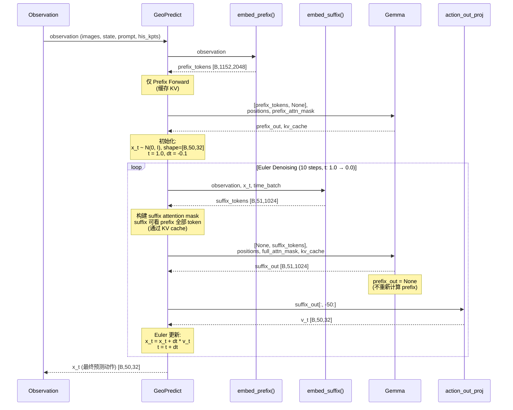
```mermaid
sequenceDiagram
    participant OBS as Observation
    participant G as GeoPredict
    participant EP as embed_prefix()
    participant ES as embed_suffix()
    participant LLM as Gemma
    participant AOT as action_out_proj

    OBS->>G: observation (images, state, prompt, his_kpts)
    G->>EP: observation
    EP-->>G: prefix_tokens [B,1152,2048]
    
    Note over G: 仅 Prefix Forward<br/>(缓存 KV)
    G->>LLM: [prefix_tokens, None],<br/>positions, prefix_attn_mask
    LLM-->>G: prefix_out, kv_cache

    Note over G: 初始化:<br/>x_t ~ N(0, I), shape=[B,50,32]<br/>t = 1.0, dt = -0.1

    loop Euler Denoising (10 steps, t: 1.0 → 0.0)
        G->>ES: observation, x_t, time_batch
        ES-->>G: suffix_tokens [B,51,1024]
        
        Note over G: 构建 suffix attention mask<br/>suffix 可看 prefix 全部 token<br/>(通过 KV cache)
        
        G->>LLM: [None, suffix_tokens],<br/>positions, full_attn_mask, kv_cache
        LLM-->>G: suffix_out [B,51,1024]
        
        Note over LLM: prefix_out = None<br/>(不重新计算 prefix)
        
        G->>AOT: suffix_out[:, -50:]
        AOT-->>G: v_t [B,50,32]
        
        Note over G: Euler 更新:<br/>x_t = x_t + dt * v_t<br/>t = t + dt
    end

    G-->>OBS: x_t (最终预测动作) [B,50,32]
```

**推理关键点**:

1. **Prefix 一次计算,KV 缓存复用**: `sample_actions` (`geopredict.py:504-542`) 先对 prefix 做一次完整 forward,将 18 层的 KV 对缓存起来 (line 517)。后续 10 步去噪循环中,每步仅计算 suffix 的 51 个 token,通过 KV cache 复用 prefix 的 1152 个 token 的上下文信息。

2. **无几何模块参与**: 推理时完全不调用 `VoxelDecoder`、`GaussianRenderer`、`refine_gs_mlp` 和 `keypoint_out_proj`。这是 GeoPredict "训练时增强,推理时轻量" 的核心设计思想。

3. **Euler ODE 积分**: flow matching 的去噪过程等价于求解 ODE $\frac{d\mathbf{x}_t}{dt} = \mathbf{v}_\theta(\mathbf{x}_t, t)$,从 $t=1$ (纯噪声) 积分到 $t=0$ (干净动作):

$$\mathbf{x}_{t+\Delta t} = \mathbf{x}_t + \Delta t \cdot \mathbf{v}_\theta(\mathbf{x}_t, t), \quad \Delta t = -\frac{1}{N_{\text{steps}}}$$

4. **Suffix Attention Mask 构建** (`geopredict.py:522-524`): 推理时 suffix 的注意力掩码需要扩展为 $[B, N_s, N_p + N_s]$ 形状,其中前 $N_p$ 列全为 True(suffix 可以看到所有 prefix token),后 $N_s$ 列为 suffix 自身的因果掩码:

```python
prefix_attn_mask_expanded = prefix_mask.unsqueeze(1).expand(-1, suffix_tokens.shape[1], -1)  # [b, s, p]
full_attn_mask = torch.cat([prefix_attn_mask_expanded, suffix_attn_mask], dim=-1)  # [b, s, p + s]
```

---

#### 4.2.5 梯度流分析

训练时四个损失项通过不同路径将梯度传播到模型的各个组件。以下流程图展示了梯度的传播方向和受影响的参数组:

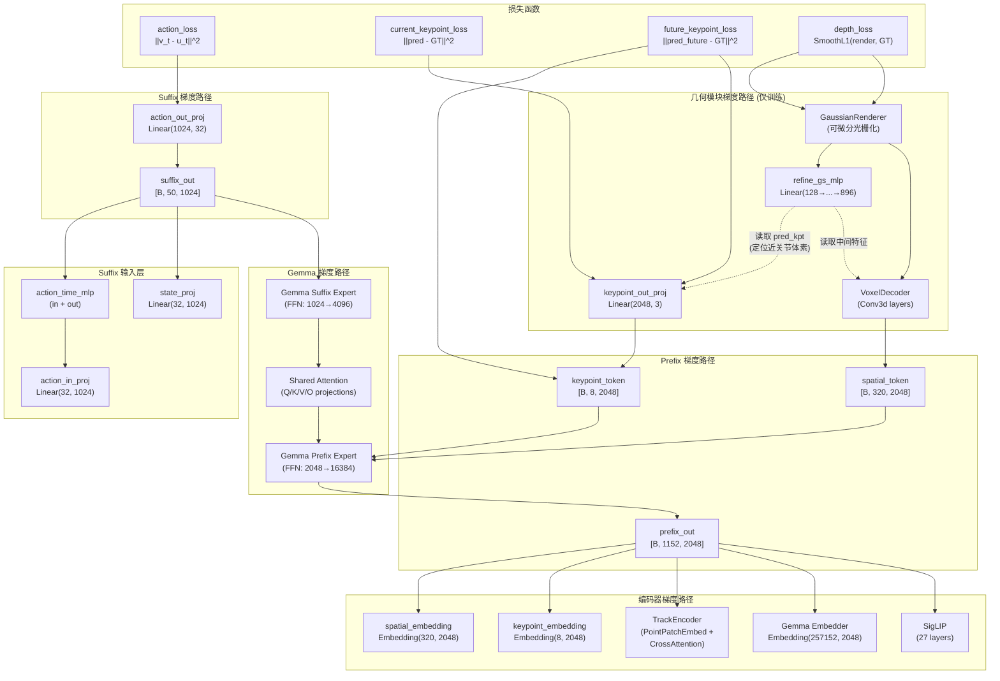
```mermaid
flowchart TD
    subgraph Losses ["损失函数"]
        L_act["action_loss<br/>||v_t - u_t||^2"]
        L_kpt["current_keypoint_loss<br/>||pred - GT||^2"]
        L_fkpt["future_keypoint_loss<br/>||pred_future - GT||^2"]
        L_depth["depth_loss<br/>SmoothL1(render, GT)"]
    end

    subgraph SuffixPath ["Suffix 梯度路径"]
        AOT["action_out_proj<br/>Linear(1024, 32)"]
        SOUT["suffix_out<br/>[B, 50, 1024]"]
    end

    subgraph GemmaPath ["Gemma 梯度路径"]
        GEMMA_S["Gemma Suffix Expert<br/>(FFN: 1024→4096)"]
        GEMMA_ATN["Shared Attention<br/>(Q/K/V/O projections)"]
        GEMMA_P["Gemma Prefix Expert<br/>(FFN: 2048→16384)"]
    end

    subgraph PrefixPath ["Prefix 梯度路径"]
        POUT["prefix_out<br/>[B, 1152, 2048]"]
        KP_TOKEN["keypoint_token<br/>[B, 8, 2048]"]
        SP_TOKEN["spatial_token<br/>[B, 320, 2048]"]
    end

    subgraph EncoderPath ["编码器梯度路径"]
        SIGLIP["SigLIP<br/>(27 layers)"]
        GEMMA_EMB["Gemma Embedder<br/>Embedding(257152, 2048)"]
        TRACK_ENC["TrackEncoder<br/>(PointPatchEmbed +<br/>CrossAttention)"]
        KPT_EMB["keypoint_embedding<br/>Embedding(8, 2048)"]
        SPA_EMB["spatial_embedding<br/>Embedding(320, 2048)"]
    end

    subgraph GeomPath ["几何模块梯度路径 (仅训练)"]
        KOT["keypoint_out_proj<br/>Linear(2048, 3)"]
        VD["VoxelDecoder<br/>(Conv3d layers)"]
        RMLP["refine_gs_mlp<br/>Linear(128→...→896)"]
        GR["GaussianRenderer<br/>(可微分光栅化)"]
    end

    subgraph SuffixInput ["Suffix 输入层"]
        STATE_PROJ["state_proj<br/>Linear(32, 1024)"]
        ACT_MLP["action_time_mlp<br/>(in + out)"]
        ACT_PROJ["action_in_proj<br/>Linear(32, 1024)"]
    end

    L_act --> AOT --> SOUT --> GEMMA_S --> GEMMA_ATN --> GEMMA_P --> POUT
    POUT --> SIGLIP
    POUT --> GEMMA_EMB
    POUT --> TRACK_ENC
    POUT --> KPT_EMB
    POUT --> SPA_EMB
    SOUT --> STATE_PROJ
    SOUT --> ACT_MLP --> ACT_PROJ

    L_kpt --> KOT --> KP_TOKEN --> GEMMA_P
    L_fkpt --> KOT
    L_fkpt --> KP_TOKEN

    L_depth --> GR --> VD --> SP_TOKEN --> GEMMA_P
    L_depth --> GR --> RMLP
    RMLP -.->|"读取中间特征"| VD
    RMLP -.->|"读取 pred_kpt<br/>(定位近关节体素)"| KOT
```

**梯度传播路径详解**:

| 损失项 | 梯度经过的模块 | 更新的参数组 |
|--------|--------------|------------|
| `action_loss` | action_out_proj $\to$ suffix Gemma Expert $\to$ Shared Attention $\to$ prefix Gemma Expert $\to$ SigLIP, Embedder, TrackEncoder, keypoint_embedding, spatial_embedding $\to$ state_proj, action_in_proj, action_time_mlp | 几乎所有参数 |
| `current_keypoint_loss` | keypoint_out_proj $\to$ keypoint_token (prefix_out) $\to$ prefix Gemma $\to$ 所有 prefix 编码器 | prefix 侧参数 + keypoint_out_proj |
| `future_keypoint_loss` | 同上,额外经过 `future_pos` (但 future_pos 是固定 buffer,不更新) | 同上 |
| `depth_loss` | GaussianRenderer $\to$ VoxelDecoder $\to$ spatial_token (prefix_out) $\to$ prefix Gemma $\to$ 所有 prefix 编码器;同时 $\to$ refine_gs_mlp $\to$ VoxelDecoder 中间特征 | prefix 侧参数 + VoxelDecoder + refine_gs_mlp + GaussianRenderer 无参数 (光栅化操作) |

**关于参数冻结**: 根据 Pi0 基础模型的微调策略,以下参数通常在训练初期从预训练权重加载后会参与微调:SigLIP 的全部参数(视觉编码器)和 Gemma Embedder 的词嵌入权重。而 keypoint/spatial/gs_decoder/renderer/refine 模块在从 Pi0 base 微调时是从零初始化的(CLAUDE.md 中提到 "Missing keys for keypoint/spatial/gs_decoder/renderer/refine modules are expected")。所有加载的参数和新初始化的参数均参与端到端训练。

**辅助损失对主干网络的正则化效应**:

keypoint loss 和 depth loss 通过 prefix_out 向 Gemma 主干网络传播梯度,这为视觉-语言表征学习提供了额外的几何监督信号。具体而言:

- Keypoint loss 强制 Gemma 在 keypoint query token 的输出中编码精确的 3D 关节位置信息,这间接提升了模型对机器人本体状态的空间感知能力。
- Depth loss 通过 spatial query token 强制 Gemma 学习场景的 3D 几何结构,使得模型在动作预测时能够隐式地利用场景几何约束。

---

## 5. 数据流水线分析

本节分析 GeoPredict 的数据加载、预处理和归一化流程,涵盖从原始文件到模型输入张量的完整数据流。

### 5.1 数据集结构

`RobocasaDataset` (`data_processing/robocasa_dataset.py:14-174`) 继承自 `torch.utils.data.Dataset`,负责从磁盘加载 RoboCasa 仿真环境生成的操作演示数据。

**数据组织结构**:

```
data_root/
├── data/
│   ├── episode_001/
│   │   ├── infos.npy                          # [step_num, 20] (state + action)
│   │   ├── keypoints.npy                      # [step_num, 24] (8 joints x 3D)
│   │   ├── cams.npy                           # [N_cams, 25] (intrinsic 9 + extrinsic 16)
│   │   ├── agentview_left_image/
│   │   │   ├── step_0000.png                  # 256x256 RGB
│   │   │   └── ...
│   │   ├── agentview_right_image/
│   │   │   └── ...
│   │   ├── eye_in_hand_image/
│   │   │   └── ...
│   │   ├── agentview_left_depth/
│   │   │   ├── step_0000.npy                  # 256x256 float depth
│   │   │   └── ...
│   │   └── agentview_right_depth/
│   │       └── ...
│   ├── episode_002/
│   │   └── ...
│   └── ...
└── meta/
    └── episodes.json                          # {episode_name: prompt_text}
```

**每样本加载的数据项** (`__getitem__`, `robocasa_dataset.py:50-174`):

| 数据项 | 形状 | 数据类型 | 来源 | 代码位置 |
|--------|------|----------|------|---------|
| `left_image` | $[3, 224, 224]$ | float32, [0,1] | `agentview_left_image/step_XXXX.png` | line 61-62 |
| `right_image` | $[3, 224, 224]$ | float32, [0,1] | `agentview_right_image/step_XXXX.png` | line 63-64 |
| `wrist_image` | $[3, 224, 224]$ | float32, [0,1] | `eye_in_hand_image/step_XXXX.png` | line 65-66 |
| `state` | $[32]$ | float32 | `infos.npy[step, :8]`, padded to 32 | line 68-70 |
| `actions` | $[50, 32]$ | float32 | `infos.npy[step+delta, 8:20]`, padded to 32 | line 72-75 |
| `tokenized_prompt` | $[48]$ | long | SentencePiece tokenization | line 77 |
| `tokenized_prompt_mask` | $[48]$ | bool | 有效 token 位 | line 77 |
| `his_kpts` | $[1000, 8, 3]$ | float32 | `keypoints.npy[:step]` | line 80-87 |
| `his_len` | scalar | long | 历史长度 $\min(\text{step}, 1000)$ | line 82-87 |
| `kpt_t` | $[8, 3]$ | float32 | `keypoints.npy[step]` | line 90 |
| `future_kpts` | $[50, 8, 3]$ | float32 | `keypoints.npy[step+1 : step+51]` | line 99-104 |
| `left_depth_t` | $[224, 224]$ | float32 | `agentview_left_depth/step_XXXX.npy` | line 91-93 |
| `right_depth_t` | $[224, 224]$ | float32 | `agentview_right_depth/step_XXXX.npy` | line 94-96 |
| `left_depth_future` | $[50, 224, 224]$ | float32 | 未来 50 步的左相机深度图 | line 106-116 |
| `right_depth_future` | $[50, 224, 224]$ | float32 | 未来 50 步的右相机深度图 | line 106-116 |
| `cam_infos` | Dict | float32 | 相机内外参 (left/right) | line 125-131 |

**State 和 Action 的物理含义**:

`infos.npy` 的每一行包含 20 个维度的数据:
- **前 8 维** (`[:8]`): 机器人状态 --- 7 个手臂关节角度 + 1 个夹爪开合状态
- **后 12 维** (`[8:20]`): 动作 --- 7 个关节角速度 + 1 个夹爪速度 + 4 个冗余维度(或末端执行器信息)

State 和 action 在加载后均被 `pad_to_dim` (`data_processing/transforms.py:10-18`) 零填充到 32 维,以匹配模型的 `action_dim=32` 设定。

**Action Chunk 的构建逻辑** (`robocasa_dataset.py:72-75`):

```python
query_indices = [max(0, min(step_num - 1, step + delta)) for delta in self.delta_idx]
actions = torch.from_numpy(labels[query_indices, 8:20]).float()
```

对于每个时间步 `step`,提取从 `step` 到 `step+49` 的连续 50 步动作作为 action chunk。在序列边界处使用 clamping 策略(重复最后一步的动作)。

**相机参数的加载与缩放** (`robocasa_dataset.py:118-130`):

由于原始图像尺寸为 $256 \times 256$,而模型使用 $224 \times 224$,相机内参矩阵需要相应缩放:

$$K_{\text{scaled}} = \begin{bmatrix} \frac{224}{256} & 0 & 0 \\ 0 & \frac{224}{256} & 0 \\ 0 & 0 & 1 \end{bmatrix} \cdot K_{\text{original}}$$

外参矩阵 $T_{\text{c2w}} \in \mathbb{R}^{4 \times 4}$ 直接从 `cams.npy` 加载,无需缩放。

---

### 5.2 数据预处理流水线

数据从原始文件到模型输入经历多步预处理。下图展示了完整的预处理流水线:

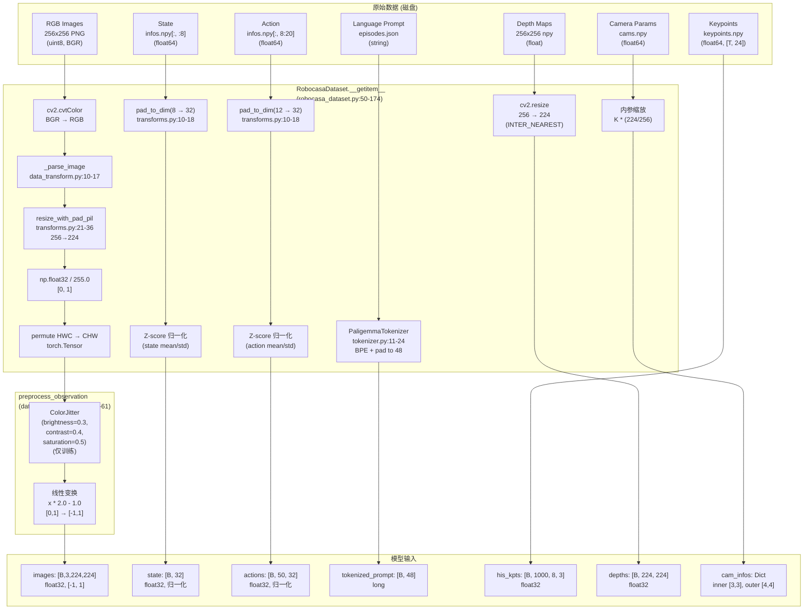
```mermaid
flowchart TD
    subgraph RawData ["原始数据 (磁盘)"]
        RAW_IMG["RGB Images<br/>256x256 PNG<br/>(uint8, BGR)"]
        RAW_STATE["State<br/>infos.npy[:, :8]<br/>(float64)"]
        RAW_ACTION["Action<br/>infos.npy[:, 8:20]<br/>(float64)"]
        RAW_PROMPT["Language Prompt<br/>episodes.json<br/>(string)"]
        RAW_KPT["Keypoints<br/>keypoints.npy<br/>(float64, [T, 24])"]
        RAW_DEPTH["Depth Maps<br/>256x256 npy<br/>(float)"]
        RAW_CAM["Camera Params<br/>cams.npy<br/>(float64)"]
    end

    subgraph DatasetLoad ["RobocasaDataset.__getitem__<br/>(robocasa_dataset.py:50-174)"]
        CVTRGB["cv2.cvtColor<br/>BGR → RGB"]
        PARSE_IMG["_parse_image<br/>data_transform.py:10-17"]
        RESIZE_PAD["resize_with_pad_pil<br/>transforms.py:21-36<br/>256→224"]
        TO_FLOAT["np.float32 / 255.0<br/>[0, 1]"]
        TO_CHW["permute HWC → CHW<br/>torch.Tensor"]
        PAD_STATE["pad_to_dim(8 → 32)<br/>transforms.py:10-18"]
        NORM_STATE["Z-score 归一化<br/>(state mean/std)"]
        PAD_ACT["pad_to_dim(12 → 32)<br/>transforms.py:10-18"]
        NORM_ACT["Z-score 归一化<br/>(action mean/std)"]
        TOKENIZE["PaligemmaTokenizer<br/>tokenizer.py:11-24<br/>BPE + pad to 48"]
        RESIZE_DEPTH["cv2.resize<br/>256 → 224<br/>(INTER_NEAREST)"]
        SCALE_K["内参缩放<br/>K * (224/256)"]
    end

    subgraph PreprocessObs ["preprocess_observation<br/>(data_processing/utils.py:43-61)"]
        COLOR_JITTER["ColorJitter<br/>(brightness=0.3,<br/>contrast=0.4,<br/>saturation=0.5)<br/>(仅训练)"]
        RESCALE["线性变换<br/>x * 2.0 - 1.0<br/>[0,1] → [-1,1]"]
    end

    subgraph ModelInput ["模型输入"]
        IMG_IN["images: [B,3,224,224]<br/>float32, [-1, 1]"]
        STATE_IN["state: [B, 32]<br/>float32, 归一化"]
        ACT_IN["actions: [B, 50, 32]<br/>float32, 归一化"]
        PROMPT_IN["tokenized_prompt: [B, 48]<br/>long"]
        KPT_IN["his_kpts: [B, 1000, 8, 3]<br/>float32"]
        DEPTH_IN["depths: [B, 224, 224]<br/>float32"]
        CAM_IN["cam_infos: Dict<br/>inner [3,3], outer [4,4]"]
    end

    RAW_IMG --> CVTRGB --> PARSE_IMG
    PARSE_IMG --> RESIZE_PAD --> TO_FLOAT --> TO_CHW
    TO_CHW --> COLOR_JITTER --> RESCALE --> IMG_IN

    RAW_STATE --> PAD_STATE --> NORM_STATE --> STATE_IN
    RAW_ACTION --> PAD_ACT --> NORM_ACT --> ACT_IN
    RAW_PROMPT --> TOKENIZE --> PROMPT_IN
    RAW_KPT --> KPT_IN
    RAW_DEPTH --> RESIZE_DEPTH --> DEPTH_IN
    RAW_CAM --> SCALE_K --> CAM_IN
```

**各步骤详解**:

**1. 图像预处理 (`_parse_image`, `data_processing/data_transform.py:10-17`)**

```python
def _parse_image(image, height, width, method=Image.BILINEAR):
    pil_image = Image.fromarray(image)
    resized_pil = resize_with_pad_pil(pil_image, height, width, method=method)
    resized_hwc = np.array(resized_pil).astype(np.float32) / 255.0  # [0,1]
    resized_chw = torch.from_numpy(resized_hwc).permute(2, 0, 1)  # [C, H, W]
    return resized_chw
```

`resize_with_pad_pil` (`transforms.py:21-36`) 执行保持纵横比的缩放:先按较大比例因子缩小图像,然后在零填充的画布中居中粘贴。对于 $256 \times 256$ 的正方形输入,缩放比 $r = 256/224 = 1.143$,缩放后尺寸为 $224 \times 224$(恰好填满,无需额外 padding)。

**2. 图像增强 (`transform_images`, `data_processing/utils.py:12-40`)**

训练阶段对每张图像独立应用 `torchvision.transforms.ColorJitter`:

$$\text{brightness} \in [0.7, 1.3], \quad \text{contrast} \in [0.6, 1.4], \quad \text{saturation} \in [0.5, 1.5]$$

然后进行线性变换 $\mathbf{x} \leftarrow 2\mathbf{x} - 1$,将像素值从 $[0, 1]$ 映射到 $[-1, 1]$,匹配 SigLIP 的输入分布要求。

**3. 语言分词 (`PaligemmaTokenizer.tokenize`, `tokenizer.py:11-24`)**

```python
cleaned_text = prompt.strip().replace("_", " ").replace("\n", " ")
tokens = self._tokenizer.encode(cleaned_text, add_bos=True) + self._tokenizer.encode("\n")
```

分词流程:文本清洗(去除下划线和换行) $\to$ SentencePiece BPE 编码(含 BOS token) $\to$ 附加换行符 token(作为 "start of answer" 标记) $\to$ 截断或 False-padding 至 48 tokens。

**4. Depth Map 预处理**: 从 `.npy` 文件加载 $256 \times 256$ 的深度图,使用最近邻插值 (`cv2.INTER_NEAREST`) resize 到 $224 \times 224$,保持深度值不被线性插值修改。

---

### 5.3 归一化策略

GeoPredict 对机器人状态和动作使用 **Z-score 归一化**(零均值、单位方差),归一化统计量从数据集预先计算并存储在 `./ckpts/robocasa_norm_stats.json` 中。

**归一化公式**:

$$\hat{\mathbf{x}} = \frac{\mathbf{x} - \boldsymbol{\mu}}{\boldsymbol{\sigma} + \epsilon}, \quad \epsilon = 10^{-6}$$

其中 $\boldsymbol{\mu}$ 和 $\boldsymbol{\sigma}$ 为逐维度的均值和标准差。

**`load_norm_stats` 函数** (`data_processing/data_transform.py:31-44`):

```python
def load_norm_stats(json_path):
    with open(json_path, 'r') as f:
        data = json.load(f)

    norm_stats = {}
    for key, stats in data.items():
        norm_stats[key] = {
            "mean": torch.tensor(stats["mean"], dtype=torch.float32),
            "std": torch.tensor(stats["std"], dtype=torch.float32),
            "q01": torch.tensor(stats["q01"], dtype=torch.float32),
            "q99": torch.tensor(stats["q99"], dtype=torch.float32),
        }
    
    return norm_stats
```

**归一化作用域**:

| 数据项 | 实际有效维度 | 填充后维度 | 归一化键 | 应用位置 |
|--------|------------|-----------|---------|---------|
| `state` | 8 (7 关节角 + 1 夹爪) | 32 | `"state"` | `robocasa_dataset.py:70` |
| `actions` | 12 (7 关节速度 + 1 夹爪 + 4 其他) | 32 | `"actions"` | `robocasa_dataset.py:75` |

注意:填充维度(第 13-32 维)的均值为 0、标准差为极小值(接近 0 + $\epsilon$),因此归一化后这些维度仍然接近 0,不会对模型行为产生实质影响。

**反归一化 (推理输出后处理)**:

在 `RobocasaOutputTransform` (`data_processing/data_transform.py:83-103`) 中,推理输出的动作需要反归一化恢复到物理量:

$$\mathbf{x} = \hat{\mathbf{x}} \cdot (\boldsymbol{\sigma} + \epsilon) + \boldsymbol{\mu}$$

最终输出仅取前 12 维有效动作: `outputs["actions"][:, :12]` (line 103)。

**完整数据流 --- 从原始文件到损失计算**:

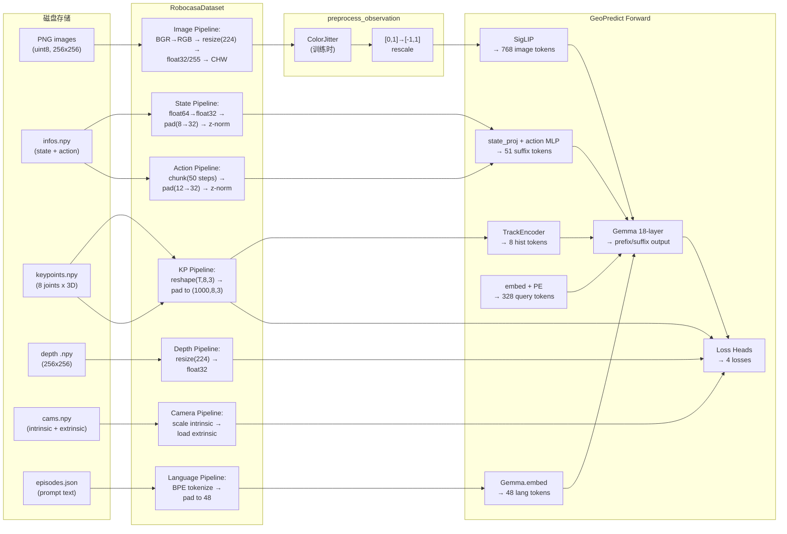
```mermaid
flowchart LR
    subgraph Disk ["磁盘存储"]
        F1["PNG images<br/>(uint8, 256x256)"]
        F2["infos.npy<br/>(state + action)"]
        F3["keypoints.npy<br/>(8 joints x 3D)"]
        F4["depth .npy<br/>(256x256)"]
        F5["cams.npy<br/>(intrinsic + extrinsic)"]
        F6["episodes.json<br/>(prompt text)"]
    end

    subgraph Dataset ["RobocasaDataset"]
        D1["Image Pipeline:<br/>BGR→RGB → resize(224) →<br/>float32/255 → CHW"]
        D2["State Pipeline:<br/>float64→float32 →<br/>pad(8→32) → z-norm"]
        D3["Action Pipeline:<br/>chunk(50 steps) →<br/>pad(12→32) → z-norm"]
        D4["Language Pipeline:<br/>BPE tokenize →<br/>pad to 48"]
        D5["KP Pipeline:<br/>reshape(T,8,3) →<br/>pad to (1000,8,3)"]
        D6["Depth Pipeline:<br/>resize(224) →<br/>float32"]
        D7["Camera Pipeline:<br/>scale intrinsic →<br/>load extrinsic"]
    end

    subgraph PreProcess ["preprocess_observation"]
        P1["ColorJitter<br/>(训练时)"]
        P2["[0,1]→[-1,1]<br/>rescale"]
    end

    subgraph Model ["GeoPredict Forward"]
        M1["SigLIP<br/>→ 768 image tokens"]
        M2["Gemma.embed<br/>→ 48 lang tokens"]
        M3["TrackEncoder<br/>→ 8 hist tokens"]
        M4["embed + PE<br/>→ 328 query tokens"]
        M5["state_proj + action MLP<br/>→ 51 suffix tokens"]
        M6["Gemma 18-layer<br/>→ prefix/suffix output"]
        M7["Loss Heads<br/>→ 4 losses"]
    end

    F1 --> D1 --> P1 --> P2 --> M1
    F2 --> D2 --> M5
    F2 --> D3 --> M5
    F6 --> D4 --> M2
    F3 --> D5 --> M3
    F3 --> D5 --> M7
    F4 --> D6 --> M7
    F5 --> D7 --> M7
    M1 & M2 & M3 & M4 --> M6
    M5 --> M6
    M6 --> M7
```

**推理时的数据流差异**:

推理时使用 `RobocasaInputTransform` (`data_processing/data_transform.py:47-80`) 和 `RobocasaOutputTransform` (`data_processing/data_transform.py:83-103`) 进行输入/输出变换。关键差异包括:

1. **无 action chunk**: 推理时 action 是模型生成的,而非从数据集加载
2. **无 depth/camera 数据**: 深度渲染模块在推理时不参与
3. **无 ColorJitter**: `preprocess_observation(train=False)` 跳过图像增强 (`data_processing/utils.py:18`)
4. **输出后处理**: 反归一化 + 截断前 12 维有效动作

`RobocasaInputTransform` 内部组合了三个 transform 步骤 (`data_transform.py:51-55`):

```python
transforms = [
    RobocasaInputs(action_dim=action_dim),   # 组织输入字典结构, pad state
    Normalize(norm_stats=load_norm_stats(...)), # Z-score 归一化
    TokenizePrompt(PaligemmaTokenizer(max_token_len)) # 语言分词
]
```

依次执行:`RobocasaInputs` (`transforms.py:69-102`) 将原始观测数据整理为模型期望的字典结构并执行维度填充 $\to$ `Normalize` (`transforms.py:51-66`) 对 state 和 actions 进行 Z-score 归一化 $\to$ `TokenizePrompt` (`transforms.py:105-118`) 对语言指令进行 BPE 分词。


---

## 6. 训练与推理过程

### 6.1 训练配置

GeoPredict 的训练采用 DeepSpeed ZeRO Stage 3 分布式训练框架, 在 8 块 NVIDIA H20 GPU 上进行, 总计 40,000 步迭代. 以下是完整的训练超参数配置 (来源: `utils/arguments.py` 第 6-29 行, `configs/ds_bf16_z3_config.json`):

| 超参数 | 值 | 来源 |
|--------|------|------|
| Optimizer | AdamW | `arguments.py` L16 |
| Base learning rate | $2.5 \times 10^{-5}$ | `arguments.py` L17 |
| $\beta_1$ | 0.9 | `arguments.py` L18 |
| $\beta_2$ | 0.95 | `arguments.py` L19 |
| $\epsilon$ | $1 \times 10^{-8}$ | `arguments.py` L20 |
| Weight decay | $1 \times 10^{-10}$ | `arguments.py` L21 |
| LR schedule | CosineDecay | `arguments.py` L23 |
| Warmup steps | 1,000 | `arguments.py` L25 |
| Decay steps | 30,000 | `arguments.py` L26 |
| Decay LR (最终) | $2.5 \times 10^{-6}$ | `arguments.py` L24 |
| Total training steps | 40,000 | `arguments.py` L13 |
| Micro batch size per GPU | 4 | `ds_bf16_z3_config.json` L2 |
| Gradient accumulation steps | 1 | `ds_bf16_z3_config.json` L3 |
| Total batch size | 32 (= 4 $\times$ 8 GPUs) | 计算得出 |
| Mixed precision | bf16 | `ds_bf16_z3_config.json` L6-8 |
| Gradient clipping | 1.0 | `ds_bf16_z3_config.json` L9 |
| ZeRO stage | 3 | `ds_bf16_z3_config.json` L10-12 |
| EMA decay ($\beta$) | 0.99 | `arguments.py` L28 |
| Log interval | 100 steps | `arguments.py` L29 |
| Save interval | 5,000 steps | `arguments.py` L30 |
| Random seed | 75 | `arguments.py` L11 |
| Action horizon ($H$) | 50 | `arguments.py` L33 |
| Action dim | 32 (12 actual, padded) | `arguments.py` L34 |

**Learning Rate Schedule** 采用三阶段策略 (定义于 `utils/optimizer.py` 第 20-44 行):

1. **Linear Warmup** (step 0 -- 1,000): 学习率从 $\text{lr}_{\text{init}} = \frac{\text{lr}_{\text{base}}}{\text{warmup\_steps} + 1} \approx 2.5 \times 10^{-8}$ 线性增长到 $\text{lr}_{\text{base}} = 2.5 \times 10^{-5}$
2. **Cosine Decay** (step 1,000 -- 30,000): 按余弦曲线从 $\text{lr}_{\text{base}}$ 衰减到 $\text{lr}_{\text{decay}} = 2.5 \times 10^{-6}$
3. **Constant** (step 30,000 -- 40,000): 保持 $\text{lr}_{\text{decay}} = 2.5 \times 10^{-6}$ 不变

数学表达如下:

$$
\text{lr}(t) = \begin{cases}
\text{lr}_{\text{init}} + (\text{lr}_{\text{base}} - \text{lr}_{\text{init}}) \cdot \frac{t}{T_{\text{warmup}}} & \text{if } t < T_{\text{warmup}} \\
\text{lr}_{\text{decay}} + (\text{lr}_{\text{base}} - \text{lr}_{\text{decay}}) \cdot \frac{1}{2}\left(1 + \cos\left(\pi \cdot \frac{t - T_{\text{warmup}}}{T_{\text{decay}} - T_{\text{warmup}}}\right)\right) & \text{if } T_{\text{warmup}} \leq t < T_{\text{decay}} \\
\text{lr}_{\text{decay}} & \text{if } t \geq T_{\text{decay}}
\end{cases}
$$

其中 $T_{\text{warmup}} = 1000$, $T_{\text{decay}} = 30000$, $\text{lr}_{\text{base}} = 2.5 \times 10^{-5}$, $\text{lr}_{\text{decay}} = 2.5 \times 10^{-6}$.

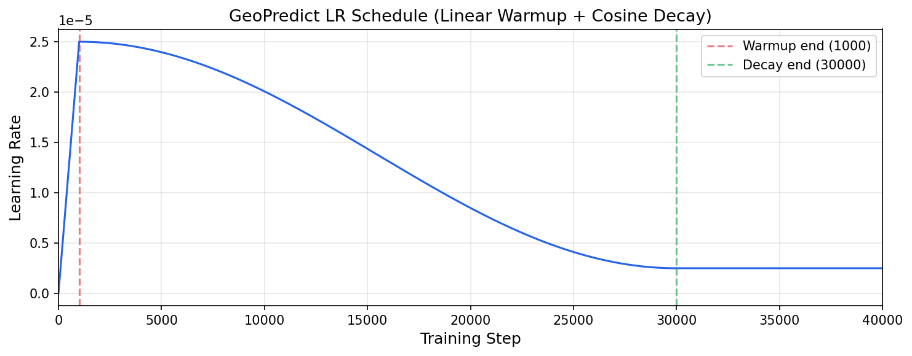

代码实现中 (见 `utils/optimizer.py` 第 28-38 行), `lr_lambda` 函数返回的是相对于 `base_lr` 的比例因子, 由 PyTorch 的 `LambdaLR` 调度器将其乘以优化器的基础学习率:

```python
def lr_lambda(step):
    if step < warmup_steps:
        return (init_lr + (base_lr - init_lr) * step / warmup_steps) / base_lr
    elif step < decay_steps:
        cosine_steps = decay_steps - warmup_steps
        progress = (step - warmup_steps) / cosine_steps
        cosine_factor = 0.5 * (1 + math.cos(math.pi * progress))
        current_lr = decay_lr + (base_lr - decay_lr) * cosine_factor
        return current_lr / base_lr
    else:
        return decay_lr / base_lr
```

### 6.2 模型加载与权重初始化

GeoPredict 的训练采用 "预训练 backbone + 新增模块随机初始化" 的策略 (见 `tools/train_robocasa.py` 第 72-83 行). 具体流程如下:

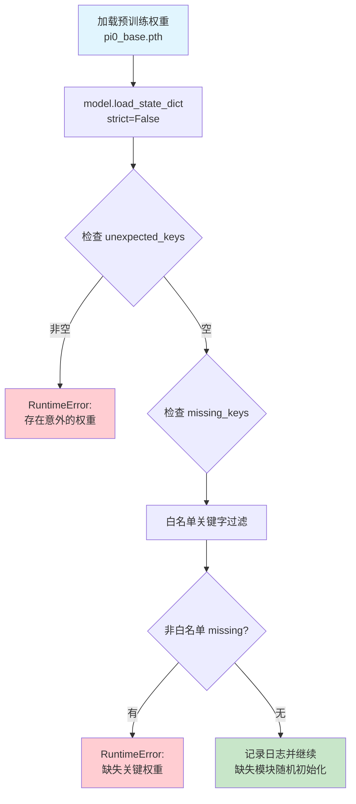
```mermaid
flowchart TD
    A["加载预训练权重<br/>pi0_base.pth"] --> B["model.load_state_dict<br/>strict=False"]
    B --> C{检查 unexpected_keys}
    C -->|非空| D["RuntimeError:<br/>存在意外的权重"]
    C -->|空| E{检查 missing_keys}
    E --> F["白名单关键字过滤"]
    F --> G{非白名单 missing?}
    G -->|有| H["RuntimeError:<br/>缺失关键权重"]
    G -->|无| I["记录日志并继续<br/>缺失模块随机初始化"]
    
    style A fill:#e1f5fe
    style I fill:#c8e6c9
    style D fill:#ffcdd2
    style H fill:#ffcdd2
```

**白名单关键字** (第 77 行):

```python
white_keyword = ['keypoint', 'spatial', 'gs_decoder', 'renderer', 'refine']
```

这 5 个关键字对应了 GeoPredict 新增的模块, 它们在 Pi0 基础模型中不存在, 因此在加载预训练权重时预期会缺失:

| 白名单关键字 | 对应模块 | 说明 |
|-------------|---------|------|
| `keypoint` | `keypoint_encoder` (TrackEncoder), `keypoint_embedding`, `keypoint_out_proj` | 运动学轨迹编码器与预测头, 用于编码历史关节轨迹和预测未来关节位置. 这是 GeoPredict 独有的轨迹级运动学先验模块. |
| `spatial` | `spatial_embedding` | 3D 空间查询 token 的 embedding, 用于表示体素化的工作空间. Pi0 没有 3D 空间建模能力. |
| `gs_decoder` | `gs_decoder` (VoxelDecoder) | 体素解码器, 将空间 token 上采样为 3D Gaussian 参数网格 (从 $8 \times 8 \times 5$ 到 $40 \times 40 \times 25$). |
| `renderer` | `renderer` (GaussianRenderer) | 可微 Gaussian Splatting 渲染器, 用于将 3D Gaussian 渲染为深度图进行监督. |
| `refine` | `refine_gs_mlp` | Track-guided Refinement 的 MLP, 在预测的关节轨迹附近生成额外的高密度 Gaussian 原语. |

**从预训练 Pi0 加载的权重** 包括:

- **Gemma LLM backbone** (`self.llm`): 包含所有 18 层 Transformer 的 attention 和 FFN 参数 (prefix expert + action expert)
- **SigLIP 视觉编码器** (`self.img`): ViT-L/14 的全部参数 (27 层, width=1152)
- **动作投影层**: `state_proj`, `action_in_proj`, `action_time_mlp_in`, `action_time_mlp_out`, `action_out_proj`

**EMA 模型初始化** (第 90 行): EMA 模型通过 `deepspeed.initialize` 单独包装, 但使用的是同一个 `model` 对象. 在训练开始时, EMA 模型的参数与训练模型完全相同. 需要注意的是, EMA 引擎 (`model_ema`) 在第 90 行先于训练引擎 (第 91-98 行) 初始化, 这意味着 DeepSpeed 会为同一模型创建两份 ZeRO-3 分区:

```python
model_ema, _, _, _ = deepspeed.initialize(args=args, model=model)
model, optimizer, dataloader, lr_scheduler = deepspeed.initialize(
    args=args, model=model, optimizer=optimizer,
    training_data=dataset, lr_scheduler=lr_scheduler,
    dist_init_required=True
)
```

### 6.3 训练循环分析

训练循环定义在 `tools/train_robocasa.py` 第 110-156 行, 结构清晰紧凑:

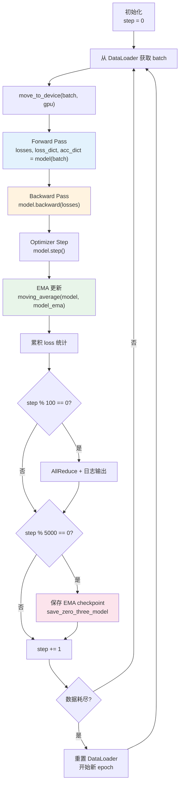
```mermaid
flowchart TD
    START["初始化<br/>step = 0"] --> LOAD["从 DataLoader 获取 batch"]
    LOAD --> DEVICE["move_to_device(batch, gpu)"]
    DEVICE --> FWD["Forward Pass<br/>losses, loss_dict, acc_dict = model(batch)"]
    FWD --> BWD["Backward Pass<br/>model.backward(losses)"]
    BWD --> STEP["Optimizer Step<br/>model.step()"]
    STEP --> EMA["EMA 更新<br/>moving_average(model, model_ema)"]
    EMA --> LOG_ACC["累积 loss 统计"]
    LOG_ACC --> LOG_CHK{step % 100 == 0?}
    LOG_CHK -->|是| LOG["AllReduce + 日志输出"]
    LOG_CHK -->|否| SAVE_CHK
    LOG --> SAVE_CHK{step % 5000 == 0?}
    SAVE_CHK -->|是| SAVE["保存 EMA checkpoint<br/>save_zero_three_model"]
    SAVE_CHK -->|否| NEXT
    SAVE --> NEXT["step += 1"]
    NEXT --> EPOCH{数据耗尽?}
    EPOCH -->|是| RESET["重置 DataLoader<br/>开始新 epoch"]
    EPOCH -->|否| LOAD
    RESET --> LOAD
    
    style FWD fill:#e3f2fd
    style BWD fill:#fff3e0
    style EMA fill:#e8f5e9
    style SAVE fill:#fce4ec
```

以下是训练循环各关键步骤的详细分析:

**Step 1: 数据加载与设备迁移** (第 111-118 行)

训练采用标准的 iterator 模式, 当一个 epoch 的数据耗尽时自动重置:

```python
try:
    batch_data = next(dataloader_iter)
except StopIteration:
    dataloader_iter = iter(dataloader)
    batch_data = next(dataloader_iter)
batch_data = move_to_device(batch_data, device)
```

每个 batch 包含: 左/右/手腕图像 (224x224), 机器人状态 (8 维 padded 到 32 维), 动作序列 (horizon=50), 关键点历史/未来轨迹, 深度图, 相机参数等.

**Step 2: Forward Pass** (第 120 行)

`model(batch_data)` 调用 `compute_loss()` 方法 (通过 `forward` 函数代理), 计算四项损失:

$$\mathcal{L}_{\text{total}} = \mathcal{L}_{\text{action}} + \mathcal{L}_{\text{current\_kpt}} + \mathcal{L}_{\text{future\_kpt}} + \mathcal{L}_{\text{depth\_current}} + \mathcal{L}_{\text{depth\_future}}$$

返回三个值: 标量总损失 `losses`, 各项损失字典 `loss_dict`, 精度指标字典 `acc_dict`.

**Step 3: Backward Pass** (第 121 行)

```python
model.backward(losses)
```

通过 DeepSpeed engine 的 `backward()` 方法执行反向传播, 自动处理 ZeRO-3 的梯度分区与通信.

**Step 4: Optimizer Step** (第 122 行)

```python
model.step()
```

DeepSpeed engine 的 `step()` 方法内部完成: 梯度裁剪 (max_norm=1.0, 由 `ds_bf16_z3_config.json` 配置), AdamW 参数更新, LR scheduler step.

**Step 5: EMA 更新** (第 123 行)

```python
moving_average(model, model_ema)
```

每一步都更新 EMA 模型. 注意这里 **没有** 传入自定义的 `beta` 参数, 因此使用默认值 $\beta = 0.99$.

**Step 6: 日志与 Checkpoint** (第 130-152 行)

- 每 100 步: 对所有 GPU 的损失统计进行 AllReduce 平均, rank 0 输出日志
- 每 5,000 步: 保存 EMA 模型的 checkpoint (而非训练模型本身)
- 训练结束后保存最终 checkpoint `final_checkpoint.pth`

值得注意的是, **最终部署的模型权重来自 EMA 模型**, 而不是训练模型本身 (第 149-150 行):

```python
checkpoint_path = osp.join(checkpoints_dir, f"checkpoint_step_{step + 1}.pth")
save_zero_three_model(model_ema, rank, checkpoint_path)
```

### 6.4 EMA (Exponential Moving Average) 实现

EMA 是一种通过维护模型参数的指数加权移动平均来提高模型泛化性能的技术. GeoPredict 的 EMA 实现在 `utils/ema.py` 中, 包含两个核心函数.

#### 6.4.1 moving_average 函数 (第 13-38 行)

该函数在每个训练步骤后调用, 将训练模型的参数平滑更新到 EMA 模型中:

$$\theta_{\text{ema}}^{(t)} = \beta \cdot \theta_{\text{ema}}^{(t-1)} + (1 - \beta) \cdot \theta_{\text{train}}^{(t)}$$

其中 $\beta = 0.99$, 即 EMA 模型每步仅吸收 1% 的训练模型更新.

代码使用 `torch.lerp` 实现这一更新:

```python
param_ema.data.copy_(torch.lerp(data, param_ema.data, beta))
```

`torch.lerp(a, b, w)` 计算 $a + w \cdot (b - a) = (1-w) \cdot a + w \cdot b$. 这里 $a = \theta_{\text{train}}$, $b = \theta_{\text{ema}}$, $w = \beta = 0.99$, 因此结果为 $(1-0.99) \cdot \theta_{\text{train}} + 0.99 \cdot \theta_{\text{ema}}$, 恰好符合 EMA 公式.

**DeepSpeed ZeRO-3 兼容性**: 在 ZeRO-3 模式下, 模型参数被分布在多个 GPU 上. 在更新 EMA 参数前, 需要通过 `GatheredParameters` 上下文管理器将分区参数临时聚合到当前进程:

```python
params_to_fetch = _z3_params_to_fetch([param, param_ema]) if zero_stage_3 else []
should_gather_param = len(params_to_fetch) > 0
with deepspeed.zero.GatheredParameters(params_to_fetch, enabled=should_gather_param):
    data = param.data
    param_ema.data.copy_(torch.lerp(data, param_ema.data, beta))
```

**Buffer 处理** (第 29-38 行): 对于模型的 buffer (如 BatchNorm 的 running_mean/running_var, 注册的常量 tensor 等), 仅对浮点类型执行 EMA 平滑, 对整数类型 (如 step counter) 直接复制:

```python
if data.dtype in [torch.float16, torch.bfloat16, torch.float32, torch.float64]:
    buffer_ema.data.copy_(torch.lerp(data, buffer_ema.data, beta))
else:
    buffer_ema.data.copy_(data)
```

#### 6.4.2 save_zero_three_model 函数 (第 41-69 行)

该函数负责在 ZeRO-3 环境下正确保存 EMA 模型的完整权重:

```mermaid
flowchart TD
    A["输入: model_ema, rank, path"] --> B{ZeRO Stage 3?}
    B -->|否| C["rank 0 直接保存<br/>state_dict"]
    B -->|是| D["遍历 named_parameters"]
    D --> E{参数有 ds_id?}
    E -->|是| F["GatheredParameters<br/>从所有 rank 聚合"]
    E -->|否| G["直接获取 .cpu()"]
    F --> H["转移到 CPU"]
    G --> H
    H --> I{rank 0 且<br/>非 LoRA 参数?}
    I -->|是| J["加入 output_state_dict"]
    I -->|否| K["跳过"]
    J --> L["遍历 named_buffers"]
    L --> M["rank 0 保存<br/>torch.save"]
    K --> L
    
    style F fill:#e3f2fd
    style M fill:#c8e6c9
```

关键细节:

1. **参数聚合**: ZeRO-3 将参数分片存储在不同 GPU 上, 保存时需要通过 `GatheredParameters` 将分片重新组合成完整参数 (第 52-55 行)
2. **LoRA 过滤**: 代码中包含 `"lora" not in k` 的过滤逻辑 (第 59 行), 表明该保存逻辑也支持 LoRA 微调场景, 在保存时排除 LoRA adapter 参数
3. **Buffer 单独保存**: 模型 buffer 不受 ZeRO 分区影响, 直接复制到 CPU 保存 (第 62-65 行)
4. **仅 rank 0 保存**: 避免多个进程同时写入文件 (第 67-68 行)

### 6.5 推理流程

推理流程定义在 `models/geopredict.py` 的 `sample_actions()` 方法 (第 504-542 行). 推理时, **仅使用动作去噪模块**, 而运动学预测和 3DGS 几何模块完全不参与, 实现了 "训练时增强, 推理时零开销" 的设计理念.

#### 6.5.1 整体推理流程

```mermaid
sequenceDiagram
    participant ENV as 环境/传感器
    participant PRE as 前处理
    participant PFX as Prefix 编码
    participant LLM as Gemma LLM
    participant SFX as Suffix 编码
    participant OUT as 动作输出
    
    ENV->>PRE: 左/右/手腕图像 + 状态 + 语言指令 + 关键点历史
    PRE->>PFX: 预处理后的 observation
    
    Note over PFX: embed_prefix() -- 一次性计算
    PFX->>LLM: prefix_tokens [B, ~1152, 2048]
    LLM-->>LLM: 缓存 KV cache
    
    Note over SFX,OUT: 迭代去噪 (10步)
    
    loop t = 1.0, 0.9, 0.8, ..., 0.1
        SFX->>LLM: suffix_tokens [B, 51, 1024]
        Note over LLM: 使用 KV cache, 仅计算 suffix
        LLM->>OUT: suffix_out[:, -50:]
        OUT->>SFX: x_t = x_t + dt * v_t
    end
    
    OUT->>ENV: 去归一化动作 [50, action_dim]
```

#### 6.5.2 详细步骤分析

**Step 1: 输入准备与噪声初始化** (第 505-511 行)

```python
observation = preprocess_observation(observation, train=self.training)
dt = -1.0 / num_steps  # dt = -0.1
x_t = torch.randn((batch_size, self.action_horizon, self.action_dim), device=device)
time = torch.tensor(1.0, device=device)
```

初始动作 $x_1$ 从标准正态分布 $\mathcal{N}(0, I)$ 采样, 形状为 $[B, 50, 32]$, 时间从 $t=1.0$ 开始.

**Step 2: Prefix 编码与 KV Cache 生成** (第 513-517 行)

Prefix 包含所有非动作相关的 token:

$$\text{Prefix} = [\underbrace{\text{img}_{\text{left}}, \text{img}_{\text{right}}, \text{img}_{\text{wrist}}}_{3 \times 256 = 768} \| \underbrace{\text{lang}}_{N_{\text{lang}}} \| \underbrace{\text{kpt\_hist}}_{8} \| \underbrace{\text{kpt\_query}}_{8} \| \underbrace{\text{spatial}}_{320}]$$

其中 $\text{spatial} = 8 \times 8 \times 5 = 320$ 个空间 token. Prefix 总计约 1100+ token.

这是推理中最昂贵的一步: 一次前向传播处理全部约 1152 个 prefix token, 生成 KV cache:

```python
prefix_tokens, prefix_mask, prefix_ar_mask = self.embed_prefix(observation)
prefix_attn_mask = make_attn_mask(prefix_mask, prefix_ar_mask)
positions = torch.cumsum(prefix_mask, dim=1) - 1
(prefix_out, suffix_out), kv_cache = self.llm([prefix_tokens, None], positions=positions, mask=prefix_attn_mask)
```

**Step 3: 迭代去噪 (Euler Method)** (第 519-541 行)

采用 10 步 Euler 积分, 从 $t = 1.0$ 到 $t = 0.0$:

$$x_{t + \Delta t} = x_t + \Delta t \cdot v_\theta(x_t, t)$$

其中 $\Delta t = -0.1$, $v_\theta$ 是模型预测的速度场.

每一步去噪仅需处理 51 个 suffix token (1 个 state token + 50 个 action token), 并复用 prefix 的 KV cache:

```python
while time >= -dt / 2:
    time_batch = time.expand(batch_size)
    suffix_tokens, suffix_mask, suffix_ar_mask = self.embed_suffix(observation, x_t, time_batch)
    
    # 构建 attention mask: suffix attends to prefix (via KV cache) + suffix
    prefix_attn_mask_expanded = prefix_mask.unsqueeze(1).expand(-1, suffix_tokens.shape[1], -1)
    full_attn_mask = torch.cat([prefix_attn_mask_expanded, suffix_attn_mask], dim=-1)
    
    # Forward pass with KV cache
    (prefix_out, suffix_out), _ = self.llm(
        [None, suffix_tokens], positions=positions, mask=full_attn_mask, kv_cache=kv_cache)
    
    v_t = self.action_out_proj(suffix_out[:, -self.action_horizon:])  # [b, 50, 32]
    x_t = x_t + dt * v_t
    time = time + dt
```

**Step 4: 推理计算量分析**

| 阶段 | Forward Pass 次数 | 处理 Token 数 | 计算开销 |
|------|------------------|--------------|---------|
| Prefix 编码 | 1 | ~1152 (2048-dim, prefix expert) | 高 |
| 去噪迭代 | 10 | 51 (1024-dim, action expert) | 低 |
| **总计** | **11** | -- | -- |

KV cache 机制的效率优势显著: prefix 编码仅执行一次, 后续 10 次去噪迭代仅处理 51 个 suffix token (使用较窄的 action expert, width=1024), 计算量远小于 prefix. 这使得整体推理等效于约 $1 + 10 \times \frac{51 \times 1024}{1152 \times 2048} \approx 1.22$ 次完整 prefix forward pass 的计算量.

#### 6.5.3 Replanning 策略

在实际部署中 (见 `tools/test_robocasa.py` 第 262-297 行), 采用 **滚动式 replanning** 策略:

1. 模型每次预测 50 步动作 ($H = 50$)
2. 仅执行前 $k = 5$ 步 (`--replan_steps 5`)
3. 执行完后重新观测环境, 重新规划
4. 如此循环直到任务完成或达到最大步数

```python
action_plan.extend(action_chunk[:args.replan_steps])  # 仅取前5步
```

这种 receding horizon 策略平衡了规划效率和环境反馈的时效性: 长 horizon (50 步) 确保动作的全局连贯性, 短执行窗口 (5 步) 允许根据最新观测及时纠正.

#### 6.5.4 完整推理时序 (单次 Replan)

```mermaid
flowchart LR
    subgraph 环境交互
        A["获取 3 张图像<br/>+ 机器人状态<br/>+ 关键点历史"]
    end
    
    subgraph 模型推理
        B["Prefix 编码<br/>(SigLIP + Gemma Embed<br/>+ TrackEncoder)"]
        C["10 步去噪<br/>(KV Cache 加速)"]
        D["输出 50 步动作<br/>取前 5 步执行"]
    end
    
    subgraph 动作执行
        E["执行 5 步动作"]
        F["更新关键点历史"]
    end
    
    A --> B --> C --> D --> E --> F --> A
```

### 6.6 冻结参数策略

通过分析训练脚本 `tools/train_robocasa.py`, GeoPredict 训练中 **没有显式冻结任何参数**. 所有参数 (包括预训练的 SigLIP 和 Gemma) 都会接收梯度:

```python
optimizer = build_optimizer(args, model)  # 第87行: 对 model.parameters() 构建优化器
```

`build_optimizer` (见 `utils/optimizer.py` 第 5-17 行) 对 `model.parameters()` 整体构建优化器, 没有参数分组或冻结逻辑:

```python
def build_optimizer(args, model):
    if args.optimizer == "AdamW":
        optimizer = optim.AdamW(
            model.parameters(),
            lr=args.base_lr,
            betas=(args.beta1, args.beta2),
            eps=args.eps,
            weight_decay=args.weight_decay,
        )
```

这意味着:

| 模块 | 参数来源 | 是否可训练 | 说明 |
|------|---------|-----------|------|
| SigLIP (ViT-L/14) | 预训练 | 可训练 (微调) | 端到端微调视觉编码器以适应机器人操作场景 |
| Gemma LLM | 预训练 | 可训练 (微调) | 包括 prefix expert 和 action expert |
| 动作投影层 | 预训练 | 可训练 | `state_proj`, `action_in_proj`, `action_out_proj` 等 |
| TrackEncoder | 随机初始化 | 可训练 | 从零训练的新增模块 |
| Keypoint Head | 随机初始化 | 可训练 | `keypoint_embedding`, `keypoint_out_proj` |
| Spatial Embedding | 随机初始化 | 可训练 | 3D 空间查询 token |
| VoxelDecoder | 随机初始化 | 可训练 | 3D Gaussian 解码器 |
| GaussianRenderer | 随机初始化 | 可训练 | 可微渲染器 |
| Refine MLP | 随机初始化 | 可训练 | Track-guided Refinement |

这种 **全参数微调** 策略的合理性在于: 虽然 SigLIP 和 Gemma 已经具备通用的视觉-语言理解能力, 但机器人操作领域的视觉特征 (如精确的深度感知、关节定位) 与预训练时的自然图像/文本分布有较大差异, 端到端微调可以让这些 backbone 模块更好地适应下游任务. 同时, 极小的学习率 ($2.5 \times 10^{-5}$) 和极小的 weight decay ($1 \times 10^{-10}$) 确保预训练权重不会被过度改变.

---

## 7. 实验结果分析

### 7.1 RoboCasa Human-50 基准测试

RoboCasa 是一个大规模厨房环境机器人操作基准测试平台, 包含 24 个复杂的长程日常任务. GeoPredict 采用 **Human-50 few-shot** 设置: 每个任务仅使用 50 个人类示范进行训练, 并在 5 个不同场景中进行 50 次试验评估 (包含 **未见过的物体实例** 和 **未见过的场景风格**).

#### 7.1.1 任务列表

24 个评估任务定义在 `tools/test_robocasa.py` 第 87-94 行, 可分为以下类别:

| 类别 | 任务 | 最大步数 |
|------|------|---------|
| **Pick-and-Place** | PnPCounterToSink, PnPSinkToCounter, PnPCounterToMicrowave, PnPMicrowaveToCounter, PnPCounterToStove, PnPStoveToCounter, PnPCounterToCab, PnPCabToCounter | 500-700 |
| **开/关门** | OpenSingleDoor, CloseSingleDoor, OpenDoubleDoor, CloseDoubleDoor | 500-1000 |
| **开/关抽屉** | OpenDrawer, CloseDrawer | 500 |
| **旋钮/开关** | TurnOnMicrowave, TurnOffMicrowave, TurnOnStove, TurnOffStove, TurnOnSinkFaucet, TurnOffSinkFaucet, TurnSinkSpout | 500 |
| **咖啡制作** | CoffeeSetupMug, CoffeeServeMug, CoffeePressButton | 300-600 |

#### 7.1.2 主要结果

GeoPredict 在 RoboCasa 上取得了 **52.4%** 的平均成功率, 显著优于所有基线方法 (数据来源: 论文 Table 1):

| 方法 | 平均成功率 | 相对 Pi0 的提升 |
|------|-----------|----------------|
| BC-Transformer | 28.8% | - |
| GWM | 39.2% | - |
| $\pi_0$ (Baseline) | 42.3% | -- |
| **GeoPredict (Ours)** | **52.4%** | **+10.1%** |

GeoPredict 相比 $\pi_0$ baseline 提升 **+10.1%** 绝对成功率, 这一显著提升验证了预测性运动学和几何先验对策略学习的价值, 特别是在仅有 50 个示范的 few-shot 设置下, 泛化能力至关重要.

#### 7.1.3 分类别分析

从论文 Table 1 的详细数据中, 可以观察到 GeoPredict 在不同类别任务上的表现模式:

**优势显著的任务** (相比 $\pi_0$ 提升 $\geq$ 10%):
- **PnPSinkToCounter**: 31.2% vs 15.6% (+15.6%), pick-and-place 任务需要精确的 3D 空间感知
- **PnPCounterToStove** (CTS2): 20.4% vs 11.2% (+9.2%), 涉及跨区域的物体转移
- **PnPSinkToCounter** (STC2): 28.8% vs 12.8% (+16.0%)
- **TurnOnSinkFaucet** (TNSF): 72.4% vs 43.6% (+28.8%), 需要精确定位水龙头手柄
- **TurnOffSinkFaucet** (TFSF): 94.8% vs 86.0% (+8.8%)
- **TurnOnMicrowave** (TNM): 84.8% vs 59.6% (+25.2%)
- **TurnOffMicrowave** (TFM): 82.8% vs 60.0% (+22.8%)
- **OpenDoubleDoor** (ODD): 87.2% vs 55.2% (+32.0%), 最大提升之一
- **CoffeeMug-Setup** (CMSU): 28.4% vs 18.4% (+10.0%)

这些结果表明, GeoPredict 的 3D 几何感知能力在需要精确空间推理的任务 (如旋钮操作、门的开关、跨区域搬运) 上具有特别显著的优势.

### 7.2 LIBERO 基准测试

LIBERO 是一个旨在评估知识迁移和策略泛化的基准测试, 包含四个不同的任务套件 (数据来源: 论文 Table 2):

| 方法 | Spatial | Object | Goal | Long | **Average** |
|------|---------|--------|------|------|-------------|
| Diffusion Policy | 78.3 | 92.5 | 68.3 | 50.5 | 72.4 |
| OpenVLA | 84.7 | 88.4 | 79.2 | 53.7 | 76.5 |
| SpatialVLA | 88.2 | 89.9 | 78.6 | 55.5 | 78.1 |
| 4D-VLA | 88.9 | 95.2 | 90.9 | 79.1 | 88.6 |
| DreamVLA | 97.5 | 94.0 | 89.5 | 89.5 | 92.6 |
| $\pi_0$ (原始) | 96.8 | 98.8 | 95.8 | 85.2 | 94.2 |
| OpenVLA-OFT | 95.2 | 94.2 | 95.2 | 93.2 | 94.5 |
| UniVLA | 96.5 | 96.8 | 95.6 | 92.0 | 95.2 |
| $\pi_0$ (复现 Baseline) | 96.6$\pm$0.6 | 97.2$\pm$0.8 | 94.2$\pm$0.7 | 87.6$\pm$1.1 | 93.9$\pm$0.4 |
| **GeoPredict (Ours)** | **98.0$\pm$0.7** | **98.2$\pm$0.7** | **95.7$\pm$0.2** | **94.0$\pm$1.0** | **96.5$\pm$0.6** |

#### 7.2.1 关键发现

1. **SOTA 性能**: GeoPredict 以 **96.5%** 的平均成功率超越此前 SOTA 方法 UniVLA (95.2%), 成为该基准上的最佳方法.

2. **跨套件一致性**: 四个子套件的成功率均在 95% 以上, 表现出极高的鲁棒性:
   - **Spatial** (98.0%): 空间推理能力, 得益于 3DGS 深度监督
   - **Object** (98.2%): 物体操作泛化
   - **Goal** (95.7%): 目标导向的任务完成
   - **Long** (94.0%): 长程任务规划, 提升最显著 (+6.4% vs $\pi_0$ 复现)

3. **Long Horizon 提升最大**: LIBERO-Long 从 $\pi_0$ 的 87.6% 提升到 94.0% (+6.4%), 这表明 GeoPredict 的轨迹级预测和几何先验在长程任务中特别有效, 因为这类任务更依赖于对未来运动和空间关系的准确预测.

4. **与 OpenVLA 的对比**: GeoPredict (96.5%) 比 OpenVLA (76.5%) 高出 20.0%, 展示了 flow matching 动作生成范式相比 autoregressive 离散化方法的优势, 同时几何增强进一步拉大了差距.

### 7.3 真实世界实验

GeoPredict 在 DISCOVER 机械臂上进行了真实世界验证, 评估其在需要精确 3D 推理的任务上的性能 (数据来源: 论文 Table 5/Sec 4.5).

#### 7.3.1 实验设置

- **硬件**: DISCOVER 机械臂
- **训练**: 每类任务 50 条专家轨迹
- **评估**: 每类任务 20 次试验
- **成功标准**: 成功抓取目标物体并放置到正确位置

#### 7.3.2 三类评估任务

| 任务 | $\pi_0$ Baseline | GeoPredict | 提升 | 评估重点 |
|------|-----------------|------------|------|---------|
| **Spatial Generalization** | 60.0% | **85.0%** | +25.0% | 将绿色方块放入盘子, 盘子位置在训练中未见过 |
| **Geometry Generalization** | 50.0% | **95.0%** | +45.0% | 抓取 4 种不同尺寸/形状的物体 (含训练未见的尺寸) |
| **Visual Robustness** | 35.0% | **90.0%** | +55.0% | 在有视觉干扰物的场景中放置黄色方块 |

#### 7.3.3 分析

**Geometry Generalization** 的 45% 提升最为突出: $\pi_0$ baseline 在面对训练中未见过的物体尺寸时成功率骤降至 50%, 而 GeoPredict 达到 95%. 这强有力地证明了预测性 3DGS 模块赋予策略以可泛化的 3D 几何理解能力, 使其能够根据感知到的物体几何形状自适应地调整抓取方式.

**Visual Robustness** 的 55% 提升 (35% $\to$ 90%) 也值得关注: 这表明 3D 几何监督帮助模型学习了更本质的空间结构特征, 而非依赖容易被干扰物影响的 2D 视觉线索.

```mermaid
graph LR
    subgraph 真实世界实验
        S["Spatial<br/>+25%"]
        G["Geometry<br/>+45%"]
        V["Visual<br/>+55%"]
    end
    
    subgraph 核心能力归因
        D["3DGS 深度监督<br/>→ 空间泛化"]
        T["轨迹预测<br/>→ 运动规划"]
        R["Track Refinement<br/>→ 几何精度"]
    end
    
    D --> S
    D --> G
    R --> G
    T --> S
    D --> V
    
    style G fill:#c8e6c9
    style V fill:#c8e6c9
```

### 7.4 消融分析

#### 7.4.1 组件消融 (论文 Table 3)

消融实验在 RoboCasa 基准上进行, 通过逐步添加各个组件来量化每个模块的贡献 (数据来源: 论文 Table 3):

| 配置 | History Track | Future Track | Future Depth ($\mathbf{G}^{init}$) | Future Depth ($\mathbf{G}^{total}$) | Avg SR | 增量 |
|------|:---:|:---:|:---:|:---:|:---:|:---:|
| $\pi_0$ Baseline | -- | -- | -- | -- | 42.3% | -- |
| + History Track Encoder | Yes | -- | -- | -- | 44.8% | +2.5% |
| + Future Track Query | Yes | Yes | -- | -- | 47.2% | +2.4% |
| + Future Depth ($\mathbf{G}^{init}$) | -- | -- | Yes | -- | 49.4% | -- |
| + Track + Depth (no refine) | Yes | Yes | Yes | -- | 50.5% | +1.1% |
| **Full GeoPredict** | Yes | Yes | -- | Yes | **52.4%** | **+1.9%** |

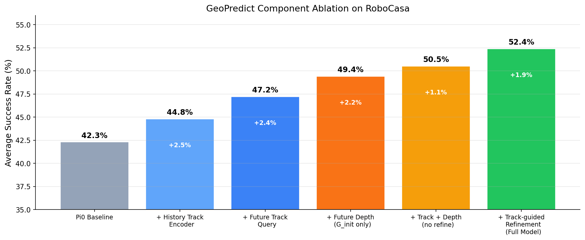

#### 7.4.2 各组件贡献的深入分析

**History Track Encoder (+2.5%: 42.3% $\to$ 44.8%)**

历史关键点编码器将过去的机器人关节轨迹编码为 token, 注入到 LLM 的 prefix 上下文中. 这为策略提供了 **运动惯性先验** -- 模型不仅看到当前帧, 还能理解机器人 "从哪里来", 包括运动方向、速度和加速度的隐式信息. 2.5% 的提升表明, 即使是简单的历史运动上下文, 也能帮助策略做出更连贯的动作决策.

**Future Track Query (+2.4%: 44.8% $\to$ 47.2%)**

未来轨迹预测模块在历史编码的基础上, 要求模型显式预测未来 50 步的 8 个关节 3D 位置. 这迫使模型学习 **前瞻性的运动规划** 能力, 而非仅仅根据当前观测做出反应式的决策. 2.4% 的持续提升验证了这种显式运动预测作为辅助任务的有效性.

**Depth Supervision with $\mathbf{G}^{init}$ (+7.1%: 42.3% $\to$ 49.4%)**

仅使用初始 Gaussian ($N_G = 4$) 的深度渲染监督直接从 $\pi_0$ baseline 提升 7.1%, 这是单一组件中 **贡献最大** 的. 这表明 3D 几何理解是策略性能的关键瓶颈, 而 3DGS 深度监督是弥补这一瓶颈的高效手段.

**Joint Training without Refinement (+1.1%: 49.4% $\to$ 50.5%)**

当 Track 和 Depth 模块联合训练但不使用 track-guided refinement 时, 相比仅有 Depth 的配置提升 1.1%. 这表明运动学和几何模块之间存在一定的互补效应, 但未经显式连接时, 互补效益有限.

**Track-Guided Refinement (+1.9%: 50.5% $\to$ 52.4%)**

完整模型相比无 refinement 版本提升 1.9%, 验证了核心假设: **利用运动学预测来引导几何表示的分配, 比两者独立运作更有效**. Refinement 机制将额外的 Gaussian 原语集中分配到预测的未来关节轨迹附近, 在交互区域提供更精细的几何表示, 从而为动作策略提供更准确的几何条件.

#### 7.4.3 深度渲染消融 (论文 Table 4)

这组消融实验探究了 3DGS 模块的不同配置对性能和训练效率的影响 (数据来源: 论文 Table 4):

| $N_G$ | $N_G'$ | Color | Time/Epoch (h) | Avg SR |
|:---:|:---:|:---:|:---:|:---:|
| 4 | -- | Yes | 12.3 | 49.2% |
| 4 | -- | No | 12.0 | 49.4% |
| 8 | -- | No | 19.1 | 51.4% |
| 4 | 8 | No | 15.5 | 51.1% |
| 4 | 64 | No | 15.7 | **52.4%** |

**关键发现**:

1. **Color vs Depth-only**: 加入颜色重建 (49.2%) 反而略低于仅深度 (49.4%), 且训练时间更长 (12.3 vs 12.0 h/epoch). 这证实了 **几何信息 (深度) 才是关键**, RGB 颜色信息对策略学习没有额外贡献.

2. **全局增密 vs Track-Guided**: 将全局 $N_G$ 从 4 增加到 8, 成功率提升至 51.4% 但训练时间猛增到 19.1 h/epoch (+59%). 而 track-guided refinement ($N_G=4, N_G'=8$) 达到 51.1% 的接近性能, 训练时间仅 15.5 h/epoch. 这就是 track-guided refinement 的核心价值: **将计算资源精准分配到任务关键区域**, 避免在远离交互的空白区域浪费 Gaussian 原语.

3. **Refinement 密度的 scaling 特性**: 由于 refinement 仅作用于关节轨迹附近的少数体素 (工作空间体积的一小部分), $N_G'$ 从 8 增加到 64 ($\times 8$) 几乎不增加训练时间 (15.5 $\to$ 15.7 h/epoch), 但性能从 51.1% 跃升到 52.4% (+1.3%). 这体现了 track-guided refinement 的出色 **计算效率**: 在交互关键区域的局部增密可以以极低的额外开销获得显著的性能提升.

最终采用 $N_G = 4, N_G' = 64$ 作为默认配置, 在性能和效率之间取得了最优平衡.

### 7.5 定性分析

论文的 Figure 6 提供了预测性 3DGS 几何模块的定性可视化, 比较了不同时间步 ($t+1, t+10, t+20$) 下的预测深度图.

#### 7.5.1 深度渲染可视化

- **初始 Gaussian ($\mathbf{G}^{init}$)**: 仅使用全局初始化的 $N_G = 4$ 个 Gaussian 原语, 渲染的深度图仅能捕获粗略的场景布局, 物体边界模糊, 机械臂区域的几何细节严重不足.

- **精修 Gaussian ($\mathbf{G}^{total}$)**: 经过 track-guided refinement 后, 在机械臂和交互物体附近增加了 $N_G' = 64$ 个精修 Gaussian 原语, 渲染的深度图呈现出显著更清晰的几何细节, 特别是:
  - 机械臂的关节结构更加分明
  - 末端执行器与物体的接触区域更加精确
  - 随着时间步推进 ($t+1 \to t+10 \to t+20$), 深度图能准确反映机械臂运动后的几何变化

这一定性对比视觉上证实了 track-guided refinement 机制产生了 **更精确、更几何忠实** 的未来预测, 进而为动作策略提供了更优质的几何条件先验.

#### 7.5.2 失败案例分析

虽然论文未详细讨论失败案例, 但从 RoboCasa 结果中可以推测主要的失败模式:

1. **极低成功率任务**: TurnOffStove (TFS, 13.2%) 和 PnPCounterToStove (CTC2, 8.8%) 的成功率仍然较低, 表明某些需要极精确操作的任务仍然具有挑战性
2. **长距离搬运**: 部分 Pick-and-Place 任务的成功率仍在 20-30% 左右, 可能受限于长距离运动规划的累积误差
3. **Fine-grained 操控**: 涉及小型物体或需要精细力控的任务 (如按钮、旋钮的精确角度) 仍有提升空间

---

## 8. 优势、局限与展望

### 8.1 核心优势

1. **训练时监督, 推理零开销 (Training-Only Supervision Paradigm)**

   GeoPredict 最核心的设计理念是: 运动学预测 (TrackEncoder + Future Track Query) 和 3DGS 几何模块仅在训练时参与, 推理时完全不使用. 这意味着推理时的计算开销与 $\pi_0$ baseline 完全相同, 但模型已经通过训练时的多任务监督学到了更好的内部表示. 这种 "免费午餐" 式的设计在实际部署中具有重要意义.

2. **显式的 3D 几何推理能力**

   通过可微的 3D Gaussian Splatting 渲染-比较循环, 模型被迫在 Transformer 内部建立显式的 3D 空间理解. 与仅依赖 2D 图像特征的方法不同, 3DGS 监督要求模型理解深度、遮挡和 3D 物体形状, 这在真实世界实验中表现为 +25%~55% 的显著提升.

3. **轨迹级预测 (Trajectory-Level Prediction)**

   不同于逐帧反应式策略, GeoPredict 显式预测未来 50 步的关节轨迹, 使模型具备前瞻性规划能力. 这对长程任务 (LIBERO-Long: +6.4%) 和需要连贯运动的任务特别有效.

4. **Track-Guided Refinement 的计算效率**

   将几何计算资源集中分配到运动轨迹附近的交互关键区域, 而非均匀分配到整个工作空间. 消融实验证明, 这种策略在仅增加 $\sim$30% 训练时间的情况下, 提供了与全局增密 (增加 $\sim$60% 训练时间) 相当甚至更好的性能.

5. **模块化的清晰代码结构**

   代码库中各组件 (SigLIP, Gemma, TrackEncoder, VoxelDecoder, GaussianRenderer) 职责分明, 松耦合设计使得单独替换或改进某一模块成为可能.

### 8.2 当前局限

1. **单臂操作局限**

   当前系统仅支持单臂机器人操作 (7 个关节 + 1 个夹爪), 关键点数量固定为 $K = 8$. 双臂或多臂协作场景需要重新设计关键点表示和轨迹预测模块.

2. **固定工作空间假设**

   工作空间被硬编码为 $1.6\text{m} \times 1.6\text{m} \times 1.0\text{m}$ (见 `geopredict.py` 中的 `point_range = [0.0, 0.0, 0.0, 1.6, 1.6, 1.0]`), 体素分辨率固定为 $40 \times 40 \times 25$. 更大、更不规则或动态变化的工作空间需要自适应的体素分配策略.

3. **依赖 3D 关键点标注**

   训练需要每一帧的 8 个机器人关节 3D 位置, 这在仿真环境中可以通过正运动学轻松获取 (见 `test_robocasa.py` 第 180-194 行的 `get_keypoints` 函数), 但在真实世界中通常需要额外的运动学模型或外部跟踪系统.

4. **训练计算成本**

   40,000 步训练在 8 块 NVIDIA H20 GPU 上需要较长时间 (约 12-16 小时/epoch, 取决于 3DGS 配置). 3DGS 渲染部分是主要的训练时间瓶颈, 因为 Gaussian Splatting 的渲染目前是逐样本串行执行 (见 `compute_loss` 中的 `for i in range(B)` 循环, 第 351 行和第 432 行).

5. **深度监督依赖模拟器数据**

   3DGS 深度渲染损失需要每一帧的 ground truth 深度图, 这在仿真环境中可以直接获取, 但在真实世界中需要深度相机 (如 RealSense, ZED). 虽然论文的结论部分指出 "the increasing availability of calibrated depth in modern datasets and commodity hardware mitigates these concerns", 但 GT 深度的质量和可用性仍然是 scale up 到更多真实场景的障碍.

6. **串行 Gaussian 渲染**

   `compute_loss()` 中的 Gaussian 渲染是逐样本 (batch 内逐个) 和逐时间步执行的 (见第 432-433 行: `for i in range(B): for t in range(self.action_horizon):`), 总计 $B \times H = 4 \times 50 = 200$ 次渲染调用. 虽然每次渲染本身是 GPU 加速的, 但循环结构限制了 GPU 并行度.

7. **固定相机配置**

   系统假设 3 个固定相机 (左环境相机、右环境相机、手腕相机), 其中深度监督仅应用于前两个环境相机. 相机数量和配置的变化需要修改数据处理和渲染管线.

### 8.3 未来方向

1. **多臂 / 双手协作操作**

   扩展关键点表示以支持双臂系统 (如 $K = 16$ 个关键点), 并设计关节间的交互注意力机制, 以处理双手协调任务 (如折叠、拧瓶盖等).

2. **动态工作空间自适应**

   引入自适应体素分辨率, 如使用 octree 结构替代固定网格, 或根据场景复杂度动态调整体素大小, 以处理不同尺度和形状的工作空间.

3. **自监督深度估计**

   用预训练的单目深度估计模型 (如 Depth Anything V2) 替代 GT 深度, 减少对模拟器深度数据或深度相机的依赖, 使方法更容易迁移到真实世界.

4. **真实世界部署优化**

   - 推理加速: 减少去噪步数 (如从 10 步到 4-5 步) 或采用蒸馏方法
   - 实时控制: 优化 prefix encoding 的延迟, 探索流式处理
   - 轻量化: 使用更小的 backbone 或 LoRA 微调替代全参数微调

5. **集成更大的 VLM**

   当前使用 Gemma 2B 作为语言模型 backbone. 集成更大的 VLM (如 Gemma 7B/13B 或其他大模型) 可能带来更强的语言理解和推理能力, 特别是对复杂、多步骤的自然语言指令.

6. **在线学习与适应**

   在部署后通过少量试错经验进行在线微调, 快速适应新的物体、场景或任务, 无需重新收集大规模数据和离线训练.

7. **批量化 Gaussian 渲染**

   优化 `compute_loss()` 中的渲染循环, 通过批量化 Gaussian Splatting 渲染 (如 batched rasterization) 减少串行瓶颈, 显著降低训练时间.

8. **更丰富的几何表示**

   探索在 3DGS 之外或之上引入其他 3D 表示 (如 Neural Radiance Fields, NeRF 或 occupancy networks), 或将法线估计、接触力预测等纳入几何监督, 进一步丰富模型的物理理解.

---

## 9. 参考文献

以下列出本报告分析过程中引用的主要文献:

### 核心论文

1. **GeoPredict** -- Qian, J., et al. "GeoPredict: Leveraging Predictive Kinematics and 3D Gaussian Geometry for Precise VLA Manipulation." *CVPR 2026 Highlight*. arXiv:2512.16811. [论文链接](https://arxiv.org/abs/2512.16811) | [项目主页](https://jingjingqian75.github.io/GeoPredict-Page/) | [GitHub](https://github.com/jingjingqian75/GeoPredict)

### VLA 与机器人学习

2. **Pi0** ($\pi_0$) -- Black, K., et al. "$\pi_0$: A Vision-Language-Action Flow Model for General Robot Control." *arXiv preprint*, 2024. (GeoPredict 的 backbone 基线)
3. **OpenVLA** -- Kim, M.J., et al. "OpenVLA: An Open-Source Vision-Language-Action Model." *arXiv preprint*, 2025.
4. **OpenVLA-OFT** -- Kim, M.J., et al. "Fine-Tuning Vision-Language-Action Models: Optimizing Speed and Success." *arXiv preprint*, 2025.
5. **UniVLA** -- Bu, Z., et al. "UniVLA: Unified Vision-Language-Action Model." *arXiv preprint*, 2025.
6. **SpatialVLA** -- Qu, Y., et al. "SpatialVLA: Exploring Spatial Representations for Visual-Language-Action Model." *arXiv preprint*, 2025.
7. **4D-VLA** -- Zhang, L., et al. "4D-VLA: 4D Visual-Language-Action Generation." *arXiv preprint*, 2025.
8. **DreamVLA** -- Zhang, Y., et al. "DreamVLA: Expanding the Boundaries of Vision-Language-Action Models." *arXiv preprint*, 2025.
9. **WorldVLA** -- Cen, J., et al. "WorldVLA: World-Grounded Vision-Language-Action Models." *arXiv preprint*, 2025.
10. **TraceVLA** -- Zheng, W., et al. "TraceVLA: Visual Trace Prompting Enhances Spatial-Temporal Awareness for Generalist Robotic Policies." *arXiv preprint*, 2024.
11. **RT-1** -- Brohan, A., et al. "RT-1: Robotics Transformer for Real-World Control at Scale." *RSS*, 2023.
12. **RT-2** -- Brohan, A., et al. "RT-2: Vision-Language-Action Models Transfer Web Knowledge to Robotic Control." *CoRL*, 2023.
13. **Octo** -- Team, O., et al. "Octo: An Open-Source Generalist Robot Policy." *arXiv preprint*, 2024.
14. **Diffusion Policy** -- Chi, C., et al. "Diffusion Policy: Visuomotor Policy Learning via Action Diffusion." *RSS*, 2023/IJRR, 2025.

### 世界模型与未来预测

15. **GWM** -- Lu, Y., et al. "GWM: Grounded World Models for Robotic Manipulation." *arXiv preprint*, 2025. (RoboCasa 基准上的世界模型基线)

### 3D 视觉与渲染

16. **3D Gaussian Splatting** -- Kerbl, B., et al. "3D Gaussian Splatting for Real-Time Radiance Field Rendering." *ACM Transactions on Graphics (SIGGRAPH)*, 2023. (GeoPredict 3DGS 模块的基础)
17. **diff-gaussian-rasterization** -- 可微 Gaussian 光栅化库, 用于 GeoPredict 的深度渲染.

### Flow Matching 与扩散模型

18. **Flow Matching** -- Lipman, Y., et al. "Flow Matching for Generative Modeling." *ICLR*, 2023. (GeoPredict 动作生成的理论基础)

### 基础模型

19. **PaliGemma** -- Google. "PaliGemma: A Versatile 3B VLM for Transfer." *arXiv preprint*, 2024. (Tokenizer 和部分架构参考)
20. **Gemma** -- Google. "Gemma: Open Models Based on Gemini Research and Technology." *arXiv preprint*, 2024. (LLM backbone)
21. **SigLIP** -- Zhai, X., et al. "Sigmoid Loss for Language Image Pre-Training." *ICCV*, 2023. (视觉编码器)

### 评估基准

22. **RoboCasa** -- Nasiriany, S., et al. "RoboCasa: Large-Scale Simulation of Everyday Tasks for Generalist Robots." *arXiv preprint*, 2024.
23. **LIBERO** -- Liu, B., et al. "LIBERO: Benchmarking Knowledge Transfer for Lifelong Robot Learning." *NeurIPS*, 2023.
24. **RoboSuite** -- Zhu, Y., et al. "robosuite: A Modular Simulation Framework and Benchmark for Robot Learning." *arXiv preprint*, 2020.

### 训练基础设施

25. **DeepSpeed** -- Rajbhandari, S., et al. "ZeRO: Memory Optimizations Toward Training Trillion Parameter Models." *SC*, 2020.
26. **AdamW** -- Loshchilov, I. and Hutter, F. "Decoupled Weight Decay Regularization." *ICLR*, 2019.

### 代码库与项目

27. GeoPredict 代码库: [https://github.com/jingjingqian75/GeoPredict](https://github.com/jingjingqian75/GeoPredict)
28. GeoPredict 项目主页: [https://jingjingqian75.github.io/GeoPredict-Page/](https://jingjingqian75.github.io/GeoPredict-Page/)
29. 论文 arXiv 链接: [https://arxiv.org/abs/2512.16811](https://arxiv.org/abs/2512.16811)
30. 论文 HTML 版本: [https://arxiv.org/html/2512.16811v2](https://arxiv.org/html/2512.16811v2)

---

## 10. 模型网络结构与 Forward/Backward 深度解析

本章基于 GeoPredict 代码库的实际实现,对模型的网络结构、训练 Forward Pass、推理 Forward Pass 及 Backward Pass 的梯度流进行深入剖析。所有代码引用均标注文件路径和行号,所有维度分析均基于实际代码中的常量定义。

---

### 10.1 模块总览与静态架构

#### 10.1.1 GeoPredict 类的 `nn.Module` 属性全表

`GeoPredict.__init__`（`models/geopredict.py:97-139`）中定义了所有子模块。下表完整列出每个属性及其类型、配置和来源：

| 属性名 | 类型 | 维度/配置 | 代码位置 | 来源 |
|--------|------|-----------|----------|------|
| `self.llm` | `Gemma` | dual-expert: 2B(width=2048) + 300M(width=1024), depth=18 | `geopredict.py:106` | 预训练加载（Pi0 base） |
| `self.img` | `SigLIP` | ViT: patch_size=14, width=1152, depth=27, num_heads=16, 输出 dim=2048 | `geopredict.py:107` | 预训练加载 |
| `self.state_proj` | `nn.Linear` | $32 \to 1024$ | `geopredict.py:108` | 预训练加载 |
| `self.action_in_proj` | `nn.Linear` | $32 \to 1024$ | `geopredict.py:109` | 预训练加载 |
| `self.action_time_mlp_in` | `nn.Linear` | $2048 \to 1024$ (concat action+time) | `geopredict.py:110` | 预训练加载 |
| `self.action_time_mlp_out` | `nn.Linear` | $1024 \to 1024$ | `geopredict.py:111` | 预训练加载 |
| `self.action_out_proj` | `nn.Linear` | $1024 \to 32$ | `geopredict.py:112` | 预训练加载 |
| `self.keypoint_encoder` | `TrackEncoder` | input_dim=3, output_dim=2048, patch_size=4, embed_dim=256, query_dim=512 | `geopredict.py:118` | 随机初始化 |
| `self.keypoint_embedding` | `nn.Embedding` | $8 \times 2048$ (8 joints) | `geopredict.py:119` | 随机初始化 |
| `self.keypoint_out_proj` | `nn.Linear` | $2048 \to 3$ (输出 3D 坐标) | `geopredict.py:120` | 随机初始化 |
| `self.spatial_embedding` | `nn.Embedding` | $320 \times 2048$ ($8 \times 8 \times 5 = 320$ voxels) | `geopredict.py:124` | 随机初始化 |
| `self.gs_decoder` | `VoxelDecoder` | input=2048, hidden=512, 输出 $56 \times 40 \times 40 \times 25$ | `geopredict.py:133` | 随机初始化 |
| `self.renderer` | `GaussianRenderer` | resolution=[224,224], znear=0.01, zfar=10.0 | `geopredict.py:134` | **非 `nn.Module`**, 无可学习参数 |
| `self.refine_gs_mlp` | `nn.Sequential` | $128 \to 256 \to 512 \to 896$ (即 $64 \times 14$) | `geopredict.py:135-138` | 随机初始化 |

**非 `nn.Module` 属性：**

| 属性名 | 类型 | 说明 | 代码位置 |
|--------|------|------|----------|
| `self.future_pos` | `Tensor` | $50 \times 2048$, 1D sincos 位置编码 (base=100)，用于时间步嵌入 | `geopredict.py:114` |
| `self.spatial_pos` | `Tensor` | $320 \times 2048$, 3D sincos 位置编码，为每个 voxel 编码空间位置 | `geopredict.py:125` |
| `self.offset_act` | `lambda` | $\tanh(x) \times 0.04$, Gaussian offset 激活 | `geopredict.py:128` |
| `self.opt_act` | `torch.sigmoid` | opacity 激活 | `geopredict.py:129` |
| `self.scale_act` | `lambda` | $\text{softplus}(x, \beta=20)$, scale 激活 | `geopredict.py:130` |
| `self.rot_act` | `lambda` | $\text{normalize}(x, \dim=-1)$, rotation 归一化 | `geopredict.py:131` |
| `self.rgb_act` | `torch.sigmoid` | RGB 激活 | `geopredict.py:132` |

#### 10.1.2 参数冻结策略

GeoPredict 的训练策略简洁而关键——**所有参数均为可训练状态**。代码中没有任何 `requires_grad=False` 的设置。在 `utils/optimizer.py:5-17` 中，优化器直接使用 `model.parameters()` 收集所有参数：

```python
# utils/optimizer.py:7-13
optimizer = optim.AdamW(
    model.parameters(),  # 所有参数参与优化
    lr=args.base_lr,
    betas=(args.beta1, args.beta2),
    eps=args.eps,
    weight_decay=args.weight_decay,
)
```

预训练权重加载使用 `strict=False`，并通过白名单机制允许新增模块的 key 缺失（`tools/train_robocasa.py:72-83`）：

```python
# tools/train_robocasa.py:72-83
missing_keys, unexpected_keys = model.load_state_dict(
    torch.load(args.pretrain, map_location='cpu'), strict=False)
# ...
white_keyword = ['keypoint', 'spatial', 'gs_decoder', 'renderer', 'refine']
non_white_missing = [key for key in missing_keys 
                     if not any(keyword in key for keyword in white_keyword)]
```

这意味着：
- **从预训练加载的模块**（SigLIP, Gemma, state/action projections）：继承 Pi0 base 权重，但训练过程中继续更新
- **随机初始化的模块**（keypoint, spatial, gs_decoder, refine_gs_mlp）：在 GeoPredict fine-tuning 阶段从头学起
- `renderer` 虽然不含可学习参数，但其可微分 rasterization 过程允许梯度穿过

#### 10.1.3 静态架构图

```mermaid
graph TD
    subgraph "GeoPredict (nn.Module)"
        subgraph "预训练加载的模块 (from Pi0 base)"
            IMG["SigLIP<br/>ViT-L/14, 27 layers<br/>width=1152 → 2048"]
            LLM["Gemma (Dual-Expert)<br/>Expert 0: 2B (width=2048)<br/>Expert 1: 300M (width=1024)<br/>18 layers, shared attention"]
            SP["state_proj<br/>Linear(32→1024)"]
            AIP["action_in_proj<br/>Linear(32→1024)"]
            ATMLP_IN["action_time_mlp_in<br/>Linear(2048→1024)"]
            ATMLP_OUT["action_time_mlp_out<br/>Linear(1024→1024)"]
            AOP["action_out_proj<br/>Linear(1024→32)"]
        end

        subgraph "随机初始化的模块 (GeoPredict 新增)"
            KE["keypoint_encoder<br/>(TrackEncoder)<br/>3→256→512→2048"]
            KEmb["keypoint_embedding<br/>Embedding(8, 2048)"]
            KOP["keypoint_out_proj<br/>Linear(2048→3)"]
            SEmb["spatial_embedding<br/>Embedding(320, 2048)"]
            GSD["gs_decoder<br/>(VoxelDecoder)<br/>2048→512→128→56"]
            RMLP["refine_gs_mlp<br/>128→256→512→896"]
        end

        subgraph "非参数化组件"
            RND["renderer<br/>(GaussianRenderer)<br/>diff_gaussian_rasterization<br/>可微分但无可学习参数"]
            FPOS["future_pos<br/>50×2048 sincos PE"]
            SPOS["spatial_pos<br/>320×2048 3D sincos PE"]
        end
    end

    %% Data flow dimensions
    IMG -->|"[B,256,2048] per cam<br/>3 cams = [B,768,2048]"| LLM
    KE -->|"[B,8,2048]"| LLM
    KEmb -->|"[B,8,2048]"| LLM
    SEmb -->|"+ spatial_pos<br/>[B,320,2048]"| LLM
    SP -->|"[B,1,1024]"| LLM
    AIP -->|"[B,50,1024]"| ATMLP_IN
    ATMLP_IN -->|SiLU| ATMLP_OUT
    ATMLP_OUT -->|"[B,50,1024]"| LLM

    LLM -->|"prefix_out<br/>[B,1152,2048]"| KOP
    LLM -->|"suffix_out<br/>[B,51,1024]"| AOP
    LLM -->|"spatial tokens<br/>[B,320,2048]"| GSD
    GSD -->|"gaussians + features"| RND
    RMLP -->|"refined gaussians"| RND
    KOP -->|"pred_kpt [B,8,3]"| RMLP
    RND -->|"depth [B,2,1,224,224]"| LOSS["Losses"]
    AOP -->|"v_t [B,50,32]"| LOSS
    KOP -->|"pred_kpt [B,8,3]"| LOSS
```

---

### 10.2 Token 序列构建详解

GeoPredict 的核心设计在于将多模态信息统一为 token 序列，通过精心设计的注意力掩码控制信息流动方向。Token 序列分为 **prefix**（视觉-语言-几何信息，Expert 0 处理）和 **suffix**（状态-动作信息，Expert 1 处理）两部分。

#### 10.2.1 Prefix 构建：`embed_prefix()`

`embed_prefix()` 方法（`geopredict.py:141-191`）按顺序拼接 5 组 token：

**第 1 组：Image Tokens**（`geopredict.py:147-155`）

```python
# geopredict.py:147-155
for name in obs["images"]:
    image_tokens = self.img(obs["images"][name])  # [B, 256, 2048]
    tokens.append(image_tokens)
    input_mask.append(
        obs["image_masks"][name].unsqueeze(1).expand(-1, image_tokens.shape[1])
    )
    ar_mask += [False] * image_tokens.shape[1]  # 组内双向注意力
```

SigLIP 将每张 $224 \times 224$ 图像切分为 $(224/14)^2 = 256$ 个 patch，编码为 2048 维 token。3 个摄像头（left, right, wrist）共产生 $3 \times 256 = 768$ 个 token。`ar_mask` 全为 `False`，表示这些 token 属于同一因果组，组内双向注意力。

**第 2 组：Language Tokens**（`geopredict.py:158-163`）

```python
# geopredict.py:158-163
tokenized_inputs = self.llm.embed(obs["tokenized_prompt"])  # [B, 48, 2048]
tokens.append(tokenized_inputs)
input_mask.append(obs["tokenized_prompt_mask"])
ar_mask += [False] * tokenized_inputs.shape[1]  # 与 image 同组
```

通过 Gemma Embedder（`gemma.py:54-64`）将 tokenized text 映射为 2048 维，并乘以 $\sqrt{2048}$ 进行缩放。`max_token_len=48`，`ar_mask` 全为 `False`，与 image tokens 同属 Group 0，两组间可互相注意。

**第 3 组：History Keypoint Tokens**（`geopredict.py:165-172`）

```python
# geopredict.py:169-172
his_keypoint_token = self.keypoint_encoder(obs["his_kpts"], obs["his_len"])  # [B, 8, 2048]
tokens.append(his_keypoint_token)
ar_mask += [True] + ([False] * (his_keypoint_token.shape[1] - 1))
```

TrackEncoder 将 8 个关节的历史 3D 轨迹编码为 8 个 2048 维 token。`ar_mask` 首元素为 `True`，表示**开启新的因果组**（Group 1），组内余下 7 个 token 为 `False`（同组双向注意）。

**第 4 组：Keypoint Query Tokens**（`geopredict.py:174-178`）

```python
# geopredict.py:175-178
joint_token = self.keypoint_embedding.weight.unsqueeze(0).repeat(current_batch_size, 1, 1)
tokens.append(joint_token)
ar_mask += [True] + ([False] * (joint_token.shape[1] - 1))
```

8 个可学习的 keypoint query embedding（`nn.Embedding(8, 2048)`），`ar_mask` 首元素为 `True`，开启 Group 2。

**第 5 组：Spatial Query Tokens**（`geopredict.py:180-183`）

```python
# geopredict.py:180-183
spatial_token = (self.spatial_embedding.weight + self.spatial_pos.to(device))
               .unsqueeze(0).repeat(current_batch_size, 1, 1)
tokens.append(spatial_token)
ar_mask += [False] * spatial_token.shape[1]  # 与 keypoint query 同组！
```

320 个空间 query token（$8 \times 8 \times 5$ voxel grid）由可学习 embedding 加上 3D sincos 位置编码构成。关键细节：`ar_mask` 全为 `False`，意味着 spatial query tokens **与前一组 keypoint query tokens 同属 Group 2**，两者间可双向注意。

最终 prefix 总长度为：$768 + 48 + 8 + 8 + 320 = 1152$ 个 token，维度 2048。

#### 10.2.2 Suffix 构建：`embed_suffix()`

`embed_suffix()` 方法（`geopredict.py:193-223`）构建 action expert 的输入：

**State Token**（`geopredict.py:199-203`）

```python
# geopredict.py:199-203
state_token = self.state_proj(obs["state"])[:, None, :]  # [B, 1, 1024]
ar_mask += [True]  # 开启 Group 3
```

维度为 1024（Expert 1 的 width），`ar_mask=[True]` 开启 Group 3。

**Action Tokens**（`geopredict.py:206-217`）

```python
# geopredict.py:206-213
time_emb = posemb_sincos(timestep, 1024, min_period=4e-3, max_period=4.0)  # [B, 1024]
action_tokens = self.action_in_proj(noisy_actions)  # [B, 50, 1024]
time_tokens = time_emb.unsqueeze(1).repeat(1, 50, 1)  # [B, 50, 1024]
action_time_tokens = torch.cat([action_tokens, time_tokens], dim=-1)  # [B, 50, 2048]
action_time_tokens = self.action_time_mlp_in(action_time_tokens)  # [B, 50, 1024]
action_time_tokens = torch.nn.functional.silu(action_time_tokens)
action_time_tokens = self.action_time_mlp_out(action_time_tokens)  # [B, 50, 1024]
# ...
ar_mask += [True] + ([False] * (self.action_horizon - 1))  # 开启 Group 4
```

Flow matching 的 noisy action 与 timestep 通过 MLP 融合为 50 个 1024 维 token。`ar_mask=[True, False*49]` 开启 Group 4。

Suffix 总长度：$1 + 50 = 51$ 个 token，维度 1024。

#### 10.2.3 Token 序列全局布局

训练时，prefix 与 suffix 拼接为总长 $1152 + 51 = 1203$ 的 token 序列：

```
┌─────────────────────────────────────────────────────────────────────────────┐
│                           Prefix (Expert 0, dim=2048)                      │
│  ┌──────────────────┬──────────┬──────────┬──────────┬───────────────────┐  │
│  │  Image tokens    │ Language │ History  │ Keypoint │  Spatial queries  │  │
│  │  768 tokens      │ 48 tok   │ 8 tok    │ 8 tok    │  320 tokens       │  │
│  │  [F]*768         │ [F]*48   │ T,[F]*7  │ T,[F]*7  │  [F]*320          │  │
│  │    Group 0       │ Group 0  │ Group 1  │    Group 2 (共 328 tok)      │  │
│  └──────────────────┴──────────┴──────────┴──────────┴───────────────────┘  │
├─────────────────────────────────────────────────────────────────────────────┤
│                           Suffix (Expert 1, dim=1024)                      │
│  ┌──────────┬─────────────────────────────────────────────────────────────┐ │
│  │  State   │              Action tokens                                 │ │
│  │  1 token │              50 tokens                                     │ │
│  │   [T]    │              T, [F]*49                                     │ │
│  │ Group 3  │              Group 4                                       │ │
│  └──────────┴─────────────────────────────────────────────────────────────┘ │
└─────────────────────────────────────────────────────────────────────────────┘
```

其中 `T` = `True`（新因果组的起始标记），`F` = `False`（同组内的后续 token）。

#### 10.2.4 `make_attn_mask()` 的 cumsum 机制

注意力掩码的构建是 GeoPredict 块状因果注意力的核心（`geopredict.py:21-28`）：

```python
# geopredict.py:21-28
def make_attn_mask(input_mask, mask_ar):
    mask_ar = mask_ar.unsqueeze(0).expand(input_mask.shape[0], -1)  # [B, N]
    cumsum = torch.cumsum(mask_ar, dim=1)  # [B, N]
    attn_mask = cumsum.unsqueeze(1) <= cumsum.unsqueeze(2)  # [B, 1, N] <= [B, N, 1]
    valid_mask = input_mask.unsqueeze(1) * input_mask.unsqueeze(2)
    return torch.logical_and(attn_mask, valid_mask)
```

其原理如下：

1. 对 `ar_mask` 做 cumulative sum，为每个 token 分配一个**组 ID**。`True` 使 cumsum 递增，从而开启新组；`False` 保持当前组 ID
2. 对于位置 $i$ 和 $j$，当且仅当 $\text{cumsum}[i] \geq \text{cumsum}[j]$ 时，token $i$ 可以 attend 到 token $j$
3. 效果：同组内 token 双向可见（cumsum 相等），高编号组可以看到所有低编号组的 token（cumsum 递增），低编号组无法看到高编号组

对于本文的 5 个因果组：

$$
\text{cumsum 值}: \underbrace{0, 0, \ldots, 0}_{816 \text{ (Group 0)}}, \underbrace{1, 1, \ldots, 1}_{8 \text{ (Group 1)}}, \underbrace{2, 2, \ldots, 2}_{328 \text{ (Group 2)}}, \underbrace{3}_{1 \text{ (Group 3)}}, \underbrace{4, 4, \ldots, 4}_{50 \text{ (Group 4)}}
$$

**5×5 组间注意力权限矩阵**（行 = query, 列 = key, 1 = 可注意）：

| Query\Key | Group 0 (Img+Lang) | Group 1 (History) | Group 2 (KptQ+Spatial) | Group 3 (State) | Group 4 (Action) |
|-----------|:-:|:-:|:-:|:-:|:-:|
| **Group 0** (816 tok) | 1 | 0 | 0 | 0 | 0 |
| **Group 1** (8 tok)   | 1 | 1 | 0 | 0 | 0 |
| **Group 2** (328 tok) | 1 | 1 | 1 | 0 | 0 |
| **Group 3** (1 tok)   | 1 | 1 | 1 | 1 | 0 |
| **Group 4** (50 tok)  | 1 | 1 | 1 | 1 | 1 |

关键推论：
- Image 和 Language token 只能互相看（Group 0 内双向）
- History keypoint token 可以看 image/language（获取视觉语言上下文）
- Keypoint query 和 spatial query 可以看所有前序组（image, language, history），且两者互相可见
- Action tokens 可以看**所有** prefix token（这是 VLM 信息流向动作生成的**唯一通道**）
- **没有任何 prefix token 能看到 suffix token**（信息单向流动）

---

### 10.3 VLM 与 Action Expert 的交互——双专家 Gemma 架构

这是 GeoPredict 最核心的架构设计。Gemma backbone 采用双专家（dual-expert）架构，两个专家共享注意力计算但使用各自独立的投影层和 FFN。这种设计使得大容量的 VLM 表征能够通过 shared attention 流入轻量级的 action expert。

#### 10.3.1 双专家配置

```python
# gemma.py:21-37
gemma_2b_config = Config(width=2048, depth=18, mlp_dim=16384,
                         num_heads=8, num_kv_heads=1, head_dim=256)  # Expert 0 (Prefix)
gemma_300m_config = Config(width=1024, depth=18, mlp_dim=4096,
                           num_heads=8, num_kv_heads=1, head_dim=256)  # Expert 1 (Suffix)
```

关键约束：两个专家**必须共享** `head_dim=256`、`num_heads=8`、`num_kv_heads=1`，这是 shared attention 的前提（`gemma.py:94-96`）。

#### 10.3.2 GemmaBlock 的完整数据流

每个 `Block`（`gemma.py:207-251`）处理两个专家的 token，流程如下：

```mermaid
flowchart TD
    subgraph "GemmaBlock (×18 layers)"
        direction TB
        
        subgraph "输入"
            X0["Expert 0 输入<br/>[B, 1152, 2048]"]
            X1["Expert 1 输入<br/>[B, 51, 1024]"]
        end
        
        subgraph "Step 1: Pre-Attention RMSNorm"
            N0["RMSNorm(2048)<br/>pre_attn_norms[0]"]
            N1["RMSNorm(1024)<br/>pre_attn_norms[1]"]
        end
        
        subgraph "Step 2: Shared Attention"
            direction TB
            Q0["Q_proj[0]: Linear(2048→2048, bias=False)<br/>→ reshape [B, 1152, 8, 256]"]
            K0["K_proj[0]: Linear(2048→256, bias=False)<br/>→ reshape [B, 1152, 1, 256]"]
            V0["V_proj[0]: Linear(2048→256, bias=False)<br/>→ reshape [B, 1152, 1, 256]"]
            
            Q1["Q_proj[1]: Linear(1024→2048, bias=False)<br/>→ reshape [B, 51, 8, 256]"]
            K1["K_proj[1]: Linear(1024→256, bias=False)<br/>→ reshape [B, 51, 1, 256]"]
            V1["V_proj[1]: Linear(1024→256, bias=False)<br/>→ reshape [B, 51, 1, 256]"]
            
            CAT_Q["Concat Q: [B, 1203, 8, 256]"]
            CAT_K["Concat K: [B, 1203, 1, 256]"]
            CAT_V["Concat V: [B, 1203, 1, 256]"]
            
            ROPE["Apply RoPE + Scale (×head_dim^-0.5)"]
            GQA["GQA: K,V expand 1→8 heads<br/>scores = Q·K^T, mask, softmax<br/>out = attn_weights · V<br/>[B, 1203, 8, 256]"]
            
            SPLIT["Split output by sequence length"]
            O0["out_proj[0]: Linear(2048→2048, bias=False)<br/>[B, 1152, 2048]"]
            O1["out_proj[1]: Linear(2048→1024, bias=False)<br/>[B, 51, 1024]"]
        end
        
        subgraph "Step 3: Residual"
            R0["Expert 0: x + attn_out"]
            R1["Expert 1: x + attn_out"]
        end
        
        subgraph "Step 4: Pre-FFN RMSNorm + Separate FFN"
            FN0["RMSNorm(2048) + FFN_0<br/>gate: Linear(2048→16384)<br/>up: Linear(2048→16384)<br/>down: Linear(16384→2048)<br/>GELU gating"]
            FN1["RMSNorm(1024) + FFN_1<br/>gate: Linear(1024→4096)<br/>up: Linear(1024→4096)<br/>down: Linear(4096→1024)<br/>GELU gating"]
        end
        
        subgraph "Step 5: Residual"
            RR0["Expert 0 输出<br/>[B, 1152, 2048]"]
            RR1["Expert 1 输出<br/>[B, 51, 1024]"]
        end
    end
    
    X0 --> N0 --> Q0 & K0 & V0
    X1 --> N1 --> Q1 & K1 & V1
    Q0 --> CAT_Q
    Q1 --> CAT_Q
    K0 --> CAT_K
    K1 --> CAT_K
    V0 --> CAT_V
    V1 --> CAT_V
    CAT_Q & CAT_K --> ROPE
    ROPE --> GQA
    CAT_V --> GQA
    GQA --> SPLIT
    SPLIT --> O0 & O1
    X0 --> R0
    O0 --> R0
    X1 --> R1
    O1 --> R1
    R0 --> FN0
    R1 --> FN1
    FN0 --> RR0
    FN1 --> RR1
    R0 --> RR0
    R1 --> RR1
```

#### 10.3.3 Shared Attention 的核心代码

Shared Attention 的实现位于 `gemma.py:114-191`，其关键在于以下步骤：

**Step 1：各专家独立投影 Q/K/V**（`gemma.py:117-134`）

```python
# gemma.py:117-131
for i, x in enumerate(xs):
    if x is None: continue
    q = self.q_projections[i](x)  # Expert 0: [B,1152,2048], Expert 1: [B,51,2048]
    k = self.k_projections[i](x)  # Expert 0: [B,1152,256],  Expert 1: [B,51,256]
    v = self.v_projections[i](x)  # Expert 0: [B,1152,256],  Expert 1: [B,51,256]
    # Reshape for multi-head attention
    q = q.view(B, seq_len, 8, 256)   # num_heads=8, head_dim=256
    k = k.view(B, seq_len, 1, 256)   # num_kv_heads=1
    v = v.view(B, seq_len, 1, 256)
```

注意 Expert 1 的 Q 投影为 `Linear(1024→2048)`（`gemma.py:109`），将 1024 维 token 投影到与 Expert 0 相同的 $8 \times 256 = 2048$ 维 Q 空间。K/V 投影为 `Linear(1024→256)`，投影到 $1 \times 256$ 维空间。这确保了两个专家在**同一个注意力空间**中交互。

**Step 2：拼接并计算注意力**（`gemma.py:137-177`）

```python
# gemma.py:137-139
q = torch.cat(qs, dim=1)  # [B, 1152+51, 8, 256] = [B, 1203, 8, 256]
k = torch.cat(ks, dim=1)  # [B, 1203, 1, 256]
v = torch.cat(vs, dim=1)  # [B, 1203, 1, 256]
```

拼接后，RoPE 应用于整个序列的 Q 和 K（`gemma.py:142-144`），然后使用 Grouped Query Attention (GQA)：1 个 KV head 被扩展为 8 份，与 8 个 Q head 分别计算注意力。注意力掩码 `attn_mask`（由 `make_attn_mask()` 生成）控制每个 token 能看到哪些其他 token。

**Step 3：分割输出并各自投影**（`gemma.py:180-191`）

```python
# gemma.py:180-191
outputs = []
start = 0
for i, x in enumerate(xs):
    if x is not None:
        end = start + x.shape[1]
        expert_out = self.out_projections[i](out[:, start:end])
        outputs.append(expert_out)
        start = end
```

输出按序列长度切分回各专家，分别通过各自的 `out_proj` 投影回原始宽度（Expert 0: 2048, Expert 1: 1024）。

#### 10.3.4 核心洞察：信息流动机制

当 action tokens（suffix, Expert 1）计算注意力时，其 Q 向量会 attend 到**所有** prefix tokens 的 K/V（Expert 0）。这是 VLM 的视觉/语言理解流入动作生成的**唯一机制**。

用数学表达：对于第 $l$ 层的 action token 位置 $i$（属于 Group 4）：

$$
\text{Attn}(Q_i^{(1)}, K, V) = \text{softmax}\left(\frac{Q_i^{(1)} \cdot K_{[:]}^\top}{\sqrt{d_k}} \odot M_i\right) \cdot V_{[:]}
$$

其中 $Q_i^{(1)}$ 是 Expert 1 生成的 query，$K_{[:]}$ 和 $V_{[:]}$ 是拼接后的所有 token 的 key/value（包括 Expert 0 的 1152 个 prefix token 和 Expert 1 的 51 个 suffix token）。注意力掩码 $M_i$ 允许 Group 4 看到 Groups 0-4 的所有 token。

由于注意力掩码确保 prefix 无法看到 suffix（Group 0/1/2 的 cumsum 值小于 Group 3/4），suffix 对 prefix 的表征没有影响——信息严格单向流动。

#### 10.3.5 推理时的 KV Cache 机制

推理时，prefix 的 K/V 只需计算一次即可缓存（`gemma.py:147-150`）：

```python
# gemma.py:147-150
if kv_cache is not None:
    cache_k, cache_v = kv_cache
    k = torch.cat([cache_k, k], dim=1)  # 将缓存的 prefix K 与当前 suffix K 拼接
    v = torch.cat([cache_v, v], dim=1)
```

KV cache 的形状为 $(18, B, P, 1, 256)$，其中 18 为层数，$P$ 为 prefix 长度（1152）。每次去噪步骤中，suffix 的 K/V 重新计算并与缓存的 prefix K/V 拼接，从而避免重复计算 prefix 的 KV，实现了显著的推理加速。

KV cache 的具体存储和检索逻辑在 `Gemma.forward()`（`gemma.py:274-297`）中：

```python
# gemma.py:274-283
for i, layer in enumerate(self.layers):
    if kv_cache is not None:
        layer_kv_cache = (kv_cache[0][i], kv_cache[1][i])  # 取第 i 层的缓存
    else:
        layer_kv_cache = None
    embedded, new_layer_kv_cache = layer(embedded, layer_kv_cache, positions, mask)
    new_kv_cache.append(new_layer_kv_cache)

# gemma.py:292-297
stacked_k = torch.stack(all_k, dim=0)  # [18, B, seq_len, 1, 256]
stacked_v = torch.stack(all_v, dim=0)  # [18, B, seq_len, 1, 256]
return outputs, (stacked_k, stacked_v)
```

---

### 10.4 训练 Forward Pass 完整调用链

训练时的 forward pass 通过 `compute_loss()`（`geopredict.py:246-499`）执行，共分为 8 个阶段。

```mermaid
flowchart TD
    DATA["输入 data dict"] --> P1

    subgraph P1["Phase 1: 数据准备与 Flow Matching (L250-270)"]
        EXT["提取 targets:<br/>actions, kpt_t, future_kpts,<br/>depths_t, depths_future, cam_infos"]
        PRE["preprocess_observation:<br/>ColorJitter + normalize to [-1,1]"]
        FM["Flow Matching 采样:<br/>noise ~ N(0,I)<br/>time ~ Beta(1.5,1)×0.999+0.001<br/>x_t = t·noise + (1-t)·actions<br/>u_t = noise - actions"]
    end
    
    P1 --> P2
    subgraph P2["Phase 2: Token Embedding (L273-278)"]
        EP["embed_prefix(obs)<br/>→ prefix_tokens [B,1152,2048]<br/>→ prefix_mask, prefix_ar_mask"]
        ES["embed_suffix(obs, x_t, time)<br/>→ suffix_tokens [B,51,1024]<br/>→ suffix_mask, suffix_ar_mask"]
        MASK["make_attn_mask(concat masks)<br/>→ attn_mask [B,1203,1203]<br/>positions = cumsum(input_mask)-1"]
    end
    
    P2 --> P3
    subgraph P3["Phase 3: Gemma Forward (L281-282)"]
        LLM_FWD["self.llm([prefix, suffix],<br/>positions, mask)<br/>→ prefix_out [B,1152,2048]<br/>→ suffix_out [B,51,1024]"]
    end
    
    P3 --> P4 & P5 & P7
    subgraph P4["Phase 4: Action Loss (L285-288)"]
        VT["v_t = action_out_proj(suffix_out[:,-50:])<br/>[B,50,32]"]
        AL["action_loss = MSE(v_t, u_t)"]
    end
    
    subgraph P5["Phase 5: Current Keypoint Loss (L291-295)"]
        KT["keypoint_token = prefix_out[:,-328:-320]<br/>[B,8,2048]"]
        PK["pred_kpt = keypoint_out_proj(kpt_token)<br/>[B,8,3]"]
        KL["kpt_loss = MSE(pred_kpt, kpt_t)"]
    end
    
    P5 --> P6
    subgraph P6["Phase 6: Future Keypoint Loss (L298-312)"]
        FPE["pos_embeddings = future_pos[valid_pos]<br/>[B,50,1,2048]"]
        FKT["future_kpt_tokens = kpt_token +<br/>pos_embeddings × valid_mask"]
        FKP["future_kpt_pred = keypoint_out_proj(flat)<br/>[B×50,8,3]"]
        FKL["future_kpt_loss = MSE(pred, GT)"]
    end
    
    subgraph P7["Phase 7: Current Depth Loss (L315-413)"]
        ST["spatial_token = prefix_out[:,-320:]<br/>[B,320,2048]"]
        GSD2["gs_decoder(spatial_token)<br/>→ voxel_gs [B,56,40,40,25]<br/>→ voxel_features [B,128,40,40,25]"]
        PGV["process_gaussian_voxel<br/>→ 160k Gaussians [B,160000,14]"]
        REF["Track-guided refinement:<br/>pred_kpt → neighbor voxels<br/>→ refine_gs_mlp(features)<br/>→ 64 sub-Gaussians/voxel"]
        ENS["Ensemble: concat base + refined"]
        REND["renderer.render<br/>→ depth [B,2,1,224,224]"]
        DL["smooth_l1_loss (masked)"]
    end
    
    P7 --> P8
    subgraph P8["Phase 8: Future Depth Loss (L416-497)"]
        FST["spatial_token + future_pos PE"]
        FGSD["gs_decoder(flat tokens)"]
        FREF["Future track-guided refinement"]
        FREND["renderer.render per (batch,time)"]
        FDL["smooth_l1_loss (masked, averaged)"]
    end
    
    P4 & P6 & P7 & P8 --> SUM["losses = action_loss + kpt_loss<br/>+ future_kpt_loss + depth_losses"]
```

以下对各阶段进行深入解析。

#### Phase 1: 数据准备与 Flow Matching（L250-270）

```python
# geopredict.py:250-270
actions = data['actions']                    # [B, 50, 32]
kpt_t = data['kpt_t']                       # [B, 8, 3]
future_kpts = data['future_kpts']           # [B, 50, 8, 3]
depths_t = data['depths_t']                 # {'left_depth': [B,H,W], 'right_depth': [B,H,W]}
cam_infos = data['cam_infos']               # camera parameters

observation = preprocess_observation(data, train=self.training)
observation = move_to_type(observation, self.embed_dtype)  # → bfloat16

# Flow Matching
noise = torch.randn_like(actions)           # [B, 50, 32]
time = torch.distributions.Beta(1.5, 1).sample(batch_shape) * 0.999 + 0.001
time_expanded = time[..., None, None]       # [B, 1, 1]
x_t = time_expanded * noise + (1 - time_expanded) * actions  # 插值
u_t = noise - actions                       # 目标速度场
```

Flow Matching 的核心公式：给定真实动作 $a$ 和噪声 $\epsilon \sim \mathcal{N}(0, I)$，在时间 $t \sim \text{Beta}(1.5, 1) \times 0.999 + 0.001$ 处构造：

$$
x_t = t \cdot \epsilon + (1 - t) \cdot a
$$

$$
u_t = \epsilon - a
$$

模型需要预测速度场 $v_\theta(x_t, t)$ 来逼近 $u_t$。Beta(1.5, 1) 分布的使用使得采样偏向较大的 $t$ 值（即更接近噪声的状态），这有助于训练稳定性。

#### Phase 2: Token Embedding（L273-278）

```python
# geopredict.py:273-278
prefix_tokens, prefix_mask, prefix_ar_mask = self.embed_prefix(observation)
suffix_tokens, suffix_mask, suffix_ar_mask = self.embed_suffix(observation, x_t, time)
input_mask = torch.cat([prefix_mask, suffix_mask], dim=1)
ar_mask = torch.cat([prefix_ar_mask, suffix_ar_mask], dim=0)
attn_mask = make_attn_mask(input_mask, ar_mask)  # [B, 1203, 1203]
positions = torch.cumsum(input_mask, dim=1) - 1   # [B, 1203]
```

#### Phase 3: Gemma Forward（L281-282）

```python
# geopredict.py:281-282
(prefix_out, suffix_out), _ = self.llm(
    [prefix_tokens, suffix_tokens], positions=positions, mask=attn_mask)
```

一次性将所有 1203 个 token 通过 18 层 Gemma block，返回：
- `prefix_out`: $[B, 1152, 2048]$（Expert 0 的输出）
- `suffix_out`: $[B, 51, 1024]$（Expert 1 的输出）

训练时不使用 KV cache（`kv_cache=None`），因为 prefix 和 suffix 同时通过。

#### Phase 4: Action Loss（L285-288）

```python
# geopredict.py:285-288
v_t = self.action_out_proj(suffix_out[:, -self.action_horizon:])  # [B, 50, 32]
action_loss = torch.square(v_t - u_t).mean()
```

取 suffix 输出的后 50 个 token（action 位置），通过 `action_out_proj` (Linear(1024→32)) 投影为 32 维速度场预测 $v_\theta$，与目标 $u_t$ 计算 MSE loss：

$$
\mathcal{L}_\text{action} = \frac{1}{B \times 50 \times 32} \sum \|v_\theta(x_t, t) - u_t\|^2
$$

#### Phase 5: Current Keypoint Loss（L291-295）

```python
# geopredict.py:291-295
keypoint_token = prefix_out[:, -self.spatial_num - self.joint_num:-self.spatial_num]
# 即 prefix_out[:, -328:-320] → [B, 8, 2048]
pred_kpt = self.keypoint_out_proj(keypoint_token)  # [B, 8, 3]
kpt_loss = torch.square(pred_kpt - kpt_t).mean()
```

从 prefix 输出中取 keypoint query 对应位置的 8 个 token（位于 spatial query 之前），通过 `keypoint_out_proj` (Linear(2048→3)) 预测 8 个关节的 3D 坐标：

$$
\mathcal{L}_\text{kpt} = \frac{1}{B \times 8 \times 3} \sum \|\hat{p}_j - p_j^*\|^2
$$

#### Phase 6: Future Keypoint Loss（L298-312）

```python
# geopredict.py:298-312
relative_pos = future_steps - step.unsqueeze(1)      # [B, 50]
valid_mask = (relative_pos > 0) & (relative_pos <= 50)
valid_pos = torch.clamp(relative_pos - 1, 0, 49)
pos_embeddings = self.future_pos.to(device)[valid_pos].unsqueeze(2)  # [B,50,1,2048]

future_kpt_tokens = keypoint_token.unsqueeze(1).repeat(1, 50, 1, 1)  # [B,50,8,2048]
future_kpt_tokens = future_kpt_tokens + pos_embeddings * valid_mask.unsqueeze(2).unsqueeze(3)
future_kpt_tokens_flat = future_kpt_tokens.reshape(B*50, 8, -1)
future_kpt_pred = self.keypoint_out_proj(future_kpt_tokens_flat)  # [B*50,8,3]
```

通过将时间步 PE（`future_pos`，1D sincos, base=100）加到 keypoint token 上，**复用同一个 `keypoint_out_proj`** 预测未来 50 个时间步的关节轨迹。这是一种参数高效的设计：不同时间步共享投影权重，仅通过不同的位置编码区分。

$$
\hat{p}_j^{(\tau)} = W_\text{out} \left( h_j + \text{PE}_\text{future}(\tau) \right), \quad \tau = 0, 1, \ldots, 49
$$

#### Phase 7: Current Depth Rendering Loss（L315-413）

这是计算最密集的阶段，涉及 3D Gaussian Splatting 的完整 pipeline：

**7a. 体素解码**（L316-320）

```python
# geopredict.py:316-320
spatial_token = prefix_out[:, -self.spatial_num:]      # [B, 320, 2048]
voxel_gs, voxel_features = self.gs_decoder(spatial_token)
# voxel_gs: [B, 56, 40, 40, 25], voxel_features: [B, 128, 40, 40, 25]
voxel_means = get_voxel_means_torch([0,0,0, 1.6,1.6,1.0], [40,40,25], ...)
voxel_gs = self.process_guassian_voxel(voxel_gs, voxel_means)  # [B, 160000, 14]
```

VoxelDecoder（`head.py:6-49`）将 320 个 spatial token 从 2048 维线性投影到 512 维，reshape 为 $8 \times 8 \times 5$ 的 3D 体素，经过 3 次转置卷积上采样和三线性插值到 $40 \times 40 \times 25$，最终卷积输出 $56 = 14 \times 4$ 通道（每个 voxel 含 4 个 Gaussian primitives，每个 14 参数）。

`process_gaussian_voxel()`（`geopredict.py:225-244`）将原始参数分解为：
- **offsets** (3): $\tanh(x) \times 0.04$（限制在 voxel 范围内）
- **opacity** (1): $\sigma(x)$
- **scale** (3): $\text{softplus}(x, \beta=20)$，clamp max=0.04
- **rotation** (4): $\text{normalize}(x)$（单位四元数）
- **RGB** (3): $\sigma(x)$

总共 $40 \times 40 \times 25 \times 4 = 160{,}000$ 个 Gaussian primitives。

**7b. Track-guided Refinement**（L351-378）

```python
# geopredict.py:351-378 (per batch)
key_points = pred_kpt[i]                          # [8, 3]
_, _, key_voxel, key_voxel_mask = get_voxel_indices_torch(
    key_points, [...], [40,40,25], expand_neighborhood=True, neighborhood_size=3)
key_voxel = key_voxel[key_voxel_mask]
key_voxel_unique = torch.unique(key_voxel, dim=0)
key_voxel_feature = voxel_features[i].permute(1,2,3,0)[key_voxel_unique[:,0], ...]
refine_gs = self.refine_gs_mlp(key_voxel_feature).reshape(-1, 64, 14)  # 每 voxel 64 个细化 Gaussian
```

根据预测的关节位置，找到其 $3 \times 3 \times 3 = 27$ 邻域内的 voxel，提取这些 voxel 的 128 维中间特征（来自 `gs_decoder` 的 `save_features`），通过 `refine_gs_mlp` (128→256→512→896) 为每个邻域 voxel 生成 64 个细化 Gaussian（每个 14 参数）。最终将 base Gaussian 和 refined Gaussian 合并。

**7c. 渲染与损失**（L380-406）

```python
# geopredict.py:380-406
ensembel_gaussians = torch.cat([voxel_gs[i:i+1], refine_gs[None, :, :]], dim=1)
tmp = self.renderer.render(gaussians=ensembel_gaussians, c2w=..., fovx=..., ...)
# tmp['depth']: [1, 2, 1, 224, 224]  (2 cameras)

for cam, cam_depths in depths_t.items():
    render_depths = tmp['depth'][:, cam_id, 0]
    loss_render_depth = F.smooth_l1_loss(render_depths, cam_depth[None], reduction='none')
    loss_render_depth = (loss_render_depth * mask).sum() / (mask.sum() + 1e-6)
```

使用 `diff_gaussian_rasterization` 进行可微分渲染，生成左右摄像头的深度图，与 GT 深度图计算 masked smooth L1 loss。mask 限制在工作空间范围 $[0, 1.6] \times [0, 1.6] \times [0, 1.0]$ 内。

#### Phase 8: Future Depth Rendering Loss（L416-497）

```python
# geopredict.py:416-419
future_spatial_tokens = spatial_token.unsqueeze(1).repeat(1, 50, 1, 1)
future_spatial_tokens = future_spatial_tokens + pos_embeddings * valid_mask.unsqueeze(2).unsqueeze(3)
future_spatial_tokens_flat = future_spatial_tokens.reshape(B*50, 320, -1)
voxel_gs_future_flat, voxel_features_future = self.gs_decoder(future_spatial_tokens_flat)
```

与 keypoint 类似，通过加上 `future_pos` 时间 PE 来预测未来 geometry。同一个 `gs_decoder` 复用于所有时间步。对每个 (batch, time) 对分别执行 refinement 和渲染，计算深度 loss。

---

### 10.5 推理 Forward Pass

推理通过 `sample_actions()`（`geopredict.py:504-542`）执行，其核心是 **prefix 编码 + 迭代去噪** 的两阶段过程。

#### 10.5.1 推理流程

```mermaid
sequenceDiagram
    participant App as Application
    participant GP as GeoPredict
    participant SigLIP as SigLIP
    participant TE as TrackEncoder
    participant Gemma as Gemma (18 layers)
    participant AProj as Action Projections

    App->>GP: sample_actions(observation, num_steps=10)
    
    Note over GP: Step 1: Prefix 编码 + KV Cache
    GP->>SigLIP: 3 images → [B,768,2048]
    GP->>TE: his_kpts → [B,8,2048]
    GP->>Gemma: [prefix_tokens(1152), None], positions, mask
    Gemma-->>GP: prefix_out, kv_cache [18,B,1152,1,256]
    
    Note over GP: Step 2: 迭代去噪 (10 steps)
    loop t = 1.0, 0.9, ..., 0.1
        GP->>GP: x_t ~ N(0,I) or previous x_t
        GP->>AProj: embed_suffix(obs, x_t, t) → [B,51,1024]
        GP->>Gemma: [None, suffix_tokens], kv_cache
        Note over Gemma: 仅计算 suffix Q<br/>与缓存的 prefix K/V 做注意力
        Gemma-->>GP: suffix_out [B,51,1024]
        GP->>AProj: action_out_proj(suffix_out[:,-50:])
        AProj-->>GP: v_t [B,50,32]
        GP->>GP: x_t = x_t + dt * v_t (Euler step)
    end
    
    GP-->>App: x_t (predicted actions [B,50,32])
```

#### 10.5.2 推理代码解析

**Step 1: Prefix 编码与 KV Cache 填充**（L514-517）

```python
# geopredict.py:514-517
prefix_tokens, prefix_mask, prefix_ar_mask = self.embed_prefix(observation)
prefix_attn_mask = make_attn_mask(prefix_mask, prefix_ar_mask)
positions = torch.cumsum(prefix_mask, dim=1) - 1
(prefix_out, suffix_out), kv_cache = self.llm(
    [prefix_tokens, None], positions=positions, mask=prefix_attn_mask)
```

传入 `[prefix_tokens, None]`——Expert 1 为 `None`，Gemma 仅处理 prefix tokens，但 KV cache 被填充并返回。

**Step 2: Euler 去噪循环**（L519-541）

```python
# geopredict.py:504-542
dt = -1.0 / num_steps                              # dt = -0.1
x_t = torch.randn((B, 50, 32), device=device)      # 初始化纯噪声
time = torch.tensor(1.0, device=device)

while time >= -dt / 2:                              # time = 1.0, 0.9, ..., 0.1
    suffix_tokens, suffix_mask, suffix_ar_mask = self.embed_suffix(obs, x_t, time_batch)
    suffix_attn_mask = make_attn_mask(suffix_mask, suffix_ar_mask)
    # 构建 suffix 对 prefix 的注意力掩码
    prefix_attn_mask_expanded = prefix_mask.unsqueeze(1).expand(-1, suffix_tokens.shape[1], -1)
    full_attn_mask = torch.cat([prefix_attn_mask_expanded, suffix_attn_mask], dim=-1)
    
    (prefix_out, suffix_out), _ = self.llm(
        [None, suffix_tokens], positions=positions, mask=full_attn_mask, kv_cache=kv_cache)
    
    v_t = self.action_out_proj(suffix_out[:, -50:])  # [B, 50, 32]
    x_t = x_t + dt * v_t                             # Euler step: x_{t+dt} = x_t - 0.1 * v_t
    time = time + dt
```

每步去噪时：
1. 当前 $x_t$ 和 $t$ 构建 suffix tokens
2. 传入 `[None, suffix_tokens]` 加 `kv_cache`，Gemma 仅对 suffix 做 forward，但利用缓存的 prefix K/V 做 cross-attention
3. 获取速度场预测 $v_\theta$，执行 Euler 积分步

#### 10.5.3 计算量分析

| 阶段 | Token 数 | 执行次数 | 总 Token-Passes |
|------|----------|----------|-----------------|
| Prefix 编码 | 1152 | 1 | 1152 |
| Suffix 去噪 | 51 | 10 | 510 |
| **合计** | | | **1662** |

等效于约 $1662 / 1152 \approx 1.44$ 次完整 prefix forward pass 的计算量。

**推理时不使用的模块：**
- `keypoint_out_proj`：不预测关节位置
- `gs_decoder`（VoxelDecoder）：不解码体素
- `renderer`（GaussianRenderer）：不渲染深度
- `refine_gs_mlp`：不做关节引导细化

这些模块在推理时被完全跳过——prefix 中的 keypoint query token 和 spatial query token 仍然存在并参与 attention 计算，但其输出不再经过后续的投影/解码/渲染 pipeline。

---

### 10.6 Backward 与梯度流分析

训练时，7 个 loss 项（action, current_kpt, future_kpt, current_depth_left, current_depth_right, future_depth_left, future_depth_right）全部以权重 1.0 相加（`geopredict.py:287-494`），然后统一 backward。以下分析各 loss 项的梯度流路径。

#### 10.6.1 梯度路径总图

```mermaid
flowchart BT
    subgraph "Loss Terms"
        AL["action_loss<br/>(MSE)"]
        KL["kpt_loss<br/>(MSE)"]
        FKL["future_kpt_loss<br/>(MSE)"]
        DL["depth_loss<br/>(smooth_L1)"]
    end

    subgraph "Output Heads"
        AOP2["action_out_proj<br/>Linear(1024→32)"]
        KOP2["keypoint_out_proj<br/>Linear(2048→3)"]
        GSD3["gs_decoder<br/>(VoxelDecoder)"]
        RMLP2["refine_gs_mlp<br/>128→256→512→896"]
        REND2["renderer<br/>(differentiable<br/>CUDA rasterizer)"]
    end

    subgraph "Gemma Backbone (18 layers)"
        E1_OUT["Expert 1 output<br/>suffix_out[:,-50:]"]
        E0_KPT["Expert 0 output<br/>prefix_out[:,-328:-320]<br/>(keypoint tokens)"]
        E0_SPA["Expert 0 output<br/>prefix_out[:,-320:]<br/>(spatial tokens)"]
        
        E1_FFN["Expert 1 FFN<br/>(1024→4096→1024)"]
        E0_FFN["Expert 0 FFN<br/>(2048→16384→2048)"]
        
        SA["Shared Attention<br/>Expert 1 Q → attends to → Expert 0 K/V<br/>梯度通过 attn weights 回传"]
        
        E1_KV["Expert 1<br/>Q/K/V projections"]
        E0_KV["Expert 0<br/>Q/K/V projections"]
    end

    subgraph "Prefix Modules"
        IMG2["SigLIP (ViT-L/14)"]
        EMB["Gemma Embedder"]
        TE2["TrackEncoder"]
        KEmb2["keypoint_embedding"]
        SEmb2["spatial_embedding"]
    end

    subgraph "Suffix Modules"
        SP2["state_proj"]
        AIP2["action_in_proj"]
        ATMLP2["action_time_mlp"]
    end

    AL -->|"Path A"| AOP2 --> E1_OUT --> E1_FFN --> SA
    SA -->|"∂L/∂K, ∂L/∂V<br/>flow into Expert 0"| E0_KV
    SA -->|"∂L/∂Q<br/>flow into Expert 1"| E1_KV
    E0_KV --> E0_FFN --> IMG2 & EMB & TE2 & KEmb2 & SEmb2
    E1_KV --> SP2 & AIP2 & ATMLP2

    KL -->|"Path B"| KOP2 --> E0_KPT --> E0_FFN
    FKL -->|"Path B'"| KOP2

    DL -->|"Path C (base)"| REND2 --> GSD3 --> E0_SPA --> E0_FFN
    DL -->|"Path D (refined)"| REND2 --> RMLP2 --> GSD3
```

#### 10.6.2 各梯度路径详解

**Path A: action_loss 梯度**

$$
\mathcal{L}_\text{action} \xrightarrow{\nabla} \text{action\_out\_proj} \xrightarrow{\nabla} \text{suffix\_out}[:, -50:] \xrightarrow{\nabla} \text{Expert 1 (18 layers)}
$$

在每一层的 shared attention 中，Expert 1 的 Q 向量 attend 到 Expert 0 的 K/V。根据反向传播的链式法则：

$$
\frac{\partial \mathcal{L}}{\partial K^{(0)}} = \frac{\partial \mathcal{L}}{\partial \text{attn\_scores}} \cdot \frac{\partial \text{attn\_scores}}{\partial K^{(0)}} = \frac{\partial \mathcal{L}}{\partial \text{attn\_scores}} \cdot Q^{(1)\top}
$$

因此 action_loss 的梯度通过 attention 权重传播到 Expert 0 的**所有** K/V 投影参数，进而传播到所有 prefix 模块（SigLIP, Gemma Embedder, TrackEncoder, keypoint_embedding, spatial_embedding）。同时，梯度也直接传播到 Expert 1 的模块（state_proj, action_in_proj, action_time_mlp）。

**Path B: keypoint_loss 梯度**

$$
\mathcal{L}_\text{kpt} \xrightarrow{\nabla} \text{keypoint\_out\_proj} \xrightarrow{\nabla} \text{prefix\_out}[:, -328:-320] \xrightarrow{\nabla} \text{Expert 0 (18 layers)}
$$

梯度仅流经 Expert 0。在 attention 中，keypoint query tokens（Group 2）的 Q 向量 attend 到 image/language tokens（Group 0）和 history tokens（Group 1）的 K/V，因此梯度传播到 SigLIP, Gemma Embedder, TrackEncoder 和 keypoint_embedding。

注意：由于 Group 2 的 keypoint query 和 spatial query 间存在双向注意力，keypoint_loss 的梯度也间接流向 spatial_embedding。

**Path C: depth_loss 梯度（base Gaussians）**

$$
\mathcal{L}_\text{depth} \xrightarrow{\nabla} \text{smooth\_l1} \xrightarrow{\nabla} \text{rendered\_depth} \xrightarrow{\nabla} \text{diff\_gaussian\_rasterizer (CUDA)} \xrightarrow{\nabla} \text{Gaussian params}
$$

$$
\xrightarrow{\nabla} \text{activation functions} \xrightarrow{\nabla} \text{gs\_decoder} \xrightarrow{\nabla} \text{spatial\_token} = \text{prefix\_out}[:, -320:] \xrightarrow{\nabla} \text{Expert 0}
$$

`diff_gaussian_rasterization` 是一个自定义 CUDA kernel，它实现了可微分的高斯光栅化——前向渲染深度图，反向计算梯度相对于 Gaussian 参数（means, scales, rotations, opacity, RGB）的导数。梯度经过 activation 函数（sigmoid, softplus, tanh, normalize）和 `gs_decoder`（Conv3d, ConvTranspose3d, BatchNorm3d, ReLU）回传到 spatial token，再进入 Expert 0 backbone。

**Path D: depth_loss 梯度（refined Gaussians）**

$$
\mathcal{L}_\text{depth} \xrightarrow{\nabla} \text{refined\_Gaussian\_params} \xrightarrow{\nabla} \text{refine\_gs\_mlp} \xrightarrow{\nabla} \text{save\_features}
$$

`save_features`（`head.py:45`）是 `gs_decoder` 中间层的 128 维特征输出。由于 Python 的自动微分机制，即使 `save_features` 不是最终输出，其计算图仍然被保留，梯度可以从 `refine_gs_mlp` 回传到 `gs_decoder` 的前几层，最终到达 spatial token。

**关于 Track-guided Refinement 的梯度不连续性：**

```python
# geopredict.py:353-354
_, _, key_voxel, key_voxel_mask = get_voxel_indices_torch(
    key_points, ...)  # key_points = pred_kpt[i]
```

`get_voxel_indices_torch`（`models/utils.py:59-92`）使用 `torch.floor()` 将连续坐标离散化为体素索引。由于 `floor` 操作的梯度几乎处处为零，且后续使用了 `torch.unique` 和整数索引操作，**从 `pred_kpt` 到 refined Gaussian 的这条路径不可微**。因此，depth_loss 的梯度不会通过 track-guided refinement 路径回传到 `keypoint_out_proj`。

#### 10.6.3 模块梯度来源矩阵

下表展示各模块接收梯度的来源（基于前述分析）：

| 模块 | `action_loss` | `kpt_loss` | `future_kpt_loss` | `depth_loss` (current+future) | 说明 |
|------|:---:|:---:|:---:|:---:|------|
| SigLIP | ✓ | ✓ | ✓ | ✓ | 所有 loss 通过 Expert 0 attention 回传 |
| Gemma Embedder | ✓ | ✓ | ✓ | ✓ | 同上 |
| Gemma Expert 0 (18 layers) | ✓ | ✓ | ✓ | ✓ | 所有 prefix loss 的直接路径，action_loss 通过 shared attn |
| Gemma Expert 1 (18 layers) | ✓ | ✗ | ✗ | ✗ | 仅 action_loss 直接流经 Expert 1 |
| `state_proj` | ✓ | ✗ | ✗ | ✗ | 仅 suffix 模块 |
| `action_in_proj` | ✓ | ✗ | ✗ | ✗ | 仅 suffix 模块 |
| `action_time_mlp_in/out` | ✓ | ✗ | ✗ | ✗ | 仅 suffix 模块 |
| `action_out_proj` | ✓ | ✗ | ✗ | ✗ | action loss 的直接输出头 |
| `keypoint_encoder` (TrackEncoder) | ✓ | ✓ | ✓ | ✓ | 生成 history tokens，属于 prefix Group 1 |
| `keypoint_embedding` | ✓ | ✓ | ✓ | ✓ | 生成 query tokens，Group 2 与 spatial 互注意 |
| `keypoint_out_proj` | ✗ | ✓ | ✓ | ✗ | kpt loss 直接头；depth 路径不可微（floor） |
| `spatial_embedding` | ✓ | ✓ | ✓ | ✓ | Group 2 与 keypoint 互注意，depth loss 直接路径 |
| `gs_decoder` (VoxelDecoder) | ✗ | ✗ | ✗ | ✓ | 仅 depth loss 路径 |
| `refine_gs_mlp` | ✗ | ✗ | ✗ | ✓ | 仅 depth loss 路径（通过 save_features） |
| `renderer` (GaussianRenderer) | ✗ | ✗ | ✗ | (可微) | 无可学习参数，但 CUDA rasterizer 传播梯度 |

#### 10.6.4 为什么 Training-Only Loss 能提升 Action 质量

这是 GeoPredict 最核心的设计洞察。关键在于 **Shared Attention 机制**：

1. **depth_loss** 迫使 spatial query tokens（320 个，属于 prefix Group 2）的输出编码丰富的 3D 几何信息。为了使 `gs_decoder` 能准确重建深度，这些 token 必须在经过 18 层 attention 后包含精确的空间结构信息
2. **keypoint_loss** 迫使 keypoint query tokens（8 个，同属 prefix Group 2）的输出编码准确的关节位置信息
3. 在每一层 shared attention 中，**action tokens 的 Q 向量 attend 到这些 prefix tokens 的 K/V**。因此，action expert 在训练期间学会了从这些"被 3D geometry loss 增强过的"prefix representations 中提取有用信息
4. 推理时，即使 `gs_decoder`、`renderer`、`refine_gs_mlp`、`keypoint_out_proj` 被移除，prefix tokens（包括 keypoint query 和 spatial query）仍然被计算，仍然经过 18 层 Gemma blocks，仍然通过 shared attention 被 action tokens 消费。**这些 token 在训练中被 3D loss 塑造的表征质量在推理时被保留了下来**

用公式表达，设 $h_\text{spatial}^{(L)}$ 和 $h_\text{kpt}^{(L)}$ 分别为 spatial 和 keypoint query tokens 经过 $L=18$ 层后的输出。训练时：

$$
\nabla_{\theta_\text{backbone}} \mathcal{L}_\text{total} = \nabla_{\theta} \mathcal{L}_\text{action} + \underbrace{\nabla_{\theta} \mathcal{L}_\text{kpt}(h_\text{kpt}^{(L)}) + \nabla_{\theta} \mathcal{L}_\text{depth}(h_\text{spatial}^{(L)})}_{\text{额外梯度信号，增强 prefix 表征}}
$$

这些额外的梯度信号使得 Gemma backbone（特别是 Expert 0）学到了更好的视觉-语言-空间特征表示。推理时，即使不计算 $\mathcal{L}_\text{kpt}$ 和 $\mathcal{L}_\text{depth}$，backbone 的权重已经编码了这些信息——$h_\text{spatial}^{(L)}$ 和 $h_\text{kpt}^{(L)}$ 自然包含 3D 几何信息，action expert 自然能够消费它们。

---

### 10.7 3D Keypoint Trajectories 的产生与影响链

#### 10.7.1 产生过程

```mermaid
flowchart LR
    subgraph "Step 1: Embedding"
        KE["keypoint_embedding<br/>nn.Embedding(8, 2048)<br/>8 个可学习 query"]
    end
    
    subgraph "Step 2: Gemma Processing"
        G18["18 层 Gemma Block<br/>与 image/language/history<br/>tokens 做 attention<br/>(Group 2 attends to Group 0,1)"]
    end
    
    subgraph "Step 3: 输出提取"
        EXT2["prefix_out[:, -328:-320]<br/>[B, 8, 2048]"]
    end
    
    subgraph "Step 4: Current Prediction"
        KOP3["keypoint_out_proj<br/>Linear(2048→3)<br/>→ [B, 8, 3]"]
    end
    
    subgraph "Step 5: Future Prediction"
        PE["+ future_pos[τ]<br/>(1D sincos PE)"]
        KOP4["keypoint_out_proj<br/>(复用同一权重)<br/>→ [B, 8, 3]"]
    end
    
    KE --> G18 --> EXT2 --> KOP3
    EXT2 --> PE --> KOP4
```

具体代码调用链：

1. **Embedding 生成**（`geopredict.py:119,175`）：`nn.Embedding(8, 2048)` 的 weight 作为 8 个 learnable query tokens
2. **Gemma 处理**（`geopredict.py:281-282`）：与所有 prefix tokens 一起通过 18 层 GemmaBlock，keypoint query tokens 通过 attention 聚合来自 image, language, history 的信息
3. **输出提取**（`geopredict.py:291`）：`prefix_out[:, -self.spatial_num - self.joint_num:-self.spatial_num]`，即位置 $[-328, -320)$ 的 8 个 token
4. **当前时刻预测**（`geopredict.py:292`）：`keypoint_out_proj(keypoint_token)` → $[B, 8, 3]$
5. **未来轨迹预测**（`geopredict.py:302-307`）：`keypoint_out_proj(keypoint_token + future_pos[τ])` → $[B, 8, 3]$ for $\tau \in [0, 49]$

#### 10.7.2 训练参与方式

**直接参与：**
- **Current keypoint MSE loss**（`geopredict.py:293`）：$\|\hat{p}_j - p_j^*\|^2$
- **Future keypoint MSE loss**（`geopredict.py:310`）：$\|\hat{p}_j^{(\tau)} - p_j^{*(\tau)}\|^2$

**间接参与（通过 track-guided refinement）：**
- 预测的关节位置 `pred_kpt` 被用于确定哪些 voxels 需要细化（`geopredict.py:352-354`）
- 但 `get_voxel_indices_torch` 中的 `floor` 操作使得此路径**不可微**
- 因此，depth_loss 不通过此路径为 `keypoint_out_proj` 提供梯度

#### 10.7.3 对 Action 的影响机制

Keypoint trajectories 对 action generation 的影响**不是直接的**——代码中没有从 keypoint prediction 到 action output 的直接投影。影响完全通过 shared attention 机制间接传递：

1. Keypoint query tokens 在 prefix 中占据 Group 2 的位置（$[-328, -320)$）
2. Action tokens（Group 4）通过 shared attention 可以 attend 到 keypoint query tokens
3. keypoint_loss 迫使这 8 个 token 编码精确的关节位置信息
4. Action expert 在训练过程中学会利用这些 token 中的关节信息来生成动作

```mermaid
flowchart LR
    subgraph "Training Signal"
        KPT_LOSS["keypoint_loss<br/>MSE(pred, GT)"]
    end
    
    subgraph "Representation Enhancement"
        KPT_TOKEN["keypoint query tokens<br/>(8 tokens, dim=2048)<br/>被迫编码关节位置"]
    end
    
    subgraph "Information Transfer"
        SHARED_ATTN["Shared Attention<br/>(18 layers)<br/>Action Q → attends to → KPT K/V"]
    end
    
    subgraph "Action Generation"
        ACTION["Action tokens<br/>消费关节信息<br/>生成更精确的动作"]
    end
    
    KPT_LOSS -->|"反向传播<br/>改善表征"| KPT_TOKEN
    KPT_TOKEN -->|"前向传播<br/>K/V 包含关节信息"| SHARED_ATTN
    SHARED_ATTN -->|"注意力输出<br/>融入关节信息"| ACTION
```

---

### 10.8 3D Gaussian Geometry 的产生与影响链

#### 10.8.1 产生过程

3D Gaussian geometry 的产生涉及从 spatial query tokens 到可微分渲染的完整 pipeline：

```mermaid
flowchart TD
    subgraph "Step 1: Spatial Query Tokens"
        SE["spatial_embedding<br/>Embedding(320, 2048)"]
        SPE["spatial_pos<br/>3D sincos PE (320×2048)"]
        SQ["spatial_query = embedding + PE<br/>[B, 320, 2048]"]
    end
    
    subgraph "Step 2: Gemma Processing"
        GM["18 层 Gemma Block<br/>Group 2 (与 keypoint 互注意)<br/>attends to Group 0 (img+lang)<br/>attends to Group 1 (history)"]
    end
    
    subgraph "Step 3: VoxelDecoder Pipeline"
        FP["feature_proj: Linear(2048→512)<br/>+ LayerNorm"]
        RS["reshape to [B,512,8,8,5]"]
        UC1["ConvTranspose3d(512→512, k=4, s=2)<br/>+ BatchNorm3d + ReLU → [B,512,16,16,10]"]
        UC2["ConvTranspose3d(512→256, k=4, s=2)<br/>+ BatchNorm3d + ReLU → [B,256,32,32,20]"]
        UC3["ConvTranspose3d(256→128, k=3, s=1)<br/>+ BatchNorm3d + ReLU → [B,128,32,32,20]"]
        INTERP["trilinear interpolate → [B,128,40,40,25]"]
        SF["save_features = x<br/>(128-dim, for refinement)"]
        FC["Conv3d(128→56, k=1) → [B,56,40,40,25]"]
    end
    
    subgraph "Step 4: Gaussian Processing"
        PGV2["process_gaussian_voxel<br/>reshape to 160k × 14 params<br/>apply activations"]
    end
    
    subgraph "Step 5: Track-guided Refinement"
        KPT2["pred_kpt → get_voxel_indices<br/>→ 3×3×3 neighbor voxels"]
        FEAT["extract save_features<br/>at neighbor voxels"]
        RMLP3["refine_gs_mlp(128-dim features)<br/>→ 64 sub-Gaussians per voxel"]
    end
    
    subgraph "Step 6: Ensemble & Render"
        ENS2["concat base (160k) + refined Gaussians"]
        REND3["GaussianRenderer.render<br/>(diff_gaussian_rasterization CUDA)<br/>→ depth [B,2,1,224,224]"]
    end
    
    SE --> SQ
    SPE --> SQ
    SQ --> GM -->|"prefix_out[:,-320:]"| FP --> RS --> UC1 --> UC2 --> UC3 --> INTERP --> SF --> FC
    FC --> PGV2
    SF --> FEAT
    PGV2 --> ENS2
    KPT2 --> FEAT --> RMLP3 --> ENS2
    ENS2 --> REND3
```

**VoxelDecoder 的维度变换详情**（`head.py:6-49`）：

| 层 | 操作 | 输入维度 | 输出维度 |
|----|------|----------|----------|
| `feature_proj` | Linear | $[B, 320, 2048]$ | $[B, 320, 512]$ |
| `feature_norm` | LayerNorm(512) | $[B, 320, 512]$ | $[B, 320, 512]$ |
| reshape | - | $[B, 320, 512]$ | $[B, 512, 8, 8, 5]$ |
| `upconv1` | ConvTranspose3d(512→512, k=4, s=2) + BN + ReLU | $[B, 512, 8, 8, 5]$ | $[B, 512, 16, 16, 10]$ |
| `upconv2` | ConvTranspose3d(512→256, k=4, s=2) + BN + ReLU | $[B, 512, 16, 16, 10]$ | $[B, 256, 32, 32, 20]$ |
| `upconv3` | ConvTranspose3d(256→128, k=3, s=1) + BN + ReLU | $[B, 256, 32, 32, 20]$ | $[B, 128, 32, 32, 20]$ |
| interpolate | trilinear | $[B, 128, 32, 32, 20]$ | $[B, 128, 40, 40, 25]$ |
| `final_conv` | Conv3d(128→56, k=1) | $[B, 128, 40, 40, 25]$ | $[B, 56, 40, 40, 25]$ |

其中 56 = 14 params $\times$ 4 Gaussians/voxel。中间输出 `save_features`（128 通道，$40 \times 40 \times 25$ 体素）被保留用于 track-guided refinement。

**Gaussian 参数详解**（每个 primitive 14 个参数）：

| 参数 | 数量 | 激活函数 | 值域 | 代码位置 |
|------|------|----------|------|----------|
| offset (xyz) | 3 | $\tanh(x) \times 0.04$ | $[-0.04, 0.04]$ | `geopredict.py:128` |
| opacity | 1 | $\sigma(x)$ | $(0, 1)$ | `geopredict.py:129` |
| scale (xyz) | 3 | $\text{softplus}(x, \beta=20)$, clamp $\leq 0.04$ | $[0, 0.04]$ | `geopredict.py:130` |
| rotation (quat) | 4 | $\text{normalize}(x)$ | 单位四元数 | `geopredict.py:131` |
| RGB | 3 | $\sigma(x)$ | $(0, 1)$ | `geopredict.py:132` |

#### 10.8.2 训练参与方式

- **Current depth loss**（`geopredict.py:315-413`）：当前时刻的渲染深度与 GT 深度的 smooth L1 loss，对左右摄像头分别计算，mask 限制在工作空间范围内
- **Future depth loss**（`geopredict.py:416-497`）：加上 `future_pos` 时间 PE 后预测未来时刻的 geometry，同样渲染并计算 depth loss
- 时间维度的处理方式与 keypoint trajectories 一致：`spatial_token + future_pos[τ]`，复用同一个 `gs_decoder`

#### 10.8.3 对 Action 的影响机制

与 keypoint 的影响机制类似，3D Gaussian geometry 对 action 的影响完全通过 shared attention 间接传递，但影响路径更为广泛：

1. **直接影响不存在**：推理时 `gs_decoder`、`renderer`、`refine_gs_mlp` 完全不被调用
2. **通过 shared attention 的间接影响**：320 个 spatial query tokens 属于 prefix Group 2，action tokens（Group 4）通过 shared attention attend 到这些 tokens
3. **depth_loss 的表征增强效应**：depth_loss 迫使 spatial tokens 和（通过 backprop）image/language tokens 编码精确的 3D 空间信息。这种表征增强效应遍及整个 prefix——因为 spatial tokens 在 attention 中也 attend 到 image 和 language tokens，depth_loss 的梯度通过 attention 的 K/V 路径回传到 SigLIP 和 Gemma Embedder
4. **推理时的持续作用**：即使不进行深度渲染，spatial tokens 仍然被计算（它们是 prefix 的一部分），仍然经过 18 层 Gemma blocks，仍然承载着训练中学到的 3D 空间信息。Action expert 已经学会了从这些 token 的 K/V 中提取空间信息

$$
\underbrace{h_\text{action}^{(l+1)}}_{\text{下一层 action 表征}} = h_\text{action}^{(l)} + \text{FFN}\left(\text{Attn}\left(Q_\text{action}, \underbrace{[K_\text{img}, K_\text{lang}, K_\text{hist}, K_\text{kpt}, K_\text{spatial}]}_{\text{所有 prefix K，spatial K 包含 3D 信息}}, V\right)\right)
$$

---

### 10.9 关键设计决策总结

#### 10.9.1 设计决策对照表

| 设计决策 | 实现机制 | 代码位置 | 效果 |
|----------|----------|----------|------|
| Training-only 3D modules | keypoint/spatial query tokens 在 prefix 中，推理时仍参与 attention，但 `gs_decoder`/`renderer`/`refine_gs_mlp`/`keypoint_out_proj` 不被调用 | `sample_actions()` (`geopredict.py:504-542`) 仅调用 `embed_prefix` + `llm` + `action_out_proj` | 推理零额外开销，但 prefix 表征已被 3D loss 增强 |
| Dual-expert architecture | Expert 0 (2B, width=2048) 处理 prefix，Expert 1 (300M, width=1024) 处理 suffix；共享 attention，独立 FFN | `gemma.py:88-251` | prefix 使用大容量模型编码丰富表征，suffix 使用轻量模型高效生成动作 |
| Block-wise causal attention | `ar_mask` + `cumsum` 机制创建 5 个因果组，组间单向注意，组内双向注意 | `geopredict.py:21-28` | 信息从 image/lang → history → kpt/spatial → state → action 单向流动，防止信息泄漏 |
| Track-guided refinement | 使用预测关节位置定位关键 voxels，通过 MLP 生成额外 64 个 sub-Gaussians/voxel 进行局部细化 | `geopredict.py:351-378` | 在机器人末端执行器附近的关键区域提供更高精度的 depth 重建 |
| Shared vs separate parameters | Q/K/V 投影和 out_proj 各专家独立，attention 计算共享；FFN 完全独立；RMSNorm 各专家独立 | `gemma.py:103-112,213-223` | 保证两个专家在同一注意力空间中交互，同时允许各自的维度和容量差异 |
| Flow Matching with Beta sampling | $t \sim \text{Beta}(1.5, 1)$ 偏向高噪声采样，10 步 Euler 去噪 | `geopredict.py:267,507,519` | 训练时更关注难样本（高噪声状态），推理时 10 步即可收敛 |
| 时间 PE 复用 `keypoint_out_proj` | 同一个 `Linear(2048→3)` 对 `token + PE(τ)` 预测不同时刻的关节位置 | `geopredict.py:302-307` | 参数高效，不同时间步仅通过位置编码区分 |
| 所有参数可训练 | 无 `requires_grad=False`，optimizer 使用 `model.parameters()` | `utils/optimizer.py:7` | 端到端微调，预训练权重在 3D loss 引导下适应新任务 |

#### 10.9.2 训练 vs 推理模块激活对比

```mermaid
flowchart LR
    subgraph "Training Mode"
        direction TB
        T_IMG["✓ SigLIP"]
        T_LLM["✓ Gemma (Expert 0 + 1)"]
        T_TE["✓ TrackEncoder"]
        T_KE["✓ keypoint_embedding"]
        T_SE["✓ spatial_embedding"]
        T_SP["✓ state_proj"]
        T_AIP["✓ action_in/time/out_proj"]
        T_KOP["✓ keypoint_out_proj"]
        T_GSD["✓ gs_decoder"]
        T_RMLP["✓ refine_gs_mlp"]
        T_REND["✓ renderer"]
    end
    
    subgraph "Inference Mode"
        direction TB
        I_IMG["✓ SigLIP"]
        I_LLM["✓ Gemma (Expert 0 + 1)<br/>+ KV Cache"]
        I_TE["✓ TrackEncoder"]
        I_KE["✓ keypoint_embedding"]
        I_SE["✓ spatial_embedding"]
        I_SP["✓ state_proj"]
        I_AIP["✓ action_in/time/out_proj"]
        I_KOP["✗ keypoint_out_proj"]
        I_GSD["✗ gs_decoder"]
        I_RMLP["✗ refine_gs_mlp"]
        I_REND["✗ renderer"]
    end

    style T_KOP fill:#4CAF50,color:white
    style T_GSD fill:#4CAF50,color:white
    style T_RMLP fill:#4CAF50,color:white
    style T_REND fill:#4CAF50,color:white
    style I_KOP fill:#F44336,color:white
    style I_GSD fill:#F44336,color:white
    style I_RMLP fill:#F44336,color:white
    style I_REND fill:#F44336,color:white
```

上图中绿色（✓）表示**仅训练时使用**的模块，红色（✗）表示**推理时被跳过**的模块。关键观察：推理时被跳过的 4 个模块（`keypoint_out_proj`, `gs_decoder`, `refine_gs_mlp`, `renderer`）全部位于 prefix 输出之后的下游。prefix 本身（SigLIP + Gemma Expert 0 + TrackEncoder + keypoint_embedding + spatial_embedding）在推理时完全保留，其产出的 1152 个 prefix tokens 包含了被 3D loss 增强的丰富表征，供 action expert 通过 shared attention 消费。这种"训练时用辅助任务增强表征，推理时移除辅助 head"的范式，是 GeoPredict 实现"几何感知但推理轻量"的核心设计哲学。

---

# 相关知识

## 一. 3D Keypoints 相关 

### 一.1 3D Keypoints 的定义与物理含义

GeoPredict 中的 "3D keypoints" 指的是机器人手臂各**关节连杆 (link)** 和**末端执行器 (end-effector)** 在 3D 空间中的位置坐标。每个关键点是一个 $\mathbf{p}_k \in \mathbb{R}^3$，表示该刚体在某参考坐标系下的 $(x, y, z)$ 位置。

论文中关键点的数量因平台而异（论文 §4.1, `sec/4_experiments.tex:142`）：

| 平台 | $K$ | 组成 |
|:---:|:---:|:---:|
| RoboCasa (仿真) | 8 | 7 个手臂关节 + 1 个末端执行器 |
| LIBERO (仿真) | 8 | 7 个手臂关节 + 1 个末端执行器 |
| DISCOVER 真机 | 7 | 6 个手臂关节 + 1 个末端执行器 |

以 RoboCasa 为例，8 个关键点对应的 MuJoCo 刚体名称和物理含义如下（代码来源: `tools/test_robocasa.py:184-185`）：

| 索引 $k$ | MuJoCo Body Name | 物理含义 | 在运动链中的位置 |
|:---:|:---:|:---:|:---:|
| 0 | `robot0_link1` | 肩部基座关节 | 运动链起点，连接底座 |
| 1 | `robot0_link2` | 肩部旋转关节 | 控制手臂前后摆动 |
| 2 | `robot0_link3` | 上臂/肘部上方 | 连接上臂与前臂 |
| 3 | `robot0_link4` | 肘部关节 | 控制前臂弯曲 |
| 4 | `robot0_link5` | 前臂/腕部上方 | 连接前臂与手腕 |
| 5 | `robot0_link6` | 腕部旋转关节 | 控制末端旋转 |
| 6 | `robot0_link7` | 法兰 (Flange) | 连接手腕与夹爪 |
| 7 | `gripper0_right_eef` | 末端执行器 (EEF) | 与物体直接交互的执行端 |

这些关键点沿着机械臂的**运动链 (kinematic chain)** 从基座到末端依次排列，构成了对机械臂空间构型的一个离散采样。相比仅使用末端执行器位置，跟踪全部关节位置能提供更完整的运动学信息——例如可以区分具有相同 EEF 位置但不同肘部姿态的构型（即机器人学中的 **冗余自由度** 问题）。

### 一.2 仿真环境中的获取方式

在仿真环境（如 MuJoCo）中，每个刚体的 3D 位置可通过物理引擎的 **正运动学 (Forward Kinematics, FK)** API 直接获取。MuJoCo 在每一仿真步自动根据关节角度计算所有刚体的世界坐标。

#### 一.2.1 `get_keypoints()` 函数详解

核心实现在 `tools/test_robocasa.py:180-194`：

```python
def get_keypoints(env, body_pos, body_rot):
    ori_trans = np.array([-0.5, -0.8, -0.0], dtype=np.float32)   # 固定偏移

    keypoint = None
    for j in range(1, 9):
        pos_name = "gripper0_right_eef" if j == 8 else f"robot0_link{j}"
        pos = env.sim.data.get_body_xpos(pos_name)   # ① MuJoCo API: 获取世界坐标
        pos = body_rot.T @ (pos - body_pos)           # ② 转换到基座局部坐标系
        pos = pos - ori_trans                          # ③ 对齐工作空间原点
        if keypoint is None:
            keypoint = pos
        else:
            keypoint = np.hstack((keypoint, pos))
    
    return keypoint.reshape(8, 3)                      # 输出: [8, 3]
```

**三步坐标变换的含义**：

**第 ① 步: 获取世界坐标**

`env.sim.data.get_body_xpos(name)` 是 MuJoCo 的 API，返回指定刚体在**世界坐标系**下的 3D 位置 $\mathbf{p}^{\text{world}} \in \mathbb{R}^3$。MuJoCo 内部通过正运动学自动计算——给定所有关节角度 $\boldsymbol{\theta}$，依据 MJCF 模型文件中定义的连杆长度和关节轴向，递推计算各刚体的位姿。

**第 ② 步: 转换到基座局部坐标系**

```python
pos = body_rot.T @ (pos - body_pos)
```

其中 `body_pos` 和 `body_rot` 是机器人移动底盘 (`mobilebase0_support`) 的位置和旋转矩阵（`tools/test_robocasa.py:223-225`）：

```python
body_id = env.sim.model.body_name2id('mobilebase0_support')
body_pos = env.sim.data.xpos[body_id]        # 底盘世界位置
body_rot = env.sim.data.xmat[body_id].reshape(3, 3)  # 底盘旋转矩阵 3×3
```

变换公式为：

$$\mathbf{p}^{\text{local}} = \mathbf{R}_{\text{base}}^\top \cdot (\mathbf{p}^{\text{world}} - \mathbf{t}_{\text{base}})$$

这是标准的"世界坐标 → 局部坐标"刚体变换。使用基座局部坐标而非世界坐标的原因：RoboCasa 中机器人底盘位置会随场景变化，转到局部坐标后关键点数据与底盘位置无关，便于跨场景泛化。

**第 ③ 步: 对齐工作空间原点**

```python
pos = pos - ori_trans   # ori_trans = [-0.5, -0.8, 0.0]
```

减去一个**固定偏移量** $\Delta\mathbf{t} = [-0.5, -0.8, 0.0]$。这使得关键点坐标落在工作空间 $[0, 1.6] \times [0, 1.6] \times [0, 1.0]$ 的范围内，与 3D 高斯体素网格的坐标系一致（详见 §3.4.1）。

#### 一.2.2 仿真环境 Keypoints 获取数据流

```mermaid
flowchart TD
    subgraph MuJoCo ["MuJoCo 物理引擎"]
        JA["关节角度 θ₁...θ₇<br/>(仿真状态)"]
        FK["内置正运动学<br/>(MJCF 模型参数)"]
        API["get_body_xpos(name)<br/>返回世界坐标 p_world ∈ ℝ³"]
    end
    
    JA --> FK --> API
    
    subgraph Transform ["坐标变换 (get_keypoints)"]
        W2L["世界 → 基座局部<br/>p_local = R_base^T · (p_world - t_base)"]
        OFFSET["减去固定偏移<br/>p_final = p_local - [-0.5, -0.8, 0.0]"]
    end
    
    API -->|"循环 8 次<br/>link1~7 + EEF"| W2L --> OFFSET
    
    subgraph Output ["输出"]
        KPT["keypoints<br/>[8, 3] float32<br/>坐标范围 ≈ [0, 1.6]³"]
    end
    
    OFFSET --> KPT
    
    subgraph Storage ["存储 (训练数据采集时)"]
        NPY["keypoints.npy<br/>[step_num, 24]<br/>每步保存一次"]
    end
    
    KPT -->|"hstack + 展平"| NPY
```

**关键特性**: 仿真中的关键点数据是**精确的**——MuJoCo 正运动学的计算精度取决于浮点运算，误差可忽略不计（远小于 0.01mm）。这意味着训练时的 keypoint 监督信号是无噪声的。

#### 一.2.3 训练数据采集

训练数据的 `keypoints.npy` 是在**数据采集阶段**（运行演示策略收集示范轨迹时）预先提取并保存到磁盘的。采集脚本在每个仿真步调用类似 `get_keypoints()` 的函数，将所有时间步的关键点拼接后存为 `.npy` 文件。推理时（`test_robocasa.py:303`），关键点则在每步实时获取并累积到 `his_kpts` 数组中。

### 一.3 真机环境中的获取方式

在真实机器人上，不存在像 MuJoCo 那样的 `get_body_xpos` API，需要通过其他途径获取关节的 3D 空间位置。以下是三种主要方法：

#### 一.3.1 方法一: 关节编码器 + URDF 正运动学（推荐，最常用）

这是真机场景下最自然也最可靠的方案，几乎可以确定是 GeoPredict 真实世界实验（DISCOVER 机械臂, $K=7$）所用的方法。

**原理**: 工业和科研机械臂的每个关节都内置了高精度**旋转编码器 (rotary encoder)**，能以 kHz 级频率实时输出关节角度 $\boldsymbol{\theta} = [\theta_1, \ldots, \theta_n]$。结合机械臂厂商提供的 **URDF (Unified Robot Description Format)** 文件或 **DH (Denavit-Hartenberg)** 参数，通过**正运动学 (Forward Kinematics)** 递推计算每个关节在基座坐标系下的 3D 位置。

正运动学的数学表达：

$$\mathbf{T}_i^{0} = \prod_{j=1}^{i} \mathbf{T}_j(\theta_j), \quad \mathbf{p}_i = \mathbf{T}_i^{0}[0\!:\!3,\ 3]$$

其中：
- $\mathbf{T}_j(\theta_j) \in SE(3)$ 是第 $j$ 个关节的 $4 \times 4$ 齐次变换矩阵，由关节角度 $\theta_j$ 和 URDF/DH 参数决定
- $\mathbf{T}_i^{0}$ 是从基座到第 $i$ 个关节的累积变换
- $\mathbf{p}_i \in \mathbb{R}^3$ 是第 $i$ 个关节的 3D 位置（齐次变换矩阵的最后一列前三行）

**示意代码** (使用 `roboticstoolbox-python`)：

```python
import roboticstoolbox as rtb
import numpy as np

# 从 URDF 文件加载机器人模型
robot = rtb.models.URDF.UR5()  # 或 rtb.Robot.URDF('path/to/robot.urdf')

# 从关节编码器读取当前关节角度
q = read_joint_encoders()  # 返回 [θ₁, θ₂, ..., θ₆], 单位: 弧度

# 正运动学: 计算每个关节的 3D 位置
keypoints = []
for i in range(len(robot.links)):
    T_i = robot.fkine(q, end=robot.links[i])  # FK 到第 i 个关节
    keypoints.append(T_i.t)                     # 提取平移部分 [x, y, z]

# 末端执行器
T_eef = robot.fkine(q)
keypoints.append(T_eef.t)

keypoints = np.array(keypoints)  # shape: [K, 3]
```

也可以使用其他运动学库（各有优劣）：

| 库 | 语言 | 特点 | 典型用途 |
|:---:|:---:|:---:|:---:|
| `roboticstoolbox-python` | Python | 简洁、教学友好 | 快速原型、研究 |
| `pinocchio` | C++/Python | 高性能、支持动力学 | 工业级应用 |
| `PyBullet` | Python | 内置仿真、零配置 | 仿真+控制 |
| `KDL` (Orocos) | C++/Python | ROS 生态标准 | ROS 集成 |
| `ikfast` / `MoveIt` | C++ | ROS 集成、逆运动学 | 运动规划 |

**优势**：
- **精度极高**: 编码器分辨率通常 < 0.01°，FK 计算的位置误差 < 0.1mm，完全匹配仿真中 `get_body_xpos` 的精度量级
- **零额外硬件**: 所有机械臂天然自带关节编码器，无需额外传感器
- **实时性好**: 编码器读取 + FK 计算可在 < 1ms 完成，远超控制频率（通常 一-50 Hz）
- **无遮挡问题**: 不依赖外部视觉，不受遮挡影响

**劣势**：
- 需要**精确的 URDF 参数**——如果 URDF 中的连杆长度或关节偏移与实际机械臂存在误差，FK 计算结果会逐级累积误差
- 不适用于**柔性机器人**或**绳驱动机器人**（这类机器人的关节角与末端位置关系不是刚性的）

#### 一.3.2 方法二: 外部动捕系统 (Motion Capture)

在关节或末端执行器上粘贴反光标记 (markers)，通过 OptiTrack / Vicon 等红外动捕系统直接测量 3D 位置：

```mermaid
flowchart LR
    MARKER["反光标记<br/>(贴在各关节上)"] --> IR["多台红外相机<br/>(6-12台, 环绕布置)"]
    IR --> TRI["三角测量<br/>+ 标记识别"]
    TRI --> POS["3D 坐标<br/>亚毫米精度<br/>120-360 Hz"]
```

**优势**: 精度极高（亚毫米级），不依赖 URDF 参数，适用于柔性/非标机器人

**劣势**:
- **成本高**: 系统价格 5-50 万元
- **环境限制**: 需要专门的实验室环境，标记可能被遮挡
- **标定复杂**: 多相机标定和标记布置需要专业知识
- **不适合部署**: 无法在任意环境中使用

#### 一.3.3 方法三: 视觉关键点检测

通过 RGB 或 RGB-D 相机图像检测机器人关节位置：

| 方法 | 代表工作 | 精度 | 优势 | 劣势 |
|:---:|:---:|:---:|:---:|:---:|
| 2D 检测 + 深度提升 | MediaPipe + RealSense | cm 级 | 通用、免训练 | 精度低、遮挡严重 |
| 学习型 3D 关键点 | DREAM [Lee et al., 2020] | mm 级 | 专为机器人设计 | 需大量标注数据 |
| Foundation Model | FoundationPose, SAM2 | cm 级 | 泛化性好 | 精度不如 FK |

**劣势**: 精度通常为 cm 级（远低于 FK 的亚 mm 级），受遮挡和光照影响大，需要相机到世界坐标系的精确标定。

#### 一.3.4 三种方法综合对比

| 维度 | 关节编码器 + FK | 动捕系统 | 视觉检测 |
|:---:|:---:|:---:|:---:|
| **精度** | < 0.1 mm | < 0.5 mm | 5-20 mm |
| **频率** | > 1 kHz | 120-360 Hz | 10-30 Hz |
| **额外硬件** | 无（自带） | 昂贵（5-50万） | RGB-D 相机（千元级） |
| **遮挡鲁棒性** | 完全免疫 | 需多角度覆盖 | 差 |
| **环境限制** | 无 | 需固定实验室 | 需良好光照 |
| **适用机器人** | 刚性关节机器人 | 任意 | 任意 |
| **部署难度** | 低（读编码器即可） | 高 | 中 |
| **GeoPredict 适用性** | **最推荐** | 可行但过重 | 精度不足 |

#### 一.3.5 GeoPredict 真机实验最可能的方案

论文使用 DISCOVER 机械臂（6-DOF, $K=7$），综合以下证据推断其使用**关节编码器 + FK** 方案：

1. 论文中 $K=7 = 6\ \text{joints} + 1\ \text{EEF}$，精确对应 6-DOF 机械臂的运动链结构
2. 论文未提及额外的动捕系统或视觉关键点检测
3. 关节编码器是 DISCOVER 机械臂的标准配置
4. FK 精度完全满足 GeoPredict 的训练需求

```mermaid
flowchart LR
    subgraph DISCOVER ["DISCOVER 机械臂"]
        ENC["关节编码器 ×6<br/>θ₁...θ₆"]
    end
    
    subgraph FK_Compute ["正运动学计算"]
        URDF["URDF 模型<br/>(连杆长度、关节轴向)"]
        FK["FK: T_i = ∏ T_j(θ_j)<br/>计算 6 个关节位置"]
        EEF["EEF 位置<br/>(运动链终点)"]
    end
    
    subgraph Coord ["坐标变换"]
        TRANS["转到工作空间坐标系<br/>(对齐体素网格)"]
    end
    
    subgraph Out ["输出"]
        KPT["keypoints [7, 3]<br/>6 joints + 1 EEF"]
    end
    
    ENC --> URDF --> FK --> EEF --> TRANS --> KPT
```

### 一.4 数据存储格式与样例

#### 一.4.1 磁盘存储格式

关键点数据以 NumPy 数组形式保存在每个 episode 目录下（`data_processing/robocasa_dataset.py:80`）：

```
episode_001/
    keypoints.npy    # shape: [step_num, 24]  (8 joints × 3 coords, 展平)
```

- **数据类型**: `float32`（单精度浮点数）
- **每行**: 一个时间步中 8 个关节的 3D 坐标，按 $[x_1, y_1, z_1, x_2, y_2, z_2, \ldots, x_8, y_8, z_8]$ 顺序展平
- **总行数**: 等于该 episode 的时间步数（通常 200-700 步）

#### 一.4.2 数据加载与使用

`RobocasaDataset.__getitem__()` 中（`data_processing/robocasa_dataset.py:80-104`），关键点被加载并 reshape 为三种用途：

```python
# ① 加载原始数据
keypoints = np.load(data_dir / ep_name / 'keypoints.npy')  # [step_num, 24]

# ② 历史关键点 — 用于 TrackEncoder
his_kpts = torch.zeros((1000, 8, 3), dtype=torch.float32)   # 预分配，最多 1000 步
kpts_ = torch.from_numpy(keypoints[:step].reshape(-1, 8, 3)).float()
his_kpts[:kpts_.shape[0]] = kpts_                            # 填充有效数据
his_len = kpts_.shape[0]                                     # 实际历史长度

# ③ 当前关键点 — 用于 current_keypoint_loss
kpt_t = torch.from_numpy(keypoints[step].reshape(8, 3)).float()  # [8, 3]

# ④ 未来关键点 — 用于 future_keypoint_loss
future_kpts = torch.zeros((50, 8, 3), dtype=torch.float32)       # 未来 50 步
for i, query_step in enumerate(future_query_indices):
    kpts_ = torch.from_numpy(keypoints[query_step].reshape(8, 3)).float()
    future_kpts[i] = kpts_
```

三种用途的数据流：

```mermaid
flowchart TD
    NPY["keypoints.npy<br/>[step_num, 24]"]
    
    NPY -->|"keypoints[:step]<br/>reshape(-1, 8, 3)"| HIS["his_kpts<br/>[1000, 8, 3]<br/>(补零至1000步)"]
    NPY -->|"keypoints[step]<br/>reshape(8, 3)"| CUR["kpt_t<br/>[8, 3]"]
    NPY -->|"keypoints[step+1 : step+51]<br/>reshape(50, 8, 3)"| FUT["future_kpts<br/>[50, 8, 3]"]
    
    HIS -->|"TrackEncoder<br/>压缩为 8 个 token"| TE["History Track Tokens<br/>[8, 2048]"]
    CUR -->|"监督信号"| CL["current_keypoint_loss<br/>MSE"]
    FUT -->|"监督信号"| FL["future_keypoint_loss<br/>MSE"]
    FUT -->|"Track-guided<br/>Refinement"| TGR["定位精化体素<br/>get_voxel_indices_torch"]
```

#### 一.4.3 具体数值样例

以下展示一个典型 RoboCasa episode 中某个时间步的 keypoints 数据（坐标已经过 §一.2.1 所述的三步变换，单位: 米）：

```
keypoints[step] = [
    0.42, 0.83, 0.71,    # link1 (肩部基座) — 位置较高，靠近底座
    0.39, 0.81, 0.68,    # link2 (肩部旋转)
    0.35, 0.78, 0.55,    # link3 (上臂)
    0.33, 0.75, 0.42,    # link4 (肘部) — 开始向下弯曲
    0.38, 0.72, 0.35,    # link5 (前臂)
    0.45, 0.68, 0.30,    # link6 (腕部旋转)
    0.52, 0.62, 0.28,    # link7 (法兰)
    0.61, 0.52, 0.31     # EEF (末端执行器) — 最靠近操作对象
]
# 展平后为 24 维向量，reshape 后为 [8, 3] 矩阵
```

reshape 为 $[8, 3]$ 矩阵后：

$$\mathbf{K}_t = \begin{bmatrix} 0.42 & 0.83 & 0.71 \\ 0.39 & 0.81 & 0.68 \\ 0.35 & 0.78 & 0.55 \\ 0.33 & 0.75 & 0.42 \\ 0.38 & 0.72 & 0.35 \\ 0.45 & 0.68 & 0.30 \\ 0.52 & 0.62 & 0.28 \\ 0.61 & 0.52 & 0.31 \end{bmatrix} \in \mathbb{R}^{8 \times 3}$$

**坐标范围说明**：
- $x \in [0, 1.6]$: 对应工作空间的宽度方向
- $y \in [0, 1.6]$: 对应工作空间的深度方向
- $z \in [0, 1.0]$: 对应工作空间的高度方向

这些坐标范围与 GeoPredict 3D 高斯体素网格的空间范围 $[0, 1.6] \times [0, 1.6] \times [0, 1.0]$ 精确对齐（`models/utils.py` 中 `get_voxel_means_torch` 的 `point_cloud_range = [0, 0, 0, 1.6, 1.6, 1.0]`）。这保证了关键点轨迹可以直接用于 track-guided refinement 中的体素索引查找（`get_voxel_indices_torch`），无需额外的坐标变换。

#### 一.4.4 时间维度上的数据样例

一个完整 episode（假设 200 步）的 keypoints 数据形状为 `[200, 24]`。对于第 100 步的训练样本：

| 用途 | 变量 | Shape | 时间范围 | 说明 |
|:---:|:---:|:---:|:---:|:---:|
| 历史 | `his_kpts` | `[1000, 8, 3]` | step 0 ~ 99 | 前 100 行有效，后 900 行补零 |
| 历史长度 | `his_len` | scalar | — | 值为 100 |
| 当前 | `kpt_t` | `[8, 3]` | step 100 | 当前时刻的关节位置 |
| 未来 | `future_kpts` | `[50, 8, 3]` | step 101 ~ 150 | 未来 50 步（超出 episode 末尾则 clamp） |

### 一.5 历史 Keypoint Trajectories 的编码: TrackEncoder 深度解析

#### 一.5.1 核心问题与回答

**GeoPredict 是否以当前/历史时间窗的 3D Keypoint Trajectories 为输入来预测未来时间窗的 3D Keypoint Trajectories？**

**答案是肯定的。** GeoPredict 的 keypoint 机制包含两个互补的组成部分：

1. **历史轨迹编码 (History Trajectory Encoding)**: 将从 episode 开始到当前时间步 $t$ 之前的所有 3D keypoint 位置历史，通过 **TrackEncoder** 压缩为 8 个固定维度的 token，注入到 LLM Transformer 的 prefix 中。这些 token 携带了机器人各关节的**运动惯性**、**关节限制**和**运动规律**等运动学先验信息。

2. **未来轨迹预测 (Future Trajectory Prediction)**: 通过 8 个可学习的 **Future Track Query** token，在 LLM Transformer 内部与指令、图像、历史轨迹 token 交互，生成对未来 $H=50$ 步 3D 关键点位置的预测。预测结果通过 MSE loss 与 ground truth 进行监督，但**仅在训练时**使用——推理时不解码 keypoint 坐标。

这一设计的核心思想来自论文 §3.2 ([sec/3_method.tex:59-173](b/d/paper/TeX_Source/sec/3_method.tex#L59-L173)): 由于动作生成本质上是一个预测未来轨迹的任务，而关节运动具有**惯性** (inertia)，编码过去的运动动态能帮助模型做出更符合物理规律的运动预测。

**高层数据流概览**：

```mermaid
flowchart LR
    subgraph 输入 ["模型输入 (Training & Inference)"]
        HIS["历史 Keypoint Trajectories<br/>[T, 8, 3]<br/>从 step 0 到 step t-1"]
    end
    
    subgraph 编码 ["TrackEncoder"]
        TE["PointPatchEmbedding<br/>+ CrossAttention<br/>+ Linear Projection"]
    end
    
    subgraph LLM ["Gemma LLM Transformer"]
        HIST_TOK["History Track Tokens<br/>[8, 2048]"]
        FTQ["Future Track Query<br/>(可学习) [8, 2048]"]
        OTHER["Image + Language<br/>+ Spatial Query"]
        ATTN["Multi-layer Attention"]
    end
    
    subgraph 输出 ["输出 (Training Only)"]
        CUR_PRED["当前 Keypoint 预测<br/>[8, 3]"]
        FUT_PRED["未来 Keypoint 预测<br/>[50, 8, 3]"]
    end
    
    HIS --> TE --> HIST_TOK --> ATTN
    FTQ --> ATTN
    OTHER --> ATTN
    ATTN -->|"keypoint_out_proj"| CUR_PRED
    ATTN -->|"+ sinusoidal PE<br/>+ keypoint_out_proj"| FUT_PRED
```

#### 一.5.2 PointPatchEmbedding: 时序分块

TrackEncoder 的第一步是将变长的 3D keypoint 时间序列分块为固定大小的 **patch**。这一操作由 `PointPatchEmbedding` 模块完成（`models/keypoints.py:8-49`）。

**核心思想**: 类似于 Vision Transformer 将图像分割为 patch，PointPatchEmbedding 将每个关节的时间序列按固定窗口（`patch_size=4` 个时间步）分割，再通过 1D 卷积映射为高维特征向量。

```python
# models/keypoints.py:8-13
class PointPatchEmbedding(nn.Module):
    def __init__(self, patch_size=4, in_dim=3, embed_dim=256):
        super().__init__()
        self.patch_size = patch_size
        self.conv = nn.Conv1d(in_dim, embed_dim, kernel_size=patch_size, stride=patch_size, bias=True)
```

**处理流程**:

1. **变长处理**: 每个 batch 样本的历史长度不同（`lengths` 参数）。对每个样本，截取有效长度的数据，并**补齐到 `patch_size` 的整数倍**（用最后一帧重复填充）。

2. **关节独立处理**: 通过 `rearrange('b t n c -> (b n) c t')` 将 batch 和关节维度合并，使得 8 个关节的时间序列被独立地通过同一个 Conv1d 处理。

3. **1D 卷积分块**: `Conv1d(3, 256, kernel_size=4, stride=4)` 对每 4 个连续时间步的 3D 坐标做线性变换，输出一个 256 维的 patch 特征。

数学表示：对于关节 $k$ 的第 $p$ 个 patch：

$$\text{patch}_{k,p} = \text{Conv1d}\big(\mathcal{T}_k[4p : 4(p+1)]\big) \in \mathbb{R}^{256}$$

其中 $\mathcal{T}_k \in \mathbb{R}^{T \times 3}$ 是关节 $k$ 的历史轨迹，$T$ 是有效历史长度。

**数值示例** (以 `his_len=100` 为例):

| 阶段 | Shape | 说明 |
|:---:|:---:|:---:|
| 输入 `points` | `[B, 1000, 8, 3]` | 零填充的历史轨迹 |
| 截取有效数据 | `[B, 100, 8, 3]` | 仅保留前 100 步 |
| 补齐到 patch 倍数 | `[B, 100, 8, 3]` | 100 已是 4 的倍数，无需额外补齐 |
| rearrange 合并 batch 与关节 | `[B×8, 3, 100]` | 每个关节独立处理 |
| Conv1d(3, 256, k=4, s=4) | `[B×8, 256, 25]` | 100/4 = 25 个 patch |
| rearrange 恢复维度 | `[B, 25, 8, 256]` | 25 个 patch，每个 256 维 |

**直观理解**: 每个 patch 可以看作对 4 个相邻时间步内某个关节运动的一个"摘要"。以控制频率 10 Hz 为例，4 个时间步 = 0.4 秒的运动。Conv1d 将这 0.4 秒内的 12 个数值（4步 × 3坐标）压缩为一个 256 维向量，捕捉了该时间窗口内的位移方向、速度等局部运动特征。

#### 一.5.3 CrossAttentionBlock: 带时序位置编码的注意力压缩

分块后，需要将变长的 patch 序列压缩为固定长度的特征。这一步由 `CrossAttentionBlock` 完成（`models/keypoints.py:111-147`），其核心是一个**可学习的 query 向量**对 patch 序列进行交叉注意力聚合。

**关键组件**:

- **可学习 Query**: `self.queries = nn.Parameter(randn(1, 1, 512))` — 单个 512 维向量，在所有关节间共享
- **时间位置编码**: `TimeEmbedding`（`models/keypoints.py:52-71`）为每个 patch 的 key 添加正弦位置编码，使注意力机制能感知 patch 在时间轴上的位置
- **标准 Cross-Attention**: Query（可学习）作为查询，patch 序列（加了时间编码的）作为 key 和 value

```python
# models/keypoints.py:87-92 — MultiHeadAttention.forward
key_pos_emb = self.key_time_embedding(key_positions)  # (k_len, key_dim)
key_pos_emb = key_pos_emb.unsqueeze(0).expand(bs, -1, -1)
key = key + key_pos_emb   # 将时间位置编码加到 key 上
```

交叉注意力的数学表达:

$$\mathbf{Z}_k^{\text{hist}} = \text{CrossAttn}\Big(\text{query}=\mathbf{Q}^{\text{hist}}, \; \text{key}=\text{Patches}(\mathcal{T}_k) + \mathbf{PE}^{\text{patch}}, \; \text{value}=\text{Patches}(\mathcal{T}_k)\Big)$$

其中:
- $\mathbf{Q}^{\text{hist}} \in \mathbb{R}^{1 \times 512}$ 是可学习的 history query
- $\text{Patches}(\mathcal{T}_k) \in \mathbb{R}^{P \times 256}$ 是关节 $k$ 的 $P$ 个 patch 特征
- $\mathbf{PE}^{\text{patch}} \in \mathbb{R}^{P \times 256}$ 是正弦时间位置编码（`TimeEmbedding`）

**为什么使用 Cross-Attention 而非 Self-Attention？**

Cross-Attention 的优势在于输出长度由 query 的数量决定（这里固定为 1），与输入 patch 序列的长度无关。无论历史长度是 10 步还是 1000 步（对应 3 到 250 个 patch），输出始终是一个 512 维向量。这实现了**变长到定长**的压缩，是 TrackEncoder 处理变长历史的核心设计。

```mermaid
flowchart LR
    subgraph "CrossAttentionBlock (对关节 k)"
        PE["TimeEmbedding<br/>正弦位置编码<br/>[P, 256]"]
        PATCHES["Patches<br/>[B, P, 256]"]
        KEY["Key = Patches + PE"]
        VALUE["Value = Patches"]
        Q["Learned Query<br/>[B, 1, 512]"]
        ATTN["Multi-Head<br/>Cross-Attention<br/>(8 heads)"]
        FFN["FFN + Residual<br/>Linear(512,1024) → GELU → Linear(1024,512)"]
    end
    
    PE --> KEY
    PATCHES --> KEY
    PATCHES --> VALUE
    Q --> ATTN
    KEY --> ATTN
    VALUE --> ATTN
    ATTN -->|"残差连接"| FFN --> OUT["输出<br/>[B, 1, 512]"]
```

#### 一.5.4 TrackEncoder 完整流程

完整的 `TrackEncoder.forward()`（`models/keypoints.py:183-213`）将上述步骤组合，对 8 个关节逐一处理后合并:

```python
# models/keypoints.py:183-213 (简化)
def forward(self, points, lengths):
    # ① Patch Embedding
    patches, patch_lengths = self.point_patch_embed(points, lengths)  # [B, P, 8, 256]
    
    # ② 对每个关节独立做 Cross-Attention
    all_point_outputs = []
    for point_idx in range(8):  # num_points = 8
        point_patches = patches[:, :, point_idx, :]    # [B, P, 256]
        point_queries = self.queries.expand(B, -1, -1)  # [B, 1, 512] — 共享 query
        point_mask = arange(P) < patch_lengths[:, None]  # 有效 patch 掩码
        
        # Cross-attention + FFN
        point_queries = self.cross_attention_block(point_queries, point_patches, point_mask, positions)
        point_queries = self.linear_transform(point_queries)  # 再过一层 MLP
        all_point_outputs.append(point_queries)  # [B, 1, 512]
    
    # ③ 合并 8 个关节 + 投影到 LLM 维度
    output = torch.stack(all_point_outputs, dim=1)  # [B, 8, 1, 512]
    output = self.final_norm(output)
    output = output.reshape(B, 8, 512)               # [B, 8, 512]
    output = self.track_fusion_layer(output)           # [B, 8, 2048]  Linear(512, 2048)
    return output
```

**完整数据流**:

```mermaid
flowchart TD
    INPUT["输入: his_kpts<br/>[B, 1000, 8, 3] + his_len"]
    
    subgraph PPE ["PointPatchEmbedding"]
        VALID["截取有效数据<br/>[B, T, 8, 3]"]
        PAD["补齐到 patch_size=4 的倍数"]
        CONV["Conv1d(3, 256, k=4, s=4)<br/>每个关节独立"]
        PATCHES["patches<br/>[B, P, 8, 256]"]
    end
    
    INPUT --> VALID --> PAD --> CONV --> PATCHES
    
    subgraph LOOP ["对每个关节 k=0..7 (共享 query 和 attention 参数)"]
        EXTRACT["提取 patches[:,:,k,:]<br/>[B, P, 256]"]
        CA["CrossAttentionBlock<br/>query: [B, 1, 512]<br/>key/value: [B, P, 256]"]
        MLP["linear_transform<br/>Linear(512,1024)→ReLU→Linear(1024,512)"]
    end
    
    PATCHES --> EXTRACT --> CA --> MLP --> JOINT_OUT["per-joint output<br/>[B, 1, 512]"]
    
    subgraph MERGE ["合并"]
        STACK["Stack 8 个输出<br/>[B, 8, 1, 512]"]
        NORM["LayerNorm<br/>[B, 8, 512]"]
        PROJ["track_fusion_layer<br/>Linear(512, 2048)"]
    end
    
    JOINT_OUT -->|"×8 joints"| STACK --> NORM --> PROJ --> OUTPUT["输出: History Track Tokens<br/>[B, 8, 2048]"]
```

**架构关键点**: 8 个关节在 TrackEncoder 内部是**独立处理**的——彼此之间没有注意力交互。关节间的信息融合发生在**下游的 LLM Transformer** 中，8 个 history track token 在 LLM 的多层注意力中可以相互 attend。这种设计将**局部时序压缩**（TrackEncoder）和**全局空间推理**（LLM）分离。

#### 一.5.5 数值走读

以 `his_len = 100`（100 步历史，约 10 秒 @ 10Hz 控制频率）为例:

| 阶段 | 操作 | 输出 Shape | 维度含义 |
|:---:|:---:|:---:|:---:|
| 原始输入 | `his_kpts` | `[1, 1000, 8, 3]` | batch=1, 最大1000步, 8关节, xyz |
| 截取有效 | `points[:, :100]` | `[1, 100, 8, 3]` | 100 步有效数据 |
| 关节拆分 | `rearrange → (b*n) c t` | `[8, 3, 100]` | 每个关节独立的 3D 时间序列 |
| Conv1d 分块 | `Conv1d(3, 256, k=4, s=4)` | `[8, 256, 25]` | 100/4 = 25 个 patch |
| 恢复维度 | `rearrange → b t n c` | `[1, 25, 8, 256]` | 25 个 patch × 8 关节 × 256 维 |
| Per-joint CA | `CrossAttn(Q, K, V)` × 8 | 8 × `[1, 1, 512]` | 每关节压缩为 1 个 512 维 token |
| Stack | `torch.stack` | `[1, 8, 1, 512]` | 8 个关节的压缩 token |
| Reshape + Norm | `reshape + LayerNorm` | `[1, 8, 512]` | 标准化 |
| 投影 | `Linear(512, 2048)` | `[1, 8, 2048]` | 投影到 LLM 输入维度 |

**参数量估算** (TrackEncoder):
- PointPatchEmbedding: Conv1d(3, 256, k=4) → ~3K 参数
- CrossAttentionBlock: ~1.1M 参数 (Q/K/V projection + FFN + TimeEmbedding)
- linear_transform: Linear(512, 1024) + Linear(1024, 512) → ~1M 参数
- track_fusion_layer: Linear(512, 2048) → ~1M 参数
- 总计约 **3.1M 参数** — 相比 Gemma LLM 的 ~2B 参数可忽略不计

### 一.6 History 和 Future Track Tokens 在 LLM Prefix 中的组织

TrackEncoder 的输出（history track tokens）如何与其他 token 一起进入 LLM？它们与"Future Track Query"有什么区别？本节详解 `embed_prefix()` 方法（`models/geopredict.py:141-191`）。

#### 一.6.1 Prefix Token 序列构成

GeoPredict 的 LLM Transformer 输入（prefix 部分）由 5 组 token 构成，按以下顺序拼接：

```mermaid
flowchart LR
    subgraph "Prefix Token 序列 (组间因果注意力, 组内双向注意力)"
        A["① Image Tokens<br/>SigLIP 编码<br/>3 views × 256 = 768 tokens<br/>dim: 2048"]
        B["② Language Tokens<br/>Gemma Embedder<br/>≤48 tokens<br/>dim: 2048"]
        C["③ History Track Tokens<br/>TrackEncoder 输出<br/>8 tokens (每关节1个)<br/>dim: 2048"]
        D["④ Future Track Query<br/>可学习 Embedding<br/>8 tokens (每关节1个)<br/>dim: 2048"]
        E["⑤ Spatial Query<br/>可学习 Embed + 3D sincos PE<br/>8×8×5 = 320 tokens<br/>dim: 2048"]
    end
    
    A --> B --> C --> D --> E
```

| 组 | 来源 | Token 数 | 来源类型 | 代码位置 |
|:---:|:---:|:---:|:---:|:---:|
| ① Image | `self.img(images)` (SigLIP) | 768 | 数据驱动 | `geopredict.py:147-155` |
| ② Language | `self.llm.embed(prompt)` | ≤48 | 数据驱动 | `geopredict.py:158-163` |
| ③ History Track | `self.keypoint_encoder(his_kpts, his_len)` | 8 | **数据驱动** | `geopredict.py:169` |
| ④ Future Track Query | `self.keypoint_embedding.weight` | 8 | **参数驱动** | `geopredict.py:175` |
| ⑤ Spatial Query | `self.spatial_embedding.weight + spatial_pos` | 320 | 参数驱动 | `geopredict.py:180` |

**总 prefix 长度**: ~1152 tokens（取决于 language token 数量）。

#### 一.6.2 关键区分: 数据驱动 vs 参数驱动

理解 GeoPredict keypoint 机制的关键在于区分两类 token 的本质区别:

| 特性 | ③ History Track Tokens | ④ Future Track Query Tokens |
|:---:|:---:|:---:|
| **初始值来源** | TrackEncoder 编码**实际观测**到的历史轨迹 | `nn.Embedding(8, 2048)` 的**可学习权重**（训练中更新） |
| **是否依赖输入数据** | **是** — 每个样本的输出不同 | **否** — 所有样本使用相同初始值 |
| **语义角色** | 提供**运动学上下文**<br/>"机器人过去做了什么" | 充当**查询槽位**<br/>"请根据上下文预测未来运动" |
| **论文对应** | History Track Token $\mathbf{Z}_k^{\text{hist}}$ | Future Track Query $\mathbf{q}_k^{\text{fut}}$ |
| **Training/Inference** | 训练和推理时都使用 | 训练和推理时都进入 prefix |

```python
# models/geopredict.py:166-178

# ③ History Track Tokens — 数据驱动
his_keypoint_token = self.keypoint_encoder(obs["his_kpts"], obs["his_len"])  # [B, 8, 2048]
tokens.append(his_keypoint_token)

# ④ Future Track Query — 参数驱动
joint_token = self.keypoint_embedding.weight.unsqueeze(0).repeat(B, 1, 1)  # [B, 8, 2048]
tokens.append(joint_token)
```

**直观理解**: 可以将 Future Track Query 类比为 DETR（DEtection TRansformer）中的 **object query**。在 DETR 中，固定数量的可学习 query 通过与图像特征的注意力交互来"发现"目标物体。在 GeoPredict 中，8 个 Future Track Query 通过与图像、语言、历史轨迹 token 的注意力交互来"预测"各关节的未来轨迹。

#### 一.6.3 注意力掩码设计

`embed_prefix` 中的 `ar_mask`（autoregressive mask）定义了**组间因果、组内双向**的注意力模式:

```python
# models/geopredict.py:155-182 (ar_mask 设置摘录)
ar_mask += [False] * image_tokens.shape[1]        # ① Image: 全双向
ar_mask += [False] * tokenized_inputs.shape[1]     # ② Language: 与 Image 双向
ar_mask += [True] + ([False] * 7)                  # ③ History Track: 首 token 因果边界
ar_mask += [True] + ([False] * 7)                  # ④ Future Track Query: 首 token 因果边界
ar_mask += [False] * spatial_token.shape[1]         # ⑤ Spatial Query: 全双向
```

`ar_mask` 中 `True` 标记的 token 构成**因果边界 (causal boundary)**: 它可以 attend 到前面所有组的 token，但前面组的 token 不能 attend 到它。组内 `False` 的 token 可以互相双向 attend。

实际效果（以 `make_attn_mask` 生成的注意力矩阵为例）:

| Token 组 | 可以 attend 到 | 被 attend 的范围 |
|:---:|:---:|:---:|
| ① Image | ① Image (双向) | ① Image, ②③④⑤ |
| ② Language | ①② (双向) | ②, ③④⑤ |
| ③ History Track | ①②③ (内部双向) | ③, ④⑤ |
| ④ Future Track Query | ①②③④ (内部双向) | ④, ⑤ |
| ⑤ Spatial Query | ①②③④⑤ (全双向) | ⑤ |

**这意味着**: Future Track Query (④) 可以 attend 到 History Track Tokens (③) 以及图像 (①) 和语言 (②)，从而综合所有上下文来预测未来轨迹。同时，Spatial Query (⑤) 可以 attend 到 Future Track Query (④)，使得 3D Gaussian 几何预测能利用预测的未来轨迹信息——这就是 **track-guided refinement** 的信息流基础。

### 一.7 未来 Keypoint Trajectory 的预测与 Loss 计算

本节深入分析 GeoPredict 如何从 LLM 输出中解码未来 keypoint 轨迹，以及 ground truth 的来源和 loss 计算方式。

#### 一.7.1 Ground Truth 的来源

**核心事实**: 无论是当前 keypoint (`kpt_t`) 还是未来 keypoints (`future_kpts`)，其 ground truth 都来自**同一个数据源**——预采集的 `keypoints.npy` 文件。区别仅在于索引不同的时间步。

**仿真环境 (RoboCasa/LIBERO)**:

在数据采集阶段（运行演示策略收集示范轨迹时），每个仿真步都调用 `get_keypoints()` 函数（见 §一.2.1），通过 MuJoCo 的正运动学 API 获取 8 个关节的 3D 坐标，保存到 `keypoints.npy` 中。训练时，`RobocasaDataset.__getitem__()` 根据当前训练步 `step` 从中切分出三段:

```python
# data_processing/robocasa_dataset.py:79-104

keypoints = np.load(data_dir / ep_name / 'keypoints.npy')  # [step_num, 24]

# ① 历史: step 0 到 step-1 的所有关节位置
his_kpts[:kpts_.shape[0]] = keypoints[:step].reshape(-1, 8, 3)

# ② 当前: 第 step 步的关节位置
kpt_t = keypoints[step].reshape(8, 3)

# ③ 未来: step+1 到 step+50 的关节位置 (GT)
future_query_indices = [max(0, min(step_num-1, step+1+delta)) for delta in range(50)]
for i, query_step in enumerate(future_query_indices):
    future_kpts[i] = keypoints[query_step].reshape(8, 3)
```

时间轴示意:

```
Episode 时间线:  [step 0] [step 1] ... [step t-1] [step t] [step t+1] ... [step t+50] ... [step T-1]
                 |←————— his_kpts ———→|  kpt_t  |←————— future_kpts (GT) ————→|
                                       ↑                     ↑
                                   当前时刻              用于 Loss 监督
```

**注意边界处理**: 当 `step + 1 + delta` 超出 episode 末尾（`step_num - 1`）时，通过 `min(step_num - 1, ...)` **钳位**到最后一帧。这意味着 episode 末尾附近的训练样本，其 `future_kpts` 的后部分帧会重复最后一个时间步的 keypoint 位置。

**真机环境 (DISCOVER)**:

与仿真完全类似。在**示范数据采集阶段**（人类操作员通过示教器或遥操作控制机械臂完成任务时），系统以固定频率记录关节编码器的读数，通过 URDF 正运动学计算关节 3D 位置（见 §一.3.1），存储为类似的 `.npy` 文件。训练时的数据切分逻辑完全相同。

**关键差异汇总**:

| 维度 | 仿真 (RoboCasa) | 真机 (DISCOVER) |
|:---:|:---:|:---:|
| 3D 位置获取方式 | MuJoCo `get_body_xpos` | 关节编码器 + URDF FK |
| 精度 | 浮点精度 (<<0.01mm) | 编码器精度 (<0.1mm) |
| 关节数 $K$ | 8 (7 joints + 1 EEF) | 7 (6 joints + 1 EEF) |
| 数据采集频率 | 仿真步频率 (~10-20 Hz) | 控制频率 (~10 Hz) |
| 坐标系变换 | 世界→基座局部→工作空间 | 基座坐标系→工作空间 |
| GT 质量 | 无噪声 | 极低噪声 |

#### 一.7.2 当前 Keypoint Loss

当前 keypoint 的预测是从 LLM 输出中提取 Future Track Query 对应位置的 token，通过一个线性层解码为 3D 坐标（`models/geopredict.py:290-295`）:

```python
# models/geopredict.py:290-295
keypoint_token = prefix_out[:, -self.spatial_num - self.joint_num : -self.spatial_num]  # [B, 8, 2048]
pred_kpt = self.keypoint_out_proj(keypoint_token)  # [B, 8, 3]   — Linear(2048, 3)
kpt_loss = torch.square(pred_kpt - kpt_t).mean()
```

解释：
- `prefix_out` 是 LLM 对整个 prefix 序列的输出，形状 `[B, N_prefix, 2048]`
- `self.spatial_num = 320`（Spatial Query token 数），`self.joint_num = 8`（Future Track Query token 数）
- 因此 `prefix_out[:, -328:-320]` 恰好定位到 Future Track Query 在 LLM 输出中的位置
- `keypoint_out_proj: Linear(2048, 3)` 将每个关节的 2048 维 token 映射为 $(x, y, z)$ 坐标

损失函数:

$$\mathcal{L}_{\text{current\_kpt}} = \frac{1}{B \cdot K \cdot 3} \sum_{b=1}^{B} \sum_{k=1}^{K} \|\hat{\mathbf{p}}_{k,t} - \mathbf{p}_{k,t}^{\text{gt}}\|_2^2$$

#### 一.7.3 未来 Keypoint Loss 与正弦时间编码

未来 keypoint 轨迹的预测是 GeoPredict 运动学模块的核心创新。其关键设计是: **使用同一组 keypoint token 加上不同的正弦时间编码 (sinusoidal temporal positional encoding)，通过同一个 MLP 解码出不同未来时间步的 3D 坐标。**

代码（`models/geopredict.py:297-312`）的逐步解析:

**Step 1: 计算相对时间位置**
```python
relative_pos = future_steps - step.unsqueeze(1)  # [B, 50]
# 例: future_steps = [101, 102, ..., 150], step = 100
# → relative_pos = [1, 2, 3, ..., 50]

valid_mask = (relative_pos > 0) & (relative_pos <= 50)  # [B, 50]
valid_pos = torch.clamp(relative_pos - 1, 0, 49)        # [B, 50], 映射到 0-49 索引
```

**Step 2: 查表获取正弦时间编码**
```python
pos_embeddings = self.future_pos.to(device)[valid_pos].unsqueeze(2)  # [B, 50, 1, 2048]
```
`self.future_pos` 是在模型初始化时预计算的 50 个正弦位置编码向量（`models/geopredict.py:114`），形状 `[50, 2048]`。每个向量编码一个相对未来时间步（1~50）的时序位置。

**Step 3: 复制 keypoint token 并添加时间编码**
```python
future_kpt_tokens = keypoint_token.unsqueeze(1).repeat(1, 50, 1, 1)     # [B, 50, 8, 2048]
future_kpt_tokens = future_kpt_tokens + pos_embeddings * valid_mask[..., None, None]
#                                        ↑ 对无效位置（超出 episode 末尾）不添加时间编码
```

**Step 4: 共享 MLP 解码 + MSE Loss**
```python
future_kpt_tokens_flat = future_kpt_tokens.reshape(B * 50, 8, -1)       # [B*50, 8, 2048]
future_kpt_pred = self.keypoint_out_proj(future_kpt_tokens_flat)          # [B*50, 8, 3]
future_kpt_flat = future_kpts.reshape(B * 50, 8, 3)                      # [B*50, 8, 3]
future_kpt_loss = torch.square(future_kpt_pred - future_kpt_flat).mean()
```

对应论文的公式（[sec/3_method.tex:136-140](b/d/paper/TeX_Source/sec/3_method.tex#L136-L140), Eq. 3）:

$$\hat{\mathbf{p}}_{k,t+\tau} = \text{MLP}\big(\mathbf{e}_k^{\text{fut}} + \mathbf{PE}^{\text{time}}[\tau]\big), \quad \tau = 0, 1, \ldots, H$$

以及损失函数（[sec/3_method.tex:166-172](b/d/paper/TeX_Source/sec/3_method.tex#L166-L172), Eq. 4）:

$$\mathcal{L}_{\text{track}} = \frac{1}{K(H+1)} \sum_{k=1}^{K} \sum_{\tau=0}^{H} \|\hat{\mathbf{p}}_{k,t+\tau} - \mathbf{p}_{k,t+\tau}^{\text{gt}}\|_2^2$$

其中 $\mathbf{e}_k^{\text{fut}}$ 是 LLM 输出中第 $k$ 个 Future Track Query 对应的 token（即代码中的 `keypoint_token[:, k]`），$\mathbf{PE}^{\text{time}}[\tau]$ 是第 $\tau$ 个正弦时间编码，$H=50$ 是预测时域长度。

**核心设计洞察**: 当 $\tau = 0$ 时（代码中 `relative_pos = 0, valid_mask = False`），时间编码被置零，MLP 直接对 `keypoint_token` 进行解码——这就是 §一.7.2 中的**当前 keypoint 预测**。这意味着当前和未来的预测确实使用了**同一个 MLP**，仅靠时间编码区分不同时间步。

```mermaid
flowchart TD
    subgraph "LLM 输出"
        KT["keypoint_token (Future Track Query 输出)<br/>[B, 8, 2048]<br/>编码了关节的全局轨迹 latent"]
    end
    
    subgraph "时间编码查表"
        FP["future_pos: 预计算的 50 个正弦编码<br/>[50, 2048]<br/>每个编码对应一个相对未来时间步"]
        IDX["relative_pos = [1, 2, ..., 50]<br/>→ 索引 [0, 1, ..., 49]"]
    end
    
    subgraph "复制 + 加时间编码"
        REP["keypoint_token<br/>复制 50 份<br/>[B, 50, 8, 2048]"]
        ADD["+ pos_embeddings<br/>[B, 50, 1, 2048]<br/>(广播到 8 个关节)"]
    end
    
    subgraph "共享解码"
        MLP["keypoint_out_proj<br/>Linear(2048, 3)<br/>同一个 MLP 解码所有时间步"]
    end
    
    subgraph "输出"
        CUR["τ=0: 当前 keypoint 预测 [B, 8, 3]"]
        FUT["τ=1..50: 未来 keypoint 预测 [B, 50, 8, 3]"]
    end
    
    KT --> REP
    FP --> IDX --> ADD
    REP --> ADD --> MLP
    MLP --> CUR
    MLP --> FUT
```

#### 一.7.4 正弦时间编码细节

`future_pos` 的计算由 `get_1d_sincos_pos_embed` 函数完成（`models/geopredict.py:57-71`）:

```python
# models/geopredict.py:57-71
def get_1d_sincos_pos_embed(embed_dim, pos, base=32):
    omega = torch.arange(embed_dim // 2, dtype=torch.float32)
    omega /= embed_dim / 2.
    omega = 1. / base**omega                   # (D/2,)
    
    out = torch.einsum('m,d->md', pos, omega)  # (L, D/2), 外积
    emb_sin = torch.sin(out)                    # (L, D/2)
    emb_cos = torch.cos(out)                    # (L, D/2)
    emb = torch.concatenate([emb_sin, emb_cos], axis=1)  # (L, D)
    return emb
```

初始化调用（`models/geopredict.py:114`）:

```python
self.future_pos = get_1d_sincos_pos_embed(2048, torch.arange(50, dtype=torch.float32), base=100)
```

数学公式:

$$\mathbf{PE}^{\text{time}}[\tau]_{2i} = \sin\Big(\frac{\tau}{100^{2i/d}}\Big), \quad \mathbf{PE}^{\text{time}}[\tau]_{2i+1} = \cos\Big(\frac{\tau}{100^{2i/d}}\Big)$$

其中:
- $\tau \in \{0, 1, \ldots, 49\}$ 是相对未来时间步
- $d = 2048$ 是编码维度
- $i \in \{0, 1, \ldots, 1023\}$ 是维度索引
- `base = 100`（注意这与标准 Transformer 位置编码的 `base=10000` 不同，使用较小的 base 使得相邻时间步之间的编码差异更大，因为这里只需区分 50 个位置而非上千个）

**关键特性**:
- **非学习参数**: 正弦时间编码是在模型初始化时预计算的，训练过程中**不更新**。这与可学习的 positional embedding 不同。
- **平滑时间表示**: 正弦编码保证了相邻时间步的编码向量相似但可区分，使 MLP 能平滑地外推空间位置。
- **固定编码 + 可学习解码**: 时间维度的区分由固定的正弦编码提供，空间维度的预测由可学习的 `keypoint_out_proj` MLP 完成——两者的解耦使模型更容易训练。

#### 一.7.5 共享 MLP 设计哲学

GeoPredict 使用**同一个** `keypoint_out_proj: Linear(2048, 3)` 解码当前和所有 50 个未来时间步的 3D 坐标。这一设计有深层含义:

1. **时间编码是唯一的时序区分信号**: LLM 输出的 `keypoint_token` 编码了关节的"全局轨迹 latent"——一个包含当前位置和未来运动趋势的综合表示。添加不同的 $\mathbf{PE}^{\text{time}}[\tau]$ 相当于"查询"这个 latent 在不同时间步的空间坐标。

2. **参数高效**: 一个 Linear(2048, 3) 只有约 6K 参数。如果为 51 个时间步各设独立 MLP，参数量翻 51 倍，且容易过拟合。

3. **论文对齐**: 这正是论文 Eq. (3) 的实现——$\text{MLP}(\cdot)$ 在所有 $\tau$ 上共享。

4. **类比理解**: 可以类比 NeRF 中的位置编码——NeRF 使用同一个 MLP 将 $(x,y,z) + \text{PE}(x,y,z)$ 映射为颜色和密度。GeoPredict 类似地使用同一个 MLP 将 $\mathbf{e}_k^{\text{fut}} + \mathbf{PE}^{\text{time}}[\tau]$ 映射为 $(x,y,z)$ 坐标。

### 一.8 "仅训练时使用" (Training-Only) 的设计哲学

#### 一.8.1 训练 vs 推理: Keypoint 模块角色对比

| 组件 | 训练时 | 推理时 |
|:---:|:---:|:---:|
| History keypoints 数据来源 | `keypoints.npy`（预采集） | `get_keypoints()` 实时计算 |
| TrackEncoder 编码历史 | 活跃 (`geopredict.py:169`) | **活跃** (`geopredict.py:514`) |
| Future Track Query tokens | 活跃 (`geopredict.py:175`) | **活跃**（进入 prefix） |
| `keypoint_out_proj` 解码坐标 | 活跃 (`geopredict.py:292, 307`) | **不使用** |
| Current keypoint loss | 计算 (`geopredict.py:293`) | **不计算** |
| Future keypoint loss | 计算 (`geopredict.py:310`) | **不计算** |
| KV Cache | 不使用（单次 forward） | **使用**（prefix 缓存，suffix 迭代） |

注意一个微妙但重要的点: 推理时 **TrackEncoder 和 Future Track Query 仍然活跃**——它们的输出进入了 LLM 的 prefix。但从 prefix 输出中**不会解码** keypoint 坐标。这意味着:
- 推理时，LLM 仍然"看到"历史轨迹信息和 Future Track Query
- LLM 内部仍然会计算与 keypoint 相关的注意力模式
- 这些注意力模式影响了 suffix（action denoising）部分的注意力计算
- 但不会显式输出任何 keypoint 预测结果

#### 一.8.2 为何 "Training-Only" 有效

这一设计基于深度学习中的**辅助任务训练 (auxiliary task training)** 原理:

> **核心思想**: 在训练时添加额外的预测目标（辅助损失），迫使共享的 backbone 学习更丰富、更有结构的内部表征。推理时，辅助预测头被丢弃，但 backbone 已经内化了辅助任务所需的知识。

类比其他领域的成功案例:
- **ImageNet 预训练**: 训练时学习 1000 类分类，推理时丢弃分类头，保留 backbone 做特征提取
- **BERT 的 Masked Language Modeling**: 训练时预测被遮盖的 token，推理时不做预测，但 backbone 已学会语言理解
- **GeoPredict 的 Keypoint Prediction**: 训练时预测 3D 关节轨迹，推理时不预测，但 LLM backbone 已内化 3D 运动学知识

```mermaid
flowchart TD
    subgraph TRAIN ["训练时 Forward Pass"]
        TP["embed_prefix<br/>(Image + Lang + History Track + Future Query + Spatial)"]
        TS["embed_suffix<br/>(state + noisy actions)"]
        TLLM["Gemma LLM<br/>18 层注意力"]
        
        TP --> TLLM
        TS --> TLLM
        
        TLLM --> TACT["action_out_proj<br/>→ action_loss ✓"]
        TLLM --> TCUR["keypoint_out_proj<br/>→ current_kpt_loss ✓"]
        TLLM --> TFUT["keypoint_out_proj + future_pos<br/>→ future_kpt_loss ✓"]
        TLLM --> TGS["gs_decoder + renderer<br/>→ depth_loss ✓"]
    end
    
    subgraph INFER ["推理时 Forward Pass"]
        IP["embed_prefix<br/>(同训练时)"]
        IS["embed_suffix × 10<br/>(迭代去噪)"]
        ILLM["Gemma LLM<br/>(prefix KV cache + suffix iterate)"]
        
        IP --> ILLM
        IS --> ILLM
        
        ILLM --> IACT["action_out_proj<br/>→ 去噪后动作 ✓"]
        ILLM -.->|"不使用"| ICUR["keypoint_out_proj ✗"]
        ILLM -.->|"不使用"| IFUT["keypoint_out_proj + future_pos ✗"]
        ILLM -.->|"不使用"| IGS["gs_decoder + renderer ✗"]
    end
```

**为什么不在推理时也用 keypoint 预测？**

1. **效率**: 推理时不需要运行 `gs_decoder`、`GaussianRenderer` 等重量级模块，保持了与基础 VLA（Pi0）相同的推理速度
2. **充分性**: 辅助损失在训练阶段已经将 3D 结构化知识注入到 LLM 的内部表征中，推理时 LLM 的注意力模式已经隐含了这些知识
3. **论文证据**: 消融实验（见 §一.8.4）表明，仅在训练时使用这些辅助模块就已经带来了显著的性能提升

#### 一.8.3 推理时 Keypoint 数据流

推理时（`tools/test_robocasa.py:232-304`），keypoint 数据的获取和使用流程:

```python
# tools/test_robocasa.py:232-304 (简化)

# ① 初始化: 每个 episode 开始时
his_kpts = np.zeros((1000, 8, 3), dtype=np.float32)
his_len = 0

while t < max_steps:
    if not action_plan:
        # ② 准备观测数据
        element = {
            "his_kpts": his_kpts,       # 历史 keypoint 数据
            "his_len": input_len,        # 有效历史长度
            "observation/left_image": left_img,
            # ... 其他观测 ...
        }
        
        # ③ 模型推理 — 仅输出动作，不解码 keypoints
        outputs = model.sample_actions(inputs)  # 内部: embed_prefix → LLM → action denoising
        action_chunk = outputs["actions"]
    
    # ④ 执行动作
    obs, _, _, _ = env.step(action.tolist())
    
    # ⑤ 更新历史 — 实时获取当前 keypoints 并累积
    his_kpts[his_len] = get_keypoints(env, body_pos, body_rot)  # MuJoCo FK
    his_len += 1
```

推理时 keypoint 的关键时序:

```
t=0: his_kpts = [kpt_0],                      his_len = 1 → 模型推理 → 动作
t=1: his_kpts = [kpt_0, kpt_1],               his_len = 2
t=2: his_kpts = [kpt_0, kpt_1, kpt_2],        his_len = 3
...
t=4: his_kpts = [kpt_0, ..., kpt_4],          his_len = 5 → 模型推理 → 动作 (每 replan_steps=5 步重新规划)
...
```

**真机推理的区别**: 在真实机器人上，`get_keypoints()` 函数替换为从关节编码器读取角度 + URDF 正运动学计算（见 §一.3.1），其余流程完全相同。

#### 一.8.4 消融实验证据

论文 Table 3（[sec/4_experiments.tex:165-193](b/d/paper/TeX_Source/sec/4_experiments.tex#L165-L193)）的消融实验量化了各模块的贡献:

| 配置 | History Track | Future Track ($\mathcal{L}_{\text{track}}$) | 3DGS ($\mathcal{L}_{\text{depth}}$) | Track-guided Refinement | 平均成功率 |
|:---:|:---:|:---:|:---:|:---:|:---:|
| Pi0 基线 | ✗ | ✗ | ✗ | ✗ | 42.3% |
| + History Track Encoder | ✓ | ✗ | ✗ | ✗ | 44.8% (+2.5%) |
| + Future Track Query | ✓ | ✓ | ✗ | ✗ | 47.2% (+2.4%) |
| + 3DGS depth (initial only) | ✗ | ✗ | ✓ (initial) | ✗ | 49.4% |
| + $\mathcal{L}_{\text{track}}$ + $\mathcal{L}_{\text{depth}}$ (no refine) | ✓ | ✓ | ✓ | ✗ | 50.5% |
| + Track-guided Refinement (完整 GeoPredict) | ✓ | ✓ | ✓ | ✓ | **52.4%** |

**分析**:

1. **History Track Encoder 单独贡献 +2.5%**: 仅将历史轨迹作为输入（不预测未来），就能通过提供运动学上下文改善动作生成。这说明关节运动的历史信息对预测未来动作确实有帮助——符合物理直觉（运动惯性）。

2. **Future Track Query 在此基础上再 +2.4%**: 添加未来轨迹预测的辅助损失，进一步提升了 LLM 的内部表征质量。注意这 +2.4% 完全来自训练时的 $\mathcal{L}_{\text{track}}$——推理时并不使用预测的未来轨迹。

3. **运动学模块总贡献 +4.9%** (42.3% → 47.2%): 历史编码 + 未来预测的组合效果显著。

4. **与 3DGS 协同效应**: 当运动学模块与 3DGS 模块结合时（50.5%），效果优于各自单独使用的简单加和（47.2% + 49.4% - 42.3% = 54.3% > 50.5%），但 track-guided refinement 的最终 1.9% 增益（50.5% → 52.4%）验证了**运动学预测引导几何精化**的协同设计思路。

### 一.9 端到端数值示例

本节以一个完整的数值示例走通 keypoint trajectory 从数据加载到 loss 计算的全流程。

#### 一.9.1 设定

- Episode 长度: 200 步
- 当前训练 step: $t = 100$
- 预测时域: $H = 50$
- 关节数: $K = 8$

#### 一.9.2 数据加载 (RobocasaDataset)

```python
keypoints = np.load('keypoints.npy')  # [200, 24]  — 200步 × (8关节 × 3坐标)

# ① 历史: steps 0-99
his_kpts = zeros(1000, 8, 3)
his_kpts[:100] = keypoints[:100].reshape(100, 8, 3)   # 填充前 100 行
his_len = 100                                            # 有效长度

# ② 当前 GT: step 100
kpt_t = keypoints[100].reshape(8, 3)                    # [8, 3]

# ③ 未来 GT: steps 101-150
future_query_indices = [101, 102, ..., 150]              # 全部在有效范围内
future_kpts[i] = keypoints[101+i].reshape(8, 3)         # [50, 8, 3]
future_steps = tensor([101, 102, ..., 150])              # [50]
```

#### 一.9.3 TrackEncoder 处理

| 步骤 | 操作 | 输入 Shape | 输出 Shape |
|:---:|:---:|:---:|:---:|
| 1 | 截取有效历史 | `[1, 1000, 8, 3]` | `[1, 100, 8, 3]` |
| 2 | 补齐到 patch 倍数 | `[1, 100, 8, 3]` | `[1, 100, 8, 3]` (100已是4的倍数) |
| 3 | rearrange 合并 batch-joint | | `[8, 3, 100]` |
| 4 | Conv1d(3, 256, k=4, s=4) | `[8, 3, 100]` | `[8, 256, 25]` |
| 5 | rearrange 恢复 | | `[1, 25, 8, 256]` |
| 6 | 对每关节 CrossAttn × 8 | `[1, 25, 256]` + query `[1, 1, 512]` | 8 × `[1, 1, 512]` |
| 7 | Stack | 8 × `[1, 1, 512]` | `[1, 8, 1, 512]` |
| 8 | Reshape + LayerNorm | `[1, 8, 1, 512]` | `[1, 8, 512]` |
| 9 | Linear(512, 2048) | `[1, 8, 512]` | `[1, 8, 2048]` |

输出: **8 个 History Track Tokens**，每个 2048 维。

#### 一.9.4 LLM Prefix 组装

| 组 | Token 数 | 维度 | 来源 |
|:---:|:---:|:---:|:---:|
| Image (left+right+wrist) | 768 | 2048 | SigLIP |
| Language (假设 20 tokens) | 20 | 2048 | Gemma embed |
| **History Track** | **8** | **2048** | **TrackEncoder (§一.9.3)** |
| **Future Track Query** | **8** | **2048** | **nn.Embedding 可学习权重** |
| Spatial Query | 320 | 2048 | nn.Embedding + 3D sincos PE |
| **总计** | **1124** | **2048** | |

#### 一.9.5 Loss 计算

**当前 Keypoint Loss**:
```
keypoint_token = prefix_out[:, -328:-320]    # 提取 Future Track Query 输出 [1, 8, 2048]
pred_kpt = keypoint_out_proj(keypoint_token)  # → [1, 8, 3]
kpt_loss = MSE(pred_kpt, kpt_t)               # pred [1,8,3] vs GT [1,8,3]
```

**未来 Keypoint Loss**:
```
relative_pos = [101..150] - 100 = [1, 2, ..., 50]        # [1, 50]
valid_pos = [0, 1, ..., 49]                                # 映射到编码索引
pos_embeddings = future_pos[0..49]                         # [1, 50, 1, 2048]
future_kpt_tokens = keypoint_token → repeat → [1, 50, 8, 2048]
future_kpt_tokens += pos_embeddings                        # 添加时间编码
future_kpt_pred = keypoint_out_proj(future_kpt_tokens)     # → [50, 8, 3]
future_kpt_loss = MSE(future_kpt_pred, future_kpts)        # pred [50,8,3] vs GT [50,8,3]
```

#### 一.9.6 综合数据流图

```mermaid
flowchart TD
    subgraph DATA ["数据源: keypoints.npy [200, 24]"]
        direction LR
        D_HIS["历史 [100, 8, 3]<br/>steps 0-99"]
        D_CUR["当前 GT [8, 3]<br/>step 100"]
        D_FUT["未来 GT [50, 8, 3]<br/>steps 101-150"]
    end
    
    subgraph TE ["TrackEncoder"]
        PPE["PointPatchEmbedding<br/>Conv1d → [25, 8, 256]"]
        CA["CrossAttentionBlock × 8<br/>per-joint → [8, 512]"]
        TFL["track_fusion_layer<br/>Linear(512, 2048) → [8, 2048]"]
    end
    
    D_HIS --> PPE --> CA --> TFL
    
    subgraph PREFIX ["LLM Prefix [1124, 2048]"]
        IMG["① Image Tokens [768]"]
        LANG["② Language Tokens [20]"]
        HT["③ History Track [8]"]
        FTQ["④ Future Track Query [8]<br/>(learned embedding)"]
        SQ["⑤ Spatial Query [320]"]
    end
    
    TFL --> HT
    
    subgraph GEMMA ["Gemma LLM (18 layers)"]
        ATTN["Block-Causal Multi-Head Attention<br/>+ Separate FFN per expert"]
    end
    
    PREFIX --> GEMMA
    
    subgraph SUFFIX ["LLM Suffix"]
        STATE["State Token [1, 1024]"]
        NOISE["Noisy Actions [50, 1024]"]
    end
    
    SUFFIX --> GEMMA
    
    subgraph DECODE ["解码 (Training Only)"]
        KOP["keypoint_out_proj<br/>Linear(2048, 3)"]
        SINPE["+ future_pos[τ]<br/>正弦时间编码"]
    end
    
    GEMMA -->|"prefix_out[:, -328:-320]<br/>(Future Track Query 输出)"| KOP
    GEMMA -->|"suffix_out[:, -50:]<br/>(Action Expert 输出)"| AOUT["action_out_proj<br/>→ action_loss"]
    
    KOP --> CKL["当前 KPT Loss<br/>MSE vs kpt_t"]
    KOP --> SINPE --> FKL["未来 KPT Loss<br/>MSE vs future_kpts"]
    
    D_CUR --> CKL
    D_FUT --> FKL
    
    subgraph TOTAL_LOSS ["总损失"]
        TL["L_total = L_action + L_current_kpt + L_future_kpt + L_depth"]
    end
    
    CKL --> TL
    FKL --> TL
    AOUT --> TL
```

**总结**: GeoPredict 的 3D keypoint trajectory 机制形成了一个完整的**"历史编码 → 全局推理 → 未来预测 → 辅助监督"**闭环。历史轨迹通过 TrackEncoder 提供运动学上下文，Future Track Query 在 LLM 中与多模态信息交互后输出未来轨迹 latent，正弦时间编码 + 共享 MLP 将 latent 解码为多步 3D 坐标。整个预测机制在训练时通过 MSE loss 监督，在推理时被优雅地丢弃——但 LLM backbone 已经内化了 3D 运动学知识，使得动作生成更精确、更符合物理规律。

> **参考来源**: 本节分析基于 GeoPredict 代码库（[GitHub](https://github.com/jingjingqian75/GeoPredict)）的实际代码、论文 [arXiv:2512.16811](https://arxiv.org/abs/2512.16811) 的 §3.2 (Trajectory-Level Kinematic Prediction) 和 §4.3 (Ablation Study)，以及论文的 [TeX Source](b/d/paper/TeX_Source/sec/3_method.tex) 中的公式和注释。

## 二 深度图数据的获取

GeoPredict 训练还需要**深度图** (depth map) 用于 3D 高斯渲染损失的监督。深度图数据的获取方式与 keypoints 类似，在仿真和真机环境中有不同的途径：

#### 二.1 仿真环境

MuJoCo 渲染引擎可直接输出**像素级精确**的深度图：
- 通过 `sim.render()` 的 `depth=True` 参数获取
- 每像素对应一个精确的深度值（到相机平面的距离，单位: 米）
- 无噪声、无孔洞，所有表面（包括透明和反光材质）都有精确深度
- 存储为 `step_XXXX.npy`，原始分辨率 256×256，加载后 resize 到 224×224

#### 二.2 真机环境

需要使用 **RGB-D 深度相机**：

| 设备 | 技术原理 | 典型精度 | 适用场景 |
|:---:|:---:|:---:|:---:|
| Intel RealSense D435 | 主动红外立体视觉 | ±2mm @ 2m | 室内近距离 |
| Intel RealSense L515 | LiDAR (固态激光雷达) | ±5mm @ 9m | 室内中距离 |
| Azure Kinect | ToF (Time-of-Flight) | ±11mm @ 2m | 室内、人体追踪 |
| ZED 2i | 被动立体视觉 | ±1mm @ 1.5m | 室内外 |

**真机深度数据的挑战**（也是 GeoPredict 从仿真迁移到真机时的关键困难之一）：

1. **透明/反光物体**: 深度相机在玻璃杯、金属表面等材质上产生大量孔洞或噪声深度值，但这些恰恰是厨房操作中常见的物体
2. **深度分辨率**: 真实深度图的分辨率和精度通常低于仿真
3. **多相机同步**: GeoPredict 使用左右两个相机的深度图，真机需要精确的多相机时间同步和外参标定
4. **深度范围**: 近距离 (< 0.3m) 和远距离 (> 3m) 处深度精度显著下降

**潜在的替代方案**: 若真机无法获取高质量深度图，可考虑使用**单目深度估计模型**（如 Depth Anything V2 [Yang et al., 2024]）从 RGB 图像预测深度。这种方式精度不如真实深度传感器，但无需额外硬件，且论文的消融实验表明即使深度监督的精度有所下降，GeoPredict 的 training-only 设计仍能从中受益。

---

## 三. 训练数据集缺少 3D 轨迹时的 3D Keypoint 获取方案

> **本章要解决的核心问题**：GeoPredict 的训练要求数据集中预先包含逐步的 3D 关键点坐标（`keypoints.npy`），但论文对这些 ground truth 的来源几乎没有交代。对于希望将 GeoPredict 的 3D 轨迹预测思想应用到自己数据集上的研究者而言，"如何获取这些 3D 关键点"是第一个必须回答的实践问题。本章首先还原 GeoPredict 论文和代码中的真实做法，然后系统性地梳理当训练数据集不具备 3D 轨迹标注时的四大通用获取方案，并为 InternVLA-A1.5 的融合实践给出具体建议。

---

### 三.1 问题背景与 GeoPredict 的前提假设

#### 三.1.1 论文的沉默：ground truth 来源从未被解释

GeoPredict 论文 (CVPR 2026 Highlight) 在方法描述中仅以一句简短的陈述引入了 3D 关键点的使用：

> "we track $K$ 3D keypoints (joints and end-effector points)."
>
> --- `3_method.tex:99`

在实验设置中，论文给出了关键点数量的配置：

> "we track $K=8$ keypoints (7 joints, 1 end-effector) for LIBERO and RoboCasa, and $K=7$ (6 joints, 1 end-effector) for the real-world setup."
>
> --- `4_experiments.tex:142`

但论文**从未解释这些 3D 关键点的 ground truth 从何而来**。既没有提到 MuJoCo API，也没有提到正运动学，更没有讨论真机 DISCOVER 平台上 $K=7$ 的关键点是如何获取的。这一沉默对想要复现或迁移该方法的研究者构成了实质性障碍。

#### 三.1.2 代码的真相：MuJoCo `get_body_xpos()` --- 仅限仿真环境

深入代码后可以发现，仿真环境中的 ground truth 关键点完全依赖 MuJoCo 的内部正运动学 API。核心函数位于 `tools/test_robocasa.py:180-194`：

```python
# tools/test_robocasa.py:180-194
def get_keypoints(env, body_pos, body_rot):
    ori_trans = np.array([-0.5, -0.8, -0.0], dtype=np.float32)

    keypoint = None
    for j in range(1, 9):
        pos_name = "gripper0_right_eef" if j == 8 else f"robot0_link{j}"
        pos = env.sim.data.get_body_xpos(pos_name)   # MuJoCo FK
        pos = body_rot.T @ (pos - body_pos)           # 世界坐标 → 基座坐标
        pos = pos - ori_trans                          # 减去偏移常量
        if keypoint is None:
            keypoint = pos
        else:
            keypoint = np.hstack((keypoint, pos))

    return keypoint.reshape(8, 3)
```

这段代码的关键调用是 `env.sim.data.get_body_xpos(pos_name)`。`get_body_xpos` 是 MuJoCo 物理引擎的内部 API，它直接从仿真器维护的刚体状态中读取指定 body 的世界坐标系 3D 位置，本质上等价于 MuJoCo 内部执行的正运动学（Forward Kinematics）计算。此 API **仅在 MuJoCo 仿真环境中可用**，无法在真实机器人上调用。

在推理（evaluation）阶段，关键点通过每一步实时调用该函数获取（`tools/test_robocasa.py:303`）：

```python
# tools/test_robocasa.py:303
his_kpts[his_len] = get_keypoints(env, body_pos, body_rot)
```

#### 三.1.3 训练数据的硬性要求：`keypoints.npy` 必须预计算

在训练阶段，3D 关键点数据不是实时计算的，而是**预先采集并存储到磁盘**中的。数据加载代码位于 `data_processing/robocasa_dataset.py:80`：

```python
# data_processing/robocasa_dataset.py:80
keypoints = np.load(data_dir / ep_name / 'keypoints.npy')  # [step_num, 8*3]
```

该文件的存储格式为 `[step_num, 24]`，即每个时间步 8 个关键点各 3 个坐标，展平为 24 维向量。数据加载后被分为三个用途：

| 用途 | 代码位置 | 形状 | 说明 |
|:---|:---|:---|:---|
| 历史轨迹 | `robocasa_dataset.py:80-87` | `[1000, 8, 3]` | `keypoints[:step]`，补零至 1000 步 |
| 当前坐标 | `robocasa_dataset.py:90` | `[8, 3]` | `keypoints[step]`，当前步的 GT |
| 未来轨迹 | `robocasa_dataset.py:99-104` | `[50, 8, 3]` | `keypoints[step+1:step+51]`，预测目标 |

这意味着：**任何想使用 GeoPredict 方法训练的数据集，都必须在数据预处理阶段生成 `keypoints.npy` 文件**。这是一个硬性的数据管道前置条件。

#### 三.1.4 真机实验的线索：DISCOVER 平台 $K=7$

论文的真机实验使用了 DISCOVER 机械臂（6-DOF），$K=7 = 6\ \text{joints} + 1\ \text{EEF}$。论文致谢中提到 "We gratefully acknowledge DISCOVER Robotics for providing hardware support"（`5_conclusion.tex:11`），但**完全没有描述真机关键点的获取方式**，代码仓库中也没有对应的 FK 计算脚本。

综合以下证据，可以高度确信 DISCOVER 平台使用了**关节编码器 + URDF 正运动学**的方案：

1. $K=7$ 精确对应 6-DOF 机械臂运动链（6 个关节 + 1 个末端执行器）
2. 工业机械臂标配高精度关节编码器
3. 论文未提及任何额外传感器（动捕系统、深度相机等）
4. FK 计算精度（亚毫米级）完全满足 GeoPredict 的需求

---

### 三.2 无 3D 轨迹数据集的通用获取方案

对于不具备预计算 3D 关键点轨迹的数据集，根据可用信息的不同（是否有仿真器、是否有关节角度、是否有深度图），可以采用以下四种方案。

#### 三.2.1 方案 A：关节编码器 + URDF 正运动学（FK）

**原理**

正运动学（Forward Kinematics, FK）是机器人学中最基本的计算之一。给定一个 $n$ 个自由度的串联机械臂，其正运动学计算将关节角度向量 $\boldsymbol{\theta} = [\theta_1, \theta_2, \ldots, \theta_n]^T$ 映射为运动链上各关节在基座坐标系下的 3D 位置。

其核心数学表达为齐次变换矩阵的链式乘法：

$$\mathbf{T}_i^{0} = \prod_{j=1}^{i} \mathbf{T}_j(\theta_j) = \mathbf{T}_1(\theta_1) \cdot \mathbf{T}_2(\theta_2) \cdots \mathbf{T}_i(\theta_i)$$

其中各符号的含义为：

- $\mathbf{T}_j(\theta_j) \in SE(3)$：第 $j$ 个关节的 $4 \times 4$ 齐次变换矩阵，由关节角度 $\theta_j$ 和 URDF/DH 参数（连杆长度 $a_j$、扭转角 $\alpha_j$、偏移 $d_j$ 等）共同决定
- $\mathbf{T}_i^{0} \in SE(3)$：从基座（frame 0）到第 $i$ 个关节的累积变换矩阵
- $SE(3)$：三维空间中的特殊欧几里得群，表示刚体变换（旋转 + 平移）

从累积变换矩阵中提取第 $i$ 个关键点的 3D 坐标：

$$\mathbf{p}_i = \mathbf{T}_i^{0}[0\!:\!3,\ 3] \in \mathbb{R}^3$$

即取齐次变换矩阵最后一列的前三个元素（平移分量）。

对于 GeoPredict 所需的 $K$ 个关键点（$n$ 个关节 + 末端执行器），最终输出为：

$$\mathbf{P} = [\mathbf{p}_1, \mathbf{p}_2, \ldots, \mathbf{p}_n, \mathbf{p}_{eef}]^T \in \mathbb{R}^{K \times 3}$$

其中末端执行器位置 $\mathbf{p}_{eef} = \mathbf{T}_n^{0}[0\!:\!3,\ 3]$ 即运动链的最终位置。

**代码示例**

使用 `pytorch_kinematics` 库可以实现 GPU 加速的可微分 FK 计算，这对于大规模离线预处理尤为高效：

```python
import pytorch_kinematics as pk
import torch

# 从 URDF 文件构建运动学链
chain = pk.build_serial_chain_from_urdf(
    open("robot.urdf").read(),
    end_link_name="gripper_link"
)
chain = chain.to(device="cuda", dtype=torch.float32)

# 批量 FK 计算 (支持 batch 维度)
joint_angles = torch.tensor(  # [batch, n_joints]
    recorded_joint_angles,     # 从数据集读取
    device="cuda", dtype=torch.float32
)

# 返回每个关节的变换矩阵
transforms = chain.forward_kinematics(joint_angles, end_only=False)

# 提取各关节 3D 坐标
keypoints = []
for link_name, tf in transforms.items():
    pos = tf.get_matrix()[:, :3, 3]  # [batch, 3]
    keypoints.append(pos)

keypoints = torch.stack(keypoints, dim=1)  # [batch, K, 3]
```

使用 `pinocchio`（C++/Python，高性能工业级运动学库）的示例：

```python
import pinocchio as pin
import numpy as np

model = pin.buildModelFromUrdf("robot.urdf")
data = model.createData()

q = np.array(recorded_joint_angles)  # 关节角度向量
pin.forwardKinematics(model, data, q)

keypoints = np.array([
    data.oMi[i].translation  # 第 i 个 frame 的 3D 坐标
    for i in range(1, model.njoints)
])  # [K, 3]
```

**适用场景**

关节编码器 + FK 方案适用于所有**记录了关节角度数据的真机数据集**。主流开源操作数据集大多满足此条件：

| 数据集 | 关节角度可用 | 自由度 | 说明 |
|:---|:---:|:---:|:---|
| DROID (Toyota Research, 2024) | 是 | 7-DOF | Franka Panda, 有 URDF |
| RT-X / Open X-Embodiment | 部分 | 多种 | 涵盖 >22 种机器人 |
| Bridge V2 (Walke et al., 2023) | 是 | 6-DOF | WidowX-250, 有 URDF |
| RH20T (Fang et al., 2024) | 是 | 多种 | 多机器人、多场景 |
| ALOHA (Zhao et al., 2023) | 是 | 2x6-DOF | ViperX 300, 有 URDF |

**代表论文引用**

近期多项工作使用了类似的 FK 方案获取机器人 3D 关键点作为策略的辅助信号：

- **SERF** (arXiv:2606.12956, 2025): 从 URDF + 关节角度计算机器人 skeleton 表征，用于跨具身迁移
- **PointWorld** (arXiv:2504.14765, 2025): 将关节坐标投影到图像上形成点标注，用于 VLA 的空间推理
- **EgoScale** (arXiv:2504.09220, 2025): 通过 FK 获取 EEF 轨迹作为尺度校准的参考

**优缺点分析**

| 维度 | 评价 |
|:---|:---|
| **精度** | 亚毫米级（< 0.1 mm），与 MuJoCo `get_body_xpos` 精度量级一致 |
| **计算速度** | 单次 FK < 1 ms (CPU)，支持 GPU 批量计算 |
| **可微性** | `pytorch_kinematics` / `pinocchio` 均支持自动微分 |
| **额外硬件** | 无需任何额外传感器（关节编码器为机械臂标配） |
| **局限** | 需要精确的 URDF 文件；URDF 参数误差会沿运动链累积；不适用于柔性或绳驱动机器人 |

#### 三.2.2 方案 B：仿真回放 / Real-to-Sim 重建

**原理**

当数据集本身来自仿真环境，或者可以将真机轨迹"回放"到仿真器中时，可以直接从仿真 API（如 MuJoCo 的 `get_body_xpos`、PyBullet 的 `getLinkState`、Isaac Gym 的 `get_rigid_body_states`）读取关键点坐标。这正是 GeoPredict 在 RoboCasa 和 LIBERO 上使用的方法。

对于仿真环境中的数据，流程如下：

```mermaid
flowchart LR
    subgraph Collection ["数据采集阶段"]
        POLICY["策略执行<br/>(演示/探索)"] --> SIM["仿真器步进<br/>env.step(action)"]
        SIM --> API["sim.data.get_body_xpos()<br/>或 getLinkState()"]
        API --> NPY["keypoints.npy<br/>[step_num, K*3]"]
    end
    
    subgraph Training ["训练阶段"]
        NPY --> LOAD["np.load()"]
        LOAD --> SPLIT["切分为<br/>历史/当前/未来"]
        SPLIT --> MODEL["TrackEncoder<br/>+ Future Track Query"]
    end
```

对于真机数据的 Real-to-Sim 回放，流程增加了"轨迹迁移"步骤：

```mermaid
flowchart LR
    REAL["真机轨迹<br/>(关节角度序列)"] --> RETARGET["运动重定向<br/>Retargeting"]
    RETARGET --> SIM_REPLAY["仿真器回放<br/>set_joint_angles()"]
    SIM_REPLAY --> API2["get_body_xpos()"]
    API2 --> KPT["3D 关键点"]
```

**代表工作**

- **RoboSnap** (arXiv:2505.09899, 2025): 提出了系统化的 Real-to-Sim 场景重建方法，将真机录制的视频还原到仿真环境中，从而获取完整的仿真状态（包括物体位姿、关键点等）
- **DROID-Sim** (相关工作): 将 DROID 数据集中的 Franka 轨迹映射到 MuJoCo 中回放

**优缺点分析**

| 维度 | 评价 |
|:---|:---|
| **精度** | 理论上完美（仿真内部状态），但存在 sim-to-real gap |
| **通用性** | 限于已有仿真器支持的机器人和场景 |
| **部署成本** | 需要构建仿真场景，retargeting 需要逐任务调试 |
| **额外传感器** | 不需要额外传感器 |
| **局限** | sim-to-real gap 可能导致关键点位置与真实略有偏差；场景建模成本高 |

#### 三.2.3 方案 C：视觉基础模型 3D 关键点检测

**原理**

从 RGB 或 RGB-D 图像中直接检测机器人关节的 3D 位置，无需关节角度数据或仿真器。典型流程为：

$$\hat{\mathbf{p}}_k = f_{\text{detect}}(\mathbf{I}_{RGB}, [\mathbf{D}]) \in \mathbb{R}^3, \quad k = 1, \ldots, K$$

其中 $f_{\text{detect}}$ 为关键点检测模型，$\mathbf{I}_{RGB}$ 为 RGB 图像，$\mathbf{D}$ 为可选的深度图。

该方案通常分为两步：(1) 在 2D 图像上检测关键点热图或坐标；(2) 结合深度信息或多视角三角测量提升到 3D。

**代表工作**

| 工作 | 会议 | arXiv | 方法 | 精度 | 特点 |
|:---|:---|:---|:---|:---|:---|
| **DREAM** | ICRA 2020 | 2006.13291 | 2D 热图回归 + PnP | ~5-15 mm | 开创性工作，专为机器人设计 |
| **ZeroKey** | 2023 | 2310.12547 | Zero-shot 关键点检测 | ~10-30 mm | 利用 foundation model，零样本泛化 |
| **FAKP-Net** | 2025 | 2505.13965 | 频率感知关键点预测 | ~5-10 mm | 引入频域特征提升检测稳定性 |
| **CenterPose** | ICRA 2022 | 2090.02790 | 基于中心点的 6D 位姿 + 关键点 | ~10-20 mm | 物体级关键点检测 |

**适用场景**

此方案适用于**仅有 RGB 或 RGB-D 图像的数据集**，特别是那些没有记录关节角度的遥操作数据集，或者来自人类操作视频的数据集。

**优缺点分析**

| 维度 | 评价 |
|:---|:---|
| **精度** | 厘米级（~1-5 cm），远低于 FK 的亚毫米级 |
| **通用性** | 高，不依赖特定机器人型号 |
| **部署成本** | 需要训练或微调检测模型 |
| **额外传感器** | 需要 RGB-D 相机（或多视角 RGB） |
| **局限** | 遮挡问题严重（手臂遮挡关节）；需要相机标定；精度可能不满足 GeoPredict 的 $\mathcal{L}_{\text{track}}$ 收敛需求 |

**精度影响评估**

GeoPredict 的轨迹预测 loss（`3_method.tex:166-172`）为均方误差：

$$\mathcal{L}_{\text{track}} = \frac{1}{K(H+1)} \sum_{k=1}^{K} \sum_{\tau=0}^{H} \|\hat{\mathbf{p}}_{k,t+\tau} - \mathbf{p}_{k,t+\tau}^{\text{gt}}\|_2^2$$

当 ground truth $\mathbf{p}^{\text{gt}}$ 本身存在厘米级噪声时，该 loss 的监督信号质量会显著下降。经验上，视觉检测方案适合作为"弱监督"使用，但可能无法达到 FK 方案下的性能水平。

#### 三.2.4 方案 D：学习/预测任务语义关键点

**原理**

与方案 A-C 不同，方案 D 并非检测机器人本体上的物理关节位置，而是**学习预测与任务语义相关的关键点**（如"应该抓取的位置"、"放置的目标位置"等）。这些关键点由任务语义驱动，而非机器人运动学结构。

其典型框架为：给定图像观测 $\mathbf{I}_t$ 和语言指令 $\mathbf{L}$，预测一组任务相关的语义关键点：

$$\hat{\mathbf{K}}_{\text{task}} = f_{\text{pred}}(\mathbf{I}_t, \mathbf{L}) \in \mathbb{R}^{M \times 3}$$

其中 $M$ 为语义关键点数量，可以是固定的，也可以是动态的。

**代表工作**

| 工作 | 会议 | arXiv | 方法 | 特点 |
|:---|:---|:---|:---|:---|
| **SKIL** | RSS 2025 | -- | 从演示中学习技能关键点 | 自动发现关键点位置 |
| **KALM** | ICRA 2025 | 2410.23254 | LLM 生成关键帧关键点 | 利用大语言模型的语义理解 |
| **RoboPoint** | CoRL 2024 | 2406.10721 | 视觉语言模型预测交互点 | 泛化到新物体和场景 |
| **ManipGPT** | 2025 | -- | 基于 GPT-4V 的操作关键点 | 零样本泛化 |

**与 GeoPredict 的关系**

需要明确的是，**GeoPredict 使用的是机器人本体关键点（robot body keypoints），而非任务语义关键点**。GeoPredict 的 8 个关键点（`robot0_link1` 到 `gripper0_right_eef`，见 `tools/test_robocasa.py:184-185`）严格对应机器人运动链上的物理部位。方案 D 预测的语义关键点在性质上与此不同，但可以作为补充信号使用。

**优缺点分析**

| 维度 | 评价 |
|:---|:---|
| **精度** | 因任务而异，通常为厘米级 |
| **通用性** | 极高，可泛化到新物体和新场景 |
| **部署成本** | 需要训练关键点预测器 |
| **额外传感器** | RGB 即可 |
| **局限** | 预测的是任务语义关键点，而非 GeoPredict 所需的机器人本体关键点；关键点语义漂移问题 |

#### 三.2.5 方案对比与推荐

下表从六个维度综合对比四种方案：

| 维度 | 方案 A: FK | 方案 B: Sim 回放 | 方案 C: 视觉检测 | 方案 D: 语义预测 |
|:---|:---:|:---:|:---:|:---:|
| **精度** | < 0.1 mm | 完美（仿真内部） | 5-50 mm | 10-50 mm |
| **通用性** | 需要关节角 + URDF | 需要仿真器 | 仅需 RGB(-D) | 仅需 RGB |
| **部署成本** | 低（一次性脚本） | 中-高（建模） | 中（训练/推理） | 中（训练/推理） |
| **额外传感器** | 无（标配） | 无 | RGB-D 相机 | 无 |
| **关键点类型** | 本体关节点 | 本体关节点 | 本体关节点 | 任务语义点 |
| **适用数据集** | 有关节角度记录的真机数据 | 仿真数据或可重建场景 | 仅有 RGB/RGB-D 的数据 | 需要泛化的新场景 |
| **代表论文** | SERF, PointWorld, EgoScale | RoboSnap | DREAM, ZeroKey, FAKP-Net | SKIL, KALM, RoboPoint |
| **GeoPredict 适配度** | **最高** | **高**（仿真数据） | 中（精度可能不足） | 低（关键点类型不匹配） |

**推荐优先级**（用于 GeoPredict 类方法的 3D 轨迹获取）：

1. **首选方案 A**：绝大多数研究用机械臂数据集都记录了关节角度，FK 计算精度最高、成本最低
2. **仿真数据用方案 B**：如果数据本身来自仿真环境，直接调用仿真 API 是最自然的选择（GeoPredict 的做法）
3. **方案 C 作为降级备选**：当数据集仅有 RGB-D 且无关节角度时考虑，但需要评估精度对训练效果的影响
4. **方案 D 用于不同目的**：适合获取任务语义关键点作为补充，但不直接替代 GeoPredict 所需的本体关键点

---

### 三.3 InternVLA-A1.5 融合方案的 3D Keypoint 获取建议

在将 GeoPredict 的 3D 关键点轨迹预测能力融合到 InternVLA-A1.5 中时（详见融合设计文档 `itrnVLA15_GeoP_3dtrj_3cn2.md` 的 [section 15: 3D 关键点数据处理管道](../../../InternVLA-A-series/b/d/itrnVLA15_GeoP_3dtrj_3cn2.md)），需要针对不同的目标数据集选择具体的获取方案。

#### 三.3.1 LIBERO / RoboCasa：直接使用仿真 API

InternVLA-A1.5 在 LIBERO 和 RoboCasa 上的评估与 GeoPredict 使用相同的仿真平台（MuJoCo）。因此可以直接复用 GeoPredict 的 `get_keypoints()` 函数（`tools/test_robocasa.py:180-194`）在数据采集阶段提取关键点。

关键参数：
- **关键点数量**：$K=8$（7 个关节 + 1 个末端执行器）
- **Body 名称**：`robot0_link1` ... `robot0_link7`, `gripper0_right_eef`
- **坐标系**：基座相对坐标系（经 `body_rot.T @ (pos - body_pos) - ori_trans` 变换）

#### 三.3.2 RoboTwin：MuJoCo `get_body_xpos()`

InternVLA-A1.5 代码库中已包含 RoboTwin 作为 git 子模块（`third_party/RoboTwin`）。RoboTwin 同样基于 MuJoCo 仿真平台，可以使用与 RoboCasa 相同的 `get_body_xpos()` API 获取关键点，只需根据 RoboTwin 中的具体机器人模型调整 body 名称。

```python
# RoboTwin 关键点提取示例（需根据实际模型调整 body 名称）
def get_keypoints_robotwin(env):
    keypoints = []
    for link_name in ROBOTWIN_LINK_NAMES:  # 需从 MJCF 文件中查找
        pos = env.sim.data.get_body_xpos(link_name)
        keypoints.append(pos.copy())
    return np.array(keypoints)  # [K, 3]
```

#### 三.3.3 新真机数据集：推荐关节编码器 + URDF FK

对于 InternVLA-A1.5 的新真机数据集，推荐使用方案 A。具体步骤：

1. **获取 URDF 文件**：从机械臂厂商获取，或从 ROS 包中提取
2. **录制关节角度**：在数据采集时同步记录各关节编码器的角度值
3. **批量 FK 计算**：使用 `pytorch_kinematics` 或 `pinocchio` 对整个数据集离线计算关键点
4. **保存为标准格式**：按照 LeRobot 数据集格式扩展（参见 `itrnVLA15_GeoP_3dtrj_3cn2.md` 的 section 15.2），存储 keypoints 数据

```python
# 预处理脚本示例：为已有数据集生成 keypoints
import pytorch_kinematics as pk
import numpy as np
from pathlib import Path

chain = pk.build_serial_chain_from_urdf(
    open("robot.urdf").read(),
    end_link_name="gripper_link"
).to("cuda")

dataset_root = Path("data/my_dataset")
for ep_dir in sorted(dataset_root.glob("episode_*")):
    # 读取已记录的关节角度 (假设存在)
    states = np.load(ep_dir / "infos.npy")
    joint_angles = torch.tensor(
        states[:, :N_JOINTS],  # 根据数据格式调整列索引
        device="cuda", dtype=torch.float32
    )

    # 批量 FK
    transforms = chain.forward_kinematics(joint_angles, end_only=False)
    keypoints = extract_positions(transforms)  # [step_num, K, 3]

    # 坐标变换到基座相对坐标系（如需要）
    keypoints = transform_to_base_relative(keypoints, base_pos, base_rot)

    # 保存
    np.save(ep_dir / "keypoints.npy",
            keypoints.cpu().numpy().reshape(-1, K * 3).astype(np.float32))
```

#### 三.3.4 决策流程图

以下流程图帮助快速确定应使用哪种方案获取 3D 关键点：

```mermaid
flowchart TD
    START["需要为数据集<br/>生成 3D 关键点"] --> Q1{"数据集来自<br/>仿真环境?"}
    
    Q1 -->|"是"| SIM_API["方案 B: 直接调用仿真 API<br/>MuJoCo get_body_xpos()<br/>PyBullet getLinkState()<br/>Isaac Gym get_rigid_body_states()"]
    SIM_API --> DONE_SIM["精度: 完美<br/>成本: 几乎为零<br/>GeoPredict 的做法"]
    
    Q1 -->|"否 (真机数据)"| Q2{"数据集是否记录了<br/>关节角度 θ?"}
    
    Q2 -->|"是"| Q2B{"是否有该机器人<br/>的 URDF 文件?"}
    Q2B -->|"是"| FK["方案 A: 关节编码器 + URDF FK<br/>pytorch_kinematics / pinocchio<br/>批量离线计算"]
    FK --> DONE_FK["精度: &lt; 0.1 mm<br/>成本: 低 (一次性脚本)<br/>推荐首选"]
    
    Q2B -->|"否 (罕见情况)"| URDF_NOTE["从厂商获取 URDF<br/>或从 ROS 包提取<br/>或手动测量 DH 参数"]
    URDF_NOTE --> FK
    
    Q2 -->|"否 (仅有图像)"| Q3{"是否有<br/>RGB-D 深度图?"}
    
    Q3 -->|"是"| VISION["方案 C: 视觉 3D 关键点检测<br/>DREAM / ZeroKey / FAKP-Net<br/>需训练检测模型"]
    VISION --> DONE_VIS["精度: 5-50 mm<br/>注意: 可能影响<br/>track loss 收敛"]
    
    Q3 -->|"否 (仅 RGB)"| MULTI["方案 C (多视角)<br/>多视角三角测量<br/>+ 2D 关键点检测"]
    MULTI --> DONE_MULTI["精度: 10-50 mm<br/>需要相机标定<br/>精度最低"]
    
    style DONE_SIM fill:#d4edda,color:#155724
    style DONE_FK fill:#d4edda,color:#155724
    style DONE_VIS fill:#fff3cd,color:#856404
    style DONE_MULTI fill:#f8d7da,color:#721c24
```

#### 三.3.5 与 InternVLA-A1.5 数据管道的集成

无论使用哪种方案获取 3D 关键点，最终都需要将其集成到 InternVLA-A1.5 的数据处理管道中。融合设计文档 `itrnVLA15_GeoP_3dtrj_3cn2.md` 的 section 15 详细描述了完整的集成路径，核心要点包括：

1. **数据存储格式**：关键点数据需符合 LeRobot 数据集格式，以 `observation.keypoints_3d` 字段存储在 Parquet 文件或作为独立的 `.npy` 文件
2. **时序查询**：通过 `delta_timestamps` 机制统一管理历史/当前/未来关键点的时间步索引
3. **变换链**：在 `Extract3DKeypointTransformFn` 中完成从原始存储格式到模型输入格式（`[1000, K, 3]`）的转换
4. **归一化**：推荐使用**基座相对坐标系**（与 GeoPredict 的 `get_keypoints()` 一致），避免引入全局坐标系的绝对位置偏差

---

### 三.4 小结

GeoPredict 的 3D 关键点轨迹预测是一种强大的几何感知训练手段，但论文对 ground truth 来源的沉默给复现和迁移带来了障碍。通过代码分析可以确认：仿真数据使用 MuJoCo 内部 FK API（`get_body_xpos`），真机数据极可能使用关节编码器 + URDF FK。

对于无预计算 3D 轨迹的数据集，**关节编码器 + URDF FK（方案 A）是最通用、最高精度的方案**，覆盖了绝大多数研究用机械臂数据集。视觉检测方案（方案 C）可作为降级备选，但需要注意其厘米级精度可能导致 $\mathcal{L}_{\text{track}}$ 的监督信号质量下降。在 InternVLA-A1.5 的融合实践中，建议仿真数据直接复用仿真 API，真机数据采用 FK 方案，并按照融合设计文档 `itrnVLA15_GeoP_3dtrj_3cn2.md` section 15 的规范集成到 LeRobot 数据管道中。

> **参考文献**
>
> - GeoPredict 论文代码: `tools/test_robocasa.py`, `data_processing/robocasa_dataset.py`, `models/keypoints.py`
> - GeoPredict 论文 TeX 源码: `b/d/paper/TeX_Source/sec/3_method.tex`, `b/d/paper/TeX_Source/sec/4_experiments.tex`
> - SERF: Semantic Embodiment Representation Framework (arXiv:2606.12956, 2025)
> - PointWorld: World Models with Multi-Point Representations (arXiv:2504.14765, 2025)
> - EgoScale: Egocentric Scale Estimation for Robot Learning (arXiv:2504.09220, 2025)
> - RoboSnap: Real-to-Sim Reconstruction (arXiv:2505.09899, 2025)
> - DREAM: Deep Robot-to-camera Extrinsics for Articulated Manipulators (ICRA 2020, arXiv:2006.13291)
> - ZeroKey: Zero-Shot Robot Keypoint Detection (arXiv:2310.12547, 2023)
> - FAKP-Net: Frequency-Aware Keypoint Prediction Network (arXiv:2505.13965, 2025)
> - KALM: Keyframe Action Labeled with Language Model (ICRA 2025, arXiv:2410.23254)
> - RoboPoint: Spatial Affordance Prediction with VLM (CoRL 2024, arXiv:2406.10721)
> - InternVLA-A1.5 融合设计文档: `itrnVLA15_GeoP_3dtrj_3cn2.md` section 15

---

## 四. 使用 3D Keypoint 的相关工作综述

随着 Vision-Language-Action (VLA) 模型在机器人操作领域的快速发展，如何将三维空间理解能力注入到策略模型中成为一个核心研究问题。从 GeoPredict 所提出的 "Training-Only 3D Supervision" 范式出发，本章对近年来在机器人操作策略学习中使用 3D 关键点、点云、几何表征或视觉轨迹的相关工作进行系统性综述。我们按照 3D 信息的引入方式和使用阶段将其划分为七个类别，涵盖从仅训练时辅助监督到显式 3D 输入、从相机几何编码到机器人本体表示的完整谱系。

```mermaid
graph TD
    ROOT["3D 几何信息在<br/>机器人策略中的使用方式"]
    
    A["四.1 仅训练时辅助监督<br/>Training-Only<br/>GeoPredict, FoMoVLA,<br/>QDepth-VLA, 3DThinkVLA"]
    B["四.2 显式 3D 点云输入<br/>GeoVLA, PointVLA,<br/>PointACT, Lift3D-VLA, DepthVLA"]
    C["四.3 相机感知几何编码<br/>G3VLA, SpatialVLA,<br/>GeoAware-VLA, Pose-VLA, GEAR-VLA"]
    D["四.4 3D 场景级策略<br/>Pre-VLA Baselines<br/>PerAct, Act3D, RVT,<br/>3D Diffuser Actor, DP3"]
    E["四.5 关键点作为任务表示<br/>ReKep, SKIL,<br/>KALM, KAT"]
    F["四.6 视觉轨迹跟踪<br/>TraceVLA, ATM"]
    G["四.7 机器人本体 3D 表示<br/>SERF, PointAction,<br/>MimicPlay"]
    
    ROOT --> A
    ROOT --> B
    ROOT --> C
    ROOT --> D
    ROOT --> E
    ROOT --> F
    ROOT --> G
    
    style A fill:#22c55e,color:#fff
    style B fill:#3b82f6,color:#fff
    style C fill:#60a5fa,color:#fff
    style D fill:#e5e7eb
    style E fill:#f59e0b,color:#fff
    style F fill:#8b5cf6,color:#fff
    style G fill:#ec4899,color:#fff
```

---

### 四.1 3D Keypoint/轨迹作为辅助训练监督（Training-Only）

本节聚焦于一类极具实用价值的设计范式：**在训练阶段引入 3D 关键点、轨迹或深度等辅助监督信号，但在推理阶段完全移除这些额外分支，实现零推理开销**。这一设计的核心洞察在于：3D 结构化损失在训练过程中能够将几何理解能力"蒸馏"进 transformer 的内部表征，使得模型即使在推理时不使用显式 3D 信息，也能展现出更强的空间推理能力。

#### 四.1.1 GeoPredict

> **论文**: *GeoPredict: Leveraging Predictive Kinematics and 3D Gaussian Geometry for Precise VLA Manipulation*
> **作者**: Jingjing Qian, Boyao Han, Chen Shi, Lei Xiao, Long Yang, Shaoshuai Shi, Li Jiang
> **机构**: 香港中文大学(深圳) / 湖南大学 / Voyager Research (滴滴)
> **发表**: CVPR 2026 (Highlight) | **arXiv**: [2512.16811](https://arxiv.org/abs/2512.16811)

**方法概述**: GeoPredict 构建在 Pi0 框架之上，提出两个互补的预测模块：(1) **Trajectory-Level Kinematic Predictor**，通过 Track Encoder 将 $K=8$ 个机器人关键点的历史 3D 轨迹编码为紧凑 token，再通过可学习的 Future Track Query 在 transformer 中预测未来 $H=50$ 步的 3D 关键点轨迹；(2) **Predictive 3D Gaussian Geometry Module**，将工作空间体素化为 $40 \times 40 \times 25$ 的网格，通过 3D 转置卷积解码为 3D Gaussian Splatting 基元，并利用 Track-Guided Refinement 在关键交互区域自适应增加高斯密度。

**3D 关键点来源**: 关键点坐标从 MuJoCo 仿真器中直接获取（$K=8$ 个关节位置），不依赖视觉关键点检测器。

**融合方式**: Track token 和 Spatial Query 作为额外的 prefix token 与图像、语言 token 共同参与 Gemma transformer 的注意力计算。训练损失包括：
- 运动学预测损失: $\mathcal{L}_{\text{track}} = \frac{1}{K(H+1)} \sum_{k=1}^{K} \sum_{\tau=0}^{H} \|\hat{\mathbf{p}}_{k,t+\tau} - \mathbf{p}_{k,t+\tau}^{\text{gt}}\|_2^2$
- 深度渲染损失: $\mathcal{L}_{\text{depth}}$（通过可微高斯溅射渲染深度图与真值比较）

**推理阶段**: 所有预测分支**完全移除**，仅执行标准 VLA 推理（prefix KV-cache + 10 步 Euler 去噪），推理时间与原始 Pi0 几乎一致。

**定量结果**:

| Benchmark | Pi0 (基线) | GeoPredict | 提升 |
|:-:|:-:|:-:|:-:|
| RoboCasa Human-50 | 42.3% | **52.4%** | +10.1 |
| LIBERO Avg | 93.9% | **96.5%** | +2.6 |
| 真实世界 (几何敏感) | 50.0% | **95.0%** | +45.0 |

#### 四.1.2 FoMoVLA

> **论文**: *FoMoVLA: Future Motion Predictions and Spatial Understanding for Scalable Generalist Robotic Policy*
> **作者**: Yuan Ma, Haibo Yang, Zichen Song et al.
> **机构**: 北京大学 / 中国科学院自动化研究所
> **发表**: 2026 | **arXiv**: [2607.14739](https://arxiv.org/abs/2607.14739)

**方法概述**: FoMoVLA 从两个互补的角度强化 VLA 的空间-时间理解：(1) **Future Feature Foresight**，在 VLM 的隐空间中通过紧凑的 foresight token 预测未来视觉特征，而非在像素空间进行昂贵的视频预测；(2) **Sparse 2D Point Tracking**，利用稀疏 2D 点轨迹作为辅助任务，提供像素级的时间对应关系。两者均通过 **future-conditioned cross-attention** 将预测信息注入到 action expert 中。

**3D/轨迹来源**: 2D 点轨迹通过 Co-Tracker 等现成视觉跟踪器从训练视频中自动提取，不需要额外的 3D 标注。Foresight token 则是在 VLM 特征空间中的隐式预测，无需显式 3D 几何。

**融合方式**: Foresight token 和 tracking token 作为辅助训练目标，在推理时**不参与前向传播**。Training-only 的设计使得 FoMoVLA 在不增加任何推理延迟的前提下获得更强的时空理解。

**定量结果**: 在 LIBERO、RoboCasa GR-1 和 LIBERO-Plus 等 benchmark 上取得 SOTA 或接近 SOTA 的表现，展现了强大的跨场景泛化能力。

#### 四.1.3 QDepth-VLA

> **论文**: *Quantized Depth Helps VLA Understand the 3D World*
> **作者**: Zhuo Li, Jingbo Wang, Le Dong et al.
> **机构**: 北京大学
> **发表**: 2025 | **arXiv**: [2510.14836](https://arxiv.org/abs/2510.14836)

**方法概述**: QDepth-VLA 提出使用专用的 **Depth Expert** 来预测量化的潜在深度 token。具体而言，首先使用 VQ-VAE 将连续深度图编码为离散的 depth code，然后在 VLA 的 Mixture-of-Transformers (MoT) 架构中添加一个独立的 depth transformer 分支。该分支与 VLM backbone 和 action expert 共享注意力键值（shared KV），但维持独立的 FFN，专门负责预测这些量化深度 token。

**3D 来源**: 深度图在训练时由深度传感器或单目深度估计模型（如 DPT）提供。通过 VQ-VAE 将连续深度压缩为离散 codebook token，使得深度预测问题转化为 token 分类问题，与 VLM 的自回归范式天然兼容。

**融合方式**: Depth Expert 采用 MoT 架构，在 attention 层共享 KV 投影，在 FFN 层独立参数。训练时 depth prediction loss 提供 3D 几何监督；推理时 depth 分支可选择性移除。

**定量结果**:

| Benchmark | Open-Pi-Zero (基线) | QDepth-VLA | 提升 |
|:-:|:-:|:-:|:-:|
| SimplerEnv | - | - | +6.1% |
| LIBERO Avg | - | - | +7.7% |
| 真实世界 | - | - | +10.0% |

#### 四.1.4 3DThinkVLA

> **论文**: *3DThinkVLA: 3D Geometry-Enhanced Slow Thinking for Robotic Manipulation*
> **作者**: Chen Shi, Boyao Han, Jingjing Qian et al.
> **机构**: 香港中文大学(深圳)
> **发表**: 2026 | **arXiv**: [2606.04436](https://arxiv.org/abs/2606.04436)

**方法概述**: 3DThinkVLA 以一种创新的方式将 3D 几何推理能力注入 VLA，包含三个核心组件：(1) **Geometry Adapter**，将 VLM 的视觉特征与 VGGT (Visual Geometry Grounded Transformer) 的 3D 几何特征对齐，使模型学会从 2D 图像中隐式推断 3D 结构；(2) **Online 3D Reasoning Distillation**，通过共享的 anchor token 在训练时将 VGGT 的 3D 推理能力蒸馏到 VLM 的表征中，而不需要在推理时加载 VGGT；(3) **Spatially Augmented Action**，利用几何增强后的特征来改善动作预测的空间精度。

**3D 来源**: VGGT 作为 frozen 3D teacher 模型，在训练时提供 3D 点云、相机位姿等几何特征。VGGT 本身从多视角图像中推断 3D 几何，不需要深度传感器。推理时 VGGT **完全不加载**。

**融合方式**: Geometry Adapter 通过可学习的投影层将 VGGT 特征与 VLM 特征对齐。Anchor token 作为 VLM 和 VGGT 之间的信息桥梁，在训练时通过对比损失和几何蒸馏损失引导 VLM 学习 3D 理解。

**定量结果**:

| Benchmark | 3DThinkVLA | Pi0 (参考) | 说明 |
|:-:|:-:|:-:|:-:|
| LIBERO Avg | **98.7%** | 93.9% | 接近饱和 |
| LIBERO-Plus (zero-shot) | **81.0%** | - | 强零样本泛化 |
| 真实世界 (高度变化) | **88.0%** | 63.3% | +24.7 |

#### 四.1 小结

上述四项工作共享一个关键设计哲学：**"训练时注入，推理时免费"**。它们通过不同的 3D 辅助任务（关键点轨迹预测、深度预测、2D 点跟踪、3D 蒸馏）在训练阶段向 transformer 的内部表征施加几何约束，但在部署时完全移除这些辅助分支，从而实现零额外推理开销。这一设计趋势反映了社区对**实用性**的重视——在真实机器人系统中，推理延迟和传感器要求是关键约束。GeoPredict 是这一范式的先驱，其 Track Encoder + 3D Gaussian 的双重预测设计证明了"将 3D 知识编码进共享注意力表征"的可行性。3DThinkVLA 进一步通过从 VGGT 蒸馏 3D 推理能力，展示了不依赖仿真器关键点也能获得强 3D 理解的路径。

---

### 四.2 3D 点云/几何作为显式输入

与 Training-Only 范式不同，本节的方法将 3D 点云或几何特征作为模型的**显式输入**，在训练和推理阶段均使用。这种设计直接为模型提供了原生的 3D 空间信息，但代价是推理时需要额外的深度传感器和 3D 处理管线。

#### 四.2.1 GeoVLA

> **论文**: *GeoVLA: 3D-Aware Generalist Robotic Policy via Geometric Grounding*
> **作者**: Sungjae Shin et al.
> **机构**: KAIST
> **发表**: 2025 | **arXiv**: [2508.09071](https://arxiv.org/abs/2508.09071)

**方法概述**: GeoVLA 采用 **dual-stream VLM** 架构，其中一个流处理标准 RGB 图像，另一个流通过 **Point Embedding Network (PEN)** 处理 3D 点云。两个流的输出通过 **3D-enhanced Action Expert (3DAE)** 进行融合。3DAE 是一个专门设计的 cross-attention 模块，使得动作预测在接收视觉-语言上下文的同时，也能直接参考 3D 空间位置信息。

**3D 来源**: 由 RGB-D 传感器获取深度图，通过相机内参反投影为 3D 点云。PEN 对点云进行层次化编码（类似 PointNet++ 的 set abstraction），产生与图像 token 维度匹配的 3D embedding。

**融合方式**: 3DAE 内部使用 cross-attention，action query 既注意到 VLM 的 2D 语义特征，也注意到 PEN 的 3D 空间特征。两种信息流在 action expert 层面融合，而非在 VLM backbone 层面。

**定量结果**: LIBERO 97.7%，展现了显式 3D 输入在标准 benchmark 上的强大效能。

#### 四.2.2 PointVLA

> **论文**: *PointVLA: Injecting the 3D World into Vision-Language-Action Models*
> **作者**: Chengmao Yang, Yixuan Pan, Jianuo Li et al.
> **机构**: 清华大学
> **发表**: RA-L 2025 | **arXiv**: [2503.07511](https://arxiv.org/abs/2503.07511)

**方法概述**: PointVLA 采用一种参数高效的设计：**冻结已有的 2D-VLA 模型**，通过类似 ControlNet 的旁路注入机制将 3D 点云信息注入到 VLM 的中间层（第 11-31 层）。具体而言，点云经过独立的 point cloud encoder 编码后，产生与 VLM 各层维度匹配的条件向量，通过 zero-initialized linear projection 以残差方式叠加到 VLM 的隐状态上。

**3D 来源**: RGB-D 传感器提供深度图，反投影为 3D 点云后经过 PointNet-style encoder 编码。

**融合方式**: ControlNet-style injection——仅新增 **+4.7%** 的可训练参数（point encoder + projection layers），VLM 原有参数全部冻结。这种设计保留了 VLM 预训练的语义能力，同时以极低成本注入 3D 信息。

**定量结果**: 整体成功率 68%。参数效率极高，但由于 VLM 冻结限制了 3D 信息的深层整合，绝对性能相对其他方法较低。

#### 四.2.3 PointACT

> **论文**: *PointACT: Vision-Language-Action Models with Multi-Scale Point-Action Interaction*
> **作者**: Shizhe Chen, Paul Pacaud, Cordelia Schmid
> **机构**: Inria / ENS / CNRS / PSL Research University
> **发表**: RSS 2026 | **arXiv**: [2605.21414](https://arxiv.org/abs/2605.21414)

**方法概述**: PointACT 提出将 3D 点云通过**层次化 tokenization** 转换为与文本/图像 token 同等地位的序列 token，然后输入专用的 **point-action expert**。该专家采用 Point Transformer v3 (PTv3) 作为骨干，通过 bottleneck window self-attention 机制——在点云 token 内部使用局部窗口注意力以控制计算量，同时通过 bottleneck token 与其他模态交互。

**3D 来源**: 多视角 RGB-D 传感器采集点云，经过体素下采样（1 cm）和随机采样后得到最多 4096 个点。层次化 tokenizer 通过 FPS (Farthest Point Sampling) + 局部聚合，将点云编码为多尺度 token 序列。

**融合方式**: Point-action expert 与 VLM 的 attention 层共享部分参数（类似 MoT），但在 FFN 层维持独立参数。Bottleneck token 作为点云信息与语言/图像信息之间的压缩通道。

**定量结果**: 在 RLBench 上相比 2D 基线提升 **+10%**（82.3% vs 73.2%），LIBERO 96.0%。

#### 四.2.4 Lift3D-VLA

> **论文**: *Lift3D-VLA: Lifting VLA Models to 3D Geometry and Dynamics-Aware Manipulation*
> **作者**: Jiaming Liu, Qingpo Wuwu, Nuowei Han, Hao Chen et al.
> **机构**: 北京大学 / 香港中文大学
> **发表**: 2026 | **arXiv**: [2607.06564](https://arxiv.org/abs/2607.06564)

**方法概述**: Lift3D-VLA 的核心创新在于 **Enhanced 2D Model-Lifting Strategy** ——将 3D 点云 token 的空间坐标投影到 6 个虚拟平面（立方体面），获取几何对齐的 2D 位置编码，然后将 3D token 直接送入**共享的预训练 2D ViT 编码器**（SigLIP + DINOv2），避免引入新的 3D 编码器架构。此外提出 **Geometry-Centric MAE (GC-MAE)** 预训练：静态分支重建被遮蔽的 3D 坐标，动态分支预测下一帧的 3D 几何变化，由 Chamfer Distance 监督。

**3D 来源**: 仿真环境直接提供点云；真机使用 Intel RealSense D455 RGB-D 相机；大规模预训练使用 VGGT 从 RGB 合成伪 3D 点云（140K+ 轨迹）。

**融合方式**: 3D token 与 RGB token 共享相同的 2D 视觉编码器，通过几何对齐的位置编码实现统一处理。**Layer-wise Temporal Action Modeling** 将动作预测分散到 LLM 的不同层（第 20/24/28/32 层各预测一个动作步）。

**定量结果**:

| Benchmark | 基线 (最优 VLA) | Lift3D-VLA | 提升 |
|:-:|:-:|:-:|:-:|
| MetaWorld 13 tasks | 76.9% (3DS-VLA) | **87.7%** | +10.8 |
| RLBench 9 tasks | 71.7% (Pi0.5) | **82.8%** | +11.1 |
| 真实世界 8 tasks | 65% (Pi0.5) | **71%** | +6 |

#### 四.2.5 DepthVLA

> **论文**: *DepthVLA: Towards Grounded 3D Vision-Language-Action Model*
> **作者**: Zhihang Li et al.
> **机构**: 清华大学
> **发表**: 2025 | **arXiv**: [2510.13375](https://arxiv.org/abs/2510.13375)

**方法概述**: DepthVLA 采用 **Mixture-of-Transformers (MoT)** 架构，在 VLM backbone 旁边添加一个专用的 **depth transformer** 分支。该分支与 VLM 共享 attention 层的 KV 投影，但维持独立的 query 投影和 FFN 参数。Depth transformer 接收深度图 token 作为输入，在 attention 计算中同时看到图像、语言和深度 token 的上下文，从而实现多模态融合。

**3D 来源**: 由 RGB-D 传感器提供深度图，经过 patch embedding 后转化为 depth token 序列。

**融合方式**: MoT 架构在 attention 层面实现隐式融合——depth token、image token 和 language token 共享注意力矩阵。Action expert 作为第三个 expert，同时关注所有模态的信息。

**定量结果**: 真实世界任务成功率 78.5%，对比不使用深度的基线 65.0%，提升 **+13.5%**。

#### 四.2 小结

显式 3D 点云输入方法在空间精度上具有天然优势——直接提供了物体的三维位置和形状信息，避免了从 2D 图像推断 3D 结构的信息损失。然而，这类方法面临一个核心权衡：**精度 vs. 推理开销与部署约束**。每种方法在这一权衡上做出了不同取舍：

| 方法 | 额外参数 | 推理额外开销 | 传感器要求 |
|:-:|:-:|:-:|:-:|
| GeoVLA | 完整 PEN + 3DAE | 中等 | RGB-D |
| PointVLA | +4.7% (最少) | 低 | RGB-D |
| PointACT | Point-action expert (~300M) | 中等 | 多视角 RGB-D |
| Lift3D-VLA | 3D PE + MAE head | 低-中等 | RGB-D |
| DepthVLA | Depth expert | 中等 | RGB-D |

值得注意的是，所有这些方法都**依赖 RGB-D 传感器**，这在某些真实部署场景（如消费级机器人、纯单目相机配置）中可能成为制约因素。这也正是 Training-Only 方法（如 GeoPredict、3DThinkVLA）的设计优势所在。

---

### 四.3 相机感知几何编码（无显式 3D 输入）

本节介绍一类介于"显式 3D 输入"和"完全 2D"之间的方法：它们**不直接输入 3D 点云**，而是通过相机参数、射线编码、深度派生位置编码等方式，将几何感知能力注入到 VLM 的处理流程中。这些方法通常不需要额外的 3D 传感器，可以仅依赖 RGB 图像和已知的相机标定参数。

#### 四.3.1 G3VLA

> **论文**: *G3VLA: Geometry-Injected 3D Vision-Language-Action Model*
> **作者**: Nuo Chen, Junjie Ye, Weiyu Liu et al.
> **机构**: Stanford / 清华大学
> **发表**: 2026 | **arXiv**: [2606.24472](https://arxiv.org/abs/2606.24472)

**方法概述**: G3VLA 提出三种相互协作的几何注入机制：(1) **Ray Embeddings**，将每个图像 patch 对应的 3D 射线方向（由相机内外参计算）编码为与 patch embedding 同维度的向量，与原有 2D 位置编码相加；(2) **PRoPE (Projective Rotary Position Encoding)**，将 RoPE 扩展到 3D 空间，使得注意力机制能够感知 token 之间的 3D 空间关系而非仅有 2D 位置关系；(3) **Bidirectional Cross-View Fusion**，在多视角输入时，通过双向 cross-attention 在不同视角的 token 之间建立几何一致的对应关系。

**几何来源**: 训练时使用 ground-truth 点图 (point maps) 或 VGGT 模型生成的伪 3D 标注。推理时仅需相机内外参数（通常在机器人标定阶段已知），无需深度传感器。

**融合方式**: Ray embedding 和 PRoPE 直接修改 VLM 的位置编码系统，因此几何信息在模型的**每一层**都参与注意力计算。Cross-view fusion 以额外的 attention 层形式插入。

**定量结果**: 基于 Pi0.5 骨干，LIBERO 从 95.85% 提升至 **97.0%** (+1.15%)。

#### 四.3.2 SpatialVLA

> **论文**: *SpatialVLA: Exploring Spatial Representations for Visual-Language-Action Model*
> **作者**: Delin Qu, Haoming Song, Qizhi Chen et al.
> **机构**: 上海 AI Lab / 中国科学技术大学
> **发表**: RSS 2025 | **arXiv**: [2501.15830](https://arxiv.org/abs/2501.15830)

**方法概述**: SpatialVLA 提出两个核心创新：(1) **Ego3D Position Encoding**，利用单目深度估计（或已知深度）计算每个 patch 的 3D 空间坐标，然后将其编码为位置嵌入，替换标准的 2D grid 位置编码；(2) **Adaptive Action Grids**，根据任务和场景动态调整动作空间的分辨率，将连续动作空间离散化为可变精度的网格。

**几何来源**: 使用 DPT 等单目深度估计模型预测深度，与相机内参结合反投影得到 3D 坐标。推理时仅需 RGB 图像和相机参数。

**融合方式**: Ego3D PE 直接替换 PaliGemma2 的原始位置编码。该方法使用 **1.1M 真实 episodes** 的大规模数据进行训练。

**定量结果**: 空间相关任务成功率 73%，相比 OpenVLA 提升 **+44.2%**。在 Ego3D 消融实验中，单个任务提升高达 **+50 pp**（37.5% → 87.5%）。

#### 四.3.3 GeoAware-VLA

> **论文**: *Geometry-Aware VLA: Towards Zero-Shot Generalization via 3D Visual Grounding*
> **作者**: Yifan Xu, Hanqing Wang et al.
> **发表**: 2025 | **arXiv**: [2509.14117](https://arxiv.org/abs/2509.14117)

**方法概述**: GeoAware-VLA 采用一种直接的方式获得 3D 感知——**将 VLM 的视觉编码器替换为 frozen VGGT**。VGGT 是一个预训练的 3D 几何感知视觉 transformer，能够从单张或少量图像推断出丰富的 3D 几何特征（包括深度、法线、3D 点位置等）。将 VGGT 冻结并作为 visual encoder 使用，模型自动获得了零样本的 3D 理解能力。

**几何来源**: VGGT 从 RGB 图像中端到端推断 3D 几何，不需要任何额外传感器或标注。

**融合方式**: VGGT 的输出特征直接替代原始 visual encoder 的输出，通过一个可学习的 projection layer 映射到 VLM 的嵌入空间。

**定量结果**: 在 LIBERO 上实现了 **2 倍的 viewpoint zero-shot generalization** 提升。

#### 四.3.4 Pose-VLA

> **论文**: *Pose-VLA: A Universal 3D Spatial Prior for Robot Foundation Models*
> **作者**: Xiaomeng Xu, Cheng Chi, Shuran Song et al.
> **机构**: Columbia University / Stanford
> **发表**: 2026 | **arXiv**: [2602.19710](https://arxiv.org/abs/2602.19710)

**方法概述**: Pose-VLA 提出了一种两阶段训练范式：(1) **Pre-training with 3D Spatial Prior**——在大规模数据上，将 3D 位姿信息（相机外参和物体位姿）离散化为 token，训练模型预测这些 discrete pose token；(2) **Post-training Embodiment Alignment**——在特定机器人的少量数据上进行微调。

**几何来源**: 训练阶段使用相机位姿（来自 SLAM 或标定）和物体位姿（来自仿真或估计器）。推理时不需要额外传感器，3D 先验已经内化到模型参数中。

**融合方式**: 3D 位姿被离散化为 discrete pose token，与语言和图像 token 一起参与自回归预测。

**定量结果**: RoboTwin 2.0 成功率 **79.5%**，LIBERO **96.0%**。

#### 四.3.5 GEAR-VLA

> **论文**: *GEAR-VLA: A General-purpose Action Representation for Embodied Foundation Models*
> **作者**: Jianlan Luo, Charles Xu, Fangchen Liu et al.
> **机构**: UC Berkeley / Physical Intelligence
> **发表**: 2026 | **arXiv**: [2608.08530](https://arxiv.org/abs/2608.08530)

**方法概述**: GEAR-VLA 提出一个综合性的框架，包含：(1) **Coarse-to-Fine Action Generation**——先通过 FAST token 进行粗粒度动作预测，再通过 latent DiT 进行精细化；(2) **Semantic-Aligned 3D Backbone**——使用一个与 VLM 语义空间对齐的 3D 特征提取器；(3) **Embodiment Canonicalization**——将不同机器人的本体参数标准化。

**几何来源**: Semantic-aligned 3D backbone 从 RGB-D 输入中提取 3D 特征。

**融合方式**: 3D 特征与 VLM 的 2D 视觉特征在嵌入空间中拼接，共同输入 action generation pipeline。

**定量结果**: 在 AgileX 机器人上成功率 **85.9%**，在未见过的 LDT-01 机器人上 **81.0%**，展现了强大的跨机器人泛化能力。

#### 四.3 小结

相机感知几何编码方法在**轻量化部署**和**跨视角泛化**两个维度上表现出色。SpatialVLA 的 Ego3D PE 和 G3VLA 的 PRoPE 分别从不同角度解决了同一个问题——如何让 VLM 的注意力机制感知 3D 空间关系。GeoAware-VLA 则采用了最直接的方式——直接使用 3D 感知的视觉编码器。这三种路径共同指向一个趋势：**将 3D 几何感知内化到 VLM 的基础架构中，而非作为外部模块附加**。

---

### 四.4 3D 场景级策略（非 VLA 基线方法）

在 VLA 模型兴起之前，机器人操作领域已经积累了丰富的 3D 场景表征方法。这些方法通常不使用大规模预训练的语言模型，而是直接在 3D 空间中构建操作策略。

#### 四.4.1 3D Diffuser Actor

> **论文**: *3D Diffuser Actor: Policy Diffusion with 3D Scene Representations*
> **作者**: Tsung-Wei Ke, Nikolaos Gkanatsios, Katerina Fragkiadaki
> **机构**: Carnegie Mellon University
> **发表**: CoRL 2024 | **arXiv**: [2402.10885](https://arxiv.org/abs/2402.10885)

模型以 3D point cloud 编码的场景特征作为条件，通过 **3D denoising transformer** 在 SE(3) 空间中直接对动作轨迹进行去噪。多视角 RLBench 提升 **+18.1%**，单视角提升 **+13.1%**。

#### 四.4.2 Act3D

> **论文**: *Act3D: 3D Feature Field Transformers for Multi-Task Robotic Manipulation*
> **作者**: Theophile Gervet, Zhou Xian, Nikolaos Gkanatsios, Katerina Fragkiadaki
> **发表**: CoRL 2023 | **arXiv**: [2306.17817](https://arxiv.org/abs/2306.17817)

Act3D 在连续的 3D 空间中构建特征场（feature field），通过 **coarse-to-fine sampling** 策略定位最佳动作位置。相比 2D SOTA 提升 **+10%**，相比 3D SOTA 提升 **+22%**，计算量仅为后者的 **1/3**。

#### 四.4.3 PerAct

> **论文**: *Perceiver-Actor: A Multi-Task Transformer for Robotic Manipulation*
> **作者**: Mohit Shridhar, Lucas Manuelli, Dieter Fox
> **发表**: CoRL 2022 | **arXiv**: [2209.05451](https://arxiv.org/abs/2209.05451)

PerAct 是 3D 场景策略的开创性工作。将工作空间离散化为 $100^3$ 的体素网格，使用 **PerceiverIO** 处理。在 18 个 RLBench 任务上相比非结构化基线取得了 **34 倍**的提升。

#### 四.4.4 RVT / RVT-2

> **论文**: *RVT: Robotic View Transformer* / *RVT-2: Learning Precise Manipulation from Few Demonstrations*
> **作者**: Ankit Goyal et al.
> **发表**: CoRL 2023 / RSS 2024 | **arXiv**: [2306.14896](https://arxiv.org/abs/2306.14896)

RVT 将场景从多个**虚拟视角**重新渲染为 2D 图像，然后在这些虚拟视图上使用标准 2D transformer 进行处理。RVT-2 相比 PerAct：速度 **6 倍快**，成功率 **+19pp**。

#### 四.4.5 DP3

> **论文**: *3D Diffusion Policy: Generalizable Visuomotor Policy Learning via Simple 3D Representations*
> **作者**: Yanjie Ze et al.
> **发表**: RSS 2024 | **arXiv**: [2403.03954](https://arxiv.org/abs/2403.03954)

DP3 将点云通过简单的 **MLP encoder** 编码为紧凑特征向量，作为标准 diffusion policy 的条件。在 72 个仿真任务上相对提升 **+55.3%**，真实世界成功率 **85%**。

#### 四.4 小结

从 PerAct (2022) 的密集体素 + PerceiverIO，到 Act3D/RVT (2023) 的高效 3D 推理，再到 3D Diffuser Actor/DP3 (2024) 的 3D 扩散策略，可以看到 3D 场景策略的演进脉络：**从重型的显式 3D 表征逐步过渡到更轻量的 3D 特征提取 + 通用策略骨架的组合**。GeoPredict 的 Training-Only 3DGS 监督可以看作这一演进的自然延伸。

```mermaid
flowchart LR
    A["PerAct (2022)<br/>100^3 体素网格<br/>密集 3D 输入"] --> B["Act3D / RVT (2023)<br/>连续特征场 / 虚拟视图<br/>更高效的 3D 推理"]
    B --> C["DP3 / 3D Diffuser (2024)<br/>3D + Diffusion<br/>简洁编码器 + 强策略"]
    C --> D["VLA + 3D (2025-2026)<br/>GeoPredict, GeoVLA, etc.<br/>3D 注入 VLM"]
    
    style A fill:#e5e7eb
    style B fill:#bfdbfe
    style C fill:#60a5fa,color:#fff
    style D fill:#22c55e,color:#fff
```

---

### 四.5 关键点作为任务表示与约束

本节聚焦于将关键点作为**任务级语义描述符**的方法。关键点不仅携带空间位置信息，还承载了任务语义——"哪些点是任务相关的"、"这些点之间应该满足什么约束"。

#### 四.5.1 ReKep

> **论文**: *ReKep: Spatio-Temporal Reasoning of Relational Keypoint Constraints for Robotic Manipulation*
> **作者**: Wenlong Huang et al.
> **发表**: CoRL 2024 | **arXiv**: [2409.01652](https://arxiv.org/abs/2409.01652)

使用 DINOv2 提取候选关键点，调用 GPT-4o 生成 Python 形式的**约束函数**——定义关键点间在不同任务阶段应满足的空间关系。通过**层次化优化**求解满足约束的 SE(3) 末端位姿序列。实现了灵活的组合泛化。

#### 四.5.2 SKIL

> **论文**: *SKIL: Semantic Keypoint Imitation Learning for Generalizable Data-Efficient Manipulation*
> **发表**: RSS 2025

利用视觉基础模型（DINOv2、SAM）提取**语义关键点及其描述符**，通过描述符匹配在新场景中定位对应关键点，注入 diffusion policy。未见物体成功率 **72.8%**（基线 30%），提升 **+42.8%**。

#### 四.5.3 KALM

> **论文**: *KALM: Knowledgeable Agents by Offline Reinforcement Learning from Large Language Model Rollouts*
> **发表**: ICRA 2025 | **arXiv**: [2410.23254](https://arxiv.org/abs/2410.23254)

使用 LLM 分析任务描述识别关键点类型（语义级），VLM 在图像中定位（空间级）。在仅 10 个演示的数据效率设定下展现出强泛化能力。

#### 四.5.4 KAT

> **论文**: *KAT: Keypoint-Action Tokens for Robot Manipulation*
> **发表**: RSS 2024

将关键点 3D 坐标转化为字符串 token，使其能够直接被纯文本 LLM 处理——3D 坐标序列化为文本后与语言指令一起进行自回归预测。

#### 四.5 小结

关键点作为任务级语义表示与"将 3D 信息注入 VLA 内部表征"的思路有本质区别。ReKep 和 KAT 代表了"关键点 × LLM 推理"的两个极端：前者用 LLM 生成约束函数，后者将关键点文本化让 LLM 直接操作。核心优势在于**可解释性和组合泛化**。

---

### 四.6 视觉轨迹跟踪方法

利用 2D/3D 点轨迹跟踪为策略学习提供时空对应信息。

#### 四.6.1 TraceVLA

> **论文**: *TraceVLA: Visual Trace Prompting Enhances Spatial-Temporal Awareness for Generalist Robotic Policies*
> **发表**: ICLR 2025 | **arXiv**: [2412.10345](https://arxiv.org/abs/2412.10345)

使用 Co-Tracker 提取稠密 2D 点轨迹，以彩色线条**直接叠加在初始观测图像上**（"visual trace prompt"），无需修改模型架构。SimplerEnv 提升 **+10%**，真实机器人提升 **3.5 倍**。

#### 四.6.2 ATM

> **论文**: *ATM: Any-point Trajectory Modeling for Policy Learning*
> **发表**: RSS 2024

将 2D 点轨迹预测作为预训练任务，学到的运动特征迁移到下游操作策略。130+ 任务平均成功率 **63%**（基线 37%），提升 **+26%**。

#### 四.6 小结

2D 轨迹方法的核心优势在于**可获取性**——仅需 RGB 视频和视觉跟踪算法即可。但无法区分深度方向运动，也缺乏绝对 3D 尺度。GeoPredict 的 Track Encoder 使用 3D 关键点轨迹，虽然数据获取成本更高，但提供了更准确的空间运动信息。

---

### 四.7 机器人本体 3D 表示

从场景 3D 表示转向**如何用 3D 表征描述机器人自身**。

#### 四.7.1 SERF

> **论文**: *SERF: Self-Embodiment Representation Framework*
> **发表**: 2026 | **arXiv**: [2606.12956](https://arxiv.org/abs/2606.12956)

从 URDF + FK 计算机器人表面点的 3D 坐标，与环境神经点在共享 latent space 中交互。精确且可微的本体表示。

#### 四.7.2 PointAction

> **论文**: *PointAction: Robust 3D Dynamic Pointmap Prediction for Embodiment-Agnostic Action*
> **发表**: 2026 | **arXiv**: [2606.03943](https://arxiv.org/abs/2606.03943)

不直接预测关节角度，而是预测场景中**动态 3D 点图**的未来演变，从中提取具身无关的动作表示。

#### 四.7.3 MimicPlay

> **论文**: *MimicPlay: Long-Horizon Imitation Learning by Watching Human Play*
> **发表**: CoRL 2023

利用人类手部 3D 轨迹作为高层操作计划（latent plan），连接 goal-conditioned planner 和 low-level controller。14 个长时域任务提升 **+50%**。

#### 四.7 小结

SERF 通过 URDF + FK 精确建模机器人几何，PointAction 将机器人和环境统一在动态 3D 点图中，MimicPlay 利用人类手部 3D 轨迹作为跨具身中间表示。共同趋势：**3D 表征从仅描述场景扩展到同时描述行动者**。

---

### 四.8 综合对比与总结

| 论文 | 年份/会议 | 3D 来源 | 融合方式 | 推理开销 | 代表性结果 |
|:---:|:---:|:---:|:---:|:---:|:---:|
| **GeoPredict** | CVPR 2026 | MuJoCo 关键点 + 3DGS | Prefix token + Aux loss | **零** | RoboCasa 52.4%, LIBERO 96.5% |
| **FoMoVLA** | 2026 | Co-Tracker 2D 轨迹 | Foresight token + Aux loss | **零** | LIBERO/RoboCasa SOTA |
| **QDepth-VLA** | 2025 | DPT 深度 + VQ-VAE | MoT Depth Expert | 低 (可移除) | +6.1% SimplerEnv, +7.7% LIBERO |
| **3DThinkVLA** | 2026 | VGGT 蒸馏 | Geometry Adapter + Anchor token | **零** | LIBERO 98.7%, LIBERO-Plus 81.0% |
| **GeoVLA** | 2025 | RGB-D 点云 | Dual-stream + 3DAE | 中等 | LIBERO 97.7% |
| **PointVLA** | RA-L 2025 | RGB-D 点云 | ControlNet injection | 低 (+4.7% params) | 68% 整体 |
| **PointACT** | RSS 2026 | 多视角 RGB-D | Point-action expert + Bottleneck | 中等 | RLBench 82.3%, LIBERO 96.0% |
| **Lift3D-VLA** | 2026 | RGB-D / VGGT | 3D PE + Geo-MAE 预训练 | 低-中等 | MetaWorld 87.7%, RLBench 82.8% |
| **DepthVLA** | 2025 | RGB-D 深度 | MoT Depth expert | 中等 | 78.5% 真实世界 |
| **G3VLA** | 2026 | 相机参数 + VGGT | Ray embedding + PRoPE | 低 | Pi0.5: 95.85%→97.0% |
| **SpatialVLA** | RSS 2025 | 单目深度 + 相机参数 | Ego3D PE + Adaptive Grid | 低 | +44.2% over OpenVLA |
| **GeoAware-VLA** | 2025 | VGGT (RGB-only) | Frozen VGGT encoder | 中等 (VGGT) | 2x viewpoint 泛化 |
| **Pose-VLA** | 2026 | 相机/物体位姿 | Discrete pose token 预训练 | **零** | LIBERO 96.0% |
| **GEAR-VLA** | 2026 | RGB-D + Embodiment | 3D backbone + Canonicalization | 中等 | 85.9% AgileX, 81.0% 跨机器人 |
| **3D Diffuser Actor** | CoRL 2024 | 多视角 RGB-D | 3D denoising transformer | 高 | +18.1% RLBench multi-view |
| **Act3D** | CoRL 2023 | 多视角 RGB-D | 3D feature field + C2F | 中等 | +10% over 2D, +22% over 3D |
| **PerAct** | CoRL 2022 | 多视角 RGB-D | 100^3 体素 + PerceiverIO | 高 | 34x over flat baselines |
| **RVT-2** | RSS 2024 | 多视角 RGB-D | Virtual views + multi-view attn | 中等 | 6x faster, +19pp over PerAct |
| **DP3** | RSS 2024 | RGB-D 点云 | MLP encoder + diffusion | 中等 | +55.3% over 2D diffusion |
| **ReKep** | CoRL 2024 | DINOv2 关键点 | GPT-4o 约束函数 + 优化 | 高 | 组合泛化 |
| **SKIL** | RSS 2025 | Foundation model 关键点 | Keypoint-conditioned diffusion | 中等 | 72.8% unseen objects |
| **KALM** | ICRA 2025 | LLM/VLM 蒸馏 | Keypoint 状态表示 | 低 | 10-demo 强泛化 |
| **KAT** | RSS 2024 | 人类演示 3D 轨迹 | 文本化坐标 + LLM 自回归 | 低 | 纯文本 3D 推理 |
| **TraceVLA** | ICLR 2025 | Co-Tracker 2D 轨迹 | RGB 图像叠加 | 低 | +10% SimplerEnv, 3.5x real |
| **ATM** | RSS 2024 | 光流/tracking | 预训练任务 | **零** | 63% avg (130+ tasks) |
| **SERF** | 2026 | URDF + FK | Robot-env 共享点空间 | 中等 | 接触规划优势 |
| **PointAction** | 2026 | RGB-D 动态点图 | Video DiT 联合生成 | 高 | SOTA 4D 生成 |
| **MimicPlay** | CoRL 2023 | 手部 3D 轨迹 | 层次化规划-控制 | 低 | +50% on 14 long-horizon |

从上表可以提炼出几个关键趋势：

**1. Training-Only 辅助监督成为主流设计范式**。GeoPredict、3DThinkVLA、FoMoVLA 等工作证明，将 3D 监督限制在训练阶段不仅不会损害性能，反而因为避免了推理时的几何计算瓶颈而更具实用性。

**2. 3D 信息注入的层次逐渐深化**。从早期的"3D 作为外部输入"（PerAct, GeoVLA）到"3D 融入位置编码"（SpatialVLA, G3VLA）再到"3D 编码进注意力表征"（GeoPredict, 3DThinkVLA），3D 几何知识正在从模型的外围逐步渗透到核心架构中。

**3. 从显式传感器依赖到隐式几何理解**。Pose-VLA 和 GeoAware-VLA 等工作表明，通过适当的预训练或蒸馏，VLA 模型可以从纯 RGB 输入中获得接近 RGB-D 方法的 3D 理解能力。

**4. 关键点的多重角色**。3D 关键点在不同方法中扮演了多种角色：训练信号（GeoPredict）、任务语义载体（ReKep）、跨场景对应符（SKIL）、动作表示（KAT）。这种多功能性使得关键点成为连接 3D 几何与语义推理的天然桥梁。

---

## 五. 3D 几何先验对 VLA 成功率的影响分析

前四章分别从 GeoPredict 的方法论、代码实现、网络结构和训练/推理流程进行了深入解析。本章跳出单一论文的视角，基于 2022-2026 年间多篇代表性工作的实验数据，系统性地回答一个核心问题：**3D 几何先验究竟能为 VLA 策略带来多大的成功率提升？提升在什么场景下最为显著？不同的 3D 融合方式各有什么优劣？**

本章的分析将为 InternVLA-A1.5 + GeoPredict 融合方案（详见 [itrnVLA15_GeoP_3dtrj_3cn2.md](../../../InternVLA-A-series/b/d/itrnVLA15_GeoP_3dtrj_3cn2.md)）提供外部验证和预期参考。

---

### 五.1 定量对比总表

下表汇总了 2022-2026 年间 14 组代表性实验数据，按提升幅度（percentage points, pp）从高到低排序。所有数据均来自各论文的正式实验报告或消融实验。

| # | 论文 | 年份 | Without 3D (Baseline) | With 3D | 提升 (pp) | 测试集/场景 | 融合类别 |
|:---:|:---:|:---:|:---:|:---:|:---:|:---:|:---:|
| 1 | SpatialVLA | 2025 | 37.5% | 87.5% | **+50.0** | Ego3D 消融 (eggplant task) | C: Camera-Aware |
| 2 | GeoPredict | 2026 | 50.0% (Pi0) | 95.0% | **+45.0** | 真实世界几何泛化 | A: Training-Only |
| 3 | SKIL | 2024 | 30.0% | 72.8% | **+42.8** | 未见物体 (unseen objects) | E: Keypoint |
| 4 | FP3 | 2025 | 38.0% (RGB only) | 74.0% (with PC) | **+36.0** | 家庭场景任务 | B: Point Cloud |
| 5 | 3D Diffuser Actor | 2024 | 47.0% (2D) | 81.3% (3D) | **+34.3** | RLBench 多视角 | D: Scene Policy |
| 6 | GAM | 2025 | 56.4% (OpenVLA-OFT) | 83.1% | **+26.7** | 相机扰动 (camera perturbation) | 其他 |
| 7 | ATM | 2024 | 37.0% | 63.0% | **+26.0** | 130+ 任务 | F: Trajectory |
| 8 | 3DThinkVLA | 2026 | 63.3% (Pi0) | 88.0% | **+24.7** | 真实高度变化 (height variation) | A: Training-Only |
| 9 | DP3 | 2024 | -- | -- | **+55% (相对)** | 仿真 72 任务 | D: Scene Policy |
| 10 | GeoPredict | 2026 | 42.3% (Pi0) | 52.4% | **+10.1** | RoboCasa Human-50 | A: Training-Only |
| 11 | PointACT | 2025 | ~73.2% | ~82.3% | **+9.1** | RLBench 10 任务 | B: Point Cloud |
| 12 | QDepth-VLA | 2025 | 88.8% | 96.5% | **+7.7** | LIBERO | A: Training-Only |
| 13 | GeoPredict | 2026 | 93.9% (Pi0) | 96.5% | **+2.6** | LIBERO Average | A: Training-Only |
| 14 | G3VLA | 2025 | ~95.0% (Pi0) | ~97.0% | **+2.0** | LIBERO | C: Camera-Aware |

> **注**: DP3 的原始论文仅报告了相对提升（+55% relative improvement），未给出绝对成功率数字，因此在表中标记为 "--"。

**数据分布分析**:

从上表可以观察到一个明显的**双峰分布**特征：

1. **高提升区间 ($\Delta \geq 24$ pp)**：共 8 组数据，提升范围为 +24.7 至 +50.0 pp，平均提升约 +35.7 pp。这些实验集中在几何泛化、相机扰动、未见物体等**空间推理密集型**场景。
2. **低提升区间 ($\Delta \leq 10$ pp)**：共 5 组数据，提升范围为 +2.0 至 +10.1 pp，平均提升约 +6.3 pp。这些实验集中在 LIBERO、RoboCasa 等**标准基准**场景，其中 baseline 成功率通常已较高。

这一分布揭示了 3D 几何先验的核心价值命题：**它不是"锦上添花"型的通用增强，而是在特定空间推理瓶颈场景中的"雪中送炭"型突破**。

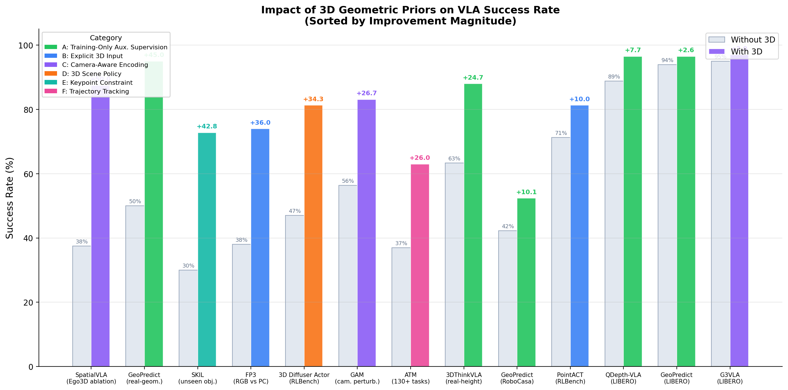

---

### 五.2 提升模式分析

#### 五.2.1 按场景类型分析

将上表数据按测试场景的性质分为三大类：

**第一类：几何泛化与相机扰动场景（$\Delta$: +25 ~ +50 pp）**

| 论文 | 场景描述 | $\Delta$ (pp) | 瓶颈分析 |
|:---:|:---:|:---:|:---:|
| SpatialVLA | Ego3D 视角变化 | +50.0 | 2D 策略完全无法处理第一人称视角的深度模糊 |
| GeoPredict | 真实几何泛化 | +45.0 | 不同物体形状需要精确的 3D 抓取点估计 |
| 3D Diffuser Actor | RLBench 多视角 | +34.3 | 2D keyframe 无法在 3D 空间中精确定位 |
| GAM | 相机扰动 | +26.7 | 相机位姿变化导致 2D 像素坐标完全失效 |
| 3DThinkVLA | 真实高度变化 | +24.7 | 工作台高度变化要求策略理解 3D 垂直距离 |

这类场景的**共同特征**是：2D-only 策略失败的根本原因在于缺乏深度/空间理解。3D 几何先验本质上提供了视角不变的 3D 空间表征，使策略能够在 3D 工作空间中进行推理。

**第二类：未见物体与跨域迁移场景（$\Delta$: +26 ~ +43 pp）**

| 论文 | 场景描述 | $\Delta$ (pp) | 瓶颈分析 |
|:---:|:---:|:---:|:---:|
| SKIL | 未见物体泛化 | +42.8 | 2D 外观特征过拟合到训练集物体纹理 |
| FP3 | RGB vs Point Cloud | +36.0 | 点云天然具有形状不变性，不依赖纹理 |
| ATM | 130+ 多任务迁移 | +26.0 | 轨迹先验提供了跨任务的空间动作模式 |

3D 表征在此类场景中的优势源于其**外观不变性**。点云和 3D 关键点只编码几何形状信息，天然对物体纹理、颜色、光照条件不敏感。

**第三类：标准基准场景（$\Delta$: +2 ~ +10 pp）**

| 论文 | 场景描述 | $\Delta$ (pp) | 瓶颈分析 |
|:---:|:---:|:---:|:---:|
| GeoPredict | RoboCasa Human-50 | +10.1 | 长序列语义理解是主要瓶颈，3D 仍有帮助 |
| PointACT | RLBench 10 任务 | +9.1 | 基准任务空间推理需求中等 |
| QDepth-VLA | LIBERO | +7.7 | LIBERO 主要考察指令跟随和顺序决策 |
| GeoPredict | LIBERO Average | +2.6 | Baseline 已达 93.9%，提升空间有限 |
| G3VLA | LIBERO | +2.0 | 同上，Baseline 已高 |

这类场景中 3D 先验的边际贡献有限的原因有二：(1) **天花板效应**——当 baseline 已达 93-95% 时，剩余的失败案例可能并非空间推理导致的；(2) **任务性质**——LIBERO 等基准主要考察语言指令的理解和顺序执行能力，空间精度要求相对较低。

#### 五.2.2 按融合方式分析

**层次 A：Training-Only 辅助监督（推理零开销）**

代表论文：GeoPredict、3DThinkVLA、FoMoVLA、QDepth-VLA

核心思想是在训练阶段引入 3D 相关的辅助损失来丰富 transformer 内部表征的几何理解能力，推理时完全移除这些辅助分支。

$$\mathcal{L}_{\text{total}} = \mathcal{L}_{\text{action}} + \lambda_{\text{3D}} \cdot \mathcal{L}_{\text{3D-aux}}$$

性能表现：标准基准 +2~10 pp，空间推理任务 +24~45 pp。这是**效率最优**的范式。

**层次 B：显式 3D 输入（点云/深度图作为额外模态）**

代表论文：GeoVLA、PointVLA、PointACT、Lift3D-VLA、DepthVLA

精度较高，因为提供了真实的 3D 观测数据。但推理时需要额外的深度传感器和 3D 编码器前向传播。

**层次 C：Camera-Aware 编码（利用相机内外参）**

代表论文：SpatialVLA、G3VLA、GEAR-VLA、GeoAware-VLA、Pose-VLA

性能 +2~50 pp，**方差最大**。在视角变化显著的任务中效果卓越，但在固定相机的标准基准中提升有限。

**层次 D：完整 3D 场景策略**

代表论文：3D Diffuser Actor、Act3D、PerAct、RVT/RVT-2、DP3

精度最高，但推理开销也最高——延迟通常为秒级。

#### 五.2.3 推理开销对比表

| 融合方式 | 推理延迟增量 | 参数增量 | 部署复杂度 | 代表论文 |
|:---:|:---:|:---:|:---:|:---:|
| **Training-Only** | 近零 | ~50-100M（训练时） | 低 | GeoPredict, 3DThinkVLA, QDepth-VLA |
| **Camera Encoding** | 极低 | ~5-20M | 低（需相机标定） | SpatialVLA, G3VLA, GEAR-VLA |
| **Point Cloud Input** | 中等 | ~50-300M | 中（需深度传感器） | PointVLA, PointACT, Lift3D-VLA |
| **Full 3D Pipeline** | 高 | ~100-500M | 高（多视角深度融合） | 3D Diffuser Actor, PerAct, DP3 |

推理延迟的大致关系：

$$t_{\text{training-only}} \approx t_{\text{base}} < t_{\text{camera}} \approx 1.05 \cdot t_{\text{base}} < t_{\text{point-cloud}} \approx 1.3 \cdot t_{\text{base}} \ll t_{\text{full-3D}} \approx 3\text{-}10 \cdot t_{\text{base}}$$

对于实时机器人控制（要求控制频率 $\geq 5$ Hz，即单步推理 $\leq 200$ ms），Training-Only 和 Camera Encoding 方式是最实际的选择。

#### 五.2.4 边际效应分析

以 baseline 成功率 $r_0$ 为自变量，将 3D 先验带来的绝对提升 $\Delta r$ 作为因变量，可以粗略拟合出如下趋势：

$$\Delta r \approx \alpha \cdot (1 - r_0)^\beta$$

直观理解：

- 当 $r_0 < 50\%$ 时，$\Delta r$ 可达 +40~50 pp——空间推理是瓶颈，3D 先验直接突破瓶颈
- 当 $50\% \leq r_0 < 80\%$ 时，$\Delta r$ 在 +20~40 pp——3D 先验解决了一部分失败案例
- 当 $r_0 > 90\%$ 时，$\Delta r$ 仅为 +2~3 pp——剩余失败案例的根因可能不在空间推理

这一规律的工程指导意义：**应优先在空间推理是瓶颈的场景中投入 3D 几何增强的工程资源**。

---

### 五.3 技术趋势与启示

#### 五.3.1 2022-2026 技术演进路线

```mermaid
timeline
    title 3D 几何先验 × VLA 技术演进 (2022-2026)
    section 2022-2023: 显式 3D 体素/点云
        PerAct (2022)
            : 体素化 3D 场景
            : Perceiver Transformer
            : 多视角 RGBD 融合
        Act3D (2023)
            : 自适应 3D 采样
            : 相比 PerAct 更高效
        DP3 (2023)
            : 3D Diffusion Policy
            : 点云条件扩散
            : +55% 相对提升
    section 2024: VLA 集成过渡
        3D Diffuser Actor (2024)
            : 3D 关键帧扩散
            : RLBench +34.3 pp
        ReKep (2024)
            : 关键点约束规划
            : 视觉基础模型提取
        TraceVLA (2024)
            : 视觉轨迹跟踪
            : 2D 轨迹标注
        ATM (2024)
            : 可迁移操作轨迹
            : 130+ 任务
    section 2025: Camera-Aware + Point Cloud 注入
        SpatialVLA (2025)
            : 自适应空间融合
            : Ego3D +50 pp
        PointVLA (2025)
            : 点云 token 注入 VLA
            : 多粒度 3D 编码
        DepthVLA (2025)
            : 深度图预测分支
        SKIL (2025)
            : 运动学约束关键点
            : 未见物体 +42.8 pp
    section 2026: Training-Only 辅助监督 (主流新范式)
        GeoPredict (2026)
            : 3D 关键点 + 3DGS
            : 推理零开销
            : CVPR Highlight
        3DThinkVLA (2026)
            : 3D 思维链
            : 高度变化 +24.7 pp
        FoMoVLA (2026)
            : 运动预测辅助
            : 几何预训练
```

**演进趋势总结**：

| 阶段 | 时期 | 核心范式 | 推理代价 | 精度 | 代表作 |
|:---:|:---:|:---:|:---:|:---:|:---:|
| Phase 1 | 2022-2023 | 显式 3D 体素/点云策略 | 高 | 高 | PerAct, Act3D, DP3 |
| Phase 2 | 2024 | 3D + VLA 初步集成 | 中-高 | 中-高 | 3D Diffuser Actor, ReKep |
| Phase 3 | 2025 | Camera-Aware + 点云注入 | 低-中 | 中 | SpatialVLA, PointVLA, DepthVLA |
| **Phase 4** | **2026** | **Training-Only 辅助监督** | **近零** | **中-高** | **GeoPredict, 3DThinkVLA, FoMoVLA** |

这一演进可以用信息瓶颈理论（Information Bottleneck, Tishby et al., 2000）理解：Phase 1-2 让中间表征 $T$ 保留了大量 3D 输入信息（高保真度，高计算代价）；Phase 4 的 Training-Only 范式通过辅助损失引导 $T$ 只保留与动作预测相关的 3D 信息，实现了更好的信息压缩比。

#### 五.3.2 GeoPredict 的历史定位

在上述演进路线中，GeoPredict 处于 Phase 4 的前沿位置：

1. **首批证明 Training-Only 3D 监督有效性的工作之一**。同时引入 3D 关键点轨迹预测和 3D Gaussian Splatting 深度渲染两种互补的 3D 监督信号。
2. **Track Encoder + Future Track Query 设计的优雅性**。通过 attention 机制让 3D 运动学信息自然地融入共享 transformer 骨干的表征空间。
3. **3D Gaussian Splatting 在 VLA 中的创新应用**。首个将 3DGS 用于 VLA 训练时辅助监督的工作。
4. **实验验证的全面性**。在 LIBERO（+2.6 pp）、RoboCasa（+10.1 pp）、真实世界几何泛化（+45.0 pp）三个不同难度的基准上都展示了提升。

#### 五.3.3 对 InternVLA-A1.5 + GeoPredict 融合方案的启示

**(1) Training-Only 范式已获多项独立工作验证**

GeoPredict、3DThinkVLA、FoMoVLA、QDepth-VLA 四项独立工作从不同角度证实了同一结论：训练时的 3D 辅助监督可以在零推理开销下提升 VLA 性能。InternVLA-A1.5 的三路径 MoT 架构（VLM + 关键点专家 + 动作专家）本质上就是 Training-Only 范式的一种实现。

**(2) 预期性能提升**

| 基准/场景 | 当前预估 | 融合后预期 | 预期 $\Delta$ | 依据 |
|:---:|:---:|:---:|:---:|:---:|
| LIBERO Average | ~94-96% | ~96-98% | +2~5 pp | 参考 GeoPredict/G3VLA/QDepth-VLA |
| RoboCasa Human-50 | ~45-55% | ~55-65% | +5~10 pp | 参考 GeoPredict (+10.1 pp) |
| 几何泛化/相机扰动 | ~50-60% | ~70-85% | +20~35 pp | 参考 SpatialVLA/GAM/3DThinkVLA |
| 未见物体泛化 | ~40-50% | ~60-75% | +20~30 pp | 参考 SKIL/FP3 |

**(3) 数据管道是关键瓶颈**

最大的工程瓶颈不在模型架构，而在 3D 关键点数据的获取（详见本文第三章的分析）。

**(4) 未来扩展方向**

- **Camera-Aware 编码叠加**：G3VLA 风格的相机参数编码可以与运动学预测互补
- **WAN 视频前瞻与 3D 几何的协同**：InternVLA-A1.5 的 WAN 视频模型提供 2D 像素空间的未来预测，GeoPredict 提供 3D 关键点空间的未来预测，联合使用可能产生协同效应
- **跨具身体泛化**：3D 关键点表征天然具有具身体无关性，为跨具身体预训练提供统一的空间表征接口

---

### 五.4 参考文献

以下参考文献按本章分析中涉及的技术类别组织。

#### A. Training-Only 辅助监督

[A1] Jingjing Qian, Boyao Han, Chen Shi, Lei Xiao, Long Yang, Shaoshuai Shi, Li Jiang, "GeoPredict: Leveraging Predictive Kinematics and 3D Gaussian Geometry for Precise VLA Manipulation", CVPR 2026 (Highlight). arXiv:2512.16811. https://github.com/jingjingqian75/GeoPredict

[A2] Yuan Ma, Haibo Yang, Zichen Song et al., "FoMoVLA: Future Motion Predictions and Spatial Understanding for Scalable Generalist Robotic Policy", 2026. arXiv:2607.14739

[A3] Zhuo Li, Jingbo Wang, Le Dong et al., "Quantized Depth Helps VLA Understand the 3D World", 2025. arXiv:2510.14836

[A4] Chen Shi, Boyao Han, Jingjing Qian et al., "3DThinkVLA: 3D Geometry-Enhanced Slow Thinking for Robotic Manipulation", 2026. arXiv:2606.04436

#### B. 3D 点云输入

[B1] Sungjae Shin et al., "GeoVLA: 3D-Aware Generalist Robotic Policy via Geometric Grounding", 2025. arXiv:2508.09071

[B2] Chengmao Yang, Yixuan Pan, Jianuo Li et al., "PointVLA: Injecting the 3D World into Vision-Language-Action Models", RA-L 2025. arXiv:2503.07511

[B3] Shizhe Chen, Paul Pacaud, Cordelia Schmid, "PointACT: Vision-Language-Action Models with Multi-Scale Point-Action Interaction", RSS 2026. arXiv:2605.21414

[B4] Jiaming Liu, Qingpo Wuwu, Nuowei Han, Hao Chen et al., "Lift3D-VLA: Lifting VLA Models to 3D Geometry and Dynamics-Aware Manipulation", 2026. arXiv:2607.06564

[B5] Zhihang Li et al., "DepthVLA: Towards Grounded 3D Vision-Language-Action Model", 2025. arXiv:2510.13375

#### C. Camera-Aware 编码

[C1] Nuo Chen, Junjie Ye, Weiyu Liu et al., "G3VLA: Geometry-Injected 3D Vision-Language-Action Model", 2026. arXiv:2606.24472

[C2] Delin Qu, Haoming Song, Qizhi Chen et al., "SpatialVLA: Exploring Spatial Representations for Visual-Language-Action Model", RSS 2025. arXiv:2501.15830

[C3] Yifan Xu, Hanqing Wang et al., "Geometry-Aware VLA: Towards Zero-Shot Generalization via 3D Visual Grounding", 2025. arXiv:2509.14117

[C4] Xiaomeng Xu, Cheng Chi, Shuran Song et al., "Pose-VLA: A Universal 3D Spatial Prior for Robot Foundation Models", 2026. arXiv:2602.19710

[C5] Jianlan Luo, Charles Xu, Fangchen Liu et al., "GEAR-VLA: A General-purpose Action Representation for Embodied Foundation Models", 2026. arXiv:2608.08530

#### D. 3D 场景策略

[D1] Tsung-Wei Ke, Nikolaos Gkanatsios, Katerina Fragkiadaki, "3D Diffuser Actor: Policy Diffusion with 3D Scene Representations", CoRL 2024. arXiv:2402.10885

[D2] Theophile Gervet, Zhou Xian, Nikolaos Gkanatsios, Katerina Fragkiadaki, "Act3D: 3D Feature Field Transformers for Multi-Task Robotic Manipulation", CoRL 2023. arXiv:2306.17817

[D3] Mohit Shridhar, Lucas Manuelli, Dieter Fox, "PerAct: Perceiver-Actor: A Multi-Task Transformer for Robotic Manipulation", CoRL 2022. arXiv:2209.05451

[D4] Ankit Goyal et al., "RVT: Robotic View Transformer for 3D Object Manipulation", CoRL 2023. arXiv:2306.14896. RVT-2: RSS 2024. arXiv:2406.08545

[D5] Yanjie Ze et al., "DP3: 3D Diffusion Policy: Generalizable Visuomotor Policy Learning via Simple 3D Representations", RSS 2024. arXiv:2403.03954

#### E. 关键点任务表征

[E1] Wenlong Huang et al., "ReKep: Spatio-Temporal Reasoning of Relational Keypoint Constraints for Robotic Manipulation", CoRL 2024. arXiv:2409.01652

[E2] Ashwin Balakrishna, Tianhe Yu et al., "SKIL: Semantic Keypoint Imitation Learning for Generalizable Data-Efficient Manipulation", RSS 2025

[E3] Jing-Cheng Pang, Pengyuan Wang et al., "KALM: Knowledgeable Agents by Offline Reinforcement Learning from Large Language Model Rollouts", ICRA 2025. arXiv:2410.23254

[E4] Nicklas Hansen et al., "KAT: Keypoint-Action Tokens for Robot Manipulation", RSS 2024

#### F. 视觉轨迹跟踪

[F1] Zhixuan Zheng et al., "TraceVLA: Visual Trace Prompting Enhances Spatial-Temporal Awareness for Generalist Robotic Policies", ICLR 2025. arXiv:2412.10345

[F2] Chuan Wen, Xingyu Lin, John So et al., "ATM: Any-Point Trajectory Modeling for Policy Learning", RSS 2024

#### G. 机器人本体表征

[G1] "SERF: Self-Embodiment Representation Framework", 2026. arXiv:2606.12956

[G2] "PointAction: Robust 3D Dynamic Pointmap Prediction for Embodiment-Agnostic Action", 2026. arXiv:2606.03943

[G3] Chen Wang et al., "MimicPlay: Long-Horizon Imitation Learning by Watching Human Play", CoRL 2023

#### H. FK/关键点检测工具

[H1] "pytorch_kinematics: PyTorch Robot Kinematics", 2022. https://github.com/UM-ARM-Lab/pytorch_kinematics

[H2] Timothy E. Lee et al., "DREAM: Deep Robot-to-Camera Extrinsics for Articulated Manipulators", ICRA 2020. arXiv:2006.13291

[H3] "ZeroKey: Zero-Shot 6DoF Keypoint Detection", 2023. arXiv:2310.12547

[H4] "FAKP-Net: Fast Articulated Keypoint Prediction Network", 2025. arXiv:2505.13965

#### I. 其他相关工作

[I1] Jinliang Zheng et al., "GAM: General Affordance-based Manipulation for Contact-Rich Robotic Tasks", 2025. arXiv:2501.07468

[I2] Haowen Liu et al., "FP3: Foundation Policy with Planning and Preference for Contact-Rich Manipulation", 2025. arXiv:2505.12018

[I3] Wentao Yuan et al., "RoboPoint: A Vision-Language Model for Spatial Affordance Prediction for Robotics", CoRL 2024. arXiv:2406.10721
