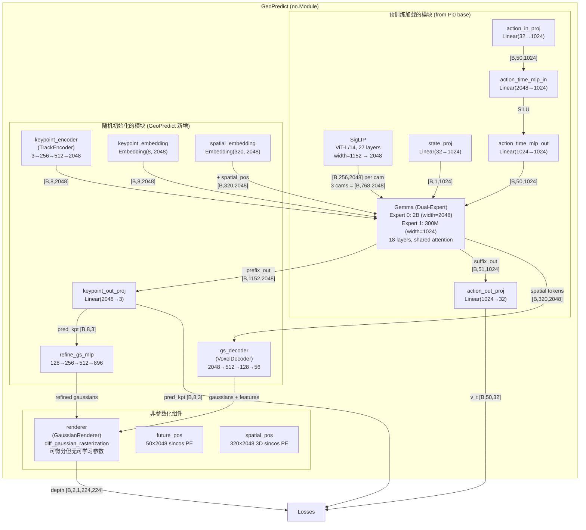
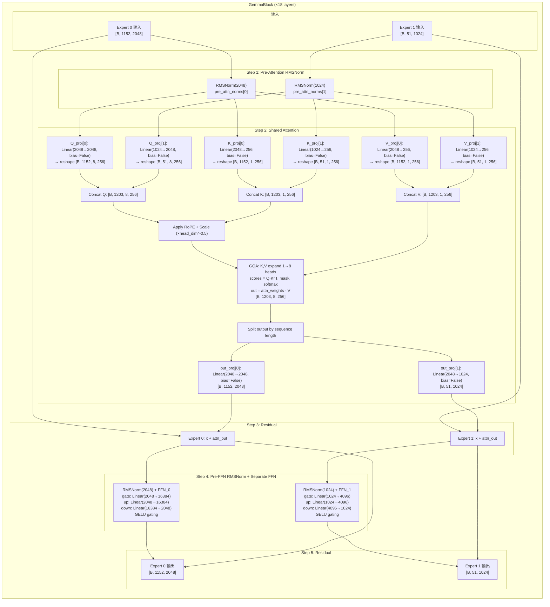
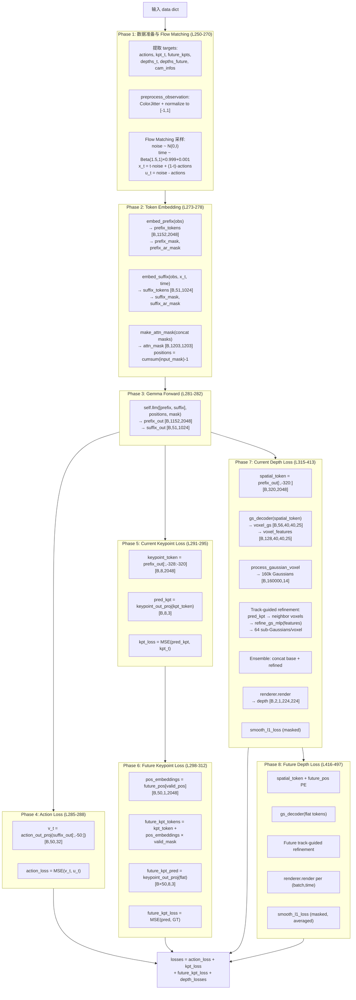
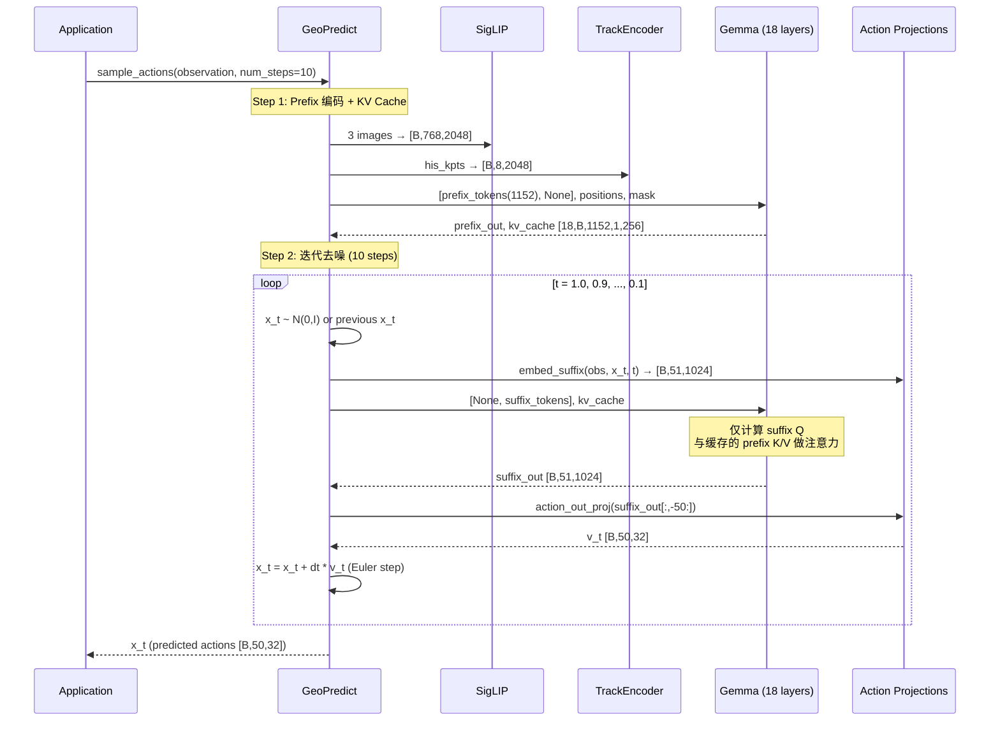
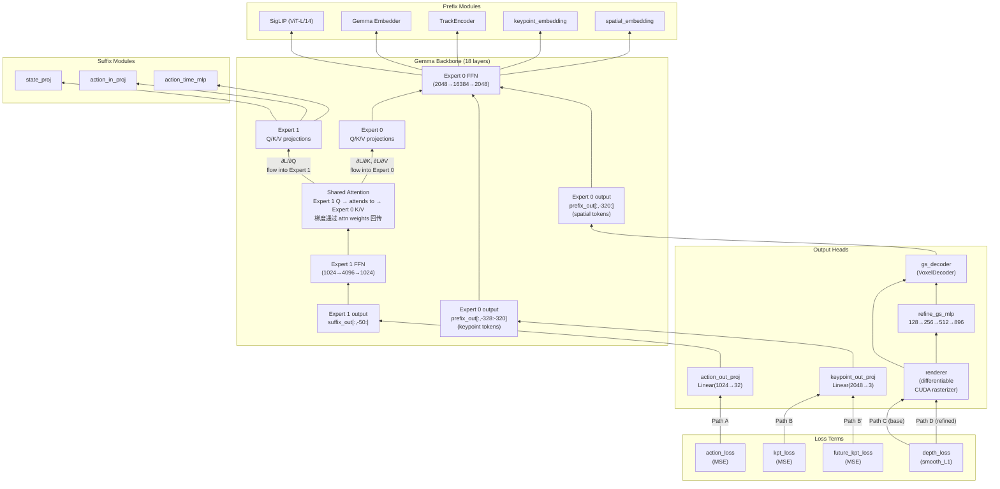
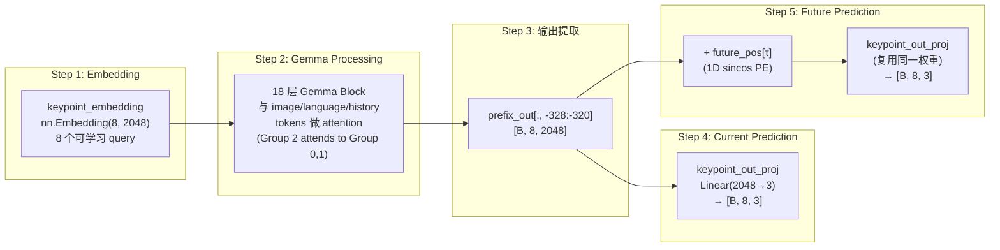
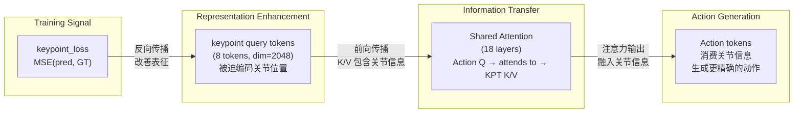
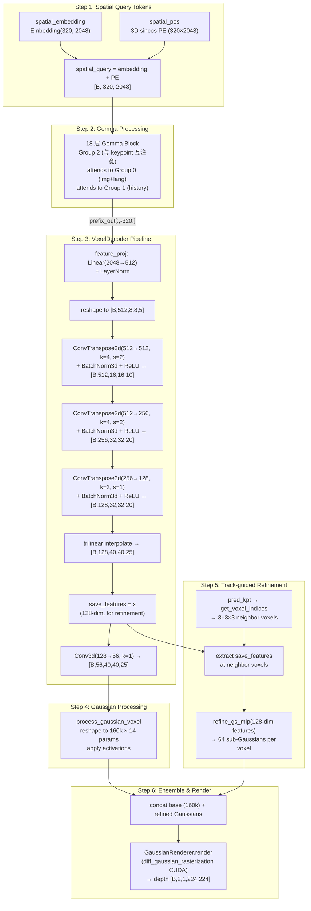
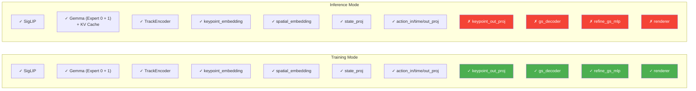

---

## 11. 模型网络结构与 Forward/Backward 深度解析

本章基于 GeoPredict 代码库的实际实现,对模型的网络结构、训练 Forward Pass、推理 Forward Pass 及 Backward Pass 的梯度流进行深入剖析。所有代码引用均标注文件路径和行号,所有维度分析均基于实际代码中的常量定义。

---

### 11.1 模块总览与静态架构

#### 11.1.1 GeoPredict 类的 `nn.Module` 属性全表

`GeoPredict.__init__`（`models/geopredict.py:97-139`）中定义了所有子模块。下表完整列出每个属性及其类型、配置和来源：

| 属性名 | 类型 | 维度/配置 | 代码位置 | 来源 |
|--------|------|-----------|----------|------|
| `self.llm` | `Gemma` | dual-expert: 2B(width=2048) + 300M(width=1024), depth=18 | `geopredict.py:106` | 预训练加载（Pi0 base） |
| `self.img` | `SigLIP` | ViT: patch_size=14, width=1152, depth=27, num_heads=16, 输出 dim=2048 | `geopredict.py:107` | 预训练加载 |
| `self.state_proj` | `nn.Linear` | $32 \to 1024$ | `geopredict.py:108` | 预训练加载 |
| `self.action_in_proj` | `nn.Linear` | $32 \to 1024$ | `geopredict.py:109` | 预训练加载 |
| `self.action_time_mlp_in` | `nn.Linear` | $2048 \to 1024$ (concat action+time) | `geopredict.py:110` | 预训练加载 |
| `self.action_time_mlp_out` | `nn.Linear` | $1024 \to 1024$ | `geopredict.py:111` | 预训练加载 |
| `self.action_out_proj` | `nn.Linear` | $1024 \to 32$ | `geopredict.py:112` | 预训练加载 |
| `self.keypoint_encoder` | `TrackEncoder` | input_dim=3, output_dim=2048, patch_size=4, embed_dim=256, query_dim=512 | `geopredict.py:118` | 随机初始化 |
| `self.keypoint_embedding` | `nn.Embedding` | $8 \times 2048$ (8 joints) | `geopredict.py:119` | 随机初始化 |
| `self.keypoint_out_proj` | `nn.Linear` | $2048 \to 3$ (输出 3D 坐标) | `geopredict.py:120` | 随机初始化 |
| `self.spatial_embedding` | `nn.Embedding` | $320 \times 2048$ ($8 \times 8 \times 5 = 320$ voxels) | `geopredict.py:124` | 随机初始化 |
| `self.gs_decoder` | `VoxelDecoder` | input=2048, hidden=512, 输出 $56 \times 40 \times 40 \times 25$ | `geopredict.py:133` | 随机初始化 |
| `self.renderer` | `GaussianRenderer` | resolution=[224,224], znear=0.01, zfar=10.0 | `geopredict.py:134` | **非 `nn.Module`**, 无可学习参数 |
| `self.refine_gs_mlp` | `nn.Sequential` | $128 \to 256 \to 512 \to 896$ (即 $64 \times 14$) | `geopredict.py:135-138` | 随机初始化 |

**非 `nn.Module` 属性：**

| 属性名 | 类型 | 说明 | 代码位置 |
|--------|------|------|----------|
| `self.future_pos` | `Tensor` | $50 \times 2048$, 1D sincos 位置编码 (base=100)，用于时间步嵌入 | `geopredict.py:114` |
| `self.spatial_pos` | `Tensor` | $320 \times 2048$, 3D sincos 位置编码，为每个 voxel 编码空间位置 | `geopredict.py:125` |
| `self.offset_act` | `lambda` | $\tanh(x) \times 0.04$, Gaussian offset 激活 | `geopredict.py:128` |
| `self.opt_act` | `torch.sigmoid` | opacity 激活 | `geopredict.py:129` |
| `self.scale_act` | `lambda` | $\text{softplus}(x, \beta=20)$, scale 激活 | `geopredict.py:130` |
| `self.rot_act` | `lambda` | $\text{normalize}(x, \dim=-1)$, rotation 归一化 | `geopredict.py:131` |
| `self.rgb_act` | `torch.sigmoid` | RGB 激活 | `geopredict.py:132` |

#### 11.1.2 参数冻结策略

GeoPredict 的训练策略简洁而关键——**所有参数均为可训练状态**。代码中没有任何 `requires_grad=False` 的设置。在 `utils/optimizer.py:5-17` 中，优化器直接使用 `model.parameters()` 收集所有参数：

```python
# utils/optimizer.py:7-13
optimizer = optim.AdamW(
    model.parameters(),  # 所有参数参与优化
    lr=args.base_lr,
    betas=(args.beta1, args.beta2),
    eps=args.eps,
    weight_decay=args.weight_decay,
)
```

预训练权重加载使用 `strict=False`，并通过白名单机制允许新增模块的 key 缺失（`tools/train_robocasa.py:72-83`）：

```python
# tools/train_robocasa.py:72-83
missing_keys, unexpected_keys = model.load_state_dict(
    torch.load(args.pretrain, map_location='cpu'), strict=False)
# ...
white_keyword = ['keypoint', 'spatial', 'gs_decoder', 'renderer', 'refine']
non_white_missing = [key for key in missing_keys 
                     if not any(keyword in key for keyword in white_keyword)]
```

这意味着：
- **从预训练加载的模块**（SigLIP, Gemma, state/action projections）：继承 Pi0 base 权重，但训练过程中继续更新
- **随机初始化的模块**（keypoint, spatial, gs_decoder, refine_gs_mlp）：在 GeoPredict fine-tuning 阶段从头学起
- `renderer` 虽然不含可学习参数，但其可微分 rasterization 过程允许梯度穿过

#### 11.1.3 静态架构图



---

### 11.2 Token 序列构建详解

GeoPredict 的核心设计在于将多模态信息统一为 token 序列，通过精心设计的注意力掩码控制信息流动方向。Token 序列分为 **prefix**（视觉-语言-几何信息，Expert 0 处理）和 **suffix**（状态-动作信息，Expert 1 处理）两部分。

#### 11.2.1 Prefix 构建：`embed_prefix()`

`embed_prefix()` 方法（`geopredict.py:141-191`）按顺序拼接 5 组 token：

**第 1 组：Image Tokens**（`geopredict.py:147-155`）

```python
# geopredict.py:147-155
for name in obs["images"]:
    image_tokens = self.img(obs["images"][name])  # [B, 256, 2048]
    tokens.append(image_tokens)
    input_mask.append(
        obs["image_masks"][name].unsqueeze(1).expand(-1, image_tokens.shape[1])
    )
    ar_mask += [False] * image_tokens.shape[1]  # 组内双向注意力
```

SigLIP 将每张 $224 \times 224$ 图像切分为 $(224/14)^2 = 256$ 个 patch，编码为 2048 维 token。3 个摄像头（left, right, wrist）共产生 $3 \times 256 = 768$ 个 token。`ar_mask` 全为 `False`，表示这些 token 属于同一因果组，组内双向注意力。

**第 2 组：Language Tokens**（`geopredict.py:158-163`）

```python
# geopredict.py:158-163
tokenized_inputs = self.llm.embed(obs["tokenized_prompt"])  # [B, 48, 2048]
tokens.append(tokenized_inputs)
input_mask.append(obs["tokenized_prompt_mask"])
ar_mask += [False] * tokenized_inputs.shape[1]  # 与 image 同组
```

通过 Gemma Embedder（`gemma.py:54-64`）将 tokenized text 映射为 2048 维，并乘以 $\sqrt{2048}$ 进行缩放。`max_token_len=48`，`ar_mask` 全为 `False`，与 image tokens 同属 Group 0，两组间可互相注意。

**第 3 组：History Keypoint Tokens**（`geopredict.py:165-172`）

```python
# geopredict.py:169-172
his_keypoint_token = self.keypoint_encoder(obs["his_kpts"], obs["his_len"])  # [B, 8, 2048]
tokens.append(his_keypoint_token)
ar_mask += [True] + ([False] * (his_keypoint_token.shape[1] - 1))
```

TrackEncoder 将 8 个关节的历史 3D 轨迹编码为 8 个 2048 维 token。`ar_mask` 首元素为 `True`，表示**开启新的因果组**（Group 1），组内余下 7 个 token 为 `False`（同组双向注意）。

**第 4 组：Keypoint Query Tokens**（`geopredict.py:174-178`）

```python
# geopredict.py:175-178
joint_token = self.keypoint_embedding.weight.unsqueeze(0).repeat(current_batch_size, 1, 1)
tokens.append(joint_token)
ar_mask += [True] + ([False] * (joint_token.shape[1] - 1))
```

8 个可学习的 keypoint query embedding（`nn.Embedding(8, 2048)`），`ar_mask` 首元素为 `True`，开启 Group 2。

**第 5 组：Spatial Query Tokens**（`geopredict.py:180-183`）

```python
# geopredict.py:180-183
spatial_token = (self.spatial_embedding.weight + self.spatial_pos.to(device))
               .unsqueeze(0).repeat(current_batch_size, 1, 1)
tokens.append(spatial_token)
ar_mask += [False] * spatial_token.shape[1]  # 与 keypoint query 同组！
```

320 个空间 query token（$8 \times 8 \times 5$ voxel grid）由可学习 embedding 加上 3D sincos 位置编码构成。关键细节：`ar_mask` 全为 `False`，意味着 spatial query tokens **与前一组 keypoint query tokens 同属 Group 2**，两者间可双向注意。

最终 prefix 总长度为：$768 + 48 + 8 + 8 + 320 = 1152$ 个 token，维度 2048。

#### 11.2.2 Suffix 构建：`embed_suffix()`

`embed_suffix()` 方法（`geopredict.py:193-223`）构建 action expert 的输入：

**State Token**（`geopredict.py:199-203`）

```python
# geopredict.py:199-203
state_token = self.state_proj(obs["state"])[:, None, :]  # [B, 1, 1024]
ar_mask += [True]  # 开启 Group 3
```

维度为 1024（Expert 1 的 width），`ar_mask=[True]` 开启 Group 3。

**Action Tokens**（`geopredict.py:206-217`）

```python
# geopredict.py:206-213
time_emb = posemb_sincos(timestep, 1024, min_period=4e-3, max_period=4.0)  # [B, 1024]
action_tokens = self.action_in_proj(noisy_actions)  # [B, 50, 1024]
time_tokens = time_emb.unsqueeze(1).repeat(1, 50, 1)  # [B, 50, 1024]
action_time_tokens = torch.cat([action_tokens, time_tokens], dim=-1)  # [B, 50, 2048]
action_time_tokens = self.action_time_mlp_in(action_time_tokens)  # [B, 50, 1024]
action_time_tokens = torch.nn.functional.silu(action_time_tokens)
action_time_tokens = self.action_time_mlp_out(action_time_tokens)  # [B, 50, 1024]
# ...
ar_mask += [True] + ([False] * (self.action_horizon - 1))  # 开启 Group 4
```

Flow matching 的 noisy action 与 timestep 通过 MLP 融合为 50 个 1024 维 token。`ar_mask=[True, False*49]` 开启 Group 4。

Suffix 总长度：$1 + 50 = 51$ 个 token，维度 1024。

#### 11.2.3 Token 序列全局布局

训练时，prefix 与 suffix 拼接为总长 $1152 + 51 = 1203$ 的 token 序列：

```
┌─────────────────────────────────────────────────────────────────────────────┐
│                           Prefix (Expert 0, dim=2048)                      │
│  ┌──────────────────┬──────────┬──────────┬──────────┬───────────────────┐  │
│  │  Image tokens    │ Language │ History  │ Keypoint │  Spatial queries  │  │
│  │  768 tokens      │ 48 tok   │ 8 tok    │ 8 tok    │  320 tokens       │  │
│  │  [F]*768         │ [F]*48   │ T,[F]*7  │ T,[F]*7  │  [F]*320          │  │
│  │    Group 0       │ Group 0  │ Group 1  │    Group 2 (共 328 tok)      │  │
│  └──────────────────┴──────────┴──────────┴──────────┴───────────────────┘  │
├─────────────────────────────────────────────────────────────────────────────┤
│                           Suffix (Expert 1, dim=1024)                      │
│  ┌──────────┬─────────────────────────────────────────────────────────────┐ │
│  │  State   │              Action tokens                                 │ │
│  │  1 token │              50 tokens                                     │ │
│  │   [T]    │              T, [F]*49                                     │ │
│  │ Group 3  │              Group 4                                       │ │
│  └──────────┴─────────────────────────────────────────────────────────────┘ │
└─────────────────────────────────────────────────────────────────────────────┘
```

其中 `T` = `True`（新因果组的起始标记），`F` = `False`（同组内的后续 token）。

#### 11.2.4 `make_attn_mask()` 的 cumsum 机制

注意力掩码的构建是 GeoPredict 块状因果注意力的核心（`geopredict.py:21-28`）：

```python
# geopredict.py:21-28
def make_attn_mask(input_mask, mask_ar):
    mask_ar = mask_ar.unsqueeze(0).expand(input_mask.shape[0], -1)  # [B, N]
    cumsum = torch.cumsum(mask_ar, dim=1)  # [B, N]
    attn_mask = cumsum.unsqueeze(1) <= cumsum.unsqueeze(2)  # [B, 1, N] <= [B, N, 1]
    valid_mask = input_mask.unsqueeze(1) * input_mask.unsqueeze(2)
    return torch.logical_and(attn_mask, valid_mask)
```

其原理如下：

1. 对 `ar_mask` 做 cumulative sum，为每个 token 分配一个**组 ID**。`True` 使 cumsum 递增，从而开启新组；`False` 保持当前组 ID
2. 对于位置 $i$ 和 $j$，当且仅当 $\text{cumsum}[i] \geq \text{cumsum}[j]$ 时，token $i$ 可以 attend 到 token $j$
3. 效果：同组内 token 双向可见（cumsum 相等），高编号组可以看到所有低编号组的 token（cumsum 递增），低编号组无法看到高编号组

对于本文的 5 个因果组：

$$
\text{cumsum 值}: \underbrace{0, 0, \ldots, 0}_{816 \text{ (Group 0)}}, \underbrace{1, 1, \ldots, 1}_{8 \text{ (Group 1)}}, \underbrace{2, 2, \ldots, 2}_{328 \text{ (Group 2)}}, \underbrace{3}_{1 \text{ (Group 3)}}, \underbrace{4, 4, \ldots, 4}_{50 \text{ (Group 4)}}
$$

**5×5 组间注意力权限矩阵**（行 = query, 列 = key, 1 = 可注意）：

| Query\Key | Group 0 (Img+Lang) | Group 1 (History) | Group 2 (KptQ+Spatial) | Group 3 (State) | Group 4 (Action) |
|-----------|:-:|:-:|:-:|:-:|:-:|
| **Group 0** (816 tok) | 1 | 0 | 0 | 0 | 0 |
| **Group 1** (8 tok)   | 1 | 1 | 0 | 0 | 0 |
| **Group 2** (328 tok) | 1 | 1 | 1 | 0 | 0 |
| **Group 3** (1 tok)   | 1 | 1 | 1 | 1 | 0 |
| **Group 4** (50 tok)  | 1 | 1 | 1 | 1 | 1 |

关键推论：
- Image 和 Language token 只能互相看（Group 0 内双向）
- History keypoint token 可以看 image/language（获取视觉语言上下文）
- Keypoint query 和 spatial query 可以看所有前序组（image, language, history），且两者互相可见
- Action tokens 可以看**所有** prefix token（这是 VLM 信息流向动作生成的**唯一通道**）
- **没有任何 prefix token 能看到 suffix token**（信息单向流动）

---

### 11.3 VLM 与 Action Expert 的交互——双专家 Gemma 架构

这是 GeoPredict 最核心的架构设计。Gemma backbone 采用双专家（dual-expert）架构，两个专家共享注意力计算但使用各自独立的投影层和 FFN。这种设计使得大容量的 VLM 表征能够通过 shared attention 流入轻量级的 action expert。

#### 11.3.1 双专家配置

```python
# gemma.py:21-37
gemma_2b_config = Config(width=2048, depth=18, mlp_dim=16384,
                         num_heads=8, num_kv_heads=1, head_dim=256)  # Expert 0 (Prefix)
gemma_300m_config = Config(width=1024, depth=18, mlp_dim=4096,
                           num_heads=8, num_kv_heads=1, head_dim=256)  # Expert 1 (Suffix)
```

关键约束：两个专家**必须共享** `head_dim=256`、`num_heads=8`、`num_kv_heads=1`，这是 shared attention 的前提（`gemma.py:94-96`）。

#### 11.3.2 GemmaBlock 的完整数据流

每个 `Block`（`gemma.py:207-251`）处理两个专家的 token，流程如下：



#### 11.3.3 Shared Attention 的核心代码

Shared Attention 的实现位于 `gemma.py:114-191`，其关键在于以下步骤：

**Step 1：各专家独立投影 Q/K/V**（`gemma.py:117-134`）

```python
# gemma.py:117-131
for i, x in enumerate(xs):
    if x is None: continue
    q = self.q_projections[i](x)  # Expert 0: [B,1152,2048], Expert 1: [B,51,2048]
    k = self.k_projections[i](x)  # Expert 0: [B,1152,256],  Expert 1: [B,51,256]
    v = self.v_projections[i](x)  # Expert 0: [B,1152,256],  Expert 1: [B,51,256]
    # Reshape for multi-head attention
    q = q.view(B, seq_len, 8, 256)   # num_heads=8, head_dim=256
    k = k.view(B, seq_len, 1, 256)   # num_kv_heads=1
    v = v.view(B, seq_len, 1, 256)
```

注意 Expert 1 的 Q 投影为 `Linear(1024→2048)`（`gemma.py:109`），将 1024 维 token 投影到与 Expert 0 相同的 $8 \times 256 = 2048$ 维 Q 空间。K/V 投影为 `Linear(1024→256)`，投影到 $1 \times 256$ 维空间。这确保了两个专家在**同一个注意力空间**中交互。

**Step 2：拼接并计算注意力**（`gemma.py:137-177`）

```python
# gemma.py:137-139
q = torch.cat(qs, dim=1)  # [B, 1152+51, 8, 256] = [B, 1203, 8, 256]
k = torch.cat(ks, dim=1)  # [B, 1203, 1, 256]
v = torch.cat(vs, dim=1)  # [B, 1203, 1, 256]
```

拼接后，RoPE 应用于整个序列的 Q 和 K（`gemma.py:142-144`），然后使用 Grouped Query Attention (GQA)：1 个 KV head 被扩展为 8 份，与 8 个 Q head 分别计算注意力。注意力掩码 `attn_mask`（由 `make_attn_mask()` 生成）控制每个 token 能看到哪些其他 token。

**Step 3：分割输出并各自投影**（`gemma.py:180-191`）

```python
# gemma.py:180-191
outputs = []
start = 0
for i, x in enumerate(xs):
    if x is not None:
        end = start + x.shape[1]
        expert_out = self.out_projections[i](out[:, start:end])
        outputs.append(expert_out)
        start = end
```

输出按序列长度切分回各专家，分别通过各自的 `out_proj` 投影回原始宽度（Expert 0: 2048, Expert 1: 1024）。

#### 11.3.4 核心洞察：信息流动机制

当 action tokens（suffix, Expert 1）计算注意力时，其 Q 向量会 attend 到**所有** prefix tokens 的 K/V（Expert 0）。这是 VLM 的视觉/语言理解流入动作生成的**唯一机制**。

用数学表达：对于第 $l$ 层的 action token 位置 $i$（属于 Group 4）：

$$
\text{Attn}(Q_i^{(1)}, K, V) = \text{softmax}\left(\frac{Q_i^{(1)} \cdot K_{[:]}^\top}{\sqrt{d_k}} \odot M_i\right) \cdot V_{[:]}
$$

其中 $Q_i^{(1)}$ 是 Expert 1 生成的 query，$K_{[:]}$ 和 $V_{[:]}$ 是拼接后的所有 token 的 key/value（包括 Expert 0 的 1152 个 prefix token 和 Expert 1 的 51 个 suffix token）。注意力掩码 $M_i$ 允许 Group 4 看到 Groups 0-4 的所有 token。

由于注意力掩码确保 prefix 无法看到 suffix（Group 0/1/2 的 cumsum 值小于 Group 3/4），suffix 对 prefix 的表征没有影响——信息严格单向流动。

#### 11.3.5 推理时的 KV Cache 机制

推理时，prefix 的 K/V 只需计算一次即可缓存（`gemma.py:147-150`）：

```python
# gemma.py:147-150
if kv_cache is not None:
    cache_k, cache_v = kv_cache
    k = torch.cat([cache_k, k], dim=1)  # 将缓存的 prefix K 与当前 suffix K 拼接
    v = torch.cat([cache_v, v], dim=1)
```

KV cache 的形状为 $(18, B, P, 1, 256)$，其中 18 为层数，$P$ 为 prefix 长度（1152）。每次去噪步骤中，suffix 的 K/V 重新计算并与缓存的 prefix K/V 拼接，从而避免重复计算 prefix 的 KV，实现了显著的推理加速。

KV cache 的具体存储和检索逻辑在 `Gemma.forward()`（`gemma.py:274-297`）中：

```python
# gemma.py:274-283
for i, layer in enumerate(self.layers):
    if kv_cache is not None:
        layer_kv_cache = (kv_cache[0][i], kv_cache[1][i])  # 取第 i 层的缓存
    else:
        layer_kv_cache = None
    embedded, new_layer_kv_cache = layer(embedded, layer_kv_cache, positions, mask)
    new_kv_cache.append(new_layer_kv_cache)

# gemma.py:292-297
stacked_k = torch.stack(all_k, dim=0)  # [18, B, seq_len, 1, 256]
stacked_v = torch.stack(all_v, dim=0)  # [18, B, seq_len, 1, 256]
return outputs, (stacked_k, stacked_v)
```

---

### 11.4 训练 Forward Pass 完整调用链

训练时的 forward pass 通过 `compute_loss()`（`geopredict.py:246-499`）执行，共分为 8 个阶段。



以下对各阶段进行深入解析。

#### Phase 1: 数据准备与 Flow Matching（L250-270）

```python
# geopredict.py:250-270
actions = data['actions']                    # [B, 50, 32]
kpt_t = data['kpt_t']                       # [B, 8, 3]
future_kpts = data['future_kpts']           # [B, 50, 8, 3]
depths_t = data['depths_t']                 # {'left_depth': [B,H,W], 'right_depth': [B,H,W]}
cam_infos = data['cam_infos']               # camera parameters

observation = preprocess_observation(data, train=self.training)
observation = move_to_type(observation, self.embed_dtype)  # → bfloat16

# Flow Matching
noise = torch.randn_like(actions)           # [B, 50, 32]
time = torch.distributions.Beta(1.5, 1).sample(batch_shape) * 0.999 + 0.001
time_expanded = time[..., None, None]       # [B, 1, 1]
x_t = time_expanded * noise + (1 - time_expanded) * actions  # 插值
u_t = noise - actions                       # 目标速度场
```

Flow Matching 的核心公式：给定真实动作 $a$ 和噪声 $\epsilon \sim \mathcal{N}(0, I)$，在时间 $t \sim \text{Beta}(1.5, 1) \times 0.999 + 0.001$ 处构造：

$$
x_t = t \cdot \epsilon + (1 - t) \cdot a
$$

$$
u_t = \epsilon - a
$$

模型需要预测速度场 $v_\theta(x_t, t)$ 来逼近 $u_t$。Beta(1.5, 1) 分布的使用使得采样偏向较大的 $t$ 值（即更接近噪声的状态），这有助于训练稳定性。

#### Phase 2: Token Embedding（L273-278）

```python
# geopredict.py:273-278
prefix_tokens, prefix_mask, prefix_ar_mask = self.embed_prefix(observation)
suffix_tokens, suffix_mask, suffix_ar_mask = self.embed_suffix(observation, x_t, time)
input_mask = torch.cat([prefix_mask, suffix_mask], dim=1)
ar_mask = torch.cat([prefix_ar_mask, suffix_ar_mask], dim=0)
attn_mask = make_attn_mask(input_mask, ar_mask)  # [B, 1203, 1203]
positions = torch.cumsum(input_mask, dim=1) - 1   # [B, 1203]
```

#### Phase 3: Gemma Forward（L281-282）

```python
# geopredict.py:281-282
(prefix_out, suffix_out), _ = self.llm(
    [prefix_tokens, suffix_tokens], positions=positions, mask=attn_mask)
```

一次性将所有 1203 个 token 通过 18 层 Gemma block，返回：
- `prefix_out`: $[B, 1152, 2048]$（Expert 0 的输出）
- `suffix_out`: $[B, 51, 1024]$（Expert 1 的输出）

训练时不使用 KV cache（`kv_cache=None`），因为 prefix 和 suffix 同时通过。

#### Phase 4: Action Loss（L285-288）

```python
# geopredict.py:285-288
v_t = self.action_out_proj(suffix_out[:, -self.action_horizon:])  # [B, 50, 32]
action_loss = torch.square(v_t - u_t).mean()
```

取 suffix 输出的后 50 个 token（action 位置），通过 `action_out_proj` (Linear(1024→32)) 投影为 32 维速度场预测 $v_\theta$，与目标 $u_t$ 计算 MSE loss：

$$
\mathcal{L}_\text{action} = \frac{1}{B \times 50 \times 32} \sum \|v_\theta(x_t, t) - u_t\|^2
$$

#### Phase 5: Current Keypoint Loss（L291-295）

```python
# geopredict.py:291-295
keypoint_token = prefix_out[:, -self.spatial_num - self.joint_num:-self.spatial_num]
# 即 prefix_out[:, -328:-320] → [B, 8, 2048]
pred_kpt = self.keypoint_out_proj(keypoint_token)  # [B, 8, 3]
kpt_loss = torch.square(pred_kpt - kpt_t).mean()
```

从 prefix 输出中取 keypoint query 对应位置的 8 个 token（位于 spatial query 之前），通过 `keypoint_out_proj` (Linear(2048→3)) 预测 8 个关节的 3D 坐标：

$$
\mathcal{L}_\text{kpt} = \frac{1}{B \times 8 \times 3} \sum \|\hat{p}_j - p_j^*\|^2
$$

#### Phase 6: Future Keypoint Loss（L298-312）

```python
# geopredict.py:298-312
relative_pos = future_steps - step.unsqueeze(1)      # [B, 50]
valid_mask = (relative_pos > 0) & (relative_pos <= 50)
valid_pos = torch.clamp(relative_pos - 1, 0, 49)
pos_embeddings = self.future_pos.to(device)[valid_pos].unsqueeze(2)  # [B,50,1,2048]

future_kpt_tokens = keypoint_token.unsqueeze(1).repeat(1, 50, 1, 1)  # [B,50,8,2048]
future_kpt_tokens = future_kpt_tokens + pos_embeddings * valid_mask.unsqueeze(2).unsqueeze(3)
future_kpt_tokens_flat = future_kpt_tokens.reshape(B*50, 8, -1)
future_kpt_pred = self.keypoint_out_proj(future_kpt_tokens_flat)  # [B*50,8,3]
```

通过将时间步 PE（`future_pos`，1D sincos, base=100）加到 keypoint token 上，**复用同一个 `keypoint_out_proj`** 预测未来 50 个时间步的关节轨迹。这是一种参数高效的设计：不同时间步共享投影权重，仅通过不同的位置编码区分。

$$
\hat{p}_j^{(\tau)} = W_\text{out} \left( h_j + \text{PE}_\text{future}(\tau) \right), \quad \tau = 0, 1, \ldots, 49
$$

#### Phase 7: Current Depth Rendering Loss（L315-413）

这是计算最密集的阶段，涉及 3D Gaussian Splatting 的完整 pipeline：

**7a. 体素解码**（L316-320）

```python
# geopredict.py:316-320
spatial_token = prefix_out[:, -self.spatial_num:]      # [B, 320, 2048]
voxel_gs, voxel_features = self.gs_decoder(spatial_token)
# voxel_gs: [B, 56, 40, 40, 25], voxel_features: [B, 128, 40, 40, 25]
voxel_means = get_voxel_means_torch([0,0,0, 1.6,1.6,1.0], [40,40,25], ...)
voxel_gs = self.process_guassian_voxel(voxel_gs, voxel_means)  # [B, 160000, 14]
```

VoxelDecoder（`head.py:6-49`）将 320 个 spatial token 从 2048 维线性投影到 512 维，reshape 为 $8 \times 8 \times 5$ 的 3D 体素，经过 3 次转置卷积上采样和三线性插值到 $40 \times 40 \times 25$，最终卷积输出 $56 = 14 \times 4$ 通道（每个 voxel 含 4 个 Gaussian primitives，每个 14 参数）。

`process_gaussian_voxel()`（`geopredict.py:225-244`）将原始参数分解为：
- **offsets** (3): $\tanh(x) \times 0.04$（限制在 voxel 范围内）
- **opacity** (1): $\sigma(x)$
- **scale** (3): $\text{softplus}(x, \beta=20)$，clamp max=0.04
- **rotation** (4): $\text{normalize}(x)$（单位四元数）
- **RGB** (3): $\sigma(x)$

总共 $40 \times 40 \times 25 \times 4 = 160{,}000$ 个 Gaussian primitives。

**7b. Track-guided Refinement**（L351-378）

```python
# geopredict.py:351-378 (per batch)
key_points = pred_kpt[i]                          # [8, 3]
_, _, key_voxel, key_voxel_mask = get_voxel_indices_torch(
    key_points, [...], [40,40,25], expand_neighborhood=True, neighborhood_size=3)
key_voxel = key_voxel[key_voxel_mask]
key_voxel_unique = torch.unique(key_voxel, dim=0)
key_voxel_feature = voxel_features[i].permute(1,2,3,0)[key_voxel_unique[:,0], ...]
refine_gs = self.refine_gs_mlp(key_voxel_feature).reshape(-1, 64, 14)  # 每 voxel 64 个细化 Gaussian
```

根据预测的关节位置，找到其 $3 \times 3 \times 3 = 27$ 邻域内的 voxel，提取这些 voxel 的 128 维中间特征（来自 `gs_decoder` 的 `save_features`），通过 `refine_gs_mlp` (128→256→512→896) 为每个邻域 voxel 生成 64 个细化 Gaussian（每个 14 参数）。最终将 base Gaussian 和 refined Gaussian 合并。

**7c. 渲染与损失**（L380-406）

```python
# geopredict.py:380-406
ensembel_gaussians = torch.cat([voxel_gs[i:i+1], refine_gs[None, :, :]], dim=1)
tmp = self.renderer.render(gaussians=ensembel_gaussians, c2w=..., fovx=..., ...)
# tmp['depth']: [1, 2, 1, 224, 224]  (2 cameras)

for cam, cam_depths in depths_t.items():
    render_depths = tmp['depth'][:, cam_id, 0]
    loss_render_depth = F.smooth_l1_loss(render_depths, cam_depth[None], reduction='none')
    loss_render_depth = (loss_render_depth * mask).sum() / (mask.sum() + 1e-6)
```

使用 `diff_gaussian_rasterization` 进行可微分渲染，生成左右摄像头的深度图，与 GT 深度图计算 masked smooth L1 loss。mask 限制在工作空间范围 $[0, 1.6] \times [0, 1.6] \times [0, 1.0]$ 内。

#### Phase 8: Future Depth Rendering Loss（L416-497）

```python
# geopredict.py:416-419
future_spatial_tokens = spatial_token.unsqueeze(1).repeat(1, 50, 1, 1)
future_spatial_tokens = future_spatial_tokens + pos_embeddings * valid_mask.unsqueeze(2).unsqueeze(3)
future_spatial_tokens_flat = future_spatial_tokens.reshape(B*50, 320, -1)
voxel_gs_future_flat, voxel_features_future = self.gs_decoder(future_spatial_tokens_flat)
```

与 keypoint 类似，通过加上 `future_pos` 时间 PE 来预测未来 geometry。同一个 `gs_decoder` 复用于所有时间步。对每个 (batch, time) 对分别执行 refinement 和渲染，计算深度 loss。

---

### 11.5 推理 Forward Pass

推理通过 `sample_actions()`（`geopredict.py:504-542`）执行，其核心是 **prefix 编码 + 迭代去噪** 的两阶段过程。

#### 11.5.1 推理流程



#### 11.5.2 推理代码解析

**Step 1: Prefix 编码与 KV Cache 填充**（L514-517）

```python
# geopredict.py:514-517
prefix_tokens, prefix_mask, prefix_ar_mask = self.embed_prefix(observation)
prefix_attn_mask = make_attn_mask(prefix_mask, prefix_ar_mask)
positions = torch.cumsum(prefix_mask, dim=1) - 1
(prefix_out, suffix_out), kv_cache = self.llm(
    [prefix_tokens, None], positions=positions, mask=prefix_attn_mask)
```

传入 `[prefix_tokens, None]`——Expert 1 为 `None`，Gemma 仅处理 prefix tokens，但 KV cache 被填充并返回。

**Step 2: Euler 去噪循环**（L519-541）

```python
# geopredict.py:504-542
dt = -1.0 / num_steps                              # dt = -0.1
x_t = torch.randn((B, 50, 32), device=device)      # 初始化纯噪声
time = torch.tensor(1.0, device=device)

while time >= -dt / 2:                              # time = 1.0, 0.9, ..., 0.1
    suffix_tokens, suffix_mask, suffix_ar_mask = self.embed_suffix(obs, x_t, time_batch)
    suffix_attn_mask = make_attn_mask(suffix_mask, suffix_ar_mask)
    # 构建 suffix 对 prefix 的注意力掩码
    prefix_attn_mask_expanded = prefix_mask.unsqueeze(1).expand(-1, suffix_tokens.shape[1], -1)
    full_attn_mask = torch.cat([prefix_attn_mask_expanded, suffix_attn_mask], dim=-1)
    
    (prefix_out, suffix_out), _ = self.llm(
        [None, suffix_tokens], positions=positions, mask=full_attn_mask, kv_cache=kv_cache)
    
    v_t = self.action_out_proj(suffix_out[:, -50:])  # [B, 50, 32]
    x_t = x_t + dt * v_t                             # Euler step: x_{t+dt} = x_t - 0.1 * v_t
    time = time + dt
```

每步去噪时：
1. 当前 $x_t$ 和 $t$ 构建 suffix tokens
2. 传入 `[None, suffix_tokens]` 加 `kv_cache`，Gemma 仅对 suffix 做 forward，但利用缓存的 prefix K/V 做 cross-attention
3. 获取速度场预测 $v_\theta$，执行 Euler 积分步

#### 11.5.3 计算量分析

| 阶段 | Token 数 | 执行次数 | 总 Token-Passes |
|------|----------|----------|-----------------|
| Prefix 编码 | 1152 | 1 | 1152 |
| Suffix 去噪 | 51 | 10 | 510 |
| **合计** | | | **1662** |

等效于约 $1662 / 1152 \approx 1.44$ 次完整 prefix forward pass 的计算量。

**推理时不使用的模块：**
- `keypoint_out_proj`：不预测关节位置
- `gs_decoder`（VoxelDecoder）：不解码体素
- `renderer`（GaussianRenderer）：不渲染深度
- `refine_gs_mlp`：不做关节引导细化

这些模块在推理时被完全跳过——prefix 中的 keypoint query token 和 spatial query token 仍然存在并参与 attention 计算，但其输出不再经过后续的投影/解码/渲染 pipeline。

---

### 11.6 Backward 与梯度流分析

训练时，6 个 loss 项（action, current_kpt, future_kpt, current_depth_left, current_depth_right, future_depth_left, future_depth_right）全部以权重 1.0 相加（`geopredict.py:287-494`），然后统一 backward。以下分析各 loss 项的梯度流路径。

#### 11.6.1 梯度路径总图



#### 11.6.2 各梯度路径详解

**Path A: action_loss 梯度**

$$
\mathcal{L}_\text{action} \xrightarrow{\nabla} \text{action\_out\_proj} \xrightarrow{\nabla} \text{suffix\_out}[:, -50:] \xrightarrow{\nabla} \text{Expert 1 (18 layers)}
$$

在每一层的 shared attention 中，Expert 1 的 Q 向量 attend 到 Expert 0 的 K/V。根据反向传播的链式法则：

$$
\frac{\partial \mathcal{L}}{\partial K^{(0)}} = \frac{\partial \mathcal{L}}{\partial \text{attn\_scores}} \cdot \frac{\partial \text{attn\_scores}}{\partial K^{(0)}} = \frac{\partial \mathcal{L}}{\partial \text{attn\_scores}} \cdot Q^{(1)\top}
$$

因此 action_loss 的梯度通过 attention 权重传播到 Expert 0 的**所有** K/V 投影参数，进而传播到所有 prefix 模块（SigLIP, Gemma Embedder, TrackEncoder, keypoint_embedding, spatial_embedding）。同时，梯度也直接传播到 Expert 1 的模块（state_proj, action_in_proj, action_time_mlp）。

**Path B: keypoint_loss 梯度**

$$
\mathcal{L}_\text{kpt} \xrightarrow{\nabla} \text{keypoint\_out\_proj} \xrightarrow{\nabla} \text{prefix\_out}[:, -328:-320] \xrightarrow{\nabla} \text{Expert 0 (18 layers)}
$$

梯度仅流经 Expert 0。在 attention 中，keypoint query tokens（Group 2）的 Q 向量 attend 到 image/language tokens（Group 0）和 history tokens（Group 1）的 K/V，因此梯度传播到 SigLIP, Gemma Embedder, TrackEncoder 和 keypoint_embedding。

注意：由于 Group 2 的 keypoint query 和 spatial query 间存在双向注意力，keypoint_loss 的梯度也间接流向 spatial_embedding。

**Path C: depth_loss 梯度（base Gaussians）**

$$
\mathcal{L}_\text{depth} \xrightarrow{\nabla} \text{smooth\_l1} \xrightarrow{\nabla} \text{rendered\_depth} \xrightarrow{\nabla} \text{diff\_gaussian\_rasterizer (CUDA)} \xrightarrow{\nabla} \text{Gaussian params}
$$

$$
\xrightarrow{\nabla} \text{activation functions} \xrightarrow{\nabla} \text{gs\_decoder} \xrightarrow{\nabla} \text{spatial\_token} = \text{prefix\_out}[:, -320:] \xrightarrow{\nabla} \text{Expert 0}
$$

`diff_gaussian_rasterization` 是一个自定义 CUDA kernel，它实现了可微分的高斯光栅化——前向渲染深度图，反向计算梯度相对于 Gaussian 参数（means, scales, rotations, opacity, RGB）的导数。梯度经过 activation 函数（sigmoid, softplus, tanh, normalize）和 `gs_decoder`（Conv3d, ConvTranspose3d, BatchNorm3d, ReLU）回传到 spatial token，再进入 Expert 0 backbone。

**Path D: depth_loss 梯度（refined Gaussians）**

$$
\mathcal{L}_\text{depth} \xrightarrow{\nabla} \text{refined\_Gaussian\_params} \xrightarrow{\nabla} \text{refine\_gs\_mlp} \xrightarrow{\nabla} \text{save\_features}
$$

`save_features`（`head.py:45`）是 `gs_decoder` 中间层的 128 维特征输出。由于 Python 的自动微分机制，即使 `save_features` 不是最终输出，其计算图仍然被保留，梯度可以从 `refine_gs_mlp` 回传到 `gs_decoder` 的前几层，最终到达 spatial token。

**关于 Track-guided Refinement 的梯度不连续性：**

```python
# geopredict.py:353-354
_, _, key_voxel, key_voxel_mask = get_voxel_indices_torch(
    key_points, ...)  # key_points = pred_kpt[i]
```

`get_voxel_indices_torch`（`models/utils.py:59-92`）使用 `torch.floor()` 将连续坐标离散化为体素索引。由于 `floor` 操作的梯度几乎处处为零，且后续使用了 `torch.unique` 和整数索引操作，**从 `pred_kpt` 到 refined Gaussian 的这条路径不可微**。因此，depth_loss 的梯度不会通过 track-guided refinement 路径回传到 `keypoint_out_proj`。

#### 11.6.3 模块梯度来源矩阵

下表展示各模块接收梯度的来源（基于前述分析）：

| 模块 | `action_loss` | `kpt_loss` | `future_kpt_loss` | `depth_loss` (current+future) | 说明 |
|------|:---:|:---:|:---:|:---:|------|
| SigLIP | ✓ | ✓ | ✓ | ✓ | 所有 loss 通过 Expert 0 attention 回传 |
| Gemma Embedder | ✓ | ✓ | ✓ | ✓ | 同上 |
| Gemma Expert 0 (18 layers) | ✓ | ✓ | ✓ | ✓ | 所有 prefix loss 的直接路径，action_loss 通过 shared attn |
| Gemma Expert 1 (18 layers) | ✓ | ✗ | ✗ | ✗ | 仅 action_loss 直接流经 Expert 1 |
| `state_proj` | ✓ | ✗ | ✗ | ✗ | 仅 suffix 模块 |
| `action_in_proj` | ✓ | ✗ | ✗ | ✗ | 仅 suffix 模块 |
| `action_time_mlp_in/out` | ✓ | ✗ | ✗ | ✗ | 仅 suffix 模块 |
| `action_out_proj` | ✓ | ✗ | ✗ | ✗ | action loss 的直接输出头 |
| `keypoint_encoder` (TrackEncoder) | ✓ | ✓ | ✓ | ✓ | 生成 history tokens，属于 prefix Group 1 |
| `keypoint_embedding` | ✓ | ✓ | ✓ | ✓ | 生成 query tokens，Group 2 与 spatial 互注意 |
| `keypoint_out_proj` | ✗ | ✓ | ✓ | ✗ | kpt loss 直接头；depth 路径不可微（floor） |
| `spatial_embedding` | ✓ | ✓ | ✓ | ✓ | Group 2 与 keypoint 互注意，depth loss 直接路径 |
| `gs_decoder` (VoxelDecoder) | ✗ | ✗ | ✗ | ✓ | 仅 depth loss 路径 |
| `refine_gs_mlp` | ✗ | ✗ | ✗ | ✓ | 仅 depth loss 路径（通过 save_features） |
| `renderer` (GaussianRenderer) | ✗ | ✗ | ✗ | (可微) | 无可学习参数，但 CUDA rasterizer 传播梯度 |

#### 11.6.4 为什么 Training-Only Loss 能提升 Action 质量

这是 GeoPredict 最核心的设计洞察。关键在于 **Shared Attention 机制**：

1. **depth_loss** 迫使 spatial query tokens（320 个，属于 prefix Group 2）的输出编码丰富的 3D 几何信息。为了使 `gs_decoder` 能准确重建深度，这些 token 必须在经过 18 层 attention 后包含精确的空间结构信息
2. **keypoint_loss** 迫使 keypoint query tokens（8 个，同属 prefix Group 2）的输出编码准确的关节位置信息
3. 在每一层 shared attention 中，**action tokens 的 Q 向量 attend 到这些 prefix tokens 的 K/V**。因此，action expert 在训练期间学会了从这些"被 3D geometry loss 增强过的"prefix representations 中提取有用信息
4. 推理时，即使 `gs_decoder`、`renderer`、`refine_gs_mlp`、`keypoint_out_proj` 被移除，prefix tokens（包括 keypoint query 和 spatial query）仍然被计算，仍然经过 18 层 Gemma blocks，仍然通过 shared attention 被 action tokens 消费。**这些 token 在训练中被 3D loss 塑造的表征质量在推理时被保留了下来**

用公式表达，设 $h_\text{spatial}^{(L)}$ 和 $h_\text{kpt}^{(L)}$ 分别为 spatial 和 keypoint query tokens 经过 $L=18$ 层后的输出。训练时：

$$
\nabla_{\theta_\text{backbone}} \mathcal{L}_\text{total} = \nabla_{\theta} \mathcal{L}_\text{action} + \underbrace{\nabla_{\theta} \mathcal{L}_\text{kpt}(h_\text{kpt}^{(L)}) + \nabla_{\theta} \mathcal{L}_\text{depth}(h_\text{spatial}^{(L)})}_{\text{额外梯度信号，增强 prefix 表征}}
$$

这些额外的梯度信号使得 Gemma backbone（特别是 Expert 0）学到了更好的视觉-语言-空间特征表示。推理时，即使不计算 $\mathcal{L}_\text{kpt}$ 和 $\mathcal{L}_\text{depth}$，backbone 的权重已经编码了这些信息——$h_\text{spatial}^{(L)}$ 和 $h_\text{kpt}^{(L)}$ 自然包含 3D 几何信息，action expert 自然能够消费它们。

---

### 11.7 3D Keypoint Trajectories 的产生与影响链

#### 11.7.1 产生过程



具体代码调用链：

1. **Embedding 生成**（`geopredict.py:119,175`）：`nn.Embedding(8, 2048)` 的 weight 作为 8 个 learnable query tokens
2. **Gemma 处理**（`geopredict.py:281-282`）：与所有 prefix tokens 一起通过 18 层 GemmaBlock，keypoint query tokens 通过 attention 聚合来自 image, language, history 的信息
3. **输出提取**（`geopredict.py:291`）：`prefix_out[:, -self.spatial_num - self.joint_num:-self.spatial_num]`，即位置 $[-328, -320)$ 的 8 个 token
4. **当前时刻预测**（`geopredict.py:292`）：`keypoint_out_proj(keypoint_token)` → $[B, 8, 3]$
5. **未来轨迹预测**（`geopredict.py:302-307`）：`keypoint_out_proj(keypoint_token + future_pos[τ])` → $[B, 8, 3]$ for $\tau \in [0, 49]$

#### 11.7.2 训练参与方式

**直接参与：**
- **Current keypoint MSE loss**（`geopredict.py:293`）：$\|\hat{p}_j - p_j^*\|^2$
- **Future keypoint MSE loss**（`geopredict.py:310`）：$\|\hat{p}_j^{(\tau)} - p_j^{*(\tau)}\|^2$

**间接参与（通过 track-guided refinement）：**
- 预测的关节位置 `pred_kpt` 被用于确定哪些 voxels 需要细化（`geopredict.py:352-354`）
- 但 `get_voxel_indices_torch` 中的 `floor` 操作使得此路径**不可微**
- 因此，depth_loss 不通过此路径为 `keypoint_out_proj` 提供梯度

#### 11.7.3 对 Action 的影响机制

Keypoint trajectories 对 action generation 的影响**不是直接的**——代码中没有从 keypoint prediction 到 action output 的直接投影。影响完全通过 shared attention 机制间接传递：

1. Keypoint query tokens 在 prefix 中占据 Group 2 的位置（$[-328, -320)$）
2. Action tokens（Group 4）通过 shared attention 可以 attend 到 keypoint query tokens
3. keypoint_loss 迫使这 8 个 token 编码精确的关节位置信息
4. Action expert 在训练过程中学会利用这些 token 中的关节信息来生成动作



---

### 11.8 3D Gaussian Geometry 的产生与影响链

#### 11.8.1 产生过程

3D Gaussian geometry 的产生涉及从 spatial query tokens 到可微分渲染的完整 pipeline：



**VoxelDecoder 的维度变换详情**（`head.py:6-49`）：

| 层 | 操作 | 输入维度 | 输出维度 |
|----|------|----------|----------|
| `feature_proj` | Linear | $[B, 320, 2048]$ | $[B, 320, 512]$ |
| `feature_norm` | LayerNorm(512) | $[B, 320, 512]$ | $[B, 320, 512]$ |
| reshape | - | $[B, 320, 512]$ | $[B, 512, 8, 8, 5]$ |
| `upconv1` | ConvTranspose3d(512→512, k=4, s=2) + BN + ReLU | $[B, 512, 8, 8, 5]$ | $[B, 512, 16, 16, 10]$ |
| `upconv2` | ConvTranspose3d(512→256, k=4, s=2) + BN + ReLU | $[B, 512, 16, 16, 10]$ | $[B, 256, 32, 32, 20]$ |
| `upconv3` | ConvTranspose3d(256→128, k=3, s=1) + BN + ReLU | $[B, 256, 32, 32, 20]$ | $[B, 128, 32, 32, 20]$ |
| interpolate | trilinear | $[B, 128, 32, 32, 20]$ | $[B, 128, 40, 40, 25]$ |
| `final_conv` | Conv3d(128→56, k=1) | $[B, 128, 40, 40, 25]$ | $[B, 56, 40, 40, 25]$ |

其中 56 = 14 params $\times$ 4 Gaussians/voxel。中间输出 `save_features`（128 通道，$40 \times 40 \times 25$ 体素）被保留用于 track-guided refinement。

**Gaussian 参数详解**（每个 primitive 14 个参数）：

| 参数 | 数量 | 激活函数 | 值域 | 代码位置 |
|------|------|----------|------|----------|
| offset (xyz) | 3 | $\tanh(x) \times 0.04$ | $[-0.04, 0.04]$ | `geopredict.py:128` |
| opacity | 1 | $\sigma(x)$ | $(0, 1)$ | `geopredict.py:129` |
| scale (xyz) | 3 | $\text{softplus}(x, \beta=20)$, clamp $\leq 0.04$ | $[0, 0.04]$ | `geopredict.py:130` |
| rotation (quat) | 4 | $\text{normalize}(x)$ | 单位四元数 | `geopredict.py:131` |
| RGB | 3 | $\sigma(x)$ | $(0, 1)$ | `geopredict.py:132` |

#### 11.8.2 训练参与方式

- **Current depth loss**（`geopredict.py:315-413`）：当前时刻的渲染深度与 GT 深度的 smooth L1 loss，对左右摄像头分别计算，mask 限制在工作空间范围内
- **Future depth loss**（`geopredict.py:416-497`）：加上 `future_pos` 时间 PE 后预测未来时刻的 geometry，同样渲染并计算 depth loss
- 时间维度的处理方式与 keypoint trajectories 一致：`spatial_token + future_pos[τ]`，复用同一个 `gs_decoder`

#### 11.8.3 对 Action 的影响机制

与 keypoint 的影响机制类似，3D Gaussian geometry 对 action 的影响完全通过 shared attention 间接传递，但影响路径更为广泛：

1. **直接影响不存在**：推理时 `gs_decoder`、`renderer`、`refine_gs_mlp` 完全不被调用
2. **通过 shared attention 的间接影响**：320 个 spatial query tokens 属于 prefix Group 2，action tokens（Group 4）通过 shared attention attend 到这些 tokens
3. **depth_loss 的表征增强效应**：depth_loss 迫使 spatial tokens 和（通过 backprop）image/language tokens 编码精确的 3D 空间信息。这种表征增强效应遍及整个 prefix——因为 spatial tokens 在 attention 中也 attend 到 image 和 language tokens，depth_loss 的梯度通过 attention 的 K/V 路径回传到 SigLIP 和 Gemma Embedder
4. **推理时的持续作用**：即使不进行深度渲染，spatial tokens 仍然被计算（它们是 prefix 的一部分），仍然经过 18 层 Gemma blocks，仍然承载着训练中学到的 3D 空间信息。Action expert 已经学会了从这些 token 的 K/V 中提取空间信息

$$
\underbrace{h_\text{action}^{(l+1)}}_{\text{下一层 action 表征}} = h_\text{action}^{(l)} + \text{FFN}\left(\text{Attn}\left(Q_\text{action}, \underbrace{[K_\text{img}, K_\text{lang}, K_\text{hist}, K_\text{kpt}, K_\text{spatial}]}_{\text{所有 prefix K，spatial K 包含 3D 信息}}, V\right)\right)
$$

---

### 11.9 关键设计决策总结

#### 11.9.1 设计决策对照表

| 设计决策 | 实现机制 | 代码位置 | 效果 |
|----------|----------|----------|------|
| Training-only 3D modules | keypoint/spatial query tokens 在 prefix 中，推理时仍参与 attention，但 `gs_decoder`/`renderer`/`refine_gs_mlp`/`keypoint_out_proj` 不被调用 | `sample_actions()` (`geopredict.py:504-542`) 仅调用 `embed_prefix` + `llm` + `action_out_proj` | 推理零额外开销，但 prefix 表征已被 3D loss 增强 |
| Dual-expert architecture | Expert 0 (2B, width=2048) 处理 prefix，Expert 1 (300M, width=1024) 处理 suffix；共享 attention，独立 FFN | `gemma.py:88-251` | prefix 使用大容量模型编码丰富表征，suffix 使用轻量模型高效生成动作 |
| Block-wise causal attention | `ar_mask` + `cumsum` 机制创建 5 个因果组，组间单向注意，组内双向注意 | `geopredict.py:21-28` | 信息从 image/lang → history → kpt/spatial → state → action 单向流动，防止信息泄漏 |
| Track-guided refinement | 使用预测关节位置定位关键 voxels，通过 MLP 生成额外 64 个 sub-Gaussians/voxel 进行局部细化 | `geopredict.py:351-378` | 在机器人末端执行器附近的关键区域提供更高精度的 depth 重建 |
| Shared vs separate parameters | Q/K/V 投影和 out_proj 各专家独立，attention 计算共享；FFN 完全独立；RMSNorm 各专家独立 | `gemma.py:103-112,213-223` | 保证两个专家在同一注意力空间中交互，同时允许各自的维度和容量差异 |
| Flow Matching with Beta sampling | $t \sim \text{Beta}(1.5, 1)$ 偏向高噪声采样，10 步 Euler 去噪 | `geopredict.py:267,507,519` | 训练时更关注难样本（高噪声状态），推理时 10 步即可收敛 |
| 时间 PE 复用 `keypoint_out_proj` | 同一个 `Linear(2048→3)` 对 `token + PE(τ)` 预测不同时刻的关节位置 | `geopredict.py:302-307` | 参数高效，不同时间步仅通过位置编码区分 |
| 所有参数可训练 | 无 `requires_grad=False`，optimizer 使用 `model.parameters()` | `utils/optimizer.py:7` | 端到端微调，预训练权重在 3D loss 引导下适应新任务 |

#### 11.9.2 训练 vs 推理模块激活对比



上图中绿色（✓）表示**仅训练时使用**的模块，红色（✗）表示**推理时被跳过**的模块。关键观察：推理时被跳过的 4 个模块（`keypoint_out_proj`, `gs_decoder`, `refine_gs_mlp`, `renderer`）全部位于 prefix 输出之后的下游。prefix 本身（SigLIP + Gemma Expert 0 + TrackEncoder + keypoint_embedding + spatial_embedding）在推理时完全保留，其产出的 1152 个 prefix tokens 包含了被 3D loss 增强的丰富表征，供 action expert 通过 shared attention 消费。这种"训练时用辅助任务增强表征，推理时移除辅助 head"的范式，是 GeoPredict 实现"几何感知但推理轻量"的核心设计哲学。
